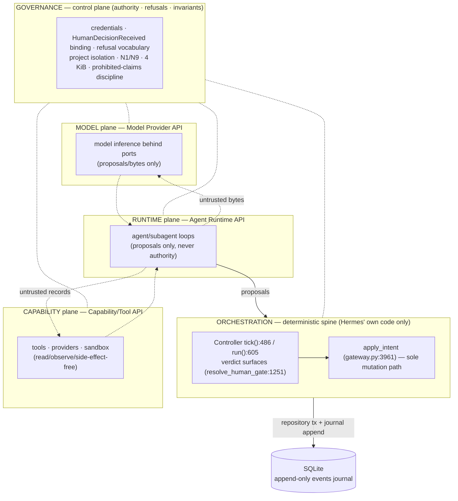

# ARCHITECTURE_DELTA — Platform R1: the three planes as ports behind `apply_intent`

**Status:** design delta. No implementation, no dependency added, no existing file modified, no
substrate adopted. **Baseline:** `platform/r1-delta` cut from `8c9b79c` (main). Where this document
names an existing surface it cites the source at that commit; where the repo's docs and the code
disagree, **the code is quoted** (repo convention, `docs/ARCHITECTURE.md` preamble).

**Inputs read (not modified):** `FOUNDATION_AUDIT.md` §6–§8, `FOUNDATION_AUDIT_NOTES.md`,
`R0_REDTEAM.md` (originals in the main checkout); `docs/ARCHITECTURE.md`, `docs/API.md`,
`AGENTS.md` at the baseline commit.

**Reading note (topology vocabulary).** The brief names four API contracts. This delta maps them
onto **three port planes** — Model, Capability, Runtime — each exposing exactly one API, **plus the
Orchestration API**, which is not a fourth port plane but the *deterministic spine* that owns every
call site of `apply_intent` and is the only legal driver of the three ports. **Governance** is the
control plane over all three planes (and over the spine). If a future round wants Orchestration
promoted to a plane, that is a naming change only — the classification rule in §5 already assigns
orchestration components exactly one owner (`ORCHESTRATION`), so no component's mapping changes.

---

## 1. Topology

**The one rule that makes the planes "behind `apply_intent`":** no plane writes. Every plane
operation is either (a) read/derive, or (b) produces a *proposal* (bounded payload + rationale) that
re-enters through the Orchestration API and becomes a mutation **only** if a validator accepts it
inside the repository write path driven by `apply_intent`. There is no second write path, no plane-
owned transaction, no plane-owned log (§3).

**Plane definitions.**

| Plane | What it is | What it must never be |
|---|---|---|
| **MODEL** | The port surface through which *all* model inference enters the platform. Models sit behind ports (`AGENTS.md` non-negotiables; `research/evaluation.py` is deterministic libraries only — its own docstring states "No write path. This module has no repository imports, no SQL"). | A transition decider. A provider's own SDK/loop. A source of identity. |
| **CAPABILITY** | The port surface for tools/providers: the 4-hook provider ABC (`tools/providers/base.py:139`, hooks `:145/:150/:156/:162`), the allowlisted registry (`tools/providers/adapters/__init__.py:37`, 11 adapters), transports/replay/rate/redaction, and the sandboxed-execution stubs (`tools/sandbox.py`, `tools/execution.py` — Phase-0 placeholders today). | An author. An unenveloped raw-output channel (`security/boundaries.py` owns the untrusted-content envelope). |
| **RUNTIME** | The agent/subagent execution surface for the profile modules (`agents/{director,researcher,implementer,adversary}.py` — Phase-0 placeholders, docstrings already state the contract: "Intent proposals only"), typed by `AgentProfile` (`core/node.py:32`). | An authority (no profile may decide a transition), a durable writer, a scheduler. |
| **ORCHESTRATION** (spine) | Hermes' own deterministic control surface: `tick()`/`run()`, verdict ingestion, `apply_intent`, the lease. It is *not* a port — foreign code never runs inside it. | A place for any borrowed code to execute. |

---

## 2. Per-plane contracts

Legend for identity and errors: **content-hash identity** = `fc_`/`cx_`/`cres_`/`fx_`/`retract_`-class
IDs are *recomputed by rule at the write boundary and never authored* (`docs/ARCHITECTURE.md` §3.8);
**refusal-as-data** = rejections return data with a code from the gateway vocabulary, never raise
through the loop, never silent success. Plane tables below reuse the certified vocabulary
`ROLE / OPERATOR / LOCK / PROPOSAL / STALE / RATIONALE` (plus the existing refinement codes where
they already apply — `MALFORMED_PAYLOAD`, `EVIDENCE_REF`, …). **No new refusal code may be introduced
without the behavior it refuses being specified and tested** (`docs/API.md` "Errors" rule). This
delta introduces none.

### 2.1 Model Provider API (plane: MODEL)

| Aspect | Contract |
|---|---|
| **Operations** | (1) `invoke(request) -> Proposal` — one bounded inference call, synchronously or streamed, returning *untrusted* text/structured output. (2) `describe() -> ModelProfile` — static, declared capability/profile metadata (which profile may use which model). (3) `replay(fixture) -> bytes` — the recorded-bytes path over `RecordedTransport` (`tools/providers/replay.py:293`); replay mode refuses live contact. |
| **Inputs** | Closed request schema: model/profile id, envelope-wrapped context, explicit output-contract (schema), lease-generation tag (§ B-4 slot). No free-form kwargs; unknown keys refuse. |
| **Outputs** | A **proposal**: bounded (≤4 KiB; overflow → artifact ref via `artifacts/store.py`), carrying rationale, never a mutation, never an authority. All model output crosses into Hermes only as envelope-wrapped untrusted content (`security/boundaries.py`). |
| **Errors** | `PROPOSAL` — output presented as a decision (missing/unbound `HumanDecisionReceived`); `ROLE` — a model proposing a kind outside `IntentKind.llm_proposable()` (`core/intents.py:124`); `RATIONALE` — oversized/absent rationale; `LOCK` — invoked without a held lease; `MALFORMED_PAYLOAD` — schema violation. Replay mismatch surfaces as the existing replay/provider error hierarchy (`ReplayUnavailableError`), unchanged. |
| **Identity rules** | Model bytes are **not identity-bearing**. Recorded interactions, if retained, get `fx_`-class fixture identity *recomputed by rule* at the repository boundary (`persistence/provider_interactions.py`), never authored. Model output may reach a content-hash ID preimage only through an explicit recomputation at a write boundary. |
| **Import direction** | Model-plane code imports `hermes.tools.*` (transport/replay/redact) and stdlib only. Never `research`/`core`/`persistence`. Providers never see research state (`docs/ARCHITECTURE.md` §3.5). |

### 2.2 Capability/Tool API (plane: CAPABILITY)

| Aspect | Contract |
|---|---|
| **Operations** | (1) `enumerate() -> CapabilitySet` — the composition/discovery surface (the B-3 slot: named toolset composition, plugin/MCP participation — re-implemented in-tree, never imported). (2) `invoke(request) -> Observation` — bounded, hazard-gated (`tools/providers/hazards.py`), rate-limited (`ratelimit.py`), redacted (`redact.py`, credential-class default-deny) capability call. (3) `replay(fixture) -> bytes` — the recorded transport path. (4) Sandboxed execution (`tools/sandbox.py` — "the only place generated code runs"), when implemented, is a *capability*, not an authority. |
| **Inputs** | Closed request schema: capability id, arguments against a declared schema, envelope-wrapped context, lease-generation tag, per-provider hazard spec. |
| **Outputs** | Untrusted observations (envelope-wrapped records); admitted evidence crosses into research **only** through the one source-outcome write boundary with content-hash identity and task binding (`docs/ARCHITECTURE.md` §3.5). |
| **Errors** | `ROLE` — a capability attempting to author state; `LOCK` — invoked outside the lease; `PROPOSAL` — capability output treated as evidence without a repository write; `MALFORMED_PAYLOAD` — schema/key violation; `EVIDENCE_REF` — a referenced artifact does not dereference in-project; `RATIONALE` — oversized payload where a rationale cap applies; `STALE` — supersession/chain-head violation on referenced records. |
| **Identity rules** | Fixtures: `fx_` recomputed, never authored. Admitted evidence: content-hash identity recomputed at `persistence/source_outcomes.py` with the N9 retraction predicate applied in-transaction. A capability **never** supplies an ID; the write boundary derives it. |
| **Import direction** | `hermes.tools.*` only (+stdlib). `tools/providers/hazards.py:137` (`from hermes.research.programs import canonical_json`) is the **single** recorded exception (`AGENTS.md`) — recorded debt, never a precedent. A measured *second* tools→research import (`tools/research_sources.py:33`) is a **standing violation** of that single-exception rule, to be refactored or explicitly gate-sanctioned by its owning gate — it is **not** recorded here as a second exception, **not** a precedent, and **no further tools→research imports may be added** (see §3). |

### 2.3 Agent Runtime API (plane: RUNTIME)

| Aspect | Contract |
|---|---|
| **Operations** | (1) `run(profile, task_context) -> ProposalSet` — one bounded agent run (the profile modules' stated contract: "Intent proposals only"). (2) `delegate(...)` — subagent dispatch/completion (the B-2 slot: record shape only; §4). (3) `recall(...)` — scoped memory (the B-6 slot: BLOCKED; §4). (4) `draft_artifact(...)` — produces an artifact *candidate*; admission is the write boundary's job. |
| **Inputs** | Bounded context: artifact-only context where the profile requires it (adversary profile), untrusted-content envelopes, explicit budget/limits, lease-generation tag. |
| **Outputs** | Proposals (intent drafts within the profile's allowlist) + rationale, each ≤4 KiB (artifact-ref overflow for larger). A runtime produces **no durable record of record**; delegation/pending records, if any, are derived working state (B-2 constraints). |
| **Errors** | `ROLE` — a profile proposing outside its allowlist, or any profile acting as an authority; `PROPOSAL` — verdict-shaped output without a bound `HumanDecisionReceived`; `LOCK` — a run outside the lease, or a mid-run lease loss (abort to `lock_lost`, rollback, per `controller.py`); `RATIONALE` — missing/oversized rationale; `STALE` — acting on superseded chain heads. |
| **Identity rules** | A proposal carries **no identity**. Identity is recomputed by rule at **whichever write boundary the proposal reaches** — the plane never supplies an id, and the rule is **not research-specific**: current research-domain examples are `programs.py:1486/:1524`, `claims.py:251`, `contradictions.py:75`, while a non-research output (e.g. the **curator** profile's, §5) takes the identity its own write boundary derives. Attribution of any derived record comes from the **lease generation**, never from an ambient settable variable (§4 B-4). |
| **Import direction** | Runtime modules import ports (Model/Capability APIs) and core types only. **Never** `persistence`; never a repository; never SQL. Proposals flow through the Orchestration API. |

### 2.4 Orchestration API (plane: ORCHESTRATION — deterministic spine)

| Aspect | Contract |
|---|---|
| **Operations** | `tick()` (`controller.py:486`), `run(max_ticks)` (`:605`); credentialed verdict ingestion surfaces (`resolve_human_gate:1251`, `record_failure_classification`, `record_contradiction_resolution`, `record_source_retraction_decision`, … per `docs/API.md`); lease acquire/renew/release (`controller.py` lease block; `scheduler_lock` single-row, `database.py:159` delete-on-release); `apply_intent` (`gateway.py:3961` — the sole mutation entry); advisory detection/reads (`detect_contradictions`, digests — never authority, §3.4). |
| **Inputs** | Intents (`kind`, `proposed_by`, `project_id`, closed payload ≤4 KiB) and operator commands (credential + lease + recorded `HumanDecision`). |
| **Outputs** | Repository rows + provenance edges + journal append inside one owned `BEGIN IMMEDIATE` transaction, then COMMIT; or **refusal-as-data** (`{"rejected": True, "code", "detail"}` / `GatewayRejection`). |
| **Errors** | The full gateway vocabulary (`gateway.py` rejection-code block; `docs/API.md` cites `:93-108`): `ROLE`, `OPERATOR`, `LOCK`, `PROPOSAL`, `STALE`, `RATIONALE`, `MALFORMED_PAYLOAD`, `EVIDENCE_REF`, `PROJECT_NOT_FOUND`, `IDEMPOTENCY_CONFLICT`, … plus completion denials (`completion.py:96-101`). Set EVOLVING, meanings FROZEN once emitted. |
| **Identity rules** | Content-hash identity recomputed at each write boundary; duplicates return existing rows; journal order defines history; re-ticks yield duplicates, never second mutations. **No future component may author an ID.** |
| **Import direction** | Spine code may import core/persistence/ports. Nothing imports *in* to the spine except through `apply_intent` and the controller's public surfaces. |

### 2.5 Governance (control plane — over all three planes and the spine)

| Aspect | Contract |
|---|---|
| **Owns** | Operator credentials (verified at the controller surface, existence re-verified in gateway; token never enters intents/events); `HumanDecisionReceived` journal rows binding deterministic command hashes; the refusal vocabulary and its FROZEN meanings; project isolation; N1 (`contradictions.py:106`, frozen) and N9 (`source_outcomes.py:159`, frozen); the 4 KiB payload cap (`event_validation.py:23`); prohibited-claims discipline; archive-not-delete / head-only supersession. |
| **Enforcement points** | Role gate → project gate → payload schema → credential-exists → HumanDecision dereference + hash binding → domain validators → repository tx → journal append (`docs/ARCHITECTURE.md` §3.3). No plane may bypass or reimplement any of these. |
| **Errors** | The six primary refusals — `ROLE` (partition violation), `OPERATOR` (unratified credential), `LOCK` (held/mid-tick-lost lease), `PROPOSAL` (unbound/forged/mismatched verdict), `STALE` (chain-head violation), `RATIONALE` (oversized rationale/payload) — plus the existing refinement codes. **Rule: no new code without the specified behavior + tests** (mirrors `docs/API.md`). |
| **Identity rules** | Authority is never content-addressed; content identities are never authored by any plane; the operator token never enters a payload. |
| **Change rule** | A change to Governance (new authority, new refusal meaning, new partition) is **not an R-round component** — it is a design gate plus the owning certification slice re-run (`AGENTS.md` change discipline). |

---

## 3. Import directions, transaction ownership, payload discipline

### 3.1 Allowed import directions (new code only; existing debt is recorded, not extended)

| Layer / plane | May import | Must never import | Anchor |
|---|---|---|---|
| Capability plane (tools/adapters) | `hermes.tools.*` + stdlib | `research` / `core` / `persistence` | `AGENTS.md` change discipline; **single** recorded exception `hazards.py:137`; `research_sources.py:33` is a **standing violation** of that single-exception rule — refactor it or obtain an explicit gate sanction from its owning gate, never a second recorded exception |
| Model plane | `hermes.tools.*` (transport/replay/redact) + stdlib | research/persistence state | `docs/ARCHITECTURE.md` §3.5 |
| Runtime plane (agents) | ports + `hermes.core` types | `persistence`; repositories; SQL | `agents/*` docstrings ("proposals only"); `security/boundaries.py` |
| Research/domain | `core`, `persistence` **reads**, tools ports | providers' raw transport except enveloped | §3.5 |
| Persistence | its own SQLite helpers | **no NEW `persistence` → `research` imports without a design gate**; the existing lazy-guarded cycle pairs are frozen debt | `docs/ARCHITECTURE.md` §3.10 (KNOWN ARCHITECTURAL DEBT, list of anchors) |
| Core | stdlib + core | everything upward | `docs/ARCHITECTURE.md` §3.2 |

Hard bans, global: **no substrate import** (R0/audit §7: "No substrate adoption. Borrow-only."),
**no new core dependency** (`README.md:27` minimal-core policy; core dep list is `[]`), and the R0
borrow import ban — never import `hermes_state*`, `hermes_cli.sqlite_util`,
`gateway.session_context`, `agent.auxiliary_client` (§4).

### 3.2 Transaction ownership for any future boundary

1. **Transactions belong to repository write boundaries only.** Each repository owns one
   `BEGIN IMMEDIATE`; the journal writer is `repositories.py:92` (`_append_event_to_db`); the lease
   is controller-owned. No port, adapter, agent, or projection opens SQLite or a transaction —
   ever.
2. A future port boundary that produces something durable must hand a **proposal** to the
   Orchestration API; the mutation then happens inside the existing validator → repository tx chain.
3. If a future boundary genuinely needs its own durable *derived* record (the B-2 shape), it must
   satisfy all five: (a) no private lock, (b) no restart re-dispatch/second scheduler, (c) lease-
   generation attribution on every record, (d) payload ≤4 KiB or artifact-ref overflow, and (e) the
   durable write routes through `apply_intent` or through an already-certified repository write
   boundary (the controller's credentialed surfaces), with the journal append still by
   `repositories.py:92`. The first four are necessary but never sufficient alone: (e) is what keeps
   §1's *no plane writes* rule true — direct repository writes from a plane stay forbidden (§3.2.1,
   `AGENTS.md` single-mutation-path). A shape that cannot satisfy (e) — e.g. one needing a new intent
   kind or table (`:214`) — is a design gate, not an R-round component.
4. **Lease fence:** every write is attributable to a lease generation; contention returns `LOCK`;
   mid-tick loss aborts to `lock_lost` with rollback. No plane participates in lease custody.

### 3.3 Payload and identity discipline (all planes)

- **4 KiB cap** (`event_validation.py:23`): oversized payloads refuse (`RATIONALE`) or overflow to
  an artifact ref (`artifacts/store.py` — content-hash-keyed, immutable once committed). Applies to
  every plane crossing, including borrowed shapes (B-2's source exceeds it — a stated delta).
- **Content-hash identity, never authored:** IDs are recomputed by rule at the write boundary
  (`programs.py:1486 canonical_content_dict` / `:1524 content_hash_of`; `claims.py:251
  claim_id_of`; `contradictions.py:75 contradiction_id_of`; N9 predicate `source_outcomes.py:159`).
  No plane may supply, cache, or trust an ID from outside a write boundary.
- **Append-only journal, scope-corrected (R0 R-10):** the guarantee is **table-scoped to the
  `events` journal** (measured: no `UPDATE`/`DELETE` against `events` in `src/`). `scheduler_lock`
  is deliberately deleted on release (`database.py:159`) and `projects`/`tasks` are deliberately
  updated — write surfaces, not journal rows. This delta adopts the measured phrasing; the blanket
  `AGENTS.md` phrasing is corrective debt owned by a docs pass, not by this delta.

---

## 4. Borrow-adapter slots (R0 B-1…B-6) — constraints are binding

Each slot is a **re-implementation inside Hermes**, never an import; each is owned by exactly one
plane/API; each cites the R0 constraint that makes it safe. **B-7 stays withdrawn** — do not
re-propose a config-fingerprint: the cited source is `uuid4()` + `datetime.now()`, i.e.
non-deterministic identity, the exact failure `docs/ARCHITECTURE.md` §3.8 forbids.

| Slot | Owner (plane / API) | Borrowed shape (behaviour only) | Binding R0 constraint | Status |
|---|---|---|---|---|
| **B-1** | GOVERNANCE control plane; implementation surface = Orchestration API's human-gate path (`controller.py:1251 resolve_human_gate`, `OPERATOR` refusals) | Withdrawal-capable, denial-bounded approval protocol: pending → withdraw (requester/waiter) → deny with a breaker bounding repeated denials → ack. **`deny` is an operator verdict — a ratified operator credential act only, resolved through `controller.py:1251`.** | **Protocol shape only. No model verdict.** The cited module family contains a model verdict producer (`approval_smart.py:31/81/109/154`, `decided_by='aux_llm'`); the borrowing implementation **must reject any verdict not produced by `resolve_human_gate` with a verified `operator_token` — provenance, not field membership: the verdict must bind a recorded `HumanDecisionReceived` row, so a model stamping `decided_by='op-1'` fails too**, resolve through the existing human-gate path, add **no new writer and no new authority**, and keep the model out of the verdict path (R0 R-1). **`deny` is never a requester/waiter protocol control:** a non-operator denial refuses as `OPERATOR` (unratified credential, `controller.py:1295`), `PROPOSAL` (verdict-shaped denial without a bound `HumanDecisionReceived`, `:115`), or `ROLE` (routed as an authority-bearing intent). Never import (ban below). | ALLOWED (re-scoped) |
| **B-2** | RUNTIME plane / Agent Runtime API; storage = derived working state only | Durable delegation **record shape** (pending → done, pruning) for subagent dispatch/completion. | **Stated delta — the source is a counter-example.** No private lock (`_DB_LOCK` forbidden), **no restart re-dispatch / second scheduler** (`owner_pid`/`_recovered_results` re-dispatch forbidden), payload routed through the **artifact-ref overflow** path (the source's `task_transcripts` exceeds 4 KiB), every derived record carries **lease-generation attribution** (B-4), and `repositories.py:92` stays the **only** journal writer. Rows are derived state, not a record of record (R0 R-2, R-8 — the journal-rewrite claim was retracted by R0 itself). Never import. | ALLOWED (re-scoped) |
| **B-3** | CAPABILITY plane / Capability-Tool API | Named toolset composition with plugin/MCP participation (a non-authoritative composition layer over ports). | Providers stay behind ports; **composition must not introduce provider leakage into core**; re-implement from behaviour — never import the host's toolset/plugin internals (its private module graph and exact-pinned transport stack would violate the minimal-core policy) (R0 R-7). Never import. | ALLOWED (re-scoped) |
| **B-4** | ORCHESTRATION spine (attribution rule binds every plane's derived records) | Execution-scoped correlation of one tick's work. | Attribution must come from the **lease generation**, never from a settable ambient variable — specifically never mirror the source's public `set_execution_uuid`; an id a caller can set would weaken the fence (R0 §5: PASS only under this binding; audit §6 B-4). | ALLOWED (binding) |
| **B-5** | ORCHESTRATION spine (read path); consumed by any plane as *derived* views | Typed event/notification ordering with declared handler dependencies, for **derived read-side projections**. | Projections must be **pure and recomputed**, never a second durable log, never a writer. **Mechanical purity test required** (R0 R-6): the projection module must provably have no `conn`, no `execute`, no writer/journal imports. The source bus is in-memory — do not re-implement it as a durable stream. Never import. | ALLOWED (guard required) |
| **B-6** | RUNTIME plane / Agent Runtime API (advisory recall only) | Scoped memory with weighted recall/analysis. | **BLOCKED pending both:** (a) a **per-project store partition** — a shared store leaks across projects (§3.9; the source scope is per-instance, not per-project — R0 R-4); and (b) an **accepted native dependency** — the cited stack drags LanceDB/Qdrant, forbidden by the minimal-core policy. If ever unblocked: never an input to a gate that grants authority; advisory only. Never import. | BLOCKED |
| ~~B-7~~ | — | ~~Config-fingerprint of security-relevant settings~~ | **WITHDRAWN (R0 R-3)** — source measured as `uuid4()` + `datetime.now()`. Not resurrectable without a different source. | WITHDRAWN |

**Hard import ban (applies to every slot):** no borrow may be implemented by importing candidate or
host code — the cited modules are evidence of shape only. Named exclusions: `hermes_state*`,
`hermes_cli.sqlite_util`, `gateway.session_context`, `agent.auxiliary_client`. Each adapter slot
re-implements behaviour inside Hermes under §3's import directions.

**No new intent kinds, events, authorities, or tables** are created by any slot. A slot that would
need one is a design gate, not an R-round component.

---

## 5. Classification rule — one plane, one API, zero ambiguity

Any future R2–R4 component (module, service, adapter, pass, or port) is classified by the **first**
question it answers *yes* to, in this order (precedence resolves overlaps):

1. Does it **verify or record authority** (credentials, operator tokens, `HumanDecisionReceived`
   binding, refusal-code meaning, project isolation, N1/N9)? → **Governance change** — *not an R-round
   component*: design gate + owning certification slice. (Governance is a control plane, not a
   component bucket.)
2. Does it **decide when/what the deterministic state machine does** (tick passes, task dispatch,
   verdict ingestion, lease, intent application)? → **ORCHESTRATION plane / Orchestration API.**
3. Does it **run an agent or subagent loop** or consume planes 4–5 to produce proposals? →
   **RUNTIME plane / Agent Runtime API.**
4. Does it **reach outside the process** (a data source, a tool, a sandbox, a provider) or expose a
   capability? → **CAPABILITY plane / Capability-Tool API.**
5. Does it **call a model**? → **MODEL plane / Model Provider API.**

Ties: the **outermost** owner wins (ORCHESTRATION > RUNTIME > CAPABILITY > MODEL), because the
outermost owner owns the mutation boundary. Worked archetypes:

| Future component (archetype) | Plane | API | Binding constraint it must satisfy |
|---|---|---|---|
| New provider adapter (4-hook ABC + registry row) | CAPABILITY | Capability/Tool API | `hermes.tools.*` imports only; hazard spec; redaction; ≤4 KiB / artifact ref |
| New model adapter / local model runner | MODEL | Model Provider API | proposals only; untrusted envelope; never an identity source |
| New agent profile (e.g. a curator profile) | RUNTIME | Agent Runtime API | `AgentProfile`-typed; Intent proposals only; no persistence import |
| Subagent delegation runner | RUNTIME | Agent Runtime API | B-2 constraints (no private lock, no re-dispatch, lease-generation attribution) |
| New tick pass / detector | ORCHESTRATION | Orchestration API | deterministic; advisory reads; no new intent kind without a gate |
| New verdict ingestion surface | ORCHESTRATION | Orchestration API | credential + lease + recorded HumanDecision; `OPERATOR`/`PROPOSAL` refusals unchanged |
| Read-side projection / digest | ORCHESTRATION (read path) | Orchestration API | B-5 purity test (no `conn`, no `execute`, no writer/journal imports) |
| Sandboxed code execution | CAPABILITY | Capability/Tool API | `tools/sandbox.py` is "the only place generated code runs"; output untrusted; no authority |
| Scoped memory / recall | RUNTIME | Agent Runtime API | B-6: BLOCKED until per-project partition + accepted native dep; advisory only |
| Approval-gate protocol (withdrawal/breaker) | GOVERNANCE (impl. surface: Orchestration API) | — (protocol, not an API) | B-1: operator-credential resolution only; no model verdict |
| Anything that opens SQLite or its own transaction | — | — | **Refused by construction.** Reclassify as a *proposal* to the Orchestration API, or design-gate it. |
| Any third-party substrate / framework | — | — | **Refused by construction** (R0/audit §7; `README.md:27`). |

---

## 6. Invariant preservation ledger (what this delta does not change)

| Certified invariant | Anchor (baseline) | How R1 keeps it |
|---|---|---|
| Sole-write-path (`apply_intent`) | `gateway.py:3961`; `docs/ARCHITECTURE.md` §3.3 | All four planes are *behind* it; no plane writes; every effect returns as a proposal. |
| Append-only journal (table-scoped, R0 R-10) | `repositories.py:92`; `docs/ARCHITECTURE.md` §3.10 | No plane owns a journal or a second log; `_append_event_to_db` remains the only writer; B-2/B-5 explicitly forbid durable-stream shapes. |
| Lease fence | `controller.py` lease block (acquire/renew/release; `LOCK` on contention; `lock_lost` rollback) | Lease custody stays in the spine; B-4 binds attribution to it; no plane participates. |
| Content-hash identity, never authored | `programs.py:1486/:1524`; `claims.py:251`; `contradictions.py:75`; §3.8 | §3.3 rule applies to every plane; no plane may supply an ID. |
| Human-authority boundary | `docs/ARCHITECTURE.md` §3.6 NORMATIVE; `intents.py` partitions; `PROPOSAL` | B-1 excludes model verdicts; `internal_only` kinds stay unreachable to planes. |
| Project isolation | §3.9 NORMATIVE; `EVIDENCE_DOES_NOT_RESOLVE` | Cross-plane traffic is project-scoped; B-6 blocked precisely because the source scope is per-instance, not per-project. |
| 4 KiB payload cap | `event_validation.py:23` | Applies to every plane crossing; overflow → artifact ref (`artifacts/store.py`). |
| N1 / N9 | `contradictions.py:106` (frozen); `source_outcomes.py:159` | Untouched; no slot feeds the identity or retraction predicates. |
| Determinism (no model decides) | `evaluation.py` (no write path); `AGENTS.md` | Model plane is explicit "proposals/bytes only". |
| Minimal-core policy / no substrate | `README.md:27`; audit §7 | Zero dependency adds; hard import ban (§4). |

**Open (not this delta's to close):** docs drift measured at the baseline — `docs/API.md` and
`AGENTS.md` cite `apply_intent` at `gateway.py:3732` (actual `:3961`), `docs/API.md` cites the ABC at
`tools/providers/base.py:139` (correct) while describing an `adapters/base.py` path (actual:
`providers/base.py` ABC + `adapters/base_adapter.py`), and intent-partition line numbers
(`:115/:124/:135`) drifted to `:124/:133/:144`. These are documentation corrections for a docs-only
change; this delta does not edit them (no existing-file edits in R1).
