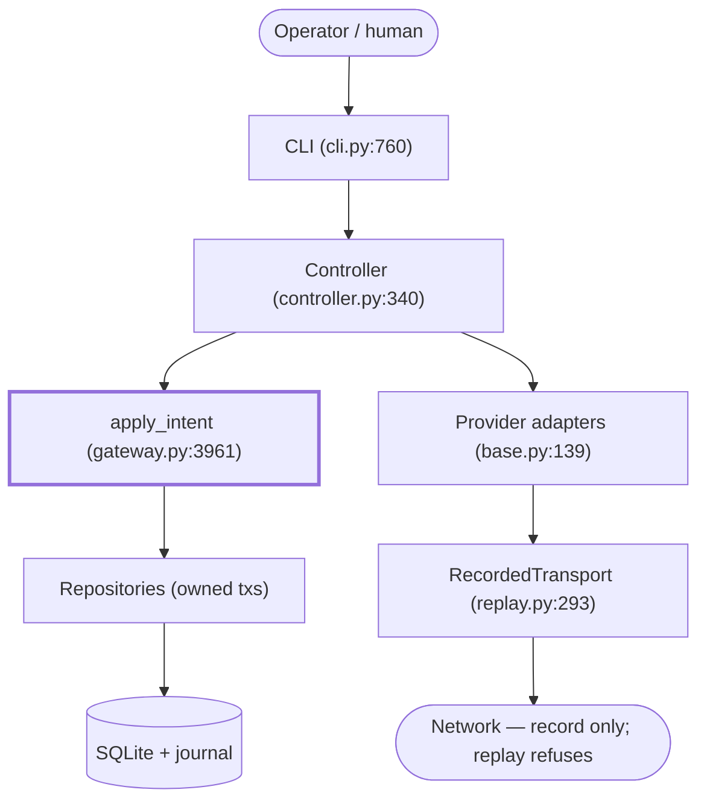
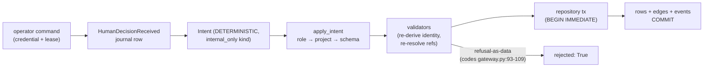
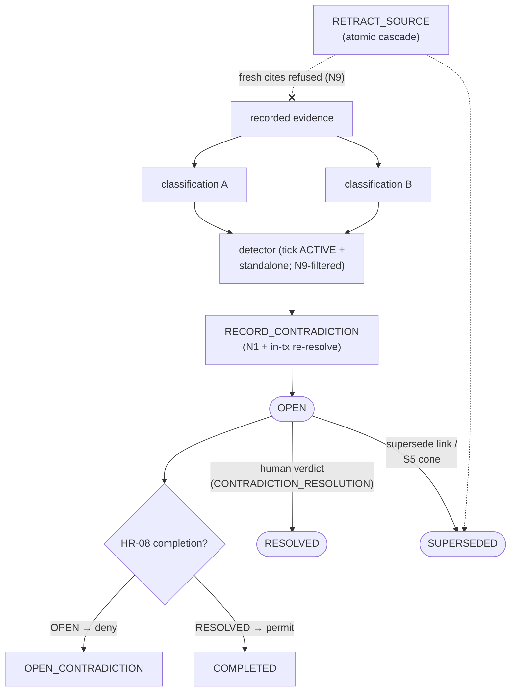
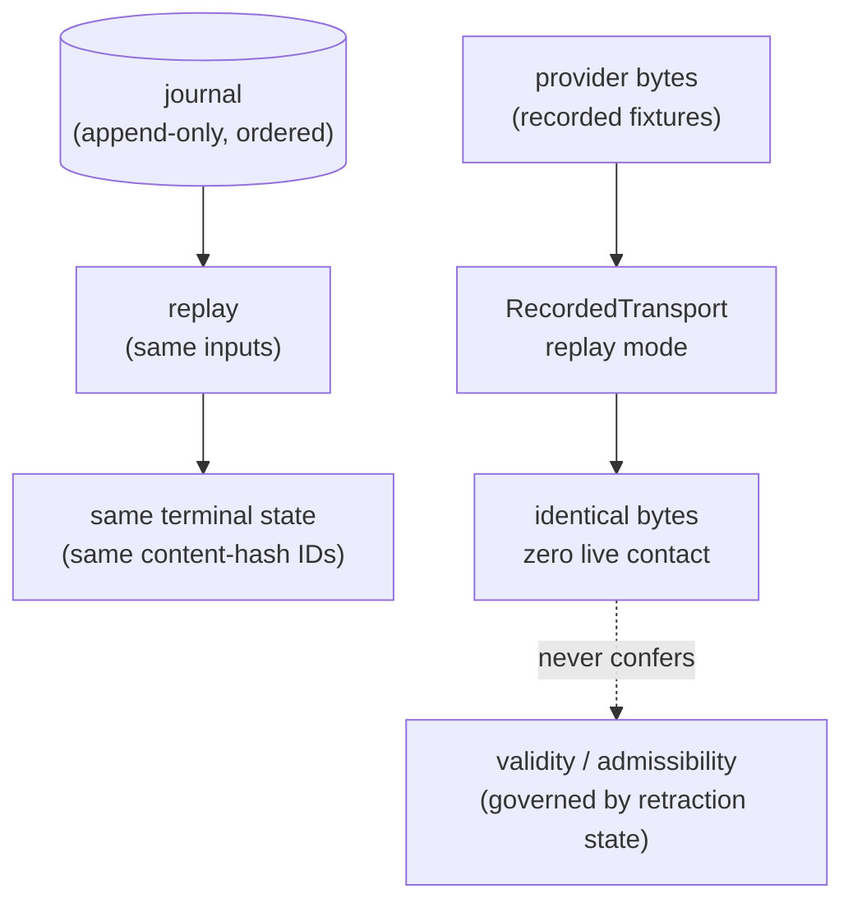

# Hermes Architecture (current, from source)

Status labels: CURRENT / NORMATIVE (must hold), CURRENT /
IMPLEMENTATION DETAIL (true today). History lives in `archive/`;
decisions in `idr/`. This map is verified against `src/` at HEAD;
where code and older documents disagree, code wins.

## 3.1 System purpose

Hermes Research is a deterministic control plane for quantitative
research: it admits research programs, dispatches tool/provider work
through a typed task machine, records evidence and operator
classifications, detects contradictions between classifications,
gates completion on governance state, and replays provider
interactions byte-identically. It deliberately does NOT: let models
decide transitions (models sit behind ports,
`src/hermes/research/evaluation.py`); claim scientific validity or
reproducibility (replay proves transport/evidence determinism only);
run external engines in-repo (`backtest_audit`, feature/statistical
engines are external, probed by `hermes doctor`).

## 3.2 Layer / module map

| Layer | Home | May call | Must never |
|---|---|---|---|
| CLI / external entry | `src/hermes/cli.py` (14 subcommands, `main:760`) | Controller constructors, `run()`/`tick()` | own leases, bypass intents, touch SQL directly (it opens connections only to hand them to repositories/Controller) |
| Controller / orchestration | `src/hermes/research/controller.py:340` (78 methods) | gateway `apply_intent`, repositories (reads), task handlers via typed bundle | write durable state except through intents; resolve human verdicts itself (it ingests recorded verdicts) |
| Intent / command model | `src/hermes/core/intents.py:26` (19 kinds; `llm_proposable:124`, `director_only:133`, `internal_only:144`) | — (data + role partitions) | be proposed outside its partition (gateway refuses `ROLE`) |
| Gateway + validation | `src/hermes/research/gateway.py` (15 `_validate_*`, sole writer `apply_intent:3961`) | repositories (inside validators), journal append | trust payloads (re-derives identity, re-resolves refs) |
| Persistence | `src/hermes/persistence/` (`repositories.py` 19 classes; `failure_classifications.py`; `source_outcomes.py`; `provider_interactions.py`; `program_obligations.py`; `corpus.py`; `graph_edges.py`; `migrations.py`, schema v19 `:20`) | SQLite via owned transactions (18 acquisition owners; mostly `BEGIN IMMEDIATE`, intentional plain-`BEGIN` creates/retry — see §3.10); pure domain helpers | expose unwritten state; delete rows (no DELETE in `src/`) |
| Journal / events | `src/hermes/core/events.py` (catalog); writer in repositories | append via `_append_event_to_db` inside write txs | rewrite history; oversized payloads (`event_validation.py`, `RATIONALE`) |
| Research / domain | `src/hermes/research/` (programs, evaluation, contradictions, completion, extraction, ladder, claims…) | core types, persistence reads, tools ports | decide transitions by model output; leak into providers |
| Provider adapters | `src/hermes/tools/providers/adapters/` (15 adapters, ABC `src/hermes/tools/providers/base.py:139`, registry `src/hermes/tools/providers/adapters/__init__.py:37`) | `hermes.tools.*` only | import `research`/`core`/`persistence` (sole recorded exception: `src/hermes/tools/providers/hazards.py:137`) |
| Replay / determinism | `RecordedTransport` (`src/hermes/tools/providers/replay.py:293`), fixture identity `fx_`, recorder boundary | adapters (record), fixtures (replay) | touch live network in replay (refusing inner transport) |
| Authority / humans | operator credentials (`repositories.py:1063`), `HumanDecisionReceived` journal rows | — (ingested by deterministic surfaces) | LLM/agent profiles deciding (`AgentProfile`, `src/hermes/core/node.py`) |

## 3.3 Primary write path (CURRENT / NORMATIVE)

```text
operator command (credential + lease + recorded HumanDecision)
    ↓  Controller verdict surface (e.g. record_failure_classification:2079)
Intent(kind, proposed_by="DETERMINISTIC", project_id, payload)
    ↓  apply_intent (gateway.py:3961)
role gate → project gate → payload schema → credential-exists →
HumanDecision dereference + hash binding → domain validators →
repository.write (own BEGIN IMMEDIATE: task binding, ownership,
identity re-derivation, idempotency, edges) → journal append → COMMIT
```

Refusals return data (`GatewayRejection`: codes `gateway.py:93-109`;
controller surfaces return `{"rejected": True, ...}`), never raise
through the loop. Forbidden paths: direct SQL mutation outside
repository tx boundaries; orchestration writes around `apply_intent`;
LLM-proposed `internal_only` kinds (`ROLE`); unwitnessed decisions
(`PROPOSAL`).

## 3.4 Read path (CURRENT / IMPLEMENTATION DETAIL)

Reads are advisory and never authoritative: classification digests
(`failure_classifications.py:634`, consumed at `controller.py:628`),
contradiction candidate rows (`controller.py:1964`), rankings
(`evaluation.py`), re-review candidates, reconcile digests. Reads
re-resolve current state on every call (no caches); writers never
trust a read — validators re-derive everything inside the
transaction.

## 3.5 Research/provider boundary (CURRENT / NORMATIVE)

Adapters implement exactly 4 hooks (`build_request`, `parse_page`,
`extract_ids`, `build_fetch_request`, `base.py:144-162`) behind
`ProviderAdapter`; orchestration drives them through `walk()`/
`fetch_batch()` with per-provider hazard specs, rate limits, and
redaction (credential-class redacted, default-deny). Outcomes cross
into research only through the one source-outcome write boundary
with content-hash identity and task binding. Providers never see
research state; research never sees raw transport except enveloped
as `UntrustedContent`.

## 3.6 Authority boundary (CURRENT / NORMATIVE)

Actors: DETERMINISTIC layer (only mutation author),
DIRECTOR/RESEARCHER/IMPLEMENTER/ADVERSARY (propose allowlisted
intents), OPERATOR (human; credential + token verified at the
controller surface, existence re-verified in gateway; token never
enters intents/events), providers/untrusted content (never
authority). Human decisions enter as `HumanDecisionReceived` journal
rows binding deterministic command hashes; missing/forged/mismatched
verdicts refuse (`PROPOSAL`); bad credentials refuse (`OPERATOR`);
held leases refuse (`LOCK`); oversized rationales refuse
(`RATIONALE`). LLM-invokable set is closed (`intents.py:124).

Experiment-gated support (claim-ground G12, `claims.py`): causal
DIRECT/PARTIAL claims require an experiment that dereferences to an
admitted in-project row via the experiment resolver. No experiment
registry or declaration intent exists, so this is structurally
inadmissible today; INFERRED/SPECULATIVE remain the downgrade path.
Pinned by `tests/test_experiment_gate_pin_v2.py`.

## 3.7 Contradiction lifecycle (CURRENT / NORMATIVE)

Evidence (recorded provider output) → operator classifications via
the write path (§3.3) → detector proposes pairs every ACTIVE tick
(`tick()` → `_detect_contradictions_pass()`, `controller.py:582,
1892`) and on standalone demand (`:1863`) → `RECORD_CONTRADICTION`
re-verifies the N1 pair rule and records OPEN → HR-08 denies program
completion while OPEN (`completion.py:101`) → ratified human verdict
→ `CONTRADICTION_RESOLUTION` → RESOLVED → completion permitted.
Supersession is head-only and explicit (new row names its target;
a second link is refused); S5 retraction supersedes OPEN rows whose
party lies in the retraction cone, in the same atomic transaction.
N9 rule (fencing, not a type): a retracted source resolves to
nothing at substrate admission, in-transaction write check,
detector derivation, and contradiction validation
(`source_outcomes.py:159`); retraction state never depends on
write-time validation alone nor detection alone. N1
(`contradictions.py:106`:
same project/program/hypothesis, `CLASSIFICATION_CONFLICT`,
different failure class, neither party invalidated, non-empty
currently-valid evidence overlap; identity `contradiction_id_of:75`,
version `cx-detect-v1:52`) is frozen.

## 3.8 Replay / determinism (CURRENT / NORMATIVE)

Identity is derived (`fc_`/`cx_`/`cres_`/`fx_`/`retract_` content
hashes), never authored; duplicates return existing rows.
Journal order defines history; re-running ticks over the same state
reproduces terminal state (re-ticks yield duplicates, never second
mutations). Provider replay serves recorded fixtures with a refusing
inner transport: identical bytes, zero live contact. Replay proves
transport/evidence determinism only — it never confers validity
(retracted sources stay inadmissible, N9) and never claims
scientific reproducibility (prohibited-claims discipline).

## 3.9 Project isolation (CURRENT / NORMATIVE)

Every resolver (`_source_artifact_resolves`,
`source_outcomes.py:96`; `_cx_resolve_evidence_ref`,
`gateway.py:2593`), detector row, validator, retraction predicate
(`source_outcomes.py:159`, project-joined on the decision row), cone
walk (project-JOIN-filtered), completion check, and re-review query
is project-scoped. Cross-project citation fails closed
(`EVIDENCE_DOES_NOT_RESOLVE`); identical bytes in another project
are governed by that project's own edges and retraction state.

## 3.10 Persistence architecture (CURRENT / IMPLEMENTATION DETAIL)

Transaction ownership is distributed across certified mutation
boundaries, not one-transaction-per-repository. The physical census
(DG-4, re-run DG-6 — see `archive/HERMES_DG4_REPOSITORY_STRUCTURAL_DESIGN_GATE_2026-09-21.md`
§4 and `archive/HERMES_DG6_FINAL_ARCHITECTURE_CLOSURE_GATE_2026-09-21.md` §5)
finds **121 executed transaction-control calls held by 27 acquisition
owners plus one rollback-only participant**: persistence **18**
(`repositories.py` 11, `database.py` 2 — the scheduler lease,
`failure_classifications.py` 1 (`record`, `BEGIN IMMEDIATE` at `:233`),
`source_outcomes.py` 1 (`record`, `BEGIN IMMEDIATE` at `:313`),
`corpus.py` 1 (`CorpusRepository.record`, `BEGIN IMMEDIATE` at `:165`),
`graph_edges.py` 1 (`GraphEdgeRepository.record`, `BEGIN IMMEDIATE` at
`:142`), `migrations.py` 1), gateway **5** (all `BEGIN IMMEDIATE`: the decision
append, retract-source, curate-knowledge, record-contradiction, and
contradiction-resolution admissions), Controller **4** (lease acquire,
human-gate resolve, floor and ladder transitions). Most owners use
`BEGIN IMMEDIATE`; plain-`BEGIN` cases are intentional (repository
creates, the event-retry path, migrations, Controller floor/ladder/
human-gate paths). Each boundary ties its transaction to a certified
requirement — journal atomicity, identity re-derivation, lease/fence,
admission checks, or all-or-nothing cascades. SQLite (WAL-capable
config), schema v19 with forward-only migrations; single writer via
the scheduler lease (`controller.py:2336`, `LOCK` on contention,
`lock_lost` abort with rollback). Rows addressed by content hash
(UNIQUE); edges in `provenance_edges` (indexed both directions);
events carry bounded payloads.

INTENTIONAL ARCHITECTURAL EXCEPTIONS — CERTIFIED, NOT DEBT (DG-5,
`archive/HERMES_DG5_PERSISTENCE_RESEARCH_INVERSION_DESIGN_GATE_2026-09-21.md`).
The normal direction remains persistence → core/domain with research →
persistence as the ordinary layering model. A bounded set of
persistence→research runtime dependencies (15 import statements) remains
by deliberate decision; DG-5 classified each and authorized no correction:

* **Model-D integrity boundaries** — repositories re-derive content identity
  with the research layer's own pure helpers before the transaction
  (`failure_classifications.py:53`, consumed pre-`BEGIN` at `:168`;
  `repositories.py:52` claims re-derivation, `:1302` program re-derivation;
  `repositories.py:2502` empty-result identity), so admission and the write
  path can never disagree (IDR-018 EC-V6-11..16, IDR-026 Decision 2, IDR-036).
* **Model-D integrity boundaries — regime dereference** — the
  persistence-side regime resolvers (`failure_classifications.py:65`,
  `repositories.py:64`) dereference the same closed
  `hermes.research.regimes` registry the research compiler validates
  against, so the write path and `programs.py` can never disagree about
  what a registered regime is (IDR-044 A6/A7; director ruling
  MERGE/conditions: INTENTIONAL under the Model-D precedent, no DG-6 re-run).
* **HR-08 completion choke point** — `ProjectRepository.transition_lifecycle`
  consults `can_complete_research` inside its transaction
  (`repositories.py:241-248`), so no current or future driver reaches
  COMPLETED while the invariant fails (`research/completion.py:258`).
* **Admission/write agreement** — the EXTRACT vocabulary constant
  (`repositories.py:62`) and the `_is_extract_spec` predicate kept
  byte-identical in three layers (`repositories.py:1878`,
  `research/extraction.py:315`, `research/gateway.py:3594`); the
  triplication is deliberate defense-in-depth, not residue.
* **Persistence-owned shared reads** — `_source_artifact_resolves` /
  `source_artifact_retracted` (`source_outcomes.py:96/:159`, the N9
  predicates) and the row→dict mappers consumed across layers in the
  allowed direction.

The layer depends upward at these points, held together by lazy imports at
three documented cycle pairs: (a) `repositories.py:51` ⇄
`source_outcomes.py:783` (single journal writer, intra-layer); (b)
`repositories.py:62` ⇄ `research/extraction.py:355` (agreement constant);
(c) `repositories.py:241` ⇄ `research/completion.py:63` (choke point).
Do not extend this pattern; new upward dependencies need an explicit
design gate (the regime dereference above was admitted exactly that way —
IDR-044; director ruling MERGE/conditions). `Controller` (78 methods), `gateway.py` (15 validators), and
`repositories.py` (19 classes) are concentrated by certified design —
ACCEPTABLE CONCENTRATION per DG-2/DG-3C/DG-4; split only mechanically,
with the owning gate re-run per split.

## 3.11 Extension points (CURRENT)

Supported (precedent-backed): new provider = 4-hook adapter +
registry row + hazard spec (~11 precedents); new evidence type =
taxonomy const + resolver prefix (fenced); new failure class =
`FailureClass` enum + `ACTION_MAP` + fixture matrix (explicit by
design); new workflow states = closed enums + transition tables
(`LifecycleState`, `TaskStatus`, `OperationalMode`); new programs =
`PROPOSE_RESEARCH_PROGRAM` + compiler path; new review actions =
proposal-action vocabulary. Merely possible (not supported —
requires a design gate): new intent kinds, new event types, new
authorities, new contradiction types, new schedulers.

## Diagrams (verified against the sources cited in each caption)

### A — System boundary



### B — Mutation / authority flow



### C — Contradiction lifecycle



### D — Replay / determinism


