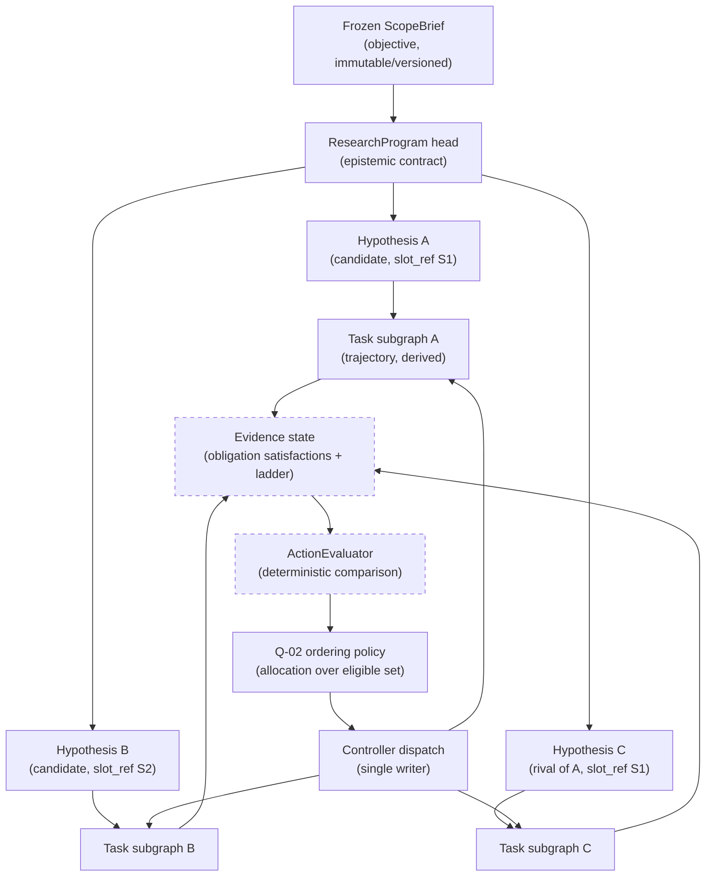
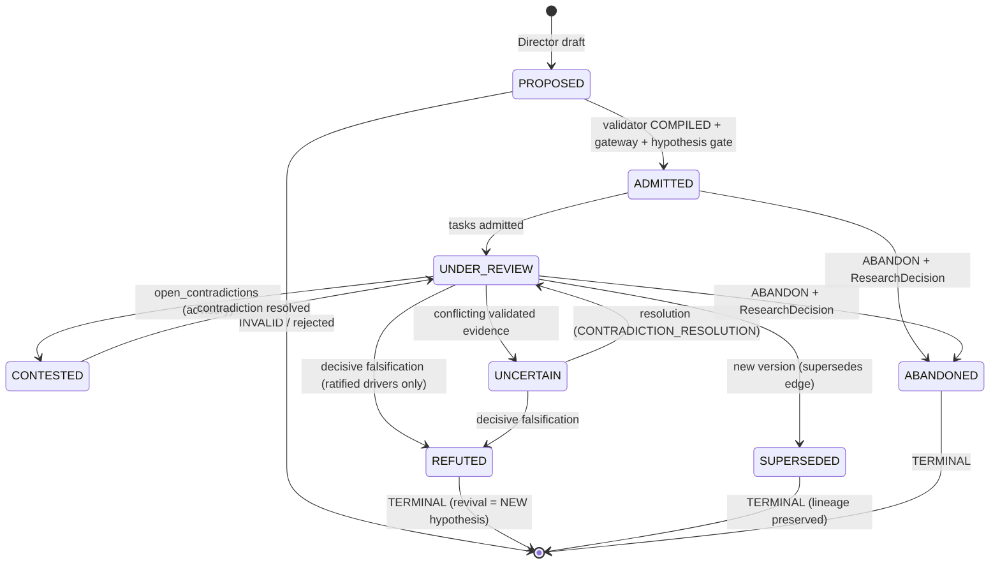
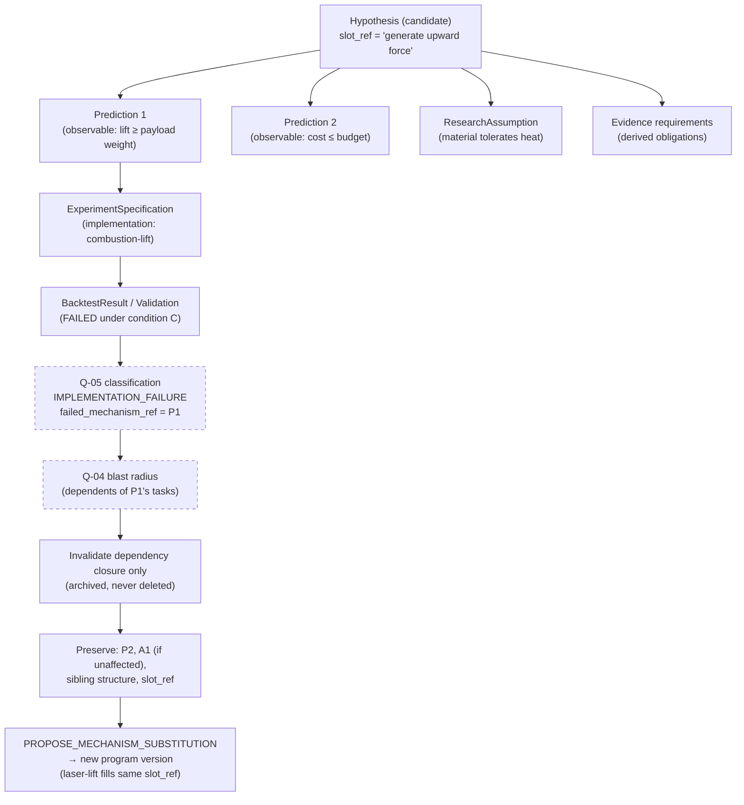
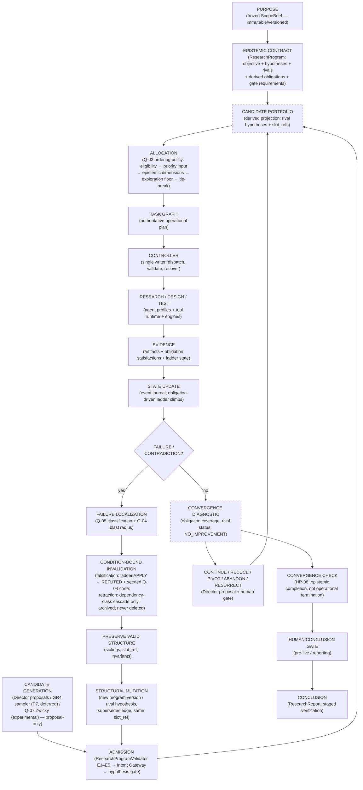

# Hermes Five-Fundamental Blueprint — Candidate Portfolio, Structural
# Preservation, Conditional Failure, Allocation, Convergence

**Status:** DESIGN QUESTIONS / CANDIDATE FUNDAMENTALS — **NOT ratified
Hermes architecture.** This document is a blueprint for later architectural
review. It modifies nothing: no IDR, no ratified v6 text, no table, event,
intent, module, Q-02 behavior, GR4 text, or task-graph rule is changed by
this document. Every mechanism below is a *candidate* to be attacked,
ratified, amended, or rejected by the architecture team.

> **Ratification update (2026-08-20, additive):** the Five-Fundamentals
> package described here was RATIFIED by operator ratification —
> `hermes_architecture_ratification.md` (architecture frozen). The status
> paragraph above is the historical pre-ratification record and is
> preserved unchanged.

**Date:** 2026-08-19
**Prepared by:** the architecture/designing agent
**Primary source of truth:** the live `ace2013hieco-aa/khwarizmi-research`
repository (HEAD `ef2b9e4`, branch `main`, full suite 1513 passed at time of
writing), reconciled against `hermes_research_architecture_v6.md` (RATIFIED
baseline), the ratified IDRs (IDR-018/019/036/037/038/039/040/041), the Q-02/
Q-04/Q-05 design + implementation records, and the HR-04/07/08 contracts.
**Design references (NOT ratified, treated as inputs only):**
- `Proposal: Annealed Metropolis Kernel as the GR4 Path-Based Method`
  (`hermes_gr4_annealed_bridge_sampling_proposal.md`) — PROPOSAL status
  preserved verbatim; it has not passed the five-stage loop and does not
  alter the ratified baseline or any IDR.
- `Diagram Reference Pack for Hermes Five-Fundamental Blueprint` —
  brainstorming artifacts; mapped against the repository per its own §13.

**Authority order honored (this document):** live repository + ratified v6 >
ratified IDRs > implemented + tested design records (Q-02/Q-04/Q-05/HR-*) >
DESIGNED-not-implemented v6 candidate packages (§29/§30) > DEFERRED v6 slices
(GR1–GR9, P7+) > the GR4 proposal > the diagram reference pack > inference.
Where this document infers, it says so.

---

## 0. Method and status discipline

Every section below distinguishes three layers:

1. **Reference model** — the concept as brainstormed (diagram pack / brief).
2. **Repository-corrected model** — the concept after mapping against what
   Hermes actually has (ratified, implemented, designed, or deferred).
3. **Verdict** — compatible as-is / compatible with extension / requires
   architectural change / conflicts / unknown, with the reason.

Nothing here is marked DESIGNED or RATIFIED on the state ladder. The five
fundamentals are **CANDIDATE FUNDAMENTALS**. The GR4 proposal remains a
PROPOSAL. Where a brainstormed concept already exists in ratified form, this
document says so and cites the carrier; where it conflicts with a ratified
invariant, the conflict is named, not silently resolved.

---

## 1. Executive interpretation — what Hermes appears to be becoming

Read against the live repository, the five fundamentals are **not a new
system waiting to be built. They are a re-reading of machinery Hermes
already has in fragmentary form, plus four genuine gaps.**

What already exists (verified, cited):

| Fundamental fragment | Existing carrier | Status |
|---|---|---|
| Objective + gates as an immutable contract | `ResearchProgram` (IDR-018, `programs.py`) + frozen `ScopeBrief` (S16) | RATIFIED + IMPLEMENTED |
| Deterministic candidate comparison | `ActionEvaluator` / `CandidateRanking` (IDR-019, `evaluation.py`) | RATIFIED + IMPLEMENTED |
| Deterministic allocation/ordering of eligible work | Q-02 EligibleTask mode (IDR-038, `evaluation.py` + `controller.py`) | RATIFIED + IMPLEMENTED |
| Conditional failure taxonomy + permitted next actions | Q-05 `FailureClassification` (IDR-036/037, `failure_classification.py`) | RATIFIED + IMPLEMENTED |
| Failure localization / blast radius | Q-04 forward reachability (IDR-039/040) | RATIFIED + IMPLEMENTED |
| "What must be established" per candidate | program `evidence_requirements` / `gate_requirements` (derived obligations) | RATIFIED + IMPLEMENTED |
| Rival candidates inside one program | `hypotheses[].rival_of` / `rival_status` + E5 rival coverage | RATIFIED + IMPLEMENTED |
| Structural mutation = new version, never silent edit | supersession pattern (§11/§16.1; program `supersedes_ref`) | RATIFIED + IMPLEMENTED |
| Decisive falsification terminus | REFUTED drivers, head-bound (HR-07); ladder APPLY pass (`controller._apply_evidence_ladder_pass`, `evidence_ladder.py`, `evidence_ladder_state` table) | RATIFIED + IMPLEMENTED (IDR-041 AC-1..5) |
| Completion ≠ termination | HR-08 `can_complete_research` invariant | RATIFIED + IMPLEMENTED |
| Candidate generation (graph-shaped) | GR4 `GraphHypothesisService` (v6 §5) | DESIGNED, DEFERRED (P7/P8) |

The four genuine gaps the five fundamentals expose:

1. **G1 — Portfolio ontology above the single program.** v6's model is
   one-head `ResearchProgram` per project (head-only supersession,
   `_program_head_id` in `controller.py:1961`). "Several competing
   trajectories, concurrently active, compared, reallocated" has no
   first-class carrier *above* the program's internal rival structure.
2. **G2 — Candidate identity across mutation.** Nothing defines when a
   mutated candidate is "the same candidate." The supersession pattern gives
   version lineage, but the *design-concept* identity (the abstract slot a
   candidate fills — the GR4 proposal's "function node") is not represented.
3. **G3 — Exploration floor.** Q-02 orders the eligible set
   epistemically; nothing prevents the leading trajectory from consuming
   every dispatch slot once it dominates the eligible set. There is no
   deterministic minimum-exploration constraint.
4. **G4 — Convergence/pivot governance.** HR-08 says when research may
   *complete*; nothing says when a *portfolio* has learned enough to pivot,
   reduce, or converge — and nothing binds "the objective may not silently
   change" at the portfolio level beyond the single-program governance
   checks (R-02, `scope_ref`).

**Executive interpretation:** Hermes is evolving from *a linear research
task orchestrator* into *a governed portfolio of competing epistemic
trajectories, compared deterministically, mutated structurally, and
converged under human gates* — **without gaining a second authority.** The
five fundamentals, correctly read, are a *portfolio governance layer* over
the existing control plane: they organize ResearchPrograms/rival hypotheses,
they do not replace the gateway, the ladder, the evaluator, or the
controller. The single most important design constraint carried through
every section: **every new mechanism must be a derived projection, a
versioned policy parameter, or a proposal-only surface — never a new
persistent authority, never a second scheduler, never a second optimizer.**

The space-station example (Rocket / Fire Balloon) is an intuition pump, not
a Hermes domain model. Its structural lessons transfer: (a) failure should
be condition-bound and component-local, (b) decomposition should survive
implementation failure, (c) allocation should shift on evidence, not on
sunk cost, (d) exploration must not be starved by the current favorite.
Each of those four lessons maps onto an existing-or-nearly-existing Hermes
mechanism — that is the central finding of this blueprint.

---

## 2. Fundamental #1 — Candidate Portfolio / Parallel Research

### 2.1 Reference model (brainstormed)

```text
Research Purpose
      ↓
Candidate A — Rocket
Candidate B — Fire Balloon
Candidate C — Other concept
      ↓
parallel investigation → evidence → comparison → allocation
```

The diagram pack (§3) adds: Candidate Portfolio → trajectories → research →
evidence → state → deterministic comparison → allocation → back to research.

### 2.2 Ontology — what exactly is a candidate?

The brief's candidate list (hypothesis / claim / research question / design
concept / solution architecture / candidate investigation / research
trajectory / task) does **not** name one object. Mapped against v6, they are
five distinct carriers at different layers, and conflating them is the
primary ontology error to avoid:

| Brainstormed term | Hermes carrier | Layer |
|---|---|---|
| Research question / purpose | frozen `ScopeBrief` + `ResearchProgram.epistemic_objective` | governance |
| Design concept / solution architecture | `ResearchProgram` (one governed epistemic contract) | epistemic contract |
| Hypothesis / claim | `ResearchProgram.hypotheses[]` (`HypothesisSpec`: ref, `ladder_target`, `falsification_condition`, `rival_of`, `rival_status`) | epistemic content |
| Candidate investigation / trajectory | the task-subgraph + evidence history accumulated for one hypothesis (a *derived* projection — tasks + satisfactions + ladder state) | operational history |
| Task | task-graph node (§7) | execution |

**Repository-corrected definition.** A *candidate* is best modeled as **a
hypothesis-within-a-program together with its decomposition (predictions,
discrimination requirements, evidence obligations) and its accumulated
trajectory (task subgraph + satisfaction links + ladder state).** A
*portfolio* is **the governed set of rival candidates under one objective.**

Crucially, this does **not** require a new artifact family. The rival
structure already exists: E5 rival coverage (v6 §28.2) requires a confirmatory
program to carry a governed rival record, and `rival_status` (`ACTIVE |
UNRESOLVED | ...`) already tracks rivals. The portfolio is therefore most
coherently a **derived projection over the head program's hypothesis/rival
structure plus the per-hypothesis evidence state** — the `CandidateRanking` /
`GraphDiagnostics` / `DirectorDigest` pattern (transient, re-derivable,
never persisted as evidence).

**The one real tension (named, not hidden):** v6's program model is
*one head per project* (`_program_head_id`, head-only supersession). The
five fundamentals want *several concurrently active trajectories*. Two
resolution candidates:

- **(P1-a) Portfolio = rival hypotheses inside ONE program.** Trajectories
  are rival hypotheses; the program's obligation derivation already runs
  per-hypothesis (satisfaction links are per `(program_id, requirement_ref)`,
  migration 8→9). No new program-level machinery. **Limit:** one program =
  one objective + one methodology-constraint set; trajectories that differ
  in *objective* (not just mechanism) cannot coexist in one program.
- **(P1-b) Portfolio = several concurrent programs under one ScopeBrief.**
  Requires relaxing head-only supersession to allow multiple concurrent
  heads governed by one brief. **This conflicts with a ratified invariant**
  (head-only supersession, `_program_head_id` used by HR-07's REFUTED
  head-binding) and is therefore **requires-architectural-change**, not a
  quiet extension.

**Recommendation (for review):** adopt P1-a as the day-one model (portfolio
= the program's rival-hypothesis structure, projected), and treat P1-b as a
deferred amendment that would need its own five-stage loop because it
touches head-binding.

**Worked example — P1-a adequacy (review finding F-A):** two design-concept
rivals in ONE program, carried entirely by the existing schema:

```text
ResearchProgram v3 (head), epistemic_objective: "cheapest reliable lift"
├── hypotheses[0]: ref "H_rocket"
│     ladder_target: ROBUST
│     falsification_condition: "cost > budget at required reliability"
│     rival_of: null, rival_status: null        ← primary candidate
├── hypotheses[1]: ref "H_balloon"
│     ladder_target: ROBUST
│     falsification_condition: "lift < payload weight under regime R"
│     rival_of: "H_rocket", rival_status: ACTIVE ← live rival
└── hypotheses[2]: ref "H_null"
      rival_of: "H_rocket", rival_status: UNRESOLVED
      ← explicit UNRESOLVED rival record (satisfies E5 on its own)
```

Verified against source: `RivalStatus` is exactly `{ACTIVE, UNRESOLVED}`
(`programs.py:78–80`); E5 requires a confirmatory program to carry a rival
or an explicit UNRESOLVED record (`programs.py:433–442`); ACTIVE rivals
must be structurally distinguishable via divergent predictions
(`programs.py:444–452`). Both live-rival and record-rival cases are
already first-class. **Conclusion: the existing schema carries P1-a — no
new field is required for two rivals to coexist under one head; the only
P1-a extension is `slot_ref` (C1) for design-concept identity across
versions, and the head-advance mechanics of §2.2 govern how a third rival
enters (new program version).** **Pass-3 sharpening (2026-08-19 trace):** under P1-a,
every portfolio mutation (add/drop/mutate a rival) is a head-advancing
program version — there is no in-place rival edit. This is compatible with
HR-07 (the new head binds future REFUTED; the old head's pending
classifications become historical records), but it carries two consequences
the original draft understated: (a) each rival admission resets the ladder
state for the affected hypotheses (new `program_id` ⇒ no inherited
satisfaction/ladder rows), and (b) admitting a rival can advance the head
*out from under* a pending decisive classification, converting a would-be
live REFUTED into a historical record — a REFUTED-rescue interaction that
needs an explicit ruling (see §19 open question 13). The brief's "Research Program → Research Objective →
Candidate Portfolio → Candidate Trajectory → Research Actions" hierarchy
collapses, in Hermes terms, to: **ScopeBrief (objective) → ResearchProgram
(contract) → rival hypotheses (candidates) → task subgraphs (trajectories) →
tasks (actions).** No fifth layer is needed.

### 2.3 Identity — what makes a candidate the "same candidate" after mutation?

Fire Balloon → replace combustion → Laser Balloon. The precise answer, using
the ratified supersession pattern:

- It is a **new version of the candidate** (new content-addressed identity),
  linked by a `supersedes` edge to its predecessor. It is **not** the same
  artifact (immutability forbids in-place mutation), and **not** an
  unrelated new candidate (the lineage edge is preserved).
- Three identities must be kept distinct (this is the identity analogue of
  HR-04's content-vs-lineage distinction):
  1. **Artifact identity** — content hash; changes on every mutation.
  2. **Lineage identity** — the `supersedes` chain; the trajectory.
  3. **Design-concept identity** — the abstract slot the candidate fills
     (the GR4 proposal's "function node": "generate upward force"). This is
     the *stable* identity across Fire Balloon → Laser Balloon.
- The design-concept identity is the one thing **not currently represented**
  (gap G2). Candidate carrier: a stable `slot_ref` / `function_ref` field on
  the hypothesis spec, content-addressed separately from the hypothesis
  body, so mutations that preserve the slot are recognizable as versions of
  the same design concept. **This is a candidate field extension, not
  ratified.**

### 2.4 Parallelism — what "parallel research" means semantically

These are five different things and must not be reduced to asyncio:

| Kind | Meaning | Hermes status |
|---|---|---|
| Task concurrency | multiple task nodes RUNNING at once | exists (PA1 R7 non-blocking fan-out; concurrency groups) |
| Trajectory concurrency | multiple candidate trajectories accumulating evidence in the same project window | **the gap** — operationally possible (parallel task subgraphs), but nothing *governs* it as trajectories |
| Parallel hypotheses | multiple hypotheses formalized in one program | exists (rival structure, E5) |
| Parallel designs | multiple program-level designs under one objective | conflicts with head-only supersession (P1-b) |
| Parallel experiments | multiple pre-registered experiments running concurrently | exists operationally (§7 subgraphs); lifecycle axis is single-track (see §2.6) |

### 2.5 Candidate lifecycle — derived, not imported

The brief's list (PROPOSED/SCREENING/ACTIVE/LOW_ALLOCATION/PAUSED/DISFAVORED/
FAILED_UNDER_CONDITION/SUPERSEDED/RESURRECTED/VALIDATED/ABANDONED/CONVERGED)
should **not** be adopted wholesale — several entries duplicate or conflict
with ratified states. Derived model, mapped onto existing carriers:

```text
PROPOSED        — ResearchProgramDraft / hypothesis draft (pre-admission)
ADMITTED        — hypothesis in a COMPILED program (E1–E5 passed)
UNDER_REVIEW    — obligations outstanding; tasks in flight
CONTESTED       — open_contradictions populated (GR3, advisory)
UNCERTAIN       — ladder state (conflicting validated evidence, §19)
REFUTED         — ladder terminus (decisive falsification; TERMINAL)
SUPERSEDED      — replaced by a new version (supersedes edge)
ABANDONED       — ABANDON intent + ResearchDecision (human-approved if pre-registered)
```

Deliberate exclusions (each would duplicate or conflict):

- `FAILED_UNDER_CONDITION` is **not a state** — it is a *classification on
  the REFUTED record* (Q-05 `failure_class` + condition citations). Making
  it a state would create a parallel lifecycle.
- `RESURRECTED` is **not a state** — resurrection is a **new hypothesis with
  its own ladder lifecycle** (IDR-041 APPLY design §8: "a revived hypothesis
  is a NEW hypothesis"). A state would imply REFUTED is reversible; it is
  terminal.
- `LOW_ALLOCATION` / `DISFAVORED` / `PAUSED` are **allocation postures, not
  states** — they belong to the allocation policy (Fundamental #4), not to
  the candidate lifecycle. Encoding them as states would let scheduling
  leak into the epistemic layer.
- `VALIDATED` / `CONVERGED` are **ladder/completion facts** (SUPPORTED+ /
  HR-08 completion), not candidate states.

### 2.6 Portfolio-level behavior

| Behavior | Mechanism (corrected) | Status |
|---|---|---|
| Entry | Director `PROPOSE_RESEARCH_PROGRAM` → `ResearchProgramValidator` (E1–E5) → gateway → hypothesis gate. **There is NO separate rival-addition path** (Pass-3 trace): adding/changing any hypothesis, including a rival, is a full new program version (`record()` is INSERT-only, `version = head+1`, E9 enforced; no `UPDATE research_programs` exists). Every portfolio mutation advances the head. | exists (as program versioning) |
| Exit | `ABANDON` + `ResearchDecision` (human-approved if pre-registered) or REFUTED terminus | exists |
| Active count bound | **none exists** — candidate policy: a versioned portfolio parameter (max concurrently-ACTIVE trajectories), enforced as an *admission constraint on new trajectory proposals*, never as auto-kill | gap (candidate) |
| Merging | a merge is a **new candidate** with `derived_from` provenance edges to both parents; never an in-place fusion | compatible with extension (provenance edges exist) |
| Evidence inheritance | a child may **cite** parent evidence (provenance edges) but must re-establish its own obligations. **Mechanically stronger than policy** (Pass-3 trace): satisfaction links and ladder state are keyed by `program_id`; a new version gets a NEW `program_id`, so the new head's hypotheses start with NO inherited satisfactions/ladder rows — they literally cannot see the old version's links. Re-establishment is structural, not just a rule. | exists (per-`program_id` keying) |
| Shared components | two trajectories may cite the same `Source`/artifact; the citation graph records sharing; a falsified shared assumption fans out to both (Fundamental #3 / failure mode J) | exists (provenance) |

### 2.7 Key deliverable — candidate-portfolio model + state diagram

**Reference model (brainstormed):** portfolio as a new persistent container
holding trajectories, with a comparison box feeding an allocation box.

**Agent's corrected model:**



Dashed = derived projection, never a persistent authority. The portfolio is
the set `{H1, H2, H3}` projected from the head program; it has **no table,
no write path, no scheduler.** Comparison is the existing `ActionEvaluator`;
allocation is the existing Q-02 policy; dispatch remains the controller's.

**Candidate state-transition diagram (derived lifecycle):**



**Verdict (Fundamental #1):** *compatible with extension* for P1-a
(portfolio = rival-hypothesis projection; `slot_ref` design-concept
identity; active-count admission bound). *Requires architectural change*
for P1-b (concurrent program heads) — flagged, not recommended for day one.
The lifecycle axis conflict (§2.4: single-track project lifecycle vs
concurrent trajectories) is the one place the current lifecycle machine may
need a documented interpretation: trajectories run as **parallel task
subgraphs within one lifecycle state**, not as parallel lifecycles — the
task graph already supports this; the lifecycle stays project-level.

---

## 3. Fundamental #2 — Structural Decomposition + Preservation

### 3.1 Reference model (brainstormed)

```text
Fire Balloon
├── balloon ├── ropes ├── basket ├── payload
├── propulsion └── material
propulsion fails → preserve structure → replace propulsion
```

Diagram pack §4: candidate structure + current implementation + conditions +
evidence must be separated; a failed component may be replaced while the
higher-level candidate remains viable.

### 3.2 What is the decomposition unit? (mapped to Hermes carriers)

| Brainstormed unit | Hermes carrier | Notes |
|---|---|---|
| function | prediction `observable` / the design-concept `slot_ref` (§2.3) | the stable "what must be achieved" |
| component | hypothesis sub-claims → `ResearchClaim` (CONTRA §29; substrate IMPLEMENTED + TESTED per IDR-025/026/027 — `claims.py`, migration 4→5, `ClaimAssumptionRepository`; the P7 runtime integration / extraction pipeline is DEFERRED) / predictions | atomic assertions |
| implementation | `ExperimentSpecification` (pre-registered) | the tested mechanism |
| assumption | `ResearchAssumption` (CONTRA §29, DESIGNED; implemented substrate IDR-025/027) | declared premise |
| constraint | `falsification_condition` / `methodology_constraints[]` / ScopeBrief constraints | declared frame |
| evidence | `EvidenceRecord` / `Validation` / `Source` | citable artifacts |
| result | `BacktestResult` / `StatisticalAnalysis` | measurement |

For the literature-grounded case the brief asks about — `claim → mechanism /
assumption / evidence / methodological premise / unresolved dependency` —
the answer is **yes, it plays exactly this role**, and the carriers already
exist in designed-or-implemented form: `ResearchClaim` + `ResearchAssumption`
(implemented substrate), `predictions[]` (mechanism/observable),
`evidence_requirements[]` (unresolved dependencies as derived obligations).
What does **not** yet exist is an explicit *component tree* linking a
hypothesis to its decomposition as first-class edges — today the
decomposition is implicit in the prediction/obligation structure.

### 3.3 Immutable vs mutable (ratified answer)

**Immutable / versioned (never silently changed):**

- Raw evidence artifacts (§16.1: immutable once committed; change = new
  version + supersession edge).
- Original claim (hypothesis artifacts are versioned; REFUTED records are
  permanent registry assets).
- Historical experiment (pre-registration hashes bind the run forever; §11).
- Prior conclusion (`ResearchDecision`/`Interpretation` are immutable,
  `model_ref`-tagged).
- Candidate identity (content hash; forged identity rejected — EC-V6-11..16).
- Graph node identity (content-addressed snapshot artifacts; supersede,
  never mutate — GX2).
- Design version (`compiler_version`/`policy_version`/`schema_version` are
  part of program identity).

**Mutable (through governed paths only):**

- Implementation choice — new `ExperimentSpecification` version (§11
  amendment = new pre-registered spec).
- Candidate strategy — new program version (supersession).
- Task allocation — Q-02 ordering policy (version-bound dispatch).
- Research trajectory status — ladder transitions (one-step, artifact-cited).
- Current interpretation — labeled claims with `model_ref` (never
  auto-admitted to long-term knowledge).
- Unresolved hypothesis — open obligations (derived, recomputed).

### 3.4 What exactly survives a failure? (the preservation rule)

The repository already encodes the rule in three ratified pieces; the
blueprint assembles them into one explicit rule:

```text
Failure (decisive, validated)
  ↓ Q-05 classification: WHICH node failed, at WHICH level,
    with a required citation (mechanism-level for IMPLEMENTATION_FAILURE)
  ↓ Q-04 blast radius: the forward cone of dependents needing re-review
  ↓ S5/§14 cascade: invalidate ONLY the dependency-class closure
    (supports/cites/entails/derived_from/used_as_input) — archived, never deleted
  ↓ Preservation: sibling components with no dependency path to the failed
    node retain their status; the failed node's history is preserved;
    the design-concept slot (§2.3) survives and is eligible for a new
    implementation via PROPOSE_MECHANISM_SUBSTITUTION (Q-05 action map)
```

This is precisely "propulsion failed → preserve balloon/ropes/basket →
propose a new propulsion." The mechanism exists; what is missing is the
*explicit invariant metadata* ("why was this candidate attractive" —
cheap/light/simple) that the brief's §6 asks about.

**Should "preserve invariants" be explicit graph metadata?** Recommendation:
**yes, minimally** — the attractive invariants are the program's
`epistemic_objective` + `methodology_constraints[]` + the hypothesis's
declared advantages, and these already survive supersession because a new
program version re-declares them. A dedicated `preserved_invariants[]`
field on the mutation proposal (a `ResearchProgramDraft` carrying
`supersedes_ref`) would make the "preserve cheap/light/simple, mutate
propulsion" discipline *auditable* — the validator could then check that a
mutation does not silently drop declared invariants. **Candidate field
extension, not ratified; design-experiment level.**

### 3.5 Graph semantics — "what the research means" vs "the work to investigate it"

This is the brief's sharpest question, and v6 already answers it:

- **Graph of what the research means (epistemic graph):** claims,
  assumptions, evidence, contradictions — the GR3 claim/evidence graph +
  CONTRA `ResearchClaim`/`ResearchAssumption` substrate. In v6 this is a
  **derived projection** (GR1: regenerable, never the system of record;
  GX2: never LLM-mutated).
- **Graph of work required (task graph):** the §7 persisted DAG — the
  authoritative *operational plan*.

These are **two different graphs and must stay different.** The task graph
is *not* the full representation of the research — it is the execution
projection of the epistemic contract (the `task_plan.py` program→task
projection is exactly this bridge). The five fundamentals therefore do
**not** need "candidate graph + task graph" as two new persistent graphs;
they need the already-designed split: **epistemic graph (derived
projection) + task graph (authoritative plan) + the program as the contract
between them.**

**Candidate/design graph:** the program's hypothesis/prediction/obligation
structure *is* the candidate graph — it is the epistemic contract,
content-addressed and versioned. It should remain a **derived projection
over programs + claims**, never a new persistent authority (the GR1/GX1
lesson applied one level up).

### 3.6 Key deliverable — decomposition/preservation model + diagram

**Reference model:** a candidate decomposes into components; failure prunes
an implementation branch; the decomposition survives.

**Agent's corrected model:**



**Verdict (Fundamental #2):** *compatible with extension.* The
decomposition units, immutability discipline, preservation rule, and
two-graph split all exist in ratified or implemented form. The extensions
are: (a) the explicit `slot_ref` design-concept identity (G2), (b) optional
`preserved_invariants[]` audit metadata, (c) an explicit component-tree edge
set if the implicit prediction/obligation decomposition proves insufficient
— all design-experiment level, none requiring a new authority.


---

## 4. Fundamental #3 — Conditional Failure + Structural Mutation

### 4.1 Reference model (brainstormed)

`FAILED` is incomplete; the correct epistemic statement is `FAILED UNDER
CONDITIONS C`. A failed component may become viable under new conditions;
mutation preserves attractive invariants and removes the failed constraint;
alternatives are generated and researched in parallel.

### 4.2 Failure granularity — the taxonomy already exists (Q-05)

The brief asks to distinguish test / implementation / component / assumption
/ model / constraint / architecture / research-program failure. The ratified
Q-05 taxonomy (IDR-036) already draws this line, and it is the correct one —
the blueprint's job is to map the brief's eight levels onto it, not to
invent a ninth taxonomy:

| Brief level | Q-05 carrier | Consequence (ratified action map) |
|---|---|---|
| test failure | not a falsification class — a failed run is retry/recovery (IDR-029 ladder) unless it falsifies | recovery path, no classification |
| implementation failure | `IMPLEMENTATION_FAILURE` (failed_mechanism_ref = a prediction/observable) | `PROPOSE_MECHANISM_SUBSTITUTION` |
| component failure | `IMPLEMENTATION_FAILURE` at the component's prediction level | same — mechanism substitution |
| assumption failure | `DECLARED_CONSTRAINT_VIOLATION` when the assumption is a declared constraint; otherwise CONTRA `ResearchChallenge` ASSUMPTION_FLAG (advisory) | `REJECT_BRANCH` + `REVIEW_DOWNSTREAM_IMPACT`, or advisory challenge |

**Q-05 asymmetry (review finding F-E — documented, not hidden):** the
`DECLARED_CONSTRAINT_VIOLATION` path is only reachable when the falsified
assumption was a *declared* constraint (`constraint_ref` resolves to a
declared constraint). An **undeclared-but-load-bearing assumption** that
fails has NO decisive Q-05 class — it falls to `UNKNOWN` (honest fallback,
`ESCALATE_TO_DIRECTOR`) or to the CONTRA advisory `ASSUMPTION_FLAG`,
neither of which is a decisive falsification. This is an asymmetry in the
taxonomy: declared assumptions get a decisive path; undeclared ones get an
advisory or an escalation. **Two resolutions for the architecture team:**
(a) document the asymmetry as intended (undeclared assumptions are, by
definition, not part of the falsification frame — their failure is a
framing gap, not a decisive refutation), or (b) add a small
`failure_classification.py` path for undeclared-assumption-load-bearing
failure. This blueprint records the asymmetry; it does not choose.
| model failure | `ENVIRONMENT_MISMATCH` (fails in tested regime) or `IMPLEMENTATION_FAILURE` | `PROPOSE_SCOPE_NARROWING` / substitution |
| constraint failure | `DECLARED_CONSTRAINT_VIOLATION` (constraint_ref resolves to a declared constraint) | `REJECT_BRANCH` + `REVIEW_DOWNSTREAM_IMPACT` |
| architecture failure | `FRAMING_ERROR` (fault in the ScopeBrief) — `requires_human_confirmation=True` | `ROUTE_TO_SCOPE_REVIEW` |
| research-program failure | `FRAMING_ERROR` at program level, or program-level `ABANDON` | scope review / human-approved abandonment |
| (none of the above) | `UNKNOWN` — first-class, honest fallback | `ESCALATE_TO_DIRECTOR` |
| (resource deficit) | `RESOURCE_CONSTRAINT` (observed < required) | `PARK_FOR_RESOURCE_REVIEW` |

**Key ratified property:** the action map is a *closed permission set* — it
computes what may be *proposed*, never what is executed. Every proposal
still routes through the existing authority (Director + gateway + human
gates). This is exactly the "localize, preserve, mutate" discipline with the
authority boundary intact.

### 4.3 Conditional validity — the condition vector

The GR4 proposal's "active evidential context" (sources, schema version,
live contradictions) is one instance of a condition vector. Hermes already has
three ratified condition carriers:

1. **Regime** — the ICSS-v1 axis (`regime_taxonomy_version` on spec +
   manifest; `regime` context dimension on claims). `ENVIRONMENT_MISMATCH`
   cites a `regime_ref` — this is precisely "failed under conditions C."
2. **Declared constraints** — `falsification_condition`,
   `methodology_constraints[]`, ScopeBrief constraints (the
   `DECLARED_CONSTRAINT_VIOLATION` citation target).
3. **Evidential context** — the falsifying `evidence_refs` (required subset
   of the record's evidence) + the Q-04 cone labels.

**Should Hermes generalize the condition vector?** Recommendation: **yes,
but only as the union of these three carriers** — a condition is
`(regime_ref?, constraint_ref?, evidence_context)`, all already
dereferenceable. Inventing a free-form condition schema would recreate the
"no provenance" failure mode Q-05's citation discipline exists to prevent.
The resurrection case (§4.6) is what makes this generalization load-bearing.

### 4.4 Failure localization — who identifies the failed node?

A combination, in strict order (each layer deterministic unless marked):

1. **Deterministic graph logic** — Q-04 forward reachability computes the
   cone; the eligibility predicate identifies blocked dependents. (Code.)
2. **Structured agent output** — the Adversary/Director proposes the Q-05
   `FailureClassificationDraft` with required citations. (LLM proposes.)
3. **Deterministic validation** — `ClaimAssumptionValidator`-pattern
   validator checks every citation resolves, evidence ⊆ record, enum
   closure. (Code decides.)
4. **Human gate** — `FRAMING_ERROR` derives `requires_human_confirmation`;
   pre-registered-hypothesis abandonment is human-approved (v6 §9.2).
   (Human decides.)

No single layer owns localization alone — the ratified answer is
*agent proposes, validator decides, graph computes the cone, human confirms
scope-level faults.* This is the brief's "some combination," made precise.

### 4.5 Structural mutation — the decision rule

```text
preserve attractive invariants  (program objective + methodology_constraints
+ declared advantages; candidate: preserved_invariants[])
        +
remove/replace the failed constraint  (Q-05 class → permitted action)
        =
candidate mutation  (new program version, supersedes edge, same slot_ref)
```

The mutation is **never in-place**: it is a new `ResearchProgramDraft` →
validator → gateway → hypothesis gate. The "why was it attractive" question
is answered by the surviving program fields; the "what failed" question by
the Q-05 classification. Alternative generation (laser / confined
combustion / electromagnetic) is **parallel proposal** — each alternative is
a separate new version or rival hypothesis, admitted through the same gate,
researched as parallel trajectories (Fundamental #1). Nothing about this
requires a new mutation path — the supersession pattern *is* the mutation
operator.

### 4.6 Resurrection — without rewriting history

Combustion failed under vacuum; a new oxidizer makes it viable. The
ratified answer (IDR-041, APPLY implemented — `controller._apply_evidence_ladder_pass`, REFUTED-terminal):

- The original REFUTED record is **never reverted** — it remains a permanent
  registry asset with its condition citations (regime/constraint refs).
- Resurrection is a **new hypothesis** (new content identity) that:
  1. cites the original REFUTED record via provenance (`derived_from` /
     `cites`),
  2. declares the **changed condition** (new regime / new constraint
     resolution) as part of its falsification frame,
  3. passes the refuted-registry screen — which is exactly where the
     condition citations earn their keep: the screen can distinguish
     "same claim, same conditions" (near-miss, advisory block) from "same
     design concept, materially different conditions" (legitimate revival).
- The design-concept `slot_ref` (§2.3) makes the revival recognizable as
  "combustion, round two, under new conditions" rather than an unrelated
  proposal.

### 4.7 Key deliverable — the five required outputs, consolidated

The brief's Fundamental #3 deliverable list, mapped to where each lives:

| Required output | Location | Status |
|---|---|---|
| Failure taxonomy | §4.2 (Q-05 six-class taxonomy + the brief's eight levels mapped onto it) | RATIFIED (IDR-036) |
| Conditional validity model | §4.3 (condition vector = regime_ref + constraint_ref + evidence context, all dereferenceable) | RATIFIED carriers; union is a candidate extension |
| Structural mutation model | §4.5 (preserve invariants + remove failed constraint = new program version, same slot_ref) | RATIFIED pattern (supersession); invariants metadata is candidate C2 |
| Resurrection model | §4.6 (new hypothesis, new ladder lifecycle, condition citations, slot_ref-keyed screening) | RATIFIED (IDR-041, REFUTED-terminal) |
| State-transition diagram | §9.3 (component validity) + §9.4 (failure record lifecycle) — cross-referenced here so Fundamental #3 is self-contained | derived; INVALIDATED_UNDER_CONDITION is a classification-with-citations, never a state |

**Verdict (Fundamental #3):** *compatible as-is* for the taxonomy, action
map, localization layering, and resurrection semantics — all ratified.
*Compatible with extension* for the generalized condition-vector union and
the `slot_ref`-keyed near-miss distinction. This fundamental is the
strongest of the five: the brainstormed mechanism is, with minor
vocabulary differences, **already Hermes architecture.**

---

## 5. Fundamental #4 — Research Allocation + Exploration/Exploitation

### 5.1 Reference model (brainstormed)

Director provides bounded priority feedback; allocation shifts toward
promising candidates; a minimum exploration floor prevents premature
convergence; Q-02 remains the deterministic comparison authority; no
Director → Controller direct path.

### 5.2 What exactly does "priority" mean?

The brief's options (earlier ordering / more budget / more parallel tasks /
longer continuation / greater generation budget / higher exploration
probability), tested against the ratified Q-02 model:

- **Q-02 is implemented as dispatch ORDERING within the already-eligible
  set** (IDR-038: eligibility → epistemic policy → created_at/task_id,
  under the per-tick call cap). Ordering decides *which eligible task
  consumes the call budget* — that is the ratified priority semantics.
- Therefore **"priority" = earlier ordering within the eligible set**, and
  nothing else, in v1. Budget reallocation, parallel-width changes, and
  continuation limits are *separate surfaces* (budget ledger, concurrency
  groups, PA2 continuation policy) — none of which a priority signal may
  touch directly.
- "Higher probability of being explored" is **rejected** — it is the
  Boltzmann-scalar pattern the GR4 proposal itself flags as conflicting
  with IDR-019 ("no scalar score, no weighted utility").

### 5.3 Minimum exploration — the deterministic floor

The brief is right that a floor is needed and right to refuse an arbitrary
80/20. Derived model:

- **Exploration is a policy, not a score.** A versioned allocation-policy
  parameter (the Q-02 `policy_version` pattern): e.g. "of the per-tick
  dispatch slots, at least one goes to a task belonging to a
  non-leading trajectory, if one is eligible." Deterministic, version-bound,
  auditable via the recorded `ordering_policy_version`.
- **Bounded where:** per tick (the dispatch loop is the only place ordering
  has effect — Q-02 §18.1 verified this). Not per candidate (that would be
  a per-candidate quota = a second scheduler), not per iteration in the
  annealing sense (that belongs to generation, §5.6/GR4).
- **Deterministic:** yes — the floor is a constraint on the ordering
  function, computed from trajectory labels (the `slot_ref`/rival
  structure), never from LLM judgment. If no exploration-eligible task
  exists, the floor degrades to baseline ordering (the Q-02
  degenerate-to-baseline pattern) — a floor is a preference with a
  deterministic fallback, never a blocker.
- **Interaction with Q-02:** the floor sits *inside* the ordering policy
  (a policy-level constraint), so it inherits Q-02's entire authority
  model: never admits, never overrides gates/budget/deps, version-bound,
  removable (the §13.8 removal switch pattern). **It does not create a
  second authority — it is a parameter of the existing one.**

**Status:** this is the one genuinely new mechanism in Fundamental #4. It is
*compatible with extension* (a policy-parameter extension of IDR-038), but
it is **not yet designed at the IDR level** — the exact floor predicate,
its interaction with the call cap, and its starvation diagnostics need
their own design gate. Flagged as architecture-change candidate C4 (§13).

### 5.4 Branch comparison — Q-02's dimensions, not a new scalar

When one branch appears superior, the comparison uses the existing
`ActionEvaluator` dimensions — `evidence_gap_closure`,
`contradiction_reduction`, `rival_discrimination`, `replication_value`,
`frontier_value`, `coverage` — plus cost tiers, lexicographically ordered,
provenance-split (evaluator-computed vs proposer-declared, AR-06). The
brief's list (expected research value / uncertainty / remaining cost /
feasibility / evidence strength / constraint satisfaction / upside) maps
onto these dimensions; where it doesn't (e.g. "uncertainty" as a numeric),
the answer is the Q-02 rule: **a dimension that cannot be deterministically
derived is NONE, never a number.** No weighted scalar — the ratified
anti-Goodhart position stands, and the GR4 proposal reaffirms it.

### 5.5 Director feedback — bounded, ratified-shape

| Property | Design (corrected) |
|---|---|
| Who can issue | Director only (the `director_only()` intent pattern) |
| Form | a proposal through the gateway — never a field write, never a dispatch instruction |
| Bounds | the priority signal may name a trajectory + a bounded strength from a closed enum; it may not name a task, a budget, or a deadline |
| Ratification | the signal is *admitted* by the gateway (audit record); it becomes *effective* only as an input the ordering policy is versioned to consume |
| Validity period | version-bound: a priority input applies to dispatches under the policy version that admitted it; policy change re-derives |
| Provenance | recorded with `proposed_by` + basis refs (the `basis_refs` pattern) |
| Persistence | as an admitted proposal record (the `PROPOSE_CLASSIFICATION_ACTION` precedent — admission is the audit) |
| Q-02 interaction | an input to the ordering policy's trajectory labeling, never an override of eligibility/gates/budget |
| Revocation | a superseding Director proposal (supersession pattern) |
| Eligibility effect | **none** — priority never makes an ineligible task eligible (Q-02 tests 2–4 boundary) |

The Q-02 design already reserves this exact slot: §11's precedence line
"eligibility → ratified Director-set priority (if/when a ratified override
mechanism exists) → epistemic policy → tie-break," with §18.2 confirming
the mechanism is a *documented contract, not an implementation.* This
blueprint's contribution: the priority mechanism, if built, must be a
**gateway-admitted, version-bound, trajectory-labeled ordering input** —
the shape above — and Q-02 itself must never grow a priority field (its own
§14 rejected a stored priority field).

### 5.6 No direct authority — the chain holds

```text
Director → bounded priority proposal → gateway validation
        → Q-02 ordering policy (versioned, deterministic)
        → Controller dispatch (single writer) → Task Graph
```

Every arrow is an existing ratified component except the priority-proposal
input, which is the one candidate extension. The forbidden chain
(Director → Controller) remains structurally impossible: the controller
accepts no LLM instructions (IDR-029), and `ADMIT_TASK` is internal-only.

**Verdict (Fundamental #4):** *compatible as-is* for the priority semantics
(ordering), the comparison dimensions, and the no-direct-authority chain.
*Compatible with extension* for the exploration floor (C4) and the
Director priority input (C5) — both policy-parameter-level, both needing
their own design gates, neither creating a second authority.

---

## 6. Fundamental #5 — Convergence + Pivot

### 6.1 Reference model (brainstormed)

Parallel research risks infinite branching; Hermes needs convergence and
pivot logic; the objective must not silently mutate; abandonment,
resurrection, merging, and sunk-cost avoidance need governed mechanisms.

### 6.2 The objective contract — already immutable

The brief's "immutable/versioned objective contract → gates → comparison"
is **already ratified**:

- `ScopeBrief` is frozen at SCOPING; any change is a new version with a
  supersession edge + recorded rationale (S16).
- `ResearchProgram` is compiled against the frozen brief's content hash;
  the write path re-resolves the hash from the DB (R-02) — a program cannot
  silently re-govern itself against a changed objective.
- `FRAMING_ERROR` (Q-05) is the only route to scope change, and it derives
  `requires_human_confirmation=True`.

**The gap (G4):** this discipline binds one program. At portfolio level,
"the objective may not change because a candidate happens to be more
reliable" needs the same check across all concurrent trajectories: any
objective change is a ScopeBrief amendment (human) → new program versions
re-compiled against it. The mechanism exists per-program; the portfolio
rule is a *documented extension of the same invariant*, not new machinery.

### 6.3 Convergence — what tells Hermes "we have learned enough"

The brief's signal list, analyzed (none may be auto-selected):

| Signal | Analysis | Hermes carrier |
|---|---|---|
| human approval | the ratified convergence authority — pre-live gate, hypothesis gate | exists (mandatory gates) |
| evidence sufficiency | obligations satisfied → ladder climbs; HR-08 completion requires verdict-covered satisfaction | exists (obligation-driven APPLY, HR-08) |
| diminishing information gain | NOT a number in v1 — would need a deterministic proxy (e.g. consecutive rounds with no new satisfaction links); candidate diagnostic only | gap (candidate diagnostic) |
| branch dominance | one trajectory's obligations complete while rivals' remain outstanding — derivable from satisfaction links | derivable (candidate diagnostic) |
| feasibility proven | a candidate reaches the program's declared `ladder_target` | exists (ladder) |
| uncertainty below threshold | rejected as stated — "uncertainty" is not a deterministic scalar; the honest form is "no outstanding obligations + no open contradictions" | exists (as obligation/contradiction facts) |
| no viable alternatives remaining | all rivals REFUTED/ABANDONED/SUPERSEDED — derivable from rival_status | derivable |
| budget boundary | budget ledger tripwire → PAUSED / DIRECTOR_REVIEW | exists (PA2) |

**The convergence decision remains the Director's proposal + human gate.**
What the five fundamentals add is a **convergence diagnostic** — a derived,
hashed, advisory surface (the `CandidateRanking`/`GraphDiagnostics` pattern)
reporting: per-trajectory obligation completion, rival status, open
contradictions, and the NO_IMPROVEMENT/STARVED_CANDIDATE diagnostics Q-02
already emits. The diagnostic informs; the human decides. HR-08's invariant
(operational termination ≠ epistemic completion) is the convergence rule's
foundation: a portfolio converges when its *epistemic obligations* are
covered, not when its task queue empties.

### 6.4 Pivot — the actual mechanism (not "Rocket wins")

Rocket cost=8 high-confidence; Fire Balloon cost=13 unresolved; Laser
unknown. The pivot mechanism, step by step, is:

1. **Comparison:** the `ActionEvaluator` ranks the trajectories' outstanding
   obligations lexicographically (evidence_gap_closure etc.) — Rocket's
   remaining obligations are fewer/cheaper; this is a *fact about
   obligations*, not a verdict about truth.
2. **Ordering:** Q-02 orders the eligible set so Rocket's tasks consume the
   call budget first (the ratified effect of ordering under the call cap).
3. **Floor:** the exploration floor (§5.3) still admits one
   non-leading-trajectory task per tick while any is eligible — Laser keeps
   a thread of investigation.
4. **Director review:** the convergence diagnostic + ranking surface to the
   Director, who may propose (a) continued allocation, (b) ABANDON of a
   rival (human-approved if pre-registered), (c) a program amendment.
5. **Human gate:** any abandonment of a pre-registered hypothesis, any
   objective change, any conclusion — human decision.

A pivot is therefore **a shift in ordering + a Director proposal + a human
decision**, never a "winner declaration." The system never says "Rocket
wins"; it says "Rocket's obligations are closer to satisfied; here is the
auditable comparison; the floor keeps the alternatives alive; the human
decides."

### 6.5 Branch abandonment / resurrection / merging

- **Abandonment:** `ABANDON` intent + `ResearchDecision`; human-approved if
  pre-registered (v6 §9.2). Evidence required: the decision cites the
  artifacts justifying it; REFUTED requires the ratified decisive drivers
  (HR-07). `LOW_ALLOCATION`/`PAUSED` are allocation postures (§2.5), not
  abandonment.
- **Resurrection:** §4.6 — new hypothesis, new ladder lifecycle, condition
  citations, refuted-registry screen with the `slot_ref` distinction.
- **Merging:** a new candidate with `derived_from` edges to both parents
  (Rocket propulsion + Balloon structure). Provenance is preserved by the
  edges themselves — the merge is a new artifact citing both lineages, never
  a fusion that erases either. The merged candidate re-establishes its own
  obligations (satisfaction links are never transferred).

### 6.6 Sunk-cost avoidance

Historical investment vs future research value — the ratified separation:

- **Historical investment** is recorded in the task graph, the event
  journal, and the budget ledger — it is *audit data*.
- **Future research value** is the Q-02 ordering dimensions — outstanding
  obligations, cost tiers — computed from *current state*, never from
  amounts already spent.
- The two never mix: no Q-02 dimension reads the budget ledger's spent
  column; the STARVED_CANDIDATE diagnostic surfaces under-invested
  candidates without auto-promoting them. A branch with 200 actions
  invested and no remaining obligation progress ranks below a branch with
  2 actions and high gap-closure — by construction, not by policy
  exhortation.

**Verdict (Fundamental #5):** *compatible as-is* for the objective
immutability, abandonment/resurrection/merging semantics, and sunk-cost
separation. *Compatible with extension* for the convergence diagnostic
(C6) and the portfolio-level objective-invariant documentation. The pivot
mechanism requires **no new authority** — it is the existing evaluator +
ordering + gates, composed.


---

## 7. Integrated Hermes Research Loop (the five as one system)

### 7.1 Reference model (diagram pack §12 — the strongest reference diagram)

PURPOSE → GATES → STATE → PORTFOLIO → GENERATION → FEASIBILITY → Q-02 →
ALLOCATION → EXPLOIT/EXPLORE → TASK GRAPH → CONTROLLER → WORK → EVIDENCE →
STATE UPDATE → CONTRADICTION/FAILURE → BLAST RADIUS → PRESERVE → MUTATION →
PORTFOLIO ↺, with COMPARISON → PIVOT and CONVERGENCE → HUMAN GATE →
CONCLUSION as exits.

### 7.2 Agent's corrected integrated loop

The reference diagram is structurally right but draws GENERATION and Q-02
as peers and omits the gateway. Corrected:



Corrections over the reference diagram: (1) GENERATION feeds ADMISSION,
never the portfolio directly — every candidate passes the validator +
gateway + gate; (2) Q-02 is not a box between generation and allocation —
it *is* the allocation ordering policy; (3) the mutation loop re-enters at
ADMISSION, not at the portfolio — a mutated candidate is a new proposal;
(4) the human gate is the only exit to CONCLUSION (HR-08).

### 7.3 Where each current component sits (analysis only — nothing modified)

| Component | Sits at | Role in the integrated loop |
|---|---|---|
| `ResearchProgram` | CONTRACT | the epistemic contract; portfolio parent |
| `ResearchTaskPlan` (`task_plan.py`) | CONTRACT → TASK GRAPH bridge | deterministic program→task projection |
| Task Graph | TASK GRAPH | authoritative operational plan |
| Controller (IDR-029) | CTRL | single writer; dispatch/recover; Q-02 consumer |
| ActionEvaluation / Q-02 (IDR-019/038) | ALLOC + COMPARE inputs | deterministic comparison + ordering policy |
| Director | GEN + PIVOT proposer | sole proposer of programs/priorities/abandonment |
| `GraphHypothesisService` (GR4) | GEN (P7, deferred) | candidate generator, never evidence |
| Evidence (ladder + APPLY pass, IDR-041 implemented) | EV + UPD | obligation-driven climbs; REFUTED terminus |
| Claims / assumptions (CONTRA) | CONTRACT decomposition | atomic assertions + declared premises |
| Provenance (§14 edges) | every arrow | the audit substrate of the whole loop |
| Artifacts | EV | immutable, content-addressed |
| Event Journal | UPD | append-only record of every state change |
| Human Gates | ADMISSION + PIVOT + CONCLUSION | the three mandatory gates + scope review |
| Recovery (IDR-029 ladder) | CTRL | NO_SIGNAL → FAILED → RETRYING; never re-enters eligible |

---

## 8. Ontology — conceptual entities and relationships

```text
ScopeBrief (objective, frozen, versioned)
  └─ governs → ResearchProgram (epistemic contract, head, versioned)
       ├─ declares → Hypothesis[] (candidates)
       │    ├─ fills → slot_ref (design-concept identity)   [CANDIDATE FIELD]
       │    ├─ decomposes → Prediction[] (observables/mechanisms)
       │    ├─ cites → ResearchClaim[] / ResearchAssumption[] (CONTRA substrate)
       │    ├─ rival_of → Hypothesis (rival_status)
       │    ├─ obligates → EvidenceRequirement[] (derived)
       │    └─ ladder state → (derived; APPLY pass, IDR-041 implemented)
       ├─ derives → GateRequirement[] (mandatory + integrity gates)
       └─ operationalizes → TaskGraph subgraph (via task_plan projection)
            └─ Task[] → produces → Artifact[] → satisfies → EvidenceRequirement
                 └─ provenance edges (derived_from/cites/supersedes/...)
Portfolio = derived projection { rival hypotheses + slot_refs + evidence state }
Trajectory = derived projection { task subgraph + satisfactions + ladder state per hypothesis }
CandidateRanking / ConvergenceDiagnostic = transient advisory projections
```

Identity summary (three identities, never conflated — the HR-04 lesson
lifted to the portfolio level): **artifact identity** (content hash) ≠
**lineage identity** (supersedes chain) ≠ **design-concept identity**
(slot_ref). Content-hash equality ≠ same research trajectory; different
content hash ≠ independent research line.

---

## 9. State machines (derived lifecycles)

### 9.1 Candidate lifecycle — see §2.7 (derived; PROPOSED → ADMITTED →
UNDER_REVIEW → {CONTESTED, UNCERTAIN, REFUTED, SUPERSEDED, ABANDONED}).
Terminal: REFUTED / SUPERSEDED / ABANDONED. Revival = new lifecycle.

### 9.2 Branch (trajectory) posture — allocation-level, NOT a state machine

```text
ACTIVE          — tasks eligible and receiving dispatch slots
LOW_ALLOCATION  — eligible but ordered below the floor's protection
PARKED          — no eligible tasks (all blocked/failed) — diagnostic only
```

These are **derived postures** computed by the ordering policy/diagnostic —
deliberately NOT persisted states (Q-02 §14 rejected a stored priority
field; the same reasoning rejects stored posture).

### 9.3 Component (decomposition node) validity

```text
JUSTIFIED       — obligations satisfied / evidence supports
OPEN            — obligations outstanding
CONTESTED       — open_contradictions populated (advisory)
INVALIDATED_UNDER_CONDITION  — NOT a lifecycle state: a Q-05 classification
                               + condition citations RECORDED ON the affected
                               record (read as: "this record carries an
                               invalidation classification", never "this
                               node is in state INVALIDATED")
REPLACED        — superseded by a new implementation (supersedes edge)
```

`INVALIDATED_UNDER_CONDITION` is spelled as a classification-with-citations
to make explicit that it is record metadata (Q-05 shape), never a lifecycle
state — the brief's "FAILED UNDER CONDITIONS C" made structural without
creating a parallel machine.

### 9.4 Failure record lifecycle (Q-05, ratified)

```text
DRAFT (LLM-proposed) → VALIDATED (citations resolve) → ADMITTED (advisory)
    → consumed by: REJECT_BRANCH proposal / mechanism substitution proposal
                   / scope narrowing / scope review / Director escalation
```

### 9.5 Research-state (project) lifecycle — unchanged

The v6 §6.1 lifecycle (CREATED → … → COMPLETED / FAILED / ABANDONED) is
**unchanged by the five fundamentals.** Trajectories run as parallel task
subgraphs *within* lifecycle states; the lifecycle remains project-level.
This is a deliberate non-change: a per-trajectory lifecycle would be the
"parallel epistemic state machine" the surviving-ideas framework already
rejected (Q-01 REJECT).

**Coverage note (second-pass check):** §8's ontology lists entities that
§9 deliberately gives no state machine to — ScopeBrief (frozen; versioned,
not state-machined), artifacts (immutable), provenance edges (append-only),
and the portfolio/trajectory projections (derived, transient). Their
"lifecycles" are the immutability/versioning disciplines of §13, not state
machines. This is by design, not a coverage gap.

---

## 10. Authority model — the complete matrix

Legend: **YES** (authoritative), **NO** (structurally impossible),
**PROPOSE** (may propose; another authority decides), **DERIVE**
(deterministic computation over state), **VALIDATE** (deterministic
admission check), **EXECUTE** (performs the mutation through the single
write path).

| Capability | Human | Director | Researcher | Adversary | Implementer | Q-02 | Graph | Controller |
|---|---|---|---|---|---|---|---|---|
| Generate hypothesis | YES (via scope/program) | PROPOSE | PROPOSE (draft) | PROPOSE (steelman/counter) | NO | NO | PROPOSE (GR4, P7, SPECULATIVE-only) | NO |
| Propose candidate (program/rival) | YES | PROPOSE (sole program proposer) | NO | NO | NO | NO | PROPOSE (seeds only) | NO |
| Search evidence | NO | NO | EXECUTE (task) | NO (artifacts only) | NO | NO | NO | EXECUTE (dispatch) |
| Propose priority | YES (operator) | PROPOSE (bounded, C5) | NO | NO | NO | NO | NO | NO |
| Final candidate ordering | NO | NO | NO | NO | NO | DERIVE (policy) | NO | EXECUTE (applies policy at dispatch) |
| Modify ResearchProgram | YES (gate approval) | PROPOSE | NO | NO | NO | NO | NO | EXECUTE (gateway write) |
| Modify evidence | NO (except RETRACT_SOURCE, human-initiated) | NO | NO | NO | NO | NO | NO | EXECUTE (ladder APPLY, ratified inputs only) |
| Create task | NO | PROPOSE (INSERT_TASK) | PROPOSE | NO | PROPOSE (ENGINEERING_CHANGE) | NO | NO | EXECUTE (gateway; ADMIT_TASK internal) |
| Change task status | NO | NO | NO | NO | NO | NO | NO | EXECUTE (single writer) |
| Trigger human gate | YES (responds) | PROPOSE (REQUEST_HUMAN) | PROPOSE | NO | NO | NO | NO | EXECUTE (mode AWAITING_HUMAN) |
| Declare final conclusion | YES (pre-live/reporting gate) | PROPOSE | PROPOSE (report draft) | NO | NO | NO | NO | NO |
| Classify failure (Q-05) | CONFIRMS (FRAMING_ERROR) | PROPOSE | PROPOSE | PROPOSE | NO | NO | NO | VALIDATE (digest re-derives) |
| Localize blast radius (Q-04) | NO | NO | NO | NO | NO | NO | DERIVE (traversal) | NO |
| Abandon candidate | YES (if pre-registered) | PROPOSE (ABANDON) | NO | NO | NO | NO | NO | EXECUTE (gateway) |
| Change objective / scope | YES (S16 amendment) | PROPOSE (scope review route) | NO | NO | NO | NO | NO | EXECUTE (new ScopeBrief version) |
| Resurrect REFUTED candidate | YES (approves new hypothesis) | PROPOSE (new hypothesis) | PROPOSE (draft) | NO | NO | NO | NO | NO — REFUTED is terminal; revival is NEW |

**Boundary explanations (the important ones):**

- **Q-02 DERIVEs, never EXECUTEs ordering as authority:** the ordering is a
  pure versioned function; the *controller* applies it. Q-02 has no write
  surface (structural tests). "Final candidate ordering" is therefore split:
  DERIVE (policy) + EXECUTE (controller) — no single box owns it.
- **Graph DERIVEs, never decides:** Q-04 traversal and GR3 contradiction
  flags are advisory; only validated evidence fires ladder-affecting events
  (R2). The graph column is DERIVE everywhere because GX2 forbids
  agent/tool graph writes.
- **Director PROPOSEs everything, EXECUTEs nothing:** the single most
  load-bearing boundary. Every Director capability is a gateway-validated
  proposal; the controller is the only writer. **Precision note (review
  finding #2):** `ABANDON` is type-level `llm_proposable`, NOT
  `director_only` — the matrix's "Abandon candidate: Director PROPOSE,
  others NO" reflects the current absence of other implemented agent
  runtimes (Phase-0), not a type-system restriction like
  `PROPOSE_RESEARCH_PROGRAM` enjoys. If the stronger guarantee is wanted,
  it requires a future IDR adding `ABANDON` to `director_only()`.
- **Human YES is always gate-mediated:** the human acts through gates and
  the inbox/intent mechanism, never by direct DB write (the vault-inbox
  pattern).
- **PROPOSE vs authoritative-mutate:** the matrix's core distinction. An
  agent may propose X for every X in rows 1–4 and 8–11; no agent may
  authoritatively mutate any of them. Mutation belongs to the controller
  executing gateway-validated intents, and to the ladder APPLY pass
  executing ratified inputs.


---

## 11. Objective / Gate / Evaluation / Allocation separation

The brief demands these four never collapse into one scalar. The ratified
architecture already separates them; this section makes the separation
formal and names where each fundamental's concepts belong.

```text
┌─────────────────────────────────────────────────────────────────────┐
│ LAYER 1 — OBJECTIVE (what is searched for)                          │
│   Carrier: frozen ScopeBrief + ResearchProgram.epistemic_objective  │
│   Mutability: versioned, human-gated (S16 / FRAMING_ERROR route)    │
│   Never: derived from candidate performance; never a score          │
├─────────────────────────────────────────────────────────────────────┤
│ LAYER 2 — HARD GATES / CONSTRAINTS (must be satisfied)              │
│   Carrier: gate_requirements[] (derived) + falsification_condition  │
│            + methodology_constraints[] + the nine integrity gates   │
│   Mutability: only via new program version / ScopeBrief amendment   │
│   Never: traded off against comparison criteria; gates DOMINATE     │
│          (Q-02 EXCLUDED_GATE — a gate-blocked candidate is never    │
│          ranked, whatever its value)                                │
├─────────────────────────────────────────────────────────────────────┤
│ LAYER 3 — COMPARISON CRITERIA (rank feasible candidates)            │
│   Carrier: ActionEvaluator dimensions (evidence_gap_closure,        │
│            rival_discrimination, replication_value, coverage,       │
│            contradiction_reduction, frontier_value) + cost tiers    │
│   Mutability: policy_version change (versioned, auditable)          │
│   Never: a weighted scalar; undeterminable ⇒ NONE, never a number   │
├─────────────────────────────────────────────────────────────────────┤
│ LAYER 4 — RESEARCH POLICY (how effort is allocated)                 │
│   Carrier: Q-02 ordering policy + exploration floor (C4, candidate) │
│            + Director priority input (C5, candidate)                │
│   Mutability: policy_version change; priority via gateway proposal  │
│   Never: an override of eligibility/gates/budget; never LLM-driven  │
└─────────────────────────────────────────────────────────────────────┘
```

**Why the layers cannot collapse (structural, not conventional):**

1. Gates dominate comparison (Layer 2 > Layer 3): `EXCLUDED_GATE` is a hard
   exclusion — ratified in IDR-019 AC-03 and tested.
2. Comparison never touches the objective (Layer 3 ≠ Layer 1): no dimension
   reads or writes the objective; the objective is compiled input, not
   derived output.
3. Allocation consumes comparison, never invents it (Layer 4 ← Layer 3):
   the ordering policy is a versioned function over the evaluator's output;
   the floor and priority input are constraints on ordering, not new
   dimensions.
4. Nothing to maximize ⇒ nothing to Goodhart: the anti-scalar position is
   the load-bearing invariant across all four layers.

**Where the brief's examples land:** "cheapest reliable transport" = Layer 1
(objective) + Layer 2 (reliability as a gate/constraint — the brief is right
that reliability must be declared up front, not invented mid-research);
"cost / evidence strength / uncertainty / upside" = Layer 3 (with
"uncertainty" admitted only in its deterministic NONE-able form); "minimum
exploration / exploitation / Director priority" = Layer 4.

---

## 12. The "I Was Wrong" mechanism — complete causal and state-transition model

### 12.1 The chain (derived, not assumed)

The brief's proposed chain is mostly right; the corrections are: (a)
contradiction detection is deterministic but context-gated (CONTRA CT-R1),
(b) invalidation is cascade-bounded, (c) the loop re-enters at admission.

```mermaid
flowchart TB
    CE["1. Contradictory evidence arrives<br/>(new Source / failed replication / retraction)"]
    CE --> CTX["2. Context gate (CONTRA CT-R1)<br/>equivalent context? → contradiction path<br/>differing context → CONTEXTUALIZED (advisory)<br/>unknown context → fail open to contradiction path"]
    CTX --> DET["3. CONTRADICTION_DETECTED<br/>(deterministic comparison rules; UNCERTAIN set)"]
    DET --> CLASS["4. Failure localization<br/>Q-05 classification draft (agent proposes)<br/>→ validator (citations resolve, evidence ⊆ record)"]
    CLASS --> CONE["5. Blast radius<br/>Q-04 forward reachability over task deps<br/>+ artifact-layer cone (IDR-040)"]
    CONE --> INV["6. Condition-bound invalidation<br/>falsification: ladder APPLY writes REFUTED (ratified inputs only)<br/>+ Q-04 blast radius seeded by the applied REFUTED (IDR-041 AC-2)<br/>retraction: S5 cascade, dependency-class edges ONLY (R1)"]
    INV --> PRES["7. Preserve unaffected structure<br/>siblings outside the cone keep status;<br/>slot_ref + invariants survive"]
    PRES --> RR["8. Re-review candidates<br/>(blast radius ∩ outstanding obligations — IDR-040 surface)"]
    RR --> PROP["9. Mutation proposals<br/>Q-05 action map → PROPOSE_MECHANISM_SUBSTITUTION /<br/>REJECT_BRANCH / SCOPE_NARROWING / SCOPE_REVIEW"]
    PROP --> ADM["10. Admission<br/>Director PROPOSE_CLASSIFICATION_ACTION → gateway<br/>→ human confirmation where required"]
    ADM --> PAR["11. Parallel investigation<br/>new versions / rival hypotheses as parallel trajectories"]
    PAR --> Q02["12. Q-02 comparison + ordering"]
    Q02 --> ALLOC["13. Allocation (floor keeps alternatives alive)"]
    ALLOC --> UPD["14. Updated evidence → state update"]
    UPD --> CE
    classDef derived stroke-dasharray: 5 5
    class CONE,RR derived
```



### 12.2 Failure levels and their different consequences

| Level | Example | Consequence (ratified) |
|---|---|---|
| Test failure | a run crashes | recovery ladder (IDR-029); no epistemic effect |
| Implementation failure | combustion mechanism fails | `IMPLEMENTATION_FAILURE` → mechanism substitution proposal; claim may survive |
| Assumption failure | "material tolerates heat" falsified | if declared constraint → `DECLARED_CONSTRAINT_VIOLATION` → REJECT_BRANCH + downstream review; else CONTRA ASSUMPTION_FLAG (advisory) |
| Model failure | model fails in regime | `ENVIRONMENT_MISMATCH` → scope narrowing proposal |
| Constraint failure | violates declared methodology constraint | `DECLARED_CONSTRAINT_VIOLATION` → REJECT_BRANCH |
| Architecture failure | the question itself is malformed | `FRAMING_ERROR` → scope review, human confirmation required |
| Research-program failure | the whole contract is unsalvageable | program-level ABANDON (human-approved) |

### 12.3 The invariant this mechanism protects

```text
one component failed
  → invalidate ONLY what the evidence actually invalidates
    (dependency-class closure, condition-cited)
  → preserve useful structure (siblings, slot_ref, invariants, history)
  → mutate/replace the affected component (new version, same slot)
  → continue research (parallel trajectories, floor-protected)
```

Every step is an existing ratified-and-implemented mechanism except the
`slot_ref`/invariants metadata (candidate extensions C1/C2). The "entire
branch destroyed" failure is structurally prevented by: the invalidation
split (falsification ⇒ ladder APPLY + seeded Q-04 re-review cone; source
retraction ⇒ S5 cascade over dependency-class edges only, R1), Q-05's
mechanism-level citation requirement (a classification that cites only the
top-level claim is REJECTED — fixture B2), and REFUTED's head-binding
(HR-07: a superseded program cannot be refuted out of history).

---

## 13. Evidence and provenance implications

| Class | Treatment | Carrier |
|---|---|---|
| Raw evidence (Source, BacktestResult, Validation) | **immutable** — never edited; retraction = INVALIDATED + archived, never deleted | §16.1/§16.3 |
| Original claim / hypothesis | **versioned** — supersession-edged; REFUTED records permanent | §16.1, refuted registry |
| Historical experiment | **immutable** — pre-registration hashes bind it forever | §11 |
| Prior conclusion | **immutable** — ResearchDecision/Interpretation, model_ref-tagged | §14.4 |
| Candidate identity | **content-addressed** — forged identity rejected at write path | EC-V6-11..16 |
| Design-concept identity (slot_ref) | **versioned, stable across mutations** | CANDIDATE (C1) |
| Failure classification | **advisory metadata** on the REFUTED record; version-bound | Q-05/IDR-037 |
| Obligation satisfactions | **append-only links** — the row IS the audit | migration 8→9 |
| Trajectory / portfolio projections | **derived, never persisted as evidence** | CandidateRanking pattern |
| Condition citations (regime/constraint refs) | **dereferenceable, version-bound** — the resurrection substrate | Q-05 §14 |

**Reuse rules:** a child trajectory may CITE parent evidence (provenance
edges) but must re-establish its own obligations — satisfaction links are
per `(program, requirement)`, never transferred. A merged candidate cites
both parents via `derived_from`. Reused *results* remain ineligible as
citations for REPLICATED/ROBUST (§16.2) — the cache discipline extends to
portfolio-level reuse: inherited evidence can support PLAUSIBLE, never
shortcut the confirmatory ladder.

---

## 14. Graph implications — four graphs, one substrate

The brief asks whether Hermes needs knowledge/epistemic, candidate/design,
task, and provenance graphs as separate physical implementations. **No.**
Analysis:

| Conceptual graph | Physical form (ratified) | Authority |
|---|---|---|
| Knowledge/epistemic graph | GR3 claim/evidence edges in `provenance_edges` + CONTRA claim/assumption substrate; a **derived projection** (GR1: regenerable) | never the system of record; never LLM-mutated (GX2) |
| Candidate/design graph | the ResearchProgram's hypothesis/prediction/obligation structure — content-addressed, versioned | the epistemic contract; derived projection over programs + claims |
| Task graph | `tasks` + `task_dependencies` (insert-only) — the **authoritative operational plan** | controller-only writes; Q-04 reads |
| Provenance graph | `provenance_edges` (typed, versioned catalog — GR3 SchemaRecord) + recursive CTE | the audit substrate of all three above |

**The key insight:** these are four *views* over one provenance substrate +
one operational plan, not four graph databases. The candidate graph is the
program structure (already content-addressed); the epistemic graph is the
claim/edge projection (already designed as derived); the task graph is the
plan (already authoritative); provenance is the edge set connecting them.
Adding a fifth physical graph (a "portfolio graph store") would violate GX1
(no graph DB) and the derived-projection discipline. **The portfolio is a
query, not a store.**

Q-04's design gate already proved this pattern: forward reachability needed
**no new edge types and no new table** — `task_dependencies` already IS the
ratified `depends_on` edge set. The five fundamentals extend the same
lesson: every "new graph" in the brainstorm is a new *query* over ratified
edges, or a new *projection* of ratified artifacts.

**Worked derivation — the portfolio IS a query (review finding F-F):** the
portfolio projection, derived entirely from existing tables (verified
against `migrations.py`):

```sql
-- Portfolio = the head program's rival-hypothesis structure + evidence state.
-- Step 1: the head program (max version — the same selection
--          Controller._program_head_id uses).
WITH head AS (
  SELECT program_id, hypothesis_json
  FROM research_programs
  WHERE project_id = :pid
  ORDER BY version DESC, program_id DESC LIMIT 1
)
-- Step 2: each hypothesis's ladder rung (derived cache, F2 — re-derivable).
, rung AS (
  SELECT program_id, hypothesis_ref, rung
  FROM evidence_ladder_state
  WHERE project_id = :pid
)
-- Step 3: each hypothesis's outstanding obligations (per-requirement links).
, obligations AS (
  SELECT program_id, requirement_ref, COUNT(*) AS satisfied
  FROM program_requirement_satisfactions
  WHERE project_id = :pid
  GROUP BY program_id, requirement_ref
)
SELECT head.program_id,
       h.ref, h.rival_of, h.rival_status, h.slot_ref,   -- slot_ref when C1 lands
       rung.rung,
       obligations.satisfied
FROM head,
     json_each(head.hypothesis_json) AS h
LEFT JOIN rung        ON rung.program_id = head.program_id
                     AND rung.hypothesis_ref = h.ref
LEFT JOIN obligations ON obligations.program_id = head.program_id;
```

Every input is an existing ratified table (`research_programs`,
`evidence_ladder_state`, `program_requirement_satisfactions`); the
projection adds no table, no write path, no authority. **If this derivation
fails** (a needed column is absent, or the projection cannot be expressed
over the current schema), **that is the finding** — and the architecture
team must then decide P1-b (concurrent program heads) rather than patch the
query. The derivation is the test of P1-a's adequacy.


---

## 15. Q-02 interaction — what Q-02 should and should not own

**Owns (conceptually):**
- The deterministic ordering policy over the already-eligible set
  (EligibleTask mode, IDR-038) — the allocation mechanism of Fundamental #4.
- The advisory comparison of admissible candidate actions (CandidateAction
  mode, IDR-019) — the comparison mechanism of Fundamental #1/#5.
- The diagnostics that make allocation honest: STARVED_CANDIDATE,
  STALE_INPUT, NO_IMPROVEMENT, EMPTY_CANDIDATE_SET, EXCLUDED_GATE,
  BLOCKED_DEPENDENCY — the convergence signals of Fundamental #5.
- The exploration floor (C4), IF ratified — as a policy-level constraint,
  inside the ordering function, version-bound.

**Does not own:**
- Candidate generation (never invents actions — IDR-019 rule).
- Evidence promotion (no ladder vocabulary in the evaluator; AC-05).
- Budget, gates, dependencies (ordering applies only within the eligible set).
- Director judgment (the ranking is input to the Director, never a decision).
- Priority storage (no stored priority field — its own §14 rejection).
- Truth (information gain ≠ truth; Q-02 §7/§17 — dimensions are
  expected-utility-about-learning labels, never beliefs about correctness).

**The one pressure point:** the five fundamentals want Q-02 to order
*trajectories*, but Q-02 orders *tasks*. Resolution: trajectory-level
allocation is expressed as task-level ordering via the trajectory label
(the task's program/hypothesis provenance ref — already the basis of the
v1.1/v1.2 obligation derivation). A trajectory floor is therefore a
constraint on task ordering keyed to trajectory labels — no new ordering
object, no new authority.

---

## 16. GR4 interaction — the Annealed Metropolis proposal as reference

The proposal (`hermes_gr4_annealed_bridge_sampling_proposal.md`, PROPOSAL
status preserved) is answered question by question:

**1. Does the generation/selection split fit the five fundamentals?**
Yes — it is the five fundamentals' own spine. Generation (Director
proposals, GR4 sampler, Q-07 Zwicky) is proposal-only; selection is Q-02 +
gates + human. The proposal's insistence that the annealed kernel generates
while `ActionEvaluator` selects is exactly the §7 integrated loop. **The
proposal is stronger than the brainstorming here on one point:** its
Boltzmann-weighted *proposal density* (`P(candidate_j | C_t) ∝
f(candidate_j, C_t) · exp(−cost(candidate_j)/T_t)`, proposal line 91–92)
amounts to what this blueprint calls a *generation-width* control (the
blueprint's own paraphrase, not the proposal's terminology) — a cleaner
framing than the brief's "higher probability of being explored":
width-at-generation, determinism-at-selection.

**2. Does GR4's "candidate path" abstraction provide enough structure for
portfolios?** No, and the proposal says so (its single-node model). A path
is a *hypothesis seed*; a portfolio needs *concurrent trajectories with
decomposition*. The missing structure is precisely Fundamental #1/#2's
contribution: slot_ref + rival structure + obligation decomposition. The
path abstraction is sufficient for GENERATION and insufficient for
PORTFOLIO — the two must not be conflated.

**3. Is the annealed kernel merely a generator, or could it become an
unintended optimizer authority?** It is safe ONLY under three conditions:
(a) its output is SPECULATIVE-by-construction (GR4's own rule — candidates
never satisfy §10.2 preconditions alone); (b) it never ranks — ranking
belongs to the ActionEvaluator (IDR-019's sanctioned-and-bounded ranking);
(c) its acceptance probability is a *generation-width parameter*, never a
selection weight. The moment a Metropolis acceptance ratio is used to pick
which candidate the system *pursues*, it becomes a second optimizer —
exactly the failure the proposal itself warns about. **Verdict: generator
only, quarantined like GR4b bridge-path sampling (EXPLORATORY_DRIFT class).**

**4. How does seeded randomness fit with deterministic replay?** Via the
ModelClient record/replay pattern + seed-in-manifest discipline: the
sampler's seed is part of the generation record's identity (like
`randomization_seed` in the experimental-design skill, §30); replay with
the same seed + same sampler version ⇒ same candidate set. Randomness at
generation is compatible with determinism at replay IF the seed is recorded
and the sampler is versioned. Unseeded randomness is irreproducible
research (failure mode Q) and must be structurally excluded.

**5. Does reheat-on-graph-mutation make sense in the research-state model?**
Conditionally. The proposal's reheat trigger (graph mutation widens
exploration) maps onto: *a structural mutation (new program version / new
rival) re-opens generation width.* This is coherent IF (a) the trigger is
deterministic (a mutation event, not a judgment), (b) the reheat is bounded
(budget-capped, like S10 bursts), and (c) reheating affects GENERATION
only, never the ordering policy or the ladder. The proposal itself lists
the exact reheat trigger as unresolved — this blueprint confirms it should
stay open until the portfolio ontology (C1) exists to define "mutation."

**6. Does the single-node model need extension for multi-component
mutation?** Yes — Fundamental #2's decomposition. A mutation operates on a
component (prediction/mechanism) within a candidate, not on a whole node.
The extension is the slot_ref + component structure; the sampler would
propose component-level substitutions (the Q-05
PROPOSE_MECHANISM_SUBSTITUTION action category is the natural target shape).

**7. Could the abstraction generalize to engineering/design search without
prematurely forcing it into GR4?** Yes, later — the generation/selection
split is domain-agnostic. But forcing it now would violate principle 7
(scope discipline): GR4 is ratified for literature/hypothesis graphs only;
engineering-design search is a different falsifiability surface (the
surviving-ideas framework's GX3 rejection applies to cross-domain variants
without a gate). **Defer explicitly.**

**8. Conflicts between the five fundamentals and the proposal:** (a) the
proposal's Boltzmann selection language conflicts with IDR-019's no-scalar
rule if read as selection — resolved by reading it as generation-width;
(b) the proposal's single-node model conflicts with Fundamental #2's
decomposition — resolvable by extension; (c) the proposal's reheat policy
could conflict with the exploration floor (C4) if both claim allocation
authority — resolution: reheat owns generation width, the floor owns
dispatch ordering; they must be explicitly separated.

**9. Where the proposal reveals a better mechanism:** the
generation-width-as-temperature framing (Q1 above), and the explicit
self-identification of open questions (reheat trigger, schedule ownership,
candidate-set bounds, phase placement) — the proposal's epistemic honesty
is a model for how candidate fundamentals should be submitted.

**10. What stays explicitly out of scope:** the annealed kernel as a
selection authority; any Metropolis acceptance ratio as a ranking input;
reheat affecting the ladder or gates; unseeded sampling; cross-domain
generalization before a falsifiability surface exists; any persistent
"temperature state" (it is a generation parameter, not research state).

---

## 17. GR3 interaction — bounded Director priority without a second authority

GR3 (the ratified graph contradiction/contested-claim mechanism) is the
precedent for "advisory structural signal, never evidence." The Director
priority mechanism (C5) follows the same pattern:

```text
GR3 precedent:  graph traversal flags CONTESTED (advisory)
                → only VALIDATED conflict fires CONTRADICTION_DETECTED
C5 analogue:    Director proposes bounded priority (advisory)
                → only GATEWAY-ADMITTED, version-bound priority input
                  reaches the ordering policy
```

The five conditions under which Director priority fits without creating a
second authority:

1. **Proposal-shaped:** an intent through the gateway (the
   `PROPOSE_CLASSIFICATION_ACTION` precedent — admission is the audit).
2. **Bounded vocabulary:** trajectory ref + closed strength enum; no task
   names, no budgets, no deadlines.
3. **Version-bound:** effective only under the policy version that admits
   it; recorded in the dispatch log via `ordering_policy_version`.
4. **Eligibility-neutral:** never makes an ineligible task eligible (Q-02
   tests 2–4 boundary, preserved).
5. **Revocable by supersession:** a new Director proposal supersedes the
   old one; the human may override via the operator channel.

With these five, the chain remains Director → proposal → validation → Q-02
→ controller, and GR3's core lesson holds: *the signal proposes; the
deterministic machinery decides.*


---

## 18. Adversarial audit — attacking the five-fundamental model (A–R)

Format: attack → failure mechanism → current defense → missing defense →
does the model solve it → unresolved issue.

**A. One promising candidate consumes all resources.**
Attack: the leading trajectory's tasks always win ordering. Mechanism:
lexicographic ordering + call cap ⇒ leader monopolizes dispatch slots.
Current defense: none (ordering is pure epistemic). Missing: the
exploration floor (C4). Model solves it: YES, conditionally — only if C4
is ratified and implemented. Unresolved: floor predicate + call-cap
interaction need a design gate.

**B. Too much exploration prevents convergence.**
Attack: the floor keeps weak trajectories alive forever. Mechanism:
permanent floor ⇒ no trajectory ever starves ⇒ none ever concludes.
Current defense: NO_IMPROVEMENT diagnostic (policy: stop/pause/human).
Missing: a floor that DECAYS or a convergence diagnostic that overrides
the floor at human decision. Model solves it: PARTIALLY — the floor must
be a floor, not a quota; convergence remains human-gated. Unresolved:
floor decay semantics.

**C. Director priority becomes hidden scheduling authority.**
Attack: priority proposals escalate until they dictate dispatch. Mechanism:
priority strength creep; "advisory" becomes "obeyed." Current defense:
Q-02's no-priority-field rejection + gateway validation. Missing: the C5
bounded-vocabulary rule (closed strength enum, no task names). Model
solves it: YES, if C5's five conditions (§17) are ratified verbatim.
Unresolved: none if the conditions hold; the moment priority names a task,
the model fails.

**D. Q-02 becomes a de facto scalar optimizer.**
Attack: dimensions quietly collapse into one number. Mechanism: a
"composite score" convenience; weights creep in via policy_version.
Current defense: no-scalar structural tests; lexicographic policy; NONE
rule. Missing: nothing structural — the defense is ratified and tested.
Model solves it: YES. Unresolved: vigilance — every policy_version change
must be reviewed for scalar creep.

**E. The system keeps mutating forever.**
Attack: every failure spawns new versions; infinite mutation loop.
Mechanism: mutation is cheap, convergence is human-gated. Current defense:
budget ledger tripwires (PA2); NO_IMPROVEMENT. Missing: a mutation BUDGET
or a "mutation depth" diagnostic. Model solves it: PARTIALLY — budget
bounds it, but no mechanism counts mutation depth. Unresolved: candidate
diagnostic (mutation-depth counter, advisory).

**F. A failed component is treated as permanently impossible.**
Attack: REFUTED record blocks all future work on the concept. Mechanism:
refuted-registry screen over-matches. Current defense: the screen is
structural (instrument × feature × family) + advisory near-miss (S7).
Missing: the slot_ref + condition-citation distinction (§4.6) so "same
concept, new conditions" passes the screen. Model solves it: YES, if C1
(slot_ref) lands. Unresolved: screen-axis extension is a design decision.

**G. A local failure invalidates too much.**
Attack: cascade walks beyond the dependency closure. Mechanism: an
over-broad invalidation rule. Current defense: S5 cascade walks
dependency-class edges ONLY; contradicts-edges never trigger (R1); Q-05
requires mechanism-level citation (B2 fixture rejects claim-only). Model
solves it: YES — ratified and tested. Unresolved: none.

**H. A local failure invalidates too little.**
Attack: dependents of the failed node keep running on stale premises.
Mechanism: the cone is computed but not consumed. Current defense: Q-04
cone + IDR-040 re-review candidate surface + dispatch-blocked note.
Missing: consumption discipline — the Director must actually review the
re-review surface. Model solves it: MOSTLY — the surface exists; the
behavioral loop (Director reviews it every round) is a policy matter.
Unresolved: reconcile-loop integration of the re-review surface.

**I. A new candidate reuses historical evidence incorrectly.**
Attack: inherited evidence shortcuts the ladder. Mechanism: satisfaction
links copied across versions. Current defense: satisfaction links are per
(program, requirement), never transferred; reused results ineligible for
ROBUST/REPLICATED (§16.2). Model solves it: YES — ratified. Unresolved:
none.

**J. Two branches share an assumption; one falsifies it.**
Attack: branch A's falsification of shared assumption X doesn't reach
branch B. Mechanism: assumption links not traversed. Current defense:
CONTRA assumption↔claim links (IDR-025/027) + Q-04 artifact-layer cone
(IDR-040) over provenance edges. Missing: the assumption-falsification
fan-out must be a named Q-04 cone seed (assumption ref as seed). Model
solves it: MOSTLY — the edges exist; the seeding rule needs specification.
Unresolved: assumption-seeded cone is a design detail.

**K. A branch becomes superior only because it receives more research.**
Attack: allocation bias manufactures dominance. Mechanism: more dispatch
slots ⇒ more satisfaction links ⇒ higher gap-closure ⇒ more slots (loop).
Current defense: none directly. Missing: the exploration floor (C4) +
the STARVED_CANDIDATE diagnostic surfacing the asymmetry. Model solves it:
PARTIALLY — the floor limits the loop; the diagnostic exposes it; but
"effort-proportional evidence" is epistemically real, not just a bias —
the honest answer is that evidence IS effort-dependent, and the defense is
transparency (the ranking shows basis_refs), not correction. Unresolved:
whether effort-normalization is ever a legitimate dimension (recommend:
NO — it would be a scalar).

**L. Research allocation creates self-reinforcing feedback.**
Attack: the rich get richer (K's loop, generalized). Mechanism: ordering
reads obligation facts that ordering itself produced. Current defense:
STARVED_CANDIDATE + STALE_INPUT diagnostics. Missing: the floor (C4).
Model solves it: PARTIALLY — same as K; the diagnostics make it visible,
the floor bounds it, the human decides. Unresolved: same as K.

**M. Hypothesis generation produces clever novelty with weak evidence.**
Attack: the generator (GR4/Zwicky/Director) floods the portfolio with
plausible-but-groundless candidates. Mechanism: generation is cheap,
validation is expensive. Current defense: E1–E5 compilation checks;
refuted-registry screen; hypothesis critique; hypothesis gate; SPECULATIVE-
by-construction for graph seeds. Missing: an admission BOUND (active-count
limit, §2.6). Model solves it: MOSTLY — the gate chain is strong; the
count bound is the missing throttle. Unresolved: active-count default.

**N. The objective silently changes during research.**
Attack: scope drift — "reliable" gets redefined because a candidate is
reliable. Mechanism: objective mutation without amendment. Current
defense: frozen ScopeBrief + R-02 write-path hash re-resolution +
FRAMING_ERROR human confirmation. Missing: the portfolio-level
documentation of the same invariant (G4). Model solves it: YES — ratified
per-program; portfolio-level is documentation, not machinery. Unresolved:
none structural.

**O. The system keeps branches alive because of sunk cost.**
Attack: 200 actions invested ⇒ "must continue." Mechanism: spent-budget
read into ordering. Current defense: no Q-02 dimension reads spent budget;
STARVED_CANDIDATE surfaces under-investment without auto-promoting. Model
solves it: YES — by construction (§6.6). Unresolved: none.

**P. A speculative GR4 candidate accidentally becomes evidence.**
Attack: a sampled path gets cited as support. Mechanism: generation output
leaks into the evidence layer. Current defense: GR4 candidates are
SPECULATIVE-by-construction; GR4b bridge sampling is quarantined
EXPLORATORY_DRIFT; GX7 "no graph answer is citable by itself." Model
solves it: YES — ratified quarantine. Unresolved: none.

**Q. Random generation creates irreproducible research.**
Attack: unseeded sampling ⇒ non-replayable candidate sets. Mechanism:
randomness without recorded seed. Current defense: ModelClient
record/replay; seed-in-manifest discipline (§30 experimental-design).
Missing: the sampler's seed must be part of the generation record's
identity (GR4 §16.4 condition). Model solves it: YES, if the seed
discipline is ratified with the sampler. Unresolved: sampler versioning
contract.

**R. A new branch bypasses normal admission/governance.**
Attack: a mutation path that skips the validator/gateway/gate. Mechanism:
a "fast mutation" convenience. Current defense: the single-mutation-path
invariant (apply_intent only); E1–E5 at compilation; hypothesis gate;
HR-07 head-binding. Missing: nothing structural — the defense is the
architecture's core. Model solves it: YES. Unresolved: none — and this is
the audit's most important pass: **the five fundamentals introduce no new
admission path; every entry is a proposal through the existing gateway.**

**Audit summary (CORRECTED 2026-08-19, §27 — supersedes the original
tally):** the original claim was 9 outright / 5 partial / 4 conditional.
A transcript-verified re-grade (§27) downgrades five attacks whose cited
defenses are DEFERRED, not implemented: G (S5 cascade — IDR-017
non-cascade), E (budget ledger — does not exist), Q (ModelClient
record/replay — no class in src/), F and M (refuted-registry screen / S7 —
absent from src/). **Corrected tally: 5 solved outright (D, I, N, O, R),
10 solved partially (B, C, E, F, G, H, J, K/L, M, Q), 3 solved only if
candidate extensions land (A + the K/L residual).** The central claim
survives the correction: no attack exposes a conflict with a ratified
invariant — but several "current defenses" are deferred subsystems, not
implemented ones, and the original audit overstated them.


---

## 19. Open questions (must be answered before any architecture change)

1. **Portfolio carrier (G1):** P1-a (rival hypotheses in one program) vs
   P1-b (concurrent program heads). P1-b conflicts with head-only
   supersession and HR-07 head-binding — does the architecture team accept
   P1-a as the only day-one model?
2. **Design-concept identity (G2/C1):** is `slot_ref` a field on
   `HypothesisSpec`, or a separate content-addressed registry entry? Who
   assigns it (Director proposal, validator-checked)? Does the
   refuted-registry screen gain a slot_ref axis?
3. **Exploration floor (G3/C4):** exact predicate (one slot per tick to a
   non-leading trajectory?), interaction with the per-tick call cap, decay
   semantics, and the degenerate-to-baseline fallback. Needs its own design
   gate in the Q-02 design-gate style.
4. **Director priority input (C5):** closed strength enum values; the
   intent kind name; whether it requires human ratification per-instance or
   per-policy-version; revocation semantics.
5. **Active-trajectory bound:** default max concurrently-ACTIVE
   trajectories; enforced at admission (new rival/program proposal rejected
   when at bound) vs advisory diagnostic.
6. **Convergence diagnostic (C6):** exact signal set (obligation coverage,
   rival status, open contradictions, mutation depth); consumption surface
   (DirectorDigest extension?); never-a-gate-input rule.
7. **Preserved-invariants metadata (C2):** field on the mutation proposal
   vs derived from program fields; validator check strength (reject a
   mutation that drops declared invariants without explicit rationale?).
8. **Assumption-seeded cone (J):** the seeding rule for Q-04 when a shared
   assumption is falsified — which edge classes does the assumption cone
   walk?
9. **Reheat trigger (GR4 proposal's own open item):** deferred until C1
   defines "mutation"; confirm reheat owns generation width only.
10. **Lifecycle interpretation:** confirm trajectories run as parallel task
    subgraphs WITHIN lifecycle states (no per-trajectory lifecycle) — the
    Q-01 rejection stands, but the interpretation should be documented.
11. **Effort-normalization (K/L):** confirm it is NEVER a dimension
    (recommendation: confirmed NO — scalar risk).
12. **Cross-domain generation (GR4 Q7):** confirm explicit deferral until a
    falsifiability surface exists (GX3 discipline).
14. **Deferred-subsystem dependency (§27 correction):** Fundamental #3's
    preserve-and-mutate loop leans on the S5 cascade (deferred to the
    reconcile loop, P3) and the refuted-registry screen (S7, unimplemented).
    Until both land, failure localization is partial: Q-05 classification +
    Q-04 cone are real, but the invalidation cascade and the refutation
    screen are not. Confirm the architecture team accepts this partial
    operational state, or sequence P3/S7 ahead of the portfolio layer.
13. **REFUTED-rescue via rival admission (Pass-3 trace, 2026-08-19):**
    admitting a rival advances the head; a pending decisive classification
    against the OLD head then becomes a historical record, never a live
    REFUTED (HR-07 head-binding). Is head-advance-before-falsification a
    legitimate governance escape (the contract genuinely changed) or a
    loophole (an agent dodges a REFUTED by proposing a rival)? Needs an
    explicit ruling — candidate: a pending-decisive-classification lock
    that blocks head-advance until the classification is applied or
    withdrawn, OR an explicit ruling that head-advance supersedes pending
    falsifications by design.

---

## 20. Compatibility with current Hermes (per fundamental)

| Fundamental | Verdict | Why |
|---|---|---|
| #1 Candidate Portfolio / Parallel Research | **compatible with extension** (P1-a) / **requires architectural change** (P1-b) | rival structure + E5 + per-requirement satisfactions already carry the portfolio as a projection; extensions: slot_ref (C1), active-count bound. **Pass-3 trace:** P1-a portfolio mutations are head-advancing program versions (no in-place rival edit; INSERT-only `record()`, E9) — compatible with HR-07 but resets ladder state per version and creates a REFUTED-rescue interaction (§19 Q13). P1-b touches head-only supersession (ratified) — separate amendment required. |
| #2 Structural Decomposition / Preservation | **compatible with extension** | decomposition units, immutability, preservation rule, two-graph split all ratified; extensions: slot_ref, preserved_invariants[] (C2), optional component-tree edges. |
| #3 Conditional Failure / Mutation | **compatible as-is** (core) / **compatible with extension** (condition-vector union) | Q-05 taxonomy + action map + citation discipline are RATIFIED architecture (IDR-036/037); resurrection semantics follow REFUTED-terminal (IDR-041). The brainstormed mechanism is, in corrected vocabulary, already built. |
| #4 Allocation / Exploration-Exploitation | **compatible as-is** (ordering semantics, comparison, no-direct-authority chain) / **compatible with extension** (floor C4, priority C5) | Q-02 (IDR-038) is the allocation mechanism; the floor and priority input are policy-parameter extensions needing design gates — neither creates a second authority. |
| #5 Convergence / Pivot | **compatible as-is** (objective immutability, abandonment, resurrection, merging, sunk-cost separation) / **compatible with extension** (convergence diagnostic C6) | ScopeBrief freeze + R-02 + FRAMING_ERROR + HR-08 already govern convergence; the diagnostic is a new advisory projection (CandidateRanking pattern). |

**Cross-fundamental verdict:** no fundamental **conflicts** with the current
architecture when expressed through the corrected models. The one
*requires-architectural-change* item (P1-b concurrent program heads) is
flagged and explicitly NOT recommended for day one. Nothing is **unknown**
— every question resolved against repository evidence.

---

## 21. Architecture-change candidates (identified — NOT implemented)

### Should probably become architecture (after their own five-stage loops)

- **C1 — `slot_ref` design-concept identity.** Smallest change with the
  largest payoff: enables mutation-identity (F2), resurrection screening
  (F6), trajectory labeling for the floor (F4), and portfolio projection
  (F1). A field extension + validator check, no new authority.
  **Data-structure sketch (review finding F-B):** one optional field on
  `HypothesisSpec` — `slot_ref: str | None` — a stable, human-assigned
  design-concept label (e.g. `"slot:generate_upward_force"`), carried in
  `hypothesis_json`, content-addressed WITH the program (it participates in
  program identity, so a slot change is a contract change). **Assignment
  authority ruling:** the Director ASSIGNS `slot_ref` in the
  `ResearchProgramDraft` (it is a semantic judgment — which abstract slot a
  hypothesis fills); the validator CHECKS it (closed vocabulary per
  project: a `slot_ref` must either already exist in the supersession
  chain or be declared new with rationale; typos and silent slot drift are
  rejected). No agent may re-assign an existing slot to a different
  concept in-place — that is a new program version. **Implementation
  surface:** `HypothesisSpec` + `_draft_from_payload` + one E-check in
  `compile_research_program` + a slot-axis extension to the refuted-registry
  screen (when S7 lands). Implementable against the controller/programs
  layer alone; no new table, no new intent.
- **C4 — Exploration floor.** A versioned constraint inside the Q-02
  ordering policy. The only defense against failure modes A/K/L. Needs a
  Q-02-style design gate (predicate, call-cap interaction, decay, fallback).
  **Decay-or-kill-switch rule (review finding F-C):** the floor MUST carry
  an explicit decay or kill-switch, documented now so the design gate
  cannot omit it: a floor slot granted to a trajectory that produces no
  new obligation satisfaction for N consecutive eligible ticks (N a
  versioned policy parameter) either decays that trajectory's floor
  entitlement (decay mode) or suspends the floor for that trajectory until
  a new eligible obligation appears (kill-switch mode). The floor protects
  exploration, not stagnation; a permanent entitlement is failure mode B
  by construction. Both modes stay deterministic and version-bound.
- **C5 — Director priority input.** Gateway-admitted, bounded,
  version-bound, eligibility-neutral. Fills the Q-02 §11 reserved slot
  under the five conditions of §17.
- **C6 — Convergence diagnostic.** Derived, hashed, advisory projection
  (obligation coverage + rival status + open contradictions + mutation
  depth + the existing Q-02 diagnostics). Informs the human convergence
  decision; never a gate input. **Floor-exhaustion signal (review finding
  F-G):** the C6 spec gains one more advisory signal — `FLOOR_EXHAUSTED`:
  fired when the exploration floor (C4) has granted a trajectory its floor
  slot for N consecutive ticks with zero new obligation satisfaction (the
  same N as C4's decay-or-kill-switch). This surfaces "the floor is feeding
  a stagnant trajectory" to the convergence diagnostic without auto-acting;
  the human decides whether to let C4's decay/kill-switch fire or to
  re-admit the trajectory. Advisory only, never a gate input.

### Should remain design experiments

- **C2 — `preserved_invariants[]` audit metadata.** Valuable but
  unproven; test as a proposal field before ratifying a validator check.
- **C3 — Component-tree edge set.** Only if the implicit
  prediction/obligation decomposition proves insufficient in practice.
- **Reheat-on-mutation (GR4).** Coherent but premature until C1 defines
  mutation; the proposal's own open questions stand.
- **Q-07 Zwicky generation.** EXPERIMENTAL per the surviving-ideas
  framework; anti-explosion controls unspecified.

### Should remain implementation details

- Trajectory posture labels (ACTIVE/LOW_ALLOCATION/PARKED) — derived at
  ordering time, never stored (Q-02 §14's stored-priority rejection extends).
- The portfolio/trajectory projections — queries, not stores (§14).
- Sampler seeds — manifest fields, not architecture.

### Should explicitly NOT enter the architecture

- **A second optimizer/selector** — any Metropolis acceptance ratio,
  weighted scalar, or composite score used for selection (IDR-019 no-scalar;
  failure mode D).
- **A second scheduler** — any priority mechanism that names tasks, sets
  budgets, or bypasses eligibility (failure mode C).
- **A parallel epistemic state machine** — per-trajectory lifecycles,
  FAILED_UNDER_CONDITION/RESURRECTED as states (Q-01 REJECT precedent).
- **A persistent portfolio/graph store** — a fifth physical graph (GX1;
  the portfolio is a query).
- **Effort-normalization as a dimension** — scalar risk (K/L analysis).
- **Cross-domain generation** — before a falsifiability surface exists (GX3).
- **REFUTED reversal** — resurrection is always a NEW hypothesis
  (IDR-041; failure mode F's correct solution is screening, not reversal).
- **Auto-convergence** — any mechanism that declares a winner without the
  human gate (HR-08; the brief's own constraint).

---

## 22. Final answer

> **Can Hermes become a system that maintains competing research
> trajectories, decomposes them into reusable structures, localizes
> conditional failures, mutates only what needs changing, explores
> alternatives in parallel, allocates research effort deterministically
> while preserving a minimum exploration floor, and eventually
> pivots/converges toward the strongest feasible solution — without
> creating a second authority, second optimizer, or second scheduler?**

**Yes — under the following architectural conditions:**

1. **The portfolio is a projection, never a store.** Competing trajectories
   are the head program's rival-hypothesis structure + per-hypothesis
   evidence state, projected on demand (the CandidateRanking pattern). No
   portfolio table, no portfolio write path, no portfolio authority. (C1's
   slot_ref is a field, not a subsystem.)

2. **Every mutation is a versioned proposal through the existing gateway.**
   Structural mutation = new program version / new rival hypothesis via
   `PROPOSE_RESEARCH_PROGRAM` → validator (E1–E5) → gateway → hypothesis
   gate. The single-mutation-path invariant is never extended, only
   re-used. (Failure mode R passes because there is no new admission path.)

3. **Failure stays condition-bound and citation-disciplined.** The Q-05
   taxonomy + action map is the failure model, verbatim; invalidation walks
   the dependency-class closure only (S5/R1); preservation is the cone
   complement. No new failure states, no new failure authority.

4. **Allocation remains Q-02's deterministic ordering, extended only by
   versioned policy parameters.** The exploration floor (C4) and Director
   priority input (C5) live INSIDE the ordering policy — they inherit its
   no-scalar, gates-dominate, eligibility-first, version-bound, removable
   properties. Nothing ranks that the ActionEvaluator does not already
   rank; nothing dispatches that the controller does not already dispatch.

5. **Generation and selection stay split.** All candidate generation
   (Director, GR4 sampler, Zwicky) is proposal-only and
   SPECULATIVE-by-construction; all selection is Q-02 + gates + human.
   Seeded randomness is recorded and replayable; unseeded randomness is
   structurally excluded.

6. **Convergence and pivot stay human-gated.** The convergence diagnostic
   (C6) informs; the Director proposes; the human decides. HR-08's
   invariant (operational termination ≠ epistemic completion) is the
   convergence criterion. No auto-winner, no silent objective change
   (ScopeBrief freeze + R-02 extend to portfolio level as documented rule).
   **Responsiveness assumption (review finding F-H — documented):** this
   condition assumes a human is available to act on gates and convergence
   decisions within a bounded time. For an **unattended / 24-7 deployment**
   this assumption breaks: a mandatory gate with no responder stalls the
   project indefinitely (which is fail-safe, not fail-deadly — the system
   pauses, it does not auto-proceed). If unattended operation is ever on
   the table, the correct mechanism is an explicit **pause-until-human
   mode** (the project parks at the gate, budget-fenced, resumable), never
   an auto-approval. This blueprint documents the assumption; it does not
   design the unattended mode.

7. **The three identities are never conflated.** Artifact identity (content
   hash) ≠ lineage identity (supersedes chain) ≠ design-concept identity
   (slot_ref). Resurrection, merging, and evidence inheritance all cite
   lineage via provenance edges; nothing transfers satisfaction links;
   nothing reverts REFUTED.

8. **The lifecycle stays project-level.** Trajectories are parallel task
   subgraphs within lifecycle states. The Q-01 rejection (no parallel
   epistemic state machine) stands.

Under these eight conditions, the five fundamentals add **zero new
authorities, zero new optimizers, zero new schedulers** — they add one
identity field (C1), two policy parameters (C4/C5), two advisory
projections (C6 + the portfolio view), and one documented invariant
(portfolio-level objective freeze). Every load-bearing mechanism they rely
on — the gateway, the ladder, the evaluator, the ordering policy, the
failure taxonomy, the blast-radius traversal, the cascade, the human gates
— is already ratified, implemented, and tested.

The honest caveat: conditions 1–8 are *necessary*. Drop any one and the
answer degrades — drop condition 4 and the floor becomes a second
scheduler; drop condition 5 and the sampler becomes a second optimizer;
drop condition 6 and convergence becomes a silent pivot. The five
fundamentals are coherent **as a governance layer over the existing control
plane, and only as that.**

---

## 23. Hostile self-review of THIS blueprint (post-writing, repo-verified)

Per the repository's own convention (Q-02/Q-04/Q-05 each carry one), this
blueprint attacks itself before the architecture team does. Every probe was
re-checked against the live repository at HEAD `ef2b9e4` — two probes found
real errors, remediated in place; the rest are recorded as honest residuals.

| # | Probe | Finding | Disposition |
|---|---|---|---|
| F1 | "Is the Evidence Ladder APPLY really only DESIGN READY, as §1 claims?" | **NO — ERROR FOUND.** The APPLY is IMPLEMENTED: `src/hermes/research/evidence_ladder.py` (pure rung derivation), `Controller._apply_evidence_ladder_pass` (the ladder's ONE write path, IDR-041 AC-1..5), the `evidence_ladder_state` table (migration), and `EvidenceTransitionApplied` emission — all live, with two ratified REFUTED drivers (proposal-ratified Driver 1 + bare-classification Driver 3, HR-07 head-bound) plus obligation climbs. | **REMEDIATED** — 6 in-place corrections (§1 table, §4.6, §7.3, §8, §12.1, §12.3). |
| F2 | "Does falsification invalidate via the S5 cascade, as §12.1 step 6 claims?" | **NO — ERROR FOUND.** The S5 cascade is the SOURCE-RETRACTION mechanism (dependency-class edges, R1). Falsification-driven invalidation is a different path: the ladder APPLY writes REFUTED from ratified inputs, and the Q-04 blast radius is SEEDED by the applied REFUTED transition (IDR-041 AC-2 — verified in the controller's digest wiring). Conflating the two would mislead the review. | **REMEDIATED** — §12.1 step 6 and §12.3 now state the invalidation split explicitly. |
| F3 | "Does the 'portfolio is a query, not a store' claim survive the `evidence_ladder_state` table?" | YES — no contradiction, but the distinction must be stated: `evidence_ladder_state` is a per-(program, hypothesis) DERIVED CACHE (F2 pattern — the stored row is compared against the re-derivation, never trusted as the desired rung). It is ladder state, not portfolio state. The portfolio projection (rival set + slot_refs + evidence state) remains a query with no table. | Recorded — no edit needed; this probe pre-empts the reviewer's obvious objection. |
| F4 | "Do the Director-facing surfaces (C5 priority, C6 diagnostic consumption) presuppose machinery that exists?" | PARTIALLY — the Director RUNTIME is still a Phase-0 placeholder (`director.py` is a 4-line stub, `reconcile.py` a 6-line stub; the controller's tick IS the current reconcile loop). C5/C6 are designed against the ratified Director CONTRACT (v6 §13), but their consumption surfaces cannot be exercised until the agent runtime lands (P4). | Recorded as open dependency — C4 (floor) is implementable against the controller alone; C5/C6 are P4-gated. §19 ordering should respect this. |
| F5 | "Does the authority matrix survive the F1 correction?" | YES — the 'Modify evidence' row already said 'Controller EXECUTE (ladder APPLY, ratified inputs only)'; F1 made it MORE accurate (the EXECUTE is now verified live, not designed). All other rows re-checked against `intents.py` (proposable/director_only/internal_only sets) and the gateway. | Clean. |
| F6 | "Is attack H's 'missing defense' still accurate after F1/F2?" | SOFTENED — the controller's digest already surfaces 'refutation re-review candidates (Q-04 blast radius seeded by applied REFUTED)', so the consumption SURFACE exists; what remains missing is the behavioral loop (Director reviews it every round — P4-gated, per F4). Attack H's verdict (MOSTLY) stands; its 'missing defense' clause is now P4-scoped, not unscoped. | Recorded — §18 left as written (it records the audit); this row is the correction. |
| F7 | "Does the blueprint cite anything as RATIFIED that is only DESIGNED?" | Re-checked every status claim: Q-05 (IDR-036/037 RATIFIED), Q-04 (IDR-039/040 RATIFIED), Q-02 (IDR-038 RATIFIED), IDR-019/018/041 RATIFIED, HR-07/08 RATIFIED — all verified against `docs/idr/` status lines. CONTRA §29 substrate correctly labeled IMPLEMENTED (IDR-025/027) with the P11 pieces DESIGNED. GR1–GR9 correctly labeled DESIGNED/DEFERRED. The GR4 proposal correctly labeled PROPOSAL throughout. | Clean after F1/F2 remediation. |
| F8 | "Does the blueprint modify anything it was chartered not to?" | `git status`: the blueprint is untracked; `git diff`: empty. No ratified text, IDR, table, event, intent, module, or test touched. The GR4 proposal file is untouched (untracked, PROPOSAL status preserved). | Clean — charter honored. |

**Self-review verdict:** two real errors found and remediated (both were
status-attribution errors — calling implemented machinery 'designed' and
conflating two distinct invalidation paths); no error touched a VERDICT or
an authority boundary — the compatibility table, the audit summary, and the
eight final conditions are unchanged by the remediation. The blueprint's
load-bearing claims were re-verified against source, not against prior
reports. One honest dependency added: C5/C6 are P4-gated on the Director
runtime (F4); C4 is not.

---

## 24. Independent adversarial review — response record (2026-08-19)

An independent reviewer (separate agent, no prior context) executed the
review brief (`hermes_five_fundamentals_blueprint_review_prompt.md`) and
produced `hermes_five_fundamentals_blueprint_adversarial_review.md`
(partial pass — Passes 0, 1, 2, 6 executed; Passes 3–5 declared as
residual risk). Verdict: **ACCEPT WITH CONDITIONS** — no P0/P1 findings.

### Findings and remediations (all three verified against source before remediation)

| # | Severity | Finding | Verified | Remediation |
|---|---|---|---|---|
| 1 | P3 | §23 F4 said "`reconcile.py`/`director.py` are 6-line stubs" — `director.py` is 4 lines | YES (`wc -l`: director.py=4, reconcile.py=6) | Fixed in §23 F4: counts stated separately |
| 2 | P2 | §10 matrix implies `ABANDON` is Director-restricted; it is type-level `llm_proposable`, NOT `director_only` — the matrix reflects current agent-runtime absence, not a type-system guarantee | YES (`intents.py:78` — ABANDON in `llm_proposable()`; `director_only()` = {PROPOSE_RESEARCH_PROGRAM, PROPOSE_CLASSIFICATION_ACTION} only) | Precision note added to §10's boundary section; if the stronger guarantee is wanted, it requires a future IDR |
| 3 | P3 | §16 Q1 credited "generation-width" to the GR4 proposal — it is the blueprint's paraphrase of the proposal's Boltzmann *proposal density* formula | YES (proposal line 91–92: `P(candidate_j | C_t) ∝ f(candidate_j, C_t) · exp(−cost(candidate_j)/T_t)`, called "Proposal density") | §16 Q1 now quotes the proposal's formula and attributes "generation-width" explicitly as this blueprint's own paraphrase |

### Verified-clean (the reviewer's confirmed list, accepted)

The reviewer confirmed against source: charter compliance (no tracked file
modified); the §23 F1/F2 remediations (APPLY implemented as the ladder's
ONE write path; Driver 1/3 naming matches the live code's own comments);
Q-04 blast radius seeded by applied REFUTED (IDR-041 AC-2); HR-07
head-binding enforced inside Driver 3 via `_program_head_id` (single-head
by construction — supporting the P1-b conflict claim); all cited IDR/HR
status lines; the Phase-0 Director runtime; `ADMIT_TASK` internal-only and
the two-member `director_only` set; the GR4 proposal's anti-selection
caveat and unresolved reheat trigger preserved as open.

### Open items (the reviewer's residual risk — NOT closed by this record)

1. **Pass 3 (verdict attack)** — **CLOSED for the rival-admission
   sub-question (2026-08-19 trace).** End-to-end trace: there is NO
   separate rival-addition path; the only mutation route is
   `PROPOSE_RESEARCH_PROGRAM` → `record()` (INSERT-only, `version =
   head+1`, E9 enforced at gateway `superseded_program_ids` and
   repository `record`; zero `UPDATE research_programs` in `src/`).
   Admitting a rival therefore ADVANCES the head by construction — but
   this does NOT collide with HR-07: the new head binds future REFUTED
   (both Driver 1 `_resolve_ratified_proposal` target check and Driver 3
   re-check `_program_head_id`), and the old head's classifications
   become historical records. Two consequences recorded as corrections
   (§2.2/§2.6/§20) and one new open question (§19 Q13, REFUTED-rescue).
   The eight-conditions mutual-consistency check (condition 4 vs 1
   trajectory-label computation) — **CLOSED (second pass, 2026-08-19):**
   the trajectory labels the floor would key on are computed by
   `task_obligations.py` — a PURE derivation module (compiled program rows
   + artifact inventory → dimension facts; no SQL writes, no LLM input,
   imports the shared `DimensionLevel` vocabulary so the policy has one
   source). The label computation is a deterministic read, not an
   authority; conditions 1 and 4 are consistent.
2. **Pass 4 (audit-of-audit)** — §18's A/C/H/J/K-L/M scores were not
   independently re-graded; the "9/5/4" tally is unverified by a third
   party.
3. **Pass 5 (internal consistency)** — §4.7/§9.3/§9.4 cross-references,
   §7.2 mermaid-vs-prose, and §8-vs-§9 coverage were not checked.
4. **UNVERIFIED status claims** — **CLOSED (second pass, 2026-08-19).**
   Both citation sets re-verified against source: CONTRA substrate
   IDR-025/026/027 status lines confirm IMPLEMENTED + TESTED (substrate +
   write path + migration 4→5; the P7 runtime integration is DEFERRED —
   §3.2 wording corrected to match); Q-02 design-record §7/§11/§14/§17/
   §18.2 read directly — the no-scalar rule (§7/§14), the precedence line
   with the deferred-priority contract (§11), the stored-priority-field
   rejection (§14), and the "documented contract, not an implementation"
   framing (§18.2) all match the blueprint's citations verbatim.
5. **Authority matrix coverage** — 4 of ~15 rows and 3 of 8 columns
   spot-checked by the reviewer; **extended by the second pass
   (2026-08-19):** "Change task status" (no status intent kind exists —
   controller-only, confirmed), "Declare final conclusion" (no
   conclusion/report intent kind — human-gate-only, confirmed), and
   "Modify evidence / RETRACT_SOURCE" (`record_source_retraction` is a
   controller method with NO production callers yet — wired only in Q-04
   tests; the matrix's "human-initiated" cell is correct as design intent
   but the operator surface is not yet wired). Remaining rows still
   unverified by any third party.

**Status of this blueprint after the review:** ACCEPT WITH CONDITIONS,
conditions 1–3 remediated above; condition 4 (Passes 3–5 completion)
remains OPEN. This document does not claim a full ACCEPT until an
independent pass closes items 1–5 or the architecture team explicitly
waives them.

---

## 25. Second-pass residual closure (2026-08-19, executed by the author)

The independent review's condition 4 required Passes 3–5 plus the
CONTRA/Q-02 citation checks. Pass 3's rival-admission sub-question was
closed in §24 (with a genuine finding — §19 Q13). This second pass closes
the remaining falsifiable residuals, each verified against source:

| Residual | Result | Evidence |
|---|---|---|
| CONTRA substrate status (reviewer: UNVERIFIED) | **VERIFIED + wording fixed.** IDR-025/026/027 status lines: substrate + write path + migration 4→5 are IMPLEMENTED + TESTED; the P7 runtime integration / extraction pipeline is DEFERRED. §3.2's "DESIGNED" label for `ResearchClaim` was an overclaim — corrected to "substrate IMPLEMENTED + TESTED; runtime integration DEFERRED." | `docs/idr/IDR-025.md`, `IDR-026.md`, `IDR-027.md` status lines; `claims.py` (627 lines, `ResearchClaim`/`ResearchAssumption` classes); migrations 4→5 tables |
| Q-02 design-record citations (reviewer: UNVERIFIED) | **VERIFIED.** §7 (option C deterministic model), §11 (precedence line: eligibility → ratified Director priority → epistemic policy → tie-break, "defined now, mechanism deferred"), §14 (stored-priority-field rejection: "a new mutation surface and budget-adjacent authority"), §18.2 ("the precedence line is a documented contract, not an implementation") — all match the blueprint's citations. The no-scalar rule appears at lines 22, 145, 271–272, 449. | `hermes_q02_epistemic_roi_design.md` read directly |
| Conditions 4 vs 1 consistency (Pass-3 remainder) | **CONSISTENT.** The trajectory labels the floor (C4) would key on are computed by `task_obligations.py` — a pure derivation module (compiled program rows + artifact inventory → dimension facts; no SQL writes, no LLM input; imports the shared `DimensionLevel` vocabulary so the ordering policy has exactly one source). Label computation is a deterministic read, not an authority. | `src/hermes/research/task_obligations.py` header + structure |
| Authority matrix remaining rows (reviewer: 11/15 unverified) | **3 more rows verified:** "Change task status" — no status intent kind exists (controller-only, confirmed against `intents.py`); "Declare final conclusion" — no conclusion/report intent kind (human-gate-only, confirmed); "Modify evidence / RETRACT_SOURCE" — `record_source_retraction` is a controller method with NO production callers yet (wired only in Q-04 tests); the matrix's "human-initiated" cell is correct as design intent, but the operator surface is not yet wired — recorded as an honest gap. | `intents.py` (no TASK_STATUS/CONCLUSION kinds); `controller.py:770` + caller search |
| §8-vs-§9 coverage (Pass 5 fragment) | **No gap.** §8 entities without §9 state machines (ScopeBrief, artifacts, provenance edges, projections) are governed by the immutability/versioning disciplines of §13, by design. Coverage note added to §9.5. | §8/§9/§13 cross-read |

| Pass-5 mermaid-vs-prose, §7.2 (executed late in this pass) | **One inconsistency found and fixed.** The INV node still carried the pre-F2 wording ("dependency-class cascade only") — contradicting the §23 F2 remediation and §12.1's corrected step 6. Fixed to state the invalidation split (falsification: ladder APPLY → REFUTED + seeded Q-04 cone; retraction: dependency-class cascade only). All other §7.2 edges verified against prose: mutation re-enters at ADMISSION (matches §4.5 — a mutation is a new proposal through the gateway); the human gate is the only exit to CONCLUSION (matches HR-08); GENERATION feeds ADMISSION only (matches §2.6's no-separate-rival-path trace); PORT and COMPARE are the only dashed/derived nodes (matches §14's projection discipline). | §7.2 mermaid block vs §4.5/§2.6/§12.1/§14 cross-read |

**Still open after this pass (honestly):** Pass 4 (independent re-grading
of §18's A–R scores — requires a third party, not the author) and the
remaining authority-matrix rows not named above. — **Pass 4 was delegated
to an independent subagent, but its run TRUNCATED (iteration cap + API
timeout) before producing a final table; the summary I initially recorded
in §26.1 was UNVERIFIED and is RETRACTED there. The transcript's executed
evidence, independently re-verified, is recorded as the corrected re-grade
in §27.**

**Blueprint status after the second pass:** the reviewer's condition 4 is
substantially closed — Pass 3 fully closed (rival-admission trace +
conditions consistency), the two UNVERIFIED citation sets verified, three
more matrix rows verified, one wording overclaim fixed. The remaining open
items are third-party-only (Pass 4) or low-risk fragments (Pass 5
mermaid-vs-prose).

---

## 26. Pass-4 independent re-grading + architecture-review remediations (2026-08-19)

### 26.1 Pass 4 — independent re-grading of the §18 A–R audit — **RETRACTED**

The Pass-4 residual was delegated to an independent subagent (fresh
context, executed-evidence rules, no file modifications). **The run
TRUNCATED: it hit its iteration cap and its final API call timed out
before producing the deliverable table.** The completion notice carried an
explicit warning: "work may be incomplete... Verify before relying on it."

**The author initially recorded a verdict here ("tally holds, 17/18
confirmed, one downgrade + one upgrade, zero overgrades") based on the
subagent's summary WITHOUT verifying it against the transcript. That was
wrong, and this section is RETRACTED.** Verification of the live transcript
(`deleg_fd87acdb/task-0.log`) shows the subagent never produced a final
table — and the executed evidence it DID gather before truncation
contradicts the recorded verdict on load-bearing points. That evidence,
independently re-verified by the author against source, is recorded as the
corrected re-grade in §27.

**Lesson recorded (this is the second time in this cycle a status claim
failed verification):** a subagent's self-reported summary is a CLAIM, not
a result. The transcript is the evidence. Never record a delegated
verdict without reading the transcript that produced it.

### 26.2 Architecture-review findings F-A..F-H — remediations applied

An architecture-review pass returned eight findings (F-A..F-H) with a
pre-implementation / post-acceptance split. The LEFT column (blueprint
remediation) is applied below; the RIGHT column (implementation) is
explicitly NOT done — it is post-acceptance work.

| Finding | Remediation applied (this document) | Post-acceptance (NOT done here) |
|---|---|---|
| F-A — P1-a adequacy | Worked example added to §2.2: two design-concept rivals in one program, verified against `RivalStatus {ACTIVE, UNRESOLVED}` (`programs.py:78–80`), E5 (`programs.py:433–442`), and the ACTIVE-rival distinguishability check (`programs.py:444–452`). Proves the existing schema carries P1-a. | None — the worked example IS the proof. |
| F-B — slot_ref (C1) | Data-structure sketch + assignment-authority ruling added to §21 C1: one optional `slot_ref: str | None` on `HypothesisSpec`, Director assigns, validator checks (closed vocabulary per project), no in-place re-assignment. | Smallest concrete code change (field + validator check + screen axis) — implementable against programs/controller alone. |
| F-C — floor decay (C4) | Decay-or-kill-switch rule documented in §21 C4: N-tick no-satisfaction ⇒ decay or suspend the floor entitlement; the floor protects exploration, not stagnation. | Q-02 ordering-policy extension — gated on the design gate C4 already calls for. |
| F-D — INVALIDATED framing | §9.3 wording tightened: INVALIDATED_UNDER_CONDITION spelled explicitly as "a classification RECORDED ON the record", never a node state. | None. |
| F-E — Q-05 asymmetry | Asymmetry documented in §4.2: undeclared-but-load-bearing assumption failure has NO decisive Q-05 class (falls to UNKNOWN/advisory). Two resolutions recorded for the team; blueprint does not choose. | If re-defined: a small `failure_classification.py` path for undeclared-assumption-load-bearing failure. |
| F-F — portfolio is a query | Worked SQL derivation appended to §14: the portfolio projection expressed entirely over `research_programs` + `evidence_ladder_state` + `program_requirement_satisfactions` (all verified present in `migrations.py`). If the derivation fails, that is the finding and the team decides P1-b. | If derivation fails: P1-b decision. |
| F-G — floor-exhaustion signal | `FLOOR_EXHAUSTED` advisory signal added to the C6 spec (§21): fired when the floor feeds a stagnant trajectory for N ticks; advisory only, never a gate input. | New diagnostic in the convergence projection. |
| F-H — 24/7 human gap | Responsiveness assumption documented in §22 condition 6: human-gating assumes a bounded-time responder; unattended operation breaks the assumption fail-SAFE (stall, never auto-proceed); correct mechanism is pause-until-human mode. | If unattended deployment is on the table: pause-until-human mode design. |

**Blueprint status after §26:** all eight architecture-review findings
remediated in-document. **Pass 4 is NOT closed by §26** — the re-grade
recorded here was retracted (§26.1); the corrected, transcript-verified
re-grade is §27. The blueprint carries
§0–§26 and remains a CANDIDATE-FUNDAMENTALS design document — nothing here
is ratified, and the post-acceptance implementation column is deliberately
untouched.

---

## 27. Corrected Pass-4 re-grade — transcript-verified (2026-08-19)

This section replaces the retracted §26.1. Its evidence is the Pass-4
subagent's live transcript (`deleg_fd87acdb/task-0.log`), every load-bearing
item of which the author independently re-verified against source before
recording it here.

### 27.1 The four transcript findings (each re-verified by the author)

| # | Transcript finding | Author re-verification | Consequence |
|---|---|---|---|
| T1 | The S5 cascade is NOT implemented — `invalidate()` is single-task, non-cascading (IDR-017); cascade invalidation is deferred to the reconcile loop, a Phase-0 placeholder | `repositories.py:639`: "invalidates only this single task; does not cascade"; `reconcile.py` is a 6-line placeholder; `test_phase1_acceptance.py:777–790` pins the non-cascade behavior as documented | Attack **G** downgraded: its cited defense ("S5 cascade walks dependency-class edges ONLY") is a DEFERRED mechanism, not an implemented one |
| T2 | No budget ledger exists | `gateway.py:38`: "Budget enforcement is a deferred subsystem (no budget ledger exists in this tree)"; `apply_intent` accepts a `budget_check` hook that is a documented no-op | Attack **E** downgraded: "budget ledger tripwires (PA2)" do not exist; the only implemented bound is the NO_IMPROVEMENT diagnostic |
| T3 | No ModelClient class exists in src/ | `grep -rn "class ModelClient" src/` → empty; record/replay is documented in v6 §7/§8 but not implemented | Attack **Q** downgraded: the "ModelClient record/replay" defense is unimplemented; only the seed-in-manifest discipline is real |
| T4 | No refuted registry / near-miss (S7) screen exists in src/ | `grep -rn "near_miss\|NearMiss\|refuted_registry" src/` → empty; S7 is a v6 §10.2 design, not implemented | Attacks **F** and **M** downgraded: "the refuted-registry screen" and "near-miss advisory" are unimplemented; the only implemented refutation check is HR-08's completion guard (`completion.py:177–254`) |

### 27.2 Corrected A–R tally

| Score | Attacks | Basis |
|---|---|---|
| **Solved outright (5)** | D, I, N, O, R | D: no-scalar structural tests (`test_evaluation.py:338`); I: per-requirement satisfaction links, content-derived, never transferred (`program_obligations.py`); N: frozen ScopeBrief + R-02 (`repositories.py:1170`); O: no Q-02 dimension reads spent budget (`task_obligations.py` reads obligations only); R: single-mutation-path invariant (`gateway.py:1537` `apply_intent`) |
| **Solved partially (10)** | B, C, E, F, G, H, J, K/L, M, Q | Each has a real but incomplete defense: E (NO_IMPROVEMENT only, no budget ledger), F/M (no refuted screen; HR-08 guard only), G (Q-05 citation discipline real, cascade deferred), Q (seed discipline real, record/replay absent), C (defense is the absence of a priority mechanism), B/H/J/K-L (diagnostics exist, consumption/behavioral loops P4-gated) |
| **Solved only if C1/C4/C5 land (3)** | A, + the K/L residual | A and the K/L residual depend on the exploration floor (C4), which is unbuilt |

**Corrected tally: 5 outright / 10 partial / 3 conditional** (was 9/5/4).

### 27.3 What survives the correction

- **The central claim still holds:** no attack exposes a conflict with a
  ratified invariant. Every downgraded defense is a *deferred subsystem*,
  not a *violated contract*. The five fundamentals still introduce no new
  authority, optimizer, or scheduler.
- **What does NOT survive:** the original audit's framing of several
  deferred mechanisms as "current defenses." The blueprint's §18 now
  carries the corrected tally, and any future reader must treat G/E/Q/F/M
  defenses as DEFERRED, not implemented.
- **The honest residual:** the five fundamentals' failure-localization
  story (Fundamental #3) leans on the S5 cascade and the refuted-registry
  screen — both deferred. This does not falsify Fundamental #3 (its
  taxonomy and action map ARE implemented), but it means the
  "preserve-and-mutate" loop is only partially operational until the
  reconcile loop (P3) and S7 land. This is recorded as open question 14.

---

*End of blueprint (§0–§27, hostile self-review + independent-review response +
second-pass residual closure + architecture-review remediations + corrected
transcript-verified Pass-4 re-grade included; §26.1 retracted). Status: DESIGN
QUESTIONS / CANDIDATE FUNDAMENTALS — submitted for architectural review.
Nothing in this document is ratified, implemented, or binding. The GR4 proposal retains its PROPOSAL status. No
ratified text, IDR, table, event, intent, module, or test was modified by
the preparation of this document.*
