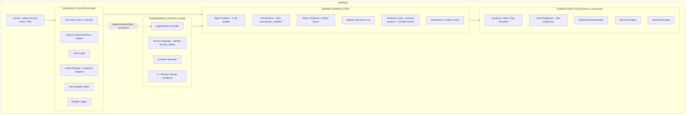

# Hermes Autonomous Quantitative Research Laboratory — Architecture v3

**Version:** v3 (candidate, pending ratification)
**Supersedes:** `hermes_research_architecture_2.md` (v2.1, remediated) and `hermes_research_architecture_ds.md` (ds) — see the Merge Decision Record (§3).
**Sources of authority (in order):** (1) explicitly remediated v2.1 requirements; (2) confirmed decisions from the adversarial reviews; (3) ds improvements adopted where they strengthen Hermes; (4) the source-level freephdlabor reassessment (`hermes_freephdlabor_source_reassessment.md`); (5) architectural inference.
**Citation convention (per v2.1 C8):** `Brief §N` = the original design brief; `v2.1 §N` = `hermes_research_architecture_2.md`; `ds §N` = `hermes_research_architecture_ds.md`; `user §N` = the v3 merge instruction (the prompt that produced this document); `v3 §N` = this document. Bare `§N` inside this document refers to v3 itself. Section numbers from other documents are never cited without their source label. **Finding ids** (`C1–C10`, `M1–M10` = v2.1 remediation findings; `H1–H4`, `M1–M6`, `L1–L6`, `R1–R9` = v3 adversarial-review findings) refer to review findings, **not to document sections** — a bare `M1`/`M2` in v3 context (model tiers, memory model) is a different finding from v2.1's `M1`/`M2` (transition table, cache bypass), and the two are always labeled by document where ambiguity exists (R6).

---

## 1. Executive Summary

Hermes v3 is **remediated v2.1 as the foundation, with ds's integrity spine adopted on top**. The merge keeps every v2 hardening that survived adversarial review (the Intent gateway with an internal-only `ADMIT_TASK`, the three mandatory human gates, the `NO_SIGNAL` two-step liveness rule, the mass-misdiagnosis circuit breaker, spec-level baseline binding, the mandatory task graph, content-hash caching with fresh-execution requirements for `REPLICATED`/`ROBUST` citations — the ROBUST extension beyond v2.1's replication bypass is recorded in §3) and adopts every ds mechanism that makes the scientific-integrity layer stronger: **pre-registration with exploratory-drift classification, the five-rung evidence ladder with deterministic promotion preconditions, the nine-gate scientific-integrity catalog with bias→gate mapping, orthogonal operational modes, the four-agent-profile model, first-class contradiction handling, INVALIDATED task semantics, and the reconciliation loop as the driver around — never instead of — the task graph.**

One sentence: *Hermes is a reconciliation loop over a typed research state machine and a persisted task graph, delegating judgment to four agent role profiles whose proposals pass through a deterministic Intent gateway, measuring reality only through external engines behind adapters, pre-registering every confirmatory experiment, and persisting everything with provenance so every belief is traceable, every experiment reproducible, and every claim must earn its status.*

The freephdlabor source investigation (`hermes_freephdlabor_source_reassessment.md`) is incorporated in full: **writeup pipeline → REIMPLEMENT; `open_deep_search` → REIMPLEMENT** (ds's "REFERENCE" label modified). No code is harvested from any evaluated repository; the reusable *shapes* (the provider-abstraction pattern, the staged-writeup discipline) are reimplemented natively behind Hermes-owned interfaces (§15, §22).

---

## 2. Architectural Principles

1. **Deterministic control flow owns execution, state, evidence progression, resource governance, and safety. LLMs provide bounded judgment inside explicitly defined interfaces.** An LLM is never the implicit authority for: state transitions, experiment execution, budget enforcement, evidence promotion, replication or robustness status, scheduler decisions, provenance, audit results, or any scientific gate decision that can be expressed deterministically (Brief §7/§9/§30/§36; v2.1 §8).
2. **One authoritative mutation path.** Every effect on research state — by an agent, a tool, or the scheduler — is a typed `Intent` validated by a single deterministic `apply_intent` gateway (v2.1 §8, preserved). There is no second write path.
3. **Evidence must earn its status.** A `Hypothesis` advances at most one ladder rung per transition, each transition citing the specific artifact that justifies it, checked against a deterministic precondition table (v2.1 §11 M1; ds §19).
4. **Confirmatory ≠ exploratory.** Only pre-registered experiments with matching executed-spec hashes may drive confirmatory evidence. Exploratory results are archived, visible, and useful — and cannot promote a claim (ds §19/§22, adopted).
5. **Reconciliation converges; the graph remembers.** The reconcile loop is the driver; the task graph is the persisted plan; the lifecycle machine is the desired-state declaration. The loop never invents workflow, bypasses the graph, or erases history (Brief §16; v2.1 §31; ds §15; v3 §8).
6. **The burden of proof is on making a responsibility agentic.** If deterministic code can do the job, deterministic code owns it (ds §16, adopted). Agents exist only where open-ended judgment is irreducible.
7. **Never over-engineer.** SQLite is the day-one system of record; DuckDB is an optional read-side enhancement triggered by need; local hardened execution is the default; no workflow engine, broker, graph DB, vector DB, or Kubernetes at launch (Brief §39; v2.1 §18; ds §43).
8. **External frameworks are never architectural authorities.** They are adapters behind Hermes-owned ports, replaceable, version-pinned, license-recorded (v2.1 §7/§34; reassessment).

---

## 3. Merge Decision Record

Every significant ds→v2 integration or rejection. "V2 status" refers to the remediated v2.1 baseline.

| ds proposal | V2 status | Action | Final decision | Reason |
|---|---|---|---|---|
| Pre-registration (spec hash, executed-spec hash, EXPLORATORY_DRIFT) | Missing | Adopt | **YES** | The single strongest anti-p-hacking mechanism; v2 had hashing but no registration-before-execution contract (§11). |
| Evidence ladder redesign (`SPECULATIVE→PLAUSIBLE→SUPPORTED→ROBUST→REPLICATED`) | v2 ladder (`SPECULATION→LITERATURE_SUPPORTED→OBSERVED→EXPERIMENTALLY_SUPPORTED→REPLICATED→ROBUST`) | Adopt, with v2 semantics preserved | **YES (ladder replaced; v2's rung semantics folded in)** | Five rungs with a terminal positive class (REPLICATED) are cleaner than v2's eight classes with two positive-orderings; `OBSERVED`/`LITERATURE_SUPPORTED` become orthogonal *attributes* so v2's determinism is not lost (§10). |
| Nine integrity gates (Data, Methodology, Leakage, Statistical, Robustness, OOS, Adversarial, Replication, Reporting) | Named but unspecified (v2.1 §31 mentions the same nine) | Consolidate + specify | **YES** | v2 referenced the catalog without defining it; ds's §35 table becomes v3 §12. |
| Bias→gate mapping | Missing | Adopt | **YES** | Turns the integrity layer from admonition into a structural matrix (§12). |
| Four agent role profiles (Director/Researcher/Implementer/Adversary) | 13 task types (v2.1 §6) | Consolidate | **YES, with roster preserved** | v2's 13 types are not deleted; they become task-type *variants* inside the four profiles (§13). Deterministic work moves to named services. |
| Orthogonal modes (ACTIVE/AWAITING_HUMAN/PAUSED) | Defective `FAILED→PAUSED` machine (v2.1 C6 remediation made PAUSED a scheduling state) | Adopt | **YES** | Three explicit axes (lifecycle / mode / task status) make pause-resume, gates, and retries compositional (§6). v2.1's scheduler-halt semantics are preserved inside the mode model. |
| Task node contract (full execution contract) | Partial (`Task` in v2.1 §8) | Strengthen | **YES** | ds §14's contract fields adopted; v2.1's gateway/budget fields retained (§7). |
| `INVALIDATED` task semantics | Missing | Adopt | **YES** | Invalidation cascade, archived-not-deleted (§7). |
| Loop = new subgraph instantiation | Weak ("INSERT_TASK/BRANCH" only) | Adopt | **YES** | Failed validation creates a *new* node from the amended, re-pre-registered spec; history immutable (§7). |
| Contradiction → `UNCERTAIN` as first-class event | Present (v2.1 M9) | Strengthen | **YES** | v2.1's infra-vs-disagreement routing retained; `CONTRADICTION_DETECTED` event + resolution path added (§8, §19). |
| Adversarial review of the robustness suite | Partial | Strengthen | **YES** | ds §36.7 adopted wholesale (§13). |
| Provider diversity (Adversary ≠ research chain) | Present (v2.1 §22) | Preserve | **YES** | Fallback ladder (different family → same provider, recorded + measured) preserved (§13). |
| Reconciliation loop as organizing principle | Backstop-only `GateReconciler` (v2.1 §31) | Adopt carefully | **YES — loop as driver, graph as plan** | ds §15's loop becomes the controller; v2's task graph stays mandatory and authoritative (§8). The loop's "never" list is explicit. |
| `NO_SIGNAL` two-step liveness | Strong v2 (v2.1 §20) | Preserve | **YES** | Unchanged; unified lease-expiry language (§19). |
| Mass-misdiagnosis circuit breaker | Strong v2 (v2.1 §20) | Preserve | **YES** | Unchanged (§19). |
| Spec-level baseline binding (`role`/`baseline_spec_id`) | Strong v2 (v2.1 C5) | Preserve | **YES** | Unchanged (§7 rule 5, §11). |
| Cache citation eligibility | v2.1 M2: replication bypasses the cache | Extend, recorded | **YES** | v2.1 made only `REPLICATED` citations execute fresh; v3 extends ineligibility to `ROBUST` citations — robustness claims must be re-measured, and parameter-sweep runs must not double as robustness evidence (§16.2). This is a deliberate extension over v2.1, recorded here (v3 M3). |
| Human-gate set | v2.1: three mandatory (hypothesis, pre-compute, pre-live) | Preserve, with ds's full semantics | **YES — three mandatory; question/data gates configurable** | User instruction §4 names exactly three mandatory gates; ds's question-approval and data-acquisition gates become configurable because v2's deterministic data gate + hashes already cover data trust (§9). |
| `WAITING_EXTERNAL` task status | Missing (`WAITING_HUMAN` overloaded) | Adopt | **YES** | Engineering handoff / CI / merge waiting gets its own status (§7, §21). |
| Vault single-writer ownership | Implied (v2.1 §12) | Make explicit | **YES** | DB → rendering pipeline → vault projection, one writer; inbox is the only input channel (§22). |
| Writeup pipeline disposition | v2.1 §34: "ADAPTER (harvest)" | Modify | **REIMPLEMENT** | Source-level reassessment: 12,168 lines, all `smolagents.Tool` subclasses wired to freephdlabor's LLM/VLM layer; LLM-judgment verification; <10% reusable (§22). |
| `open_deep_search` disposition | v2.1 §34: "ADAPTER (harvest)" | Modify | **REIMPLEMENT** | Value is the ~200-line `SearchAPI` ABC; everything above it drags litellm/crawl4ai/langchain/smolagents and returns prose, not evidence; 10–25% reusable; broken lazy imports (§22). |
| arXiv/Semantic-Scholar tooling disposition | v2.1 §34: "ADAPTER (harvest, thin)" | Modify | **REIMPLEMENT** | Thin REST adapters (~100 lines each) behind `LiteratureProvider`; harvesting adds a vendoring obligation for near-zero savings (§22). |
| Litho | ADAPTER (subprocess wrap, MIT, pinned) | Preserve | **ADAPTER** | Multi-language static analysis is genuinely not worth rebuilding; interface-isolated, read-only (§22). |
| Engineering control plane | v2.1 §32 | Preserve | **YES** | Same-core second controller; `ENGINEERING_CHANGE_REQUESTED` handoff; CI in isolated runner (§21). |
| Roadmap sequencing | v2.1 §24 (8 phases, agents early) | Resequence | **YES — evidence/provenance spine before agent runtime** | ds §39's ordering principle adopted; v2.1's stronger per-phase validations (walking skeleton with all three gates, record/replay) embedded (§24); the Engineering plane is sequenced ahead of the engine-integration phases so the adapter handoff is live when adapters first need it (v3 H1). |

**Conflicts where ds is *not* adopted (recorded for auditability):** ds's mandatory question-approval and external-data human gates (v3 keeps them configurable — see §9); ds's `HYPOTHESIS_CRITIQUE` as a lifecycle *state* (v3 keeps it as a mandatory gate precondition at the task level — see §6/§10); ds's "REFERENCE" labels for the two freephdlabor components (modified to REIMPLEMENT by source evidence, matching ds's own D4 matrix text). Nothing in v3 reverts a v2.1 remediation.

---

## 4. System Overview



Responsibilities (the Brief §40 question, answered once):

| Concept | Status | Role |
|---|---|---|
| Lifecycle state machine | authoritative (desired state) | declares what must be true; guarded transitions; orthogonal modes |
| Task graph | authoritative (operational plan) | declares the work; dependencies, retries, gates, dynamic growth |
| Reconcile loop / controller | the driver | observes, diffs, plans, dispatches, validates, commits, requeues; the only writer of research state |
| Intent gateway + evidence validator | validate | deterministic preconditions on every state/evidence transition; agents propose, never set |
| Nine integrity gates | validate | deterministic preconditions on evidence transitions (§12) |
| Agent runtime | execute judgment | typed tasks with schema'd, validated outputs; context policies; model routing |
| Tool runtime + engines | execute deterministically | adapters and engines; the only place measurement happens |
| Event log | persists memory | append-only; audit, resume, wake-ups (§8.1) |
| Observer loops | observe | watch external systems (vault inbox, PR status, providers, heartbeats) and reduce them to durable events; never write research state (§8.1) |
| Artifact store + git | persists artifacts | content-addressed, versioned, immutable |
| Reconciliation | the autonomy mechanism | convergence = resume, retry, replan, done |

---

## 5. Deterministic Services vs. Agent Profiles

The "burden of proof is on making it agentic" rule (v3 §2 principle 6) yields a fixed split. The following are **deterministic services** — code, not LLMs. An LLM may *interpret* their outputs in a schema'd task, but never compute them:

| Service | Owns |
|---|---|
| **DataValidationService** | schema/gap/duplicate/survivorship/look-ahead checks, content-hash verification (v2.1 §23; ds §35 Data gate) |
| **StatisticalAnalysisService** | tests, bootstrap CIs, multiple-comparison correction, assumption checks, regime-slice re-application |
| **EvaluationProtocolRunner** | fold/seed/split construction, per-run dispatch, versioned aggregation for `single_run | walk_forward | monte_carlo | bootstrap | parameter_sweep | out_of_sample` (v2.1 C3/C5) |
| **Controller (incl. scheduler + gate reconciling)** | the reconcile loop (§8); the scheduler component proposes `ADMIT_TASK` internally only |
| **Intent gateway (`apply_intent`)** | the single authoritative mutation path (§8) |
| **ArtifactManager** | content-hash-keyed writes, lifecycle/GC, archive (§16) |
| **ProvenanceManager** | provenance edges, acyclicity check, audit queries (§14) |
| **ReportRenderer** | structured `ResearchReport` → Markdown/LaTeX/HTML with staged verification (native reimplementation of the freephdlabor writeup discipline; §15) |

---

## 6. State / Mode / Task Model

Three orthogonal axes (Brief §26, ds §13, user §17). Never conflate scientific evidence, project lifecycle, human waiting, execution pause, and task failure in one machine.

### 6.1 Axis 1 — Lifecycle (coarse, project-level)

```text
CREATED → SCOPING → LITERATURE_REVIEW → HYPOTHESIS_FORMULATION → EXPERIMENT_DESIGN
        → DATA_ACQUISITION → DATA_VALIDATION → IMPLEMENTATION → EXPERIMENTATION
        → ANALYSIS → VALIDATION → ADVERSARIAL_REVIEW → REPLICATION → REPORTING → COMPLETED
Terminal: FAILED, ABANDONED
```

| From | To | Guard (deterministic preconditions) |
|---|---|---|
| CREATED | SCOPING | question registered; (configurable question gate, §9) |
| SCOPING | LITERATURE_REVIEW | scope defined (instruments, timeframes, boundaries) |
| LITERATURE_REVIEW | HYPOTHESIS_FORMULATION | `LiteratureReview` artifact exists |
| HYPOTHESIS_FORMULATION | EXPERIMENT_DESIGN | ≥1 hypothesis formalized, falsification condition stated, screened against refuted registry, hypothesis critique passed; **hypothesis gate approved (mandatory)** |
| HYPOTHESIS_FORMULATION | HYPOTHESIS_FORMULATION | hypothesis gate **rejected** → revision loop (rejection semantics per §9) |
| EXPERIMENT_DESIGN | DATA_ACQUISITION | ExperimentSpec drafts exist; data requirements registered |
| DATA_ACQUISITION | DATA_VALIDATION | datasets registered with content hashes |
| DATA_VALIDATION | IMPLEMENTATION | data gate passed |
| DATA_VALIDATION | DATA_ACQUISITION | data gate failed (re-acquire loop) |
| IMPLEMENTATION | EXPERIMENTATION | feature/strategy artifacts bound and verified; **pre-compute gate approved (mandatory)** |
| IMPLEMENTATION | IMPLEMENTATION | pre-compute gate **rejected** → revision (or EXPERIMENT_DESIGN if the design is flawed) |
| EXPERIMENTATION | ANALYSIS | primary experiments complete with manifests |
| ANALYSIS | VALIDATION | statistical analysis artifacts exist (statistical gate) |
| VALIDATION | ADVERSARIAL_REVIEW | robustness/OOS suites complete (robustness + OOS gates) |
| ADVERSARIAL_REVIEW | REPLICATION | adversarial gate passed |
| ADVERSARIAL_REVIEW | EXPERIMENT_DESIGN | fixable experiment-level flaw (v2.1 M8, preserved) |
| ADVERSARIAL_REVIEW | HYPOTHESIS_FORMULATION | hypothesis refuted |
| REPLICATION | REPORTING | replication gate passed; **pre-live gate approved (mandatory)** |
| REPLICATION | ANALYSIS | replication disagrees → `UNCERTAIN` + Director routing (v2.1 M9, preserved) |
| REPLICATION | REPLICATION | pre-live gate **rejected** → replication revision (or downgrade path, §9) |
| REPORTING | COMPLETED | reporting gate passed |
| any non-terminal | FAILED | unrecoverable failure after retries and human escalation |
| any non-terminal | ABANDONED | `ResearchDecision`; human-approved if the hypothesis was pre-registered |

`CREATED` is the initial row state; the `ResearchCreated` event fires on insert (v2.1 C10). Re-entrancy is limited to the edges above (`REPLICATION → EXPERIMENTATION` on replication *disagreement* is not a direct edge — disagreement routes through `ANALYSIS`/`UNCERTAIN`; a replication that fails to *run* is an infrastructure failure on the §19 retry path, v2.1 M9).

### 6.2 Axis 2 — Operational mode (orthogonal to lifecycle)

```text
ACTIVE | AWAITING_HUMAN | PAUSED
```

| From | To | Guard / trigger |
|---|---|---|
| ACTIVE | AWAITING_HUMAN | a human gate node is reached in the graph; loop requeues with backoff |
| AWAITING_HUMAN | ACTIVE | a `HumanDecision` is recorded (consumed once from the inbox, §22) |
| ACTIVE | PAUSED | operator pause request; auto-pause on `GateExpired` escalation (§9) or circuit-breaker trip (§19) |
| PAUSED | ACTIVE | operator resume |
| AWAITING_HUMAN | PAUSED | auto-pause after the gate-expiry escalation threshold |
| PAUSED | AWAITING_HUMAN | resume re-enters the waiting gate |

Modes apply only to non-terminal lifecycle states. While `PAUSED`, the controller stops dispatching; task statuses, leases, and artifacts are all preserved, and resume re-runs wave eligibility (v2.1 C6 semantics, preserved verbatim as the mode's behavior).

**Pause/resume contract (user §8):** *Who* — the operator may pause from any non-terminal state; the system auto-pauses on escalation thresholds and circuit-breaker trips. *Running work* — cooperative halt: no new dispatches; in-flight tasks run to their next checkpoint (a completed tool call / artifact write) and persist status + `last_heartbeat`; a task that cannot checkpoint cleanly is marked `RETRYING` on resume, never half-committed. *Checkpoint* — SQLite state + content-addressed artifacts *are* the checkpoint; there is no separate serialization. *Resume* — the reconcile loop converges from observed state; a `RUNNING` task whose lease expired during the pause follows the `NO_SIGNAL` → second-check → retry path (§19). *Idempotency* — every node carries an `idempotency_key` (content hash of spec+inputs), so re-dispatch cannot double-execute. *Recovery after restart* — same convergence property; a second controller instance fails the single-writer advisory lock and exits. *Audit* — every mode change emits `ModeChanged` with actor and reason. *Restrictions* — no pausing during the atomic consumption of a gate decision; no pausing a project already in a terminal lifecycle state.

### 6.3 Axis 3 — Task status (operational, per node)

```text
PENDING → READY → RUNNING → SUCCEEDED
              │         ├→ NO_SIGNAL → FAILED (second conclusive miss)
              │         └→ WAITING_HUMAN | WAITING_EXTERNAL → RUNNING
              ├→ CANCELLED | SKIPPED (optional branches only)
              └→ INVALIDATED
FAILED → RETRYING → RUNNING
```

`WAITING_HUMAN` = a human gate node awaiting `HumanDecision`. `WAITING_EXTERNAL` = awaiting the Engineering Controller, CI, an external tool, or a merge (v2.1 M8, adopted; never overloaded onto `WAITING_HUMAN`). `INVALIDATED` = an upstream artifact/specification changed; the node's old result is archived (never deleted) and the node is re-created or re-run per §7. `SKIPPED` is permitted only where the graph template declares the branch optional.

---

## 7. Task Graph and Node Contract

The graph is a **persisted DAG** (nodes/edges tables in SQLite). It is the authoritative operational plan; the reconcile loop advances it (v3 §8). Nodes are created only by the controller templates or validated `INSERT_TASK`/`BRANCH` intents — nothing appears in the graph without passing `apply_intent` (v2.1 §8, preserved).

**Node contract (ds §14, strengthened with v2.1 fields):**

```text
Node {
  task_id, task_type, profile (DIRECTOR | RESEARCHER | IMPLEMENTER | ADVERSARY | DETERMINISTIC),
  inputs: [artifact_ref], outputs: [declared artifact kinds],
  dependencies: [task_id],                 # edges
  idempotency_key,                          # content hash of spec + inputs (+ execution env for experiment nodes, §16)
  attempt, max_retries, retry_policy,       # transient vs. permanent error taxonomy
  status,                                   # §6.3; node-level waiting is a status (WAITING_HUMAN/WAITING_EXTERNAL), not a mode (M5)
  provenance,                               # upstream artifact ids
  spec,                                     # typed, schema'd
  cost_class, permissions, timeout, heartbeat_interval, concurrency_group,
  created_at, started_at, completed_at
}
```

Node types: `AGENT_TASK` (judgment via Agent Runtime), `TOOL_TASK` (deterministic via Tool Runtime), `GATE` (deterministic gate evaluation), `HUMAN_GATE` (stops on `AWAITING_HUMAN`), `SUBGRAPH` (nested cluster, e.g. one experiment's pipeline).

**Graph rules:**

1. **Dependencies.** A node becomes `READY` when all deps are `SUCCEEDED` and none is `INVALIDATED`.
2. **Admission.** `READY` is reached *only* via the `ADMIT_TASK` intent, proposed exclusively by the scheduler (inside the controller) or the gate-reconciling pass; `apply_intent` rejects any other `proposed_by` and enforces budget, concurrency, state-machine-gate, and policy checks (v2.1 C4, preserved). `ADMIT_TASK` is **scheduler-internal only — never LLM-proposable** (user §6).
3. **Loops are re-instantiation, not cycles.** The graph is a DAG. A failed validation creates a *new* node from the amended spec — which is re-pre-registered (§11) — with edges from its inputs; the historical run's nodes and artifacts remain immutable and queryable (user §19; ds §14). No hidden mutation of history.
4. **INVALIDATED semantics.** When an upstream artifact changes (new dataset version, amended hypothesis, superseded spec), the controller marks downstream nodes `INVALIDATED` and creates fresh ones; invalidated results stay archived under their original hashes (ds §14; v3 §16 GC rules — invalidated evidence is never garbage-collected).
5. **Baseline binding.** Any candidate `ExperimentSpecification` must resolve `baseline_spec_id` to a `role="baseline"` sibling spec on the same dataset and protocol before dispatch; `EvaluationProtocolRunner` enforces it for multi-run protocols and the runner rejects unpaired single-run candidates (v2.1 C5, preserved). The statistical engine therefore cannot compare a candidate without an explicitly resolvable baseline where the protocol requires one.
6. **Cancellation.** `PENDING`/`READY` nodes cancel with their subtrees; running nodes cancel cooperatively + lease expiry (§19).
7. **Resumability.** The graph is the persisted plan; the loop resumes from observed state after any crash (§8, §19).

---

## 8. Reconciliation Loop + Task Graph

**The relationship (user §33, verbatim in spirit):** the reconciliation loop is a control mechanism **around** the graph, never a replacement for it.

```text
                RECONCILIATION LOOP (the driver)
                        │  observes actual vs. desired
                        ▼
                    TASK GRAPH (the plan)
                        │  determines workflow
                        ▼
                  INTENT GATEWAY (apply_intent)
                        │  deterministic validation
                        ▼
                STATE / EVIDENCE / EVENT (committed)
```

**Loop responsibilities (ds §15 + user §34):** (1) inspect actual persisted state; (2) compare against desired state (lifecycle requirements + gate checklist + graph); (3) identify gaps; (4) validate whether actions are still admissible; (5) submit appropriate intents through `apply_intent`; (6) recover stalled work; (7) resume eligible work; (8) detect contradictions (`CONTRADICTION_DETECTED`); (9) enforce human gates; (10) trigger the rendering pipeline to update the vault journal projection (§21 — the loop triggers, it does not write). Requeue policy: immediate after work; short backoff while tasks in flight; long backoff while `AWAITING_HUMAN`/`WAITING_EXTERNAL`; none while `PAUSED`.

**The loop never:** invents research workflow, bypasses the task graph, directly mutates state, bypasses budget controls, replaces explicit branching, or erases execution history. Judgment (branch? abandon? sufficient?) remains a `DIRECTOR_REVIEW` task whose *proposal* is an intent; the loop only ever asks "does the mechanical next-gate task exist" (v2.1 §31, preserved inside the driver role).

**Intent kinds (merged):**

```text
Intent { kind, proposed_by, project_id, payload, justification }
  LLM-proposable: INSERT_TASK | BRANCH | ABANDON | EVIDENCE_TRANSITION |
                  REQUEST_HUMAN | REQUEST_REPLICATION | REQUEST_ADDITIONAL_EXPERIMENT |
                  PROPOSE_GATE_OVERRIDE | CONTRADICTION_RESOLUTION
  Internal-only:  ADMIT_TASK          # scheduler / reconciling pass only
```

Per-kind validators: `EVIDENCE_TRANSITION` checks the §10 precondition table + cited artifacts + one-step rule; `INSERT_TASK`/`BRANCH` check DAG validity; `ADMIT_TASK` checks budget/concurrency/state/gate policy; `ABANDON` requires a `ResearchDecision` (human-approved for pre-registered hypotheses); `PROPOSE_GATE_OVERRIDE` requires a human decision, recorded permanently; `CONTRADICTION_RESOLUTION` requires an attached resolution rationale. Rejected intents emit `IntentRejected` with reasons — signal, not noise.

**Single-writer discipline.** One controller instance per project via a SQLite advisory lock (`BEGIN IMMEDIATE` on a one-row `scheduler_lock`); a stale second instance fails to acquire and exits; lease expiry treats a stale holder's tasks as dead (§19).

### 8.1 Event Architecture and Observer Loops

**Yes to events; no to a broker** (v2.1 §19, ds §30, restored — an implementer must not re-derive this for P1/P3). An append-only `events` table in the same SQLite database (`event_id, type, payload_json, project_id, task_id, created_at, causality_links`) is the write-ahead record of every state change: every mutation is *command → validate → apply → event* in one transaction. Events give Hermes auditability (nothing overwrites history), provenance (events link state changes to the artifacts that justified them), resume (replay/observation reconstructs where a project left off), reactive wake-ups, and human-decision tracking. Events are never pruned at this scale; shrinking history is a per-project export/archive performed well after the fact (v2.1 §19).

**Catalog** — the events named throughout v3 plus the supporting set, in one place: `ResearchCreated, QuestionApproved, ScopeDefined, SourceDiscovered, LiteratureReviewCompleted, HypothesisCreated, HypothesisCritiqued, DatasetRegistered, DatasetValidated, DatasetRejected, FeatureBound, FeatureVersioned, ExperimentPreRegistered, ExperimentCreated/Started/Completed/Failed, ResultGenerated, ResultReused, AnalysisCompleted, GatePassed, GateFailed, GateEvaluated, CritiqueGenerated, ContradictionDetected, EvidenceTransitionProposed/Applied/Rejected, ReplicationRequested/Completed, HumanApprovalRequested, HumanDecisionReceived, GateExpired, BudgetExceeded, IntentApplied, IntentRejected, TaskStatusChanged, ModeChanged, HeartbeatMissed, CircuitBreakerTripped, ENGINEERING_CHANGE_REQUESTED, MergedChangeRecorded, MergeCompleted, ProjectPaused, ProjectResumed, ResearchCompleted, BackupSnapshot`. (`MergedChangeRecorded` is the event emitted when the `MergedChange` artifact is written to the research task's `output_ref` — the artifact keeps the name `MergedChange`, F5.) Every event links to the artifact(s) that justified it; every state-changing effect emits exactly one event via the write path.

**Mechanism (agent-orchestrator's CDC pattern at single-machine scale):** DB triggers append to the log; a lightweight in-process poller/broadcaster fans out to subscribers — controller wake-ups, the UI, journal re-renders. **Observer loops are a named shared-core component** (restored to §4): they watch external systems (the vault inbox, PR/CI status, provider health, heartbeats) and reduce them to durable events; observers **never write research state** — the controller is the canonical writer and reads state directly, treating the event stream as wake-ups/notifications/audit, never as the state source (ds §30). If multi-machine execution ever arrives, the event log sits behind the same interface a real broker (Redis Streams, then Kafka only if truly necessary) would implement — adopting one now, for one operator, would solve a scale problem that does not exist yet.

---

## 9. Human Gates

### 9.1 The three mandatory gates

Each gate is a `HUMAN_GATE` node; reaching it sets mode `AWAITING_HUMAN`; only a recorded `HumanDecision` releases it. Delivery is the vault-inbox pattern (Hermes writes a schema'd YAML gate file; the human edits; Hermes consumes it exactly once and archives it — no listening port; v2.1 §12/§21, preserved). Each gate defines:

| | Hypothesis gate | Pre-compute gate | Pre-live gate |
|---|---|---|---|
| **Entry state** | `HYPOTHESIS_FORMULATION → EXPERIMENT_DESIGN` | `IMPLEMENTATION → EXPERIMENTATION` | `REPLICATION → REPORTING` |
| **Required evidence** | `Hypothesis` + `NullHypothesis` + falsification condition, refuted-registry screen result, hypothesis `Critique` (passing) | bound+verified `FeatureBinding`, `ExperimentSpec` set with resolved baselines, compute-cost estimate | `REPLICATED`-eligible evidence chain: pre-registered experiments, gate verdicts, replication report |
| **Deterministic checks** | hypothesis formalized; falsification condition stated; critique artifact exists with PASS verdict | binding verified against engine; specs validated; baselines resolvable (§7 rule 5); cost within project budget | replication gate passed; executed-spec hashes match registrations; no `UNCERTAIN`/open contradictions |
| **Human decision** | APPROVED / MODIFIED / REJECTED | APPROVED / MODIFIED / REJECTED | APPROVED / REJECTED / REQUEST_MORE_REPLICATION |
| **Approval transition** | → `EXPERIMENT_DESIGN` | → `EXPERIMENTATION` | → `REPORTING` |
| **Rejection transition** | → `HYPOTHESIS_FORMULATION` (revision) | → `IMPLEMENTATION` (revision; → `EXPERIMENT_DESIGN` if the design is flawed) | → `REPLICATION` (more/stronger replication) or downgrade path via `UNCERTAIN` → `ANALYSIS` |
| **Revision behavior** | revision is a new `Hypothesis` version: re-screened against refuted registry, re-critiqued, re-submitted. Repeated rejections → `DIRECTOR_REVIEW` abandonment proposal (human-approved if pre-registered) | revised binding/spec re-verified and re-submitted; repeated rejection → scaled-down design or `ABANDONED` proposal | additional replication runs execute fresh (§16); a rejection citing an evidential flaw downgrades the claim per §10 |
| **Timeout behavior** | `respond_by` deadline (default 7 days, configurable) → `GateExpired` event → `DIRECTOR_REVIEW` proposes extend / auto-pause / escalate; past a second threshold → **auto-PAUSE** (safe: nothing advances). **A gate is never auto-approved** (v2.1 M3, preserved) |
| **Audit record** | `HumanDecision` + `GateEvaluated` + `ModeChanged` events, all linked to the evidence pack presented |

**What rejection means scientifically:** hypothesis rejection = the question as framed is untestable/not worth compute — reformulate; pre-compute rejection = the compute spend is not justified for the current design — revise the plan, not the science; pre-live rejection = the result is not yet defensible as REPLICATED — gather more evidence or accept a downgrade. These transitions exist because the gates' purposes differ, not for symmetry (user §11).

### 9.2 Configurable gates (defaults)

| Gate | Default | Notes |
|---|---|---|
| Research-question approval | OFF (configurable) | ds marks it mandatory; v3 keeps it optional because the hypothesis gate already vets the *question* before compute (v2.1 §35 step 10 rationale). Operator may enable. |
| External data acquisition | OFF (configurable) | Data trust is enforced deterministically by the Data gate + content hashes (§12), which is stronger than a human gate; operator may enable for sensitive sources. |
| Hypothesis abandonment (pre-registered) | **mandatory** | Refuting your own registered claim needs a human (ds §31, adopted). |
| Gate override | **always requires human** | Recorded permanently (ds §31, adopted). |
| Contradiction resolution | configurable | May route to `DIRECTOR_REVIEW` within budget (ds §31, adopted). |

---

## 10. Evidence Ladder — Deterministic Promotion Rules

### 10.1 Ladder and orthogonal attributes

```text
SPECULATIVE → PLAUSIBLE → SUPPORTED → ROBUST → REPLICATED
                    (terminal-ish: UNCERTAIN, REFUTED)
```

The v2 classes `LITERATURE_SUPPORTED` and `OBSERVED` are **demoted to orthogonal attributes**, not deleted (user §12: "Evaluate whether OBSERVED and LITERATURE_SUPPORTED should remain as orthogonal evidence attributes rather than primary ladder states" — they do):

```text
EvidenceAttributes { has_literature_support: ref | null   # the LiteratureReview behind PLAUSIBLE
                     observations: [BacktestResult refs]  # single runs, unreviewed; never promote alone
                     pre_registered: bool                 # §11
                     exploratory_count: int               # §11
                     open_contradictions: [ref]           # §19 }
```

Rules: a hypothesis with only observations is still `SPECULATIVE` (an observation is evidence *of measurement*, not support for a claim); literature support is the *required citation* for `PLAUSIBLE`; a single attractive experiment can never move a hypothesis past `SUPPORTED`'s full precondition set — the ladder's entry rules are deterministic, so the Evidence Validator can answer "is this eligible?" without an LLM.

### 10.2 Transition table (the validator's rules — any transition not listed is rejected; one rung max per transition; DB `CHECK` constraint mirrors it)

| Transition | Required cited artifacts | Deterministic preconditions (all must hold) |
|---|---|---|
| → SPECULATIVE | `Hypothesis`, `ResearchDecision` | hypothesis formalized; falsification condition stated; screened against refuted registry; **no `LiteratureReview.contradictions[]` entry's `subject_tags` intersect the hypothesis's tags** (instrument × feature family × claim type — the same structured-match pattern as the refuted-registry screen; prose-level contradiction judgment belongs to the PLAUSIBLE synthesis and critique, not this check — R1/F1) |
| SPECULATIVE → PLAUSIBLE | `LiteratureReview` (citing `Source[]`), hypothesis `Critique` (PASS) | review complete and consistent; hypothesis critique passed (incl. prose-level contradiction judgment); no open contradiction. A null literature result still satisfies the review citation — "the question is open" is itself a supported claim |
| PLAUSIBLE → SUPPORTED | pre-registered `Experiment` + `BacktestResult` + `StatisticalAnalysis` + `Validation` (data, leakage, statistical, methodology) + `Critique` (adversarial, methodology) | ≥1 **pre-registered** experiment; `registered_spec_hash == executed_spec_hash` (no drift, §11); pipeline validated; data gate passed; leakage gate passed; statistical gate passed (correct tests, assumptions checked, multiple-comparison awareness, **analysis-plan adherence** — the pre-registered test list was honored, no post-hoc test swapping, §11.1 M4); primary metric meets the **pre-specified** threshold; methodological adversarial review passed |
| SUPPORTED → ROBUST | robustness + OOS `Validation` records + `StatisticalAnalysis` (incl. regime-slice re-application) + `Critique` (adversarial review **of the robustness suite itself**) | SUPPORTED held; parameter perturbation, alternative specs, seeds passed; OOS/walk-forward passed; multiple-comparison correction applied across the project's experiments; stability demonstrated across at least one **pre-declared regime split** (taxonomy axis `ICSS-v1` by default, versioned — §27 item 6) with the same statistical test re-applied per slice (v2.1 §23 regime rule, preserved); robustness adversarial review passed |
| ROBUST → REPLICATED | `Replication` + fresh re-run `BacktestResult`s | ROBUST held; independent re-execution(s) agree (different seeds/splits; ideally independent implementation); replication report documents the agreement measure; replication gate passed. Controller-deterministic: replication is executed **fresh** (cache-bypassed, §16) — an "independent re-run" is never a cache hit (v2.1 M2) |
| any → UNCERTAIN | conflicting `BacktestResult`s / `Replication` / `Validation` | `CONTRADICTION_DETECTED` event fired; conflicting artifacts cited (v3 §19) |
| any → REFUTED | failed `BacktestResult` / `Replication` / leakage `Validation`, or human `ResearchDecision` | decisive falsification: pre-registered test failed, replication failure, or a validity/leakage bug in the supporting pipeline. Human-approved if the hypothesis was pre-registered |

Downgrades follow the same artifact-cited discipline as upgrades. The **one-step rule** and "no public status setter outside `apply_intent`" hold exactly as in v2.1 §11 (M1). Refuted hypotheses remain first-class registry assets, structurally screened (instrument × feature-binding signature × strategy family) before new hypotheses are accepted.

---

## 11. Pre-registration, Amendment, and Exploratory Drift

### 11.1 Flow (ds §22, adopted)

```text
ExperimentSpecification
  → canonical serialization
  → spec hash
  → PRE-REGISTRATION (immutable registry entry + timestamp, before execution)
  → execution
  → ReproducibilityManifest records executed_spec_hash
  → result carries registered_spec_hash AND executed_spec_hash
```

The `ExperimentSpecification` gains: `pre_registration_hash`, `executed_spec_hash` (from the manifest), `exploratory/confirmatory` flag, `primary_metric` + `pre_specified_threshold`, `protocol_version`, `regime_taxonomy_version` (H4, §27 item 6), and `analysis_plan` (declared tests + primary test + fallback order — binds test selection before results exist, M4). A result without both hashes is not a result; the adapter produces the manifest structurally (v2.1 §13, preserved).

**Classification:** if `registered_spec_hash != executed_spec_hash` at execution time, the run is `EXPLORATORY_DRIFT` — archived, visible, useful for hypothesis generation, and **incapable of driving any transition toward SUPPORTED or above**. The manifest's hash mismatch is itself recorded. This is the concrete anti-p-hacking mechanism: you cannot run a hundred variants and promote the winner; you must pre-register the test you intend to run.

**Amendment:** any change to a spec is a *new spec version* with a registered rationale — never a silent mutation of the same experiment. Amendment before execution = re-registration; amendment after results exist = the old run stays classified by its original hashes, and the amended spec is a new (re-pre-registered) experiment whose results start at the bottom of the confirmatory ladder. **An off-plan or exhausted-fallback test at ANALYSIS routes here:** the statistical gate fails for the original run (never silently accepts an off-plan test), and the amended analysis plan is a new pre-registered spec version (R3).

### 11.2 Anti-p-hacking integration (user §14)

Pre-registration alone is insufficient; it is combined with:

1. **Pre-registration** — primary metric and threshold fixed before execution; post-hoc metric selection is impossible by construction.
2. **Multiple-comparison correction** — mandatory across the project's experiments (v2.1 §23); a required field on `StatisticalAnalysis`.
3. **Complete experiment archival** — every run (including exploratory and failed) is archived; none hidden; the reporting gate checks nothing was dropped.
4. **Immutable provenance** — spec hashes, dataset hashes, code commits, engine versions bound at registration; post-hoc sample/regime selection is impossible because the dataset version and regime splits are fixed in the registered spec.
5. **Reporting gate** — the report must cite artifacts for every factual statement; unresolved citations fail.
6. **Adversarial review** — the Adversary's checklist includes "was this the only test against this data, or one of many."

---

## 12. Scientific Integrity Gate Matrix

Nine gates; each is a `Validation` record (deterministic checks + adversarial task where judgment is needed) and a precondition of the evidence transitions in §10.2 — structurally impossible to advance a claim past a gate it hasn't passed (ds §35, adopted):

| Gate | What it verifies (deterministic checks) | Blocks |
|---|---|---|
| **Data** | schema, coverage, gaps, duplicates, survivorship, look-ahead in raw data, content-hash integrity | any experiment on that dataset |
| **Methodology** | spec completeness, protocol soundness, pre-registration match, parameter bounds | SUPPORTED |
| **Leakage** | no future information in features/labels/splits; temporal ordering; no train/test overlap; no post-hoc feature selection | SUPPORTED |
| **Statistical** | appropriate tests, assumptions checked, multiple-comparison treatment recorded, effect sizes reported, **analysis-plan adherence**, enforced by the **gate evaluator** (the deterministic gate check in the controller's validate step, §8): `tests_run` must match the pre-registered `analysis_plan` + declared fallback order; an off-plan test or an exhausted fallback list fails the gate and routes to a new pre-registered spec version (§11.1) — never to silent acceptance (R3) | SUPPORTED |
| **Robustness** | parameter perturbation, alternative specifications, seeds, regime splits | ROBUST |
| **OOS** | walk-forward/out-of-sample consistent with in-sample claim | ROBUST |
| **Adversarial** | survived structured falsification; robustness suite itself attacked | SUPPORTED (methodology), ROBUST (robustness claims) |
| **Replication** | independent re-execution agrees (seeds, splits, ideally independent implementation); executed fresh | REPLICATED |
| **Reporting** | report statements cite artifacts; uncertainty/limitations represented; no unsupported claims | COMPLETED |

**Bias → gate mapping (user §15):**

| Bias | Detection/control mechanism | Gate | Blocks |
|---|---|---|---|
| Look-ahead | temporal leakage tests in data and features | Leakage | SUPPORTED |
| Data leakage | train/test overlap scans, no post-hoc feature selection | Leakage | SUPPORTED |
| Survivorship | raw-data completeness checks | Data | any experiment |
| Selection bias | pre-registration + protocol match | Methodology | SUPPORTED |
| Overfitting | perturbation, alternative specs, regime splits | Robustness + OOS | ROBUST |
| Data snooping | exploratory/confirmatory split + pre-registration | Methodology | SUPPORTED |
| P-hacking | pre-registration + multiple-comparison correction | Methodology + Statistical | SUPPORTED |
| Cherry-picking | complete archival + reporting citations | Reporting | COMPLETED |
| Hindsight bias | pre-registration timestamps (hash registered before results exist) | Methodology | SUPPORTED |
| Invalid statistical assumptions | assumption checks in the statistical engine | Statistical | SUPPORTED |
| Regime dependence / non-stationarity | pre-declared regime-split robustness requirement (taxonomy versioned and recorded — §10.2, §27 item 6) | Robustness | ROBUST |
| Inappropriate train/test splitting | protocol + leakage checks | Leakage + Methodology | SUPPORTED |
| Parameter instability | perturbation across parameter bounds | Robustness | ROBUST |
| Undocumented preprocessing | manifest captures preprocessing as data | Data + Methodology | SUPPORTED |
| Irreproducibility | manifest + fresh replication | Replication | REPLICATED |

---

## 13. Agent Role Model

An agent is a **role profile** — a typed task configuration `{prompt_template, model_class, tool_allowlist, output_schema, context_policy, budget_class, context_budget}` dispatched fresh for one task; no agent pool, registry, or persistent identity; handoffs are graph edges (v2.1 §6 + ds §16, merged). Four profiles:

| Profile | Unique responsibility | Why not another agent | Why not deterministic code | Consumes | Produces (schema'd) |
|---|---|---|---|---|---|
| **Director** | holistic judgment: interpret results, propose hypotheses/branches/abandonment, assess evidence sufficiency, request experiments, resolve contradictions | needs whole-project context; sole standing to propose state changes | sufficiency/interpretation are open-ended | project state summary, evidence records, gate verdicts, budget | `Intent`s only; `ResearchDecision` artifacts |
| **Researcher** | bounded knowledge work: literature synthesis, hypothesis drafting, experiment-design drafts, analysis interpretation, report drafting | Director needs the overview; Researcher does scoped work, parallelizable | synthesis/design open-ended | scoped task spec, `Source` records, artifact refs | `LiteratureReview`, `Hypothesis` draft, `ExperimentSpec` draft, `Interpretation`, `ResearchReport` draft |
| **Implementer** | turn a formal spec into code: feature bindings, strategy variants, analysis scripts — via the validated pipeline only | the one profile allowed to write code; isolated to workspace tasks | writing new code open-ended | `FeatureBinding`/`ExperimentSpec`/`ImplementationTask`, engine docs, code-intel queries | `ENGINEERING_CHANGE_REQUESTED` handoff spec; commits/PRs via the Engineering plane — never ad hoc runtime code (v2.1 C9) |
| **Adversary** | prove the research conclusion wrong: attack assumptions, hunt leakage, find alternative explanations, break the statistics, attack the robustness suite; its standing checklist includes **test-selection stability** (was the pre-registered analysis plan honored, or were tests swapped after seeing results? M4) | structurally different objective + isolated context; the researcher cannot review its own work | falsification open-ended; deterministic assistants are tools it invokes | artifacts only — never the researcher's narrative or raw external pages (ds §36) | `Critique`: severity-ranked, artifact-cited findings, PASS/FAIL/PASS_WITH_CONCERNS verdict; gate-blocking |

**Task-type variants inside profiles** (v2.1 §6 roster preserved, mapped): Researcher holds `HYPOTHESIS` (incl. formalization; merges v2.1 HypothesisAgent/TheoreticalAgent), `LITERATURE`, `EXPERIMENT_DESIGN` (merges QuantResearchAgent), `DATA_ACQUISITION` (thin, tool-driven), `ANALYSIS_INTERPRETATION` (thin), `REPORT_DRAFT` (merges ResearchWriter's drafting half); Implementer holds `IMPLEMENTATION` and `ENGINEERING_CHANGE`; Adversary holds `HYPOTHESIS_CRITIQUE`, `METHODOLOGY_REVIEW`, `ROBUSTNESS_REVIEW`, `RESULT_REVIEW`, `REPORT_REVIEW`; Director holds `DIRECTOR_REVIEW`. Deterministic responsibilities (validation, statistics, replication re-runs, protocol running, rendering) belong to the services of §5 — a thin interpretation task may sit on top of a service's report, never inside it.

**Agent Runtime rules (v2.1 §6 + ds §16):** fresh context per task; schema'd outputs validated before acceptance (malformed output = retryable task failure, never a partial write); `context_policy` per profile (Adversary sees artifacts only; Director sees structured summary, never raw pages; external text reaches any judgment context only as schema'd `Source` records — v2.1 §21 rule, preserved); tool allowlists enforced by the Tool Runtime, not the prompt; **model tiering** from the budget ledger (table below); **provider diversity** — the Adversary uses a different provider/model family from the research chain where cost permits, with a recorded fallback ladder (different family → same provider, explicitly recorded and measured for degradation; v2.1 §22 / user §22, preserved); all model calls through `ModelClient` with record/replay for deterministic regression testing (v2.1 §7/§8, preserved); bounded tool-use loops inside a task (max-steps limited) are allowed and are not persistent agents.

**Model tier contracts (M1, restored):** three tiers, one contract each. A tier is a *capability + cost + context-budget class*, not a vendor pin. **Lettering S (strong) / M (mid) / C (cheap) follows the prior advisory record (R7)** — ratified so the P4 routing table encodes the same letters as `model_ref`.

| Tier | Roles / task kinds | Context budget class | Swap protocol |
|---|---|---|---|
| **S (strong)** | Director, Adversary, hypothesis formulation/critique — where a bad judgment is most expensive | large but bounded (§17) | any model change within a tier is recorded per-artifact via `model_ref`; replay fixtures are keyed to the exact model version and re-recorded on swap; cross-tier reclassification of a role requires review (cost + honesty-baseline change); the honesty instrument (§14 item 6) measures degradation across swaps |
| **M (mid)** | Researcher synthesis and design drafts (most `LITERATURE`, `EXPERIMENT_DESIGN`, `REPORT_DRAFT` work) | medium (§17) | same |
| **C (cheap)** | Researcher bookkeeping (replication bookkeeping, `ANALYSIS_INTERPRETATION` summaries, report-draft housekeeping) | small (§17) | same |

---

## 14. Provenance Model

1. **Provenance edges.** Every artifact records upstream ids via typed edges (`derived_from`, `used_as_input`, `supersedes`, `cites`, `justifies`); a recursive CTE answers "why does Hermes believe this?" (v2.1 §11, ds §20 — same mechanism, no graph DB). The write path runs a reachability check at insert and rejects cycles.
2. **Content hashes.** Datasets, features, results, reports content-addressed; mismatch = corruption/tampering detection.
3. **Code and environment identity.** `ReproducibilityManifest` per run: dataset hash, code commit, feature/backtest/stat engine versions, dependency lockfile hash, protocol version, regime taxonomy version, seeds, environment, executed-at timestamp, plus `registered_spec_hash`/`executed_spec_hash` (§11). Structurally impossible to get a result without a manifest (v2.1 §13).
4. **Model identity.** Every judgment-bearing artifact carries `model_ref` (provider, model, prompt-template version, temperature/seed) — recorded on `ResearchDecision`, `Critique`, interpretations; enables the honesty instrument.
5. **Auditability.** Every state change is an event linking the justifying artifacts; event log + provenance edges are append-only.
6. **Honesty instrument (retained).** Calibration views over `ResearchDecision` — downgrade rate of SUPPORTED/ROBUST claims by model/provider and regime — measured once history exists; schema fields (`model_ref`, `regime_tag`) cost nothing now (v2.1 §11, ds §19).

---

## 15. Tool Model and Provider Abstraction

Tools are deterministic, typed-input/typed-output functions invoked only by the Tool Runtime. Every tool carries: name, input/output schemas, provider reference, permission level, sandbox policy, cost class, error taxonomy (transient/permanent/validation), provenance recorder (v2.1 §7 + ds §17, merged).

**Hermes-owned provider interfaces (native reimplementations; the reusable *shape* from `open_deep_search`, per the reassessment):**

```python
class ResearchSourceProvider(Protocol):      # REIMPLEMENTED natively
    def search(self, query: str, max_results: int) -> list[SearchResult]: ...
    def fetch(self, source: SearchResult) -> SourceArtifact: ...            # raw → extraction
    def extract(self, artifact: SourceArtifact) -> list[Source]: ...        # schema'd Source records

class ReportRenderer(Protocol):              # REIMPLEMENTED natively (writeup discipline)
    def render(self, report: ResearchReport, format: Literal["md","tex","html"]) -> Path: ...
```

Thin adapters behind them: `SerperAdapter`, `SearxngAdapter` (~100 lines of REST each), `ArxivAdapter`, `SemanticScholarAdapter`, `CrossrefAdapter` — all native, none vendored (`hermes_freephdlabor_source_reassessment.md`). The full tool list from v2.1 §7/ds §17 is retained (LiteratureSearchTool, PaperFetchTool, WebResearchTool, DataDiscoveryTool, DataRegisterTool, DataValidationTool, CodeExecutionTool, FeatureEngineTool, BacktestTool, StatisticalAnalysisTool, VisualizationTool, GitTool, CodeIntelligenceTool, ArtifactStoreTool, ReportTool).

**`CodeIntelligenceTool` mechanics (L4, restored from v1 §17):** the Litho subprocess binary is pinned to a verified commit; analysis output is cached by source-tree content hash so regeneration is skipped when nothing changed; a parse failure is treated as a cache miss — never a stale answer served as fresh. Open question (R9b, ds §42): whether Litho's "AI-ready context" implies a machine-readable export surface — if confirmed, it would cut this Markdown-parsing cost; verify against the pinned version (§27 item 9).

**What `open_deep_search` teaches and what Hermes builds instead (user §18):** the *provider abstraction* (valuable) → Hermes-native `ResearchSourceProvider` + thin adapters (not the ~12k-line agent stack). The **writeup pipeline** teaches the *staged-writeup discipline* (valuable) → Hermes-native `ResearchReport` structured artifact + deterministic `ReportRenderer` with staged verification: generator → schema check → render/compile → content verification (every factual statement cites an artifact; unresolved citations fail) → drafting task proposes narrative, the pipeline verifies it (ds §22 report pipeline, adopted). Neither component is a dependency; neither can mutate evidence status, experiment validity, or provenance — the deterministic gateway owns those (user §10, §11).

---

## 16. Artifacts, Cache, and Durability

### 16.1 Artifact model

The v2.1 §10 dataclasses are retained with the v3 additions: `ExperimentSpecification` gains `pre_registration_hash`, `executed_spec_hash`, `primary_metric`/`pre_specified_threshold`, `exploratory_confirmatory` flag (§11); `ResearchReport` becomes a first-class structured artifact (sections reference artifact ids, not prose); `HumanDecision` and `Validation` (gate) are first-class records; `Claim`/`EvidenceRecord` records the claim–evidence link; **`LiteratureReview` gains a structured `contradictions: [{statement, source_ref, subject_tags}]` list** — each entry carries `subject_tags: {instrument, feature_family, claim_type}` populated when the review is written, so the `→ SPECULATIVE` check is a tag comparison, never prose matching (R1/F1). Every artifact carries `id`, `created_at`, `created_by`, `provenance`, `content_hash`; artifacts are immutable once committed — a change is a new version with a recorded supersession edge.

### 16.2 Cache identity (v2.1 M2, strengthened per user §24)

```text
CACHE_KEY = H(experiment_spec_hash, data_version_hash, engine_version,
              feature_engine_version, dependency_lock_hash,
              configuration_hash, evaluation_protocol_version)
```

If any execution-relevant component changes, the old cache entry is not a valid result — it is evicted/recomputed. `ResultReused` events are logged; reused results are recorded as such and are **ineligible as citations for `REPLICATED`/`ROBUST` transitions** — the replication path always executes fresh (`force_recompute`).

### 16.3 Artifact lifecycle (v2.1 M5, made explicit)

| Class | Examples | Retention |
|---|---|---|
| Authoritative evidence | `BacktestResult`, `Validation`, `Replication`, `Hypothesis`, `ResearchDecision` | permanent; **never garbage-collected** |
| Derived artifacts | equity curves, trades, rendered reports | retained while referenced; archived at project completion |
| Temporary / scratch | per-experiment workspaces | destroyed after persistence to the artifact store (content-hash dedup first) |
| Cache | recomputable results | evicted on cache-key change; bounded size |

GC triggers: project completion, cache-key invalidation, explicit operator prune. Recovery: any corrupted filesystem artifact is detected by hash mismatch and regenerated from its manifest (v2.1 §20).

### 16.4 SQLite durability (v2.1 M6, made explicit)

System of record = SQLite (WAL mode). Backup: snapshot after each mandatory gate and at project completion (minimum); `sqlite3 .backup` or `VACUUM INTO`; verification by `PRAGMA integrity_check` after each snapshot; retention: keep last N snapshots + the completion snapshot (operator-configurable); restore: point the store at the snapshot and re-run the reconcile loop (converges); location: same host, separate directory by default, off-host option for the completion snapshot; failure behavior: a failed snapshot is logged and retried; a failed integrity check alerts the operator and blocks the next gate's commit.

### 16.5 Workspace and Isolation Model (H3, restored)

Three workspace kinds, one isolation philosophy — **isolate, make disposable, make reproducible from a manifest** (ds §28 + v2.1 §33, merged):

| Kind | Used by | Isolation | Reproducibility |
|---|---|---|---|
| **Project workspace** | a project's artifacts, drafts, journal, report | one directory per project; git for project code | git history + artifact store |
| **Experiment workspace** | one experiment execution | ephemeral; pinned environment (lockfile/image hash); **read-only dataset mounts**; declared output dir; resource limits; **no network by default** | recreated from `ReproducibilityManifest` (checkout commit + env pin + config) |
| **Engineering worktree** | one engineering session | `git worktree` per session; branch/PR/CI state isolated | git refs + session record |

```python
class WorkspaceProvider(Protocol):
    def create(self, owner_id: str) -> Workspace: ...   # owner_id = experiment id or ENGINEERING_CHANGE task id
    def destroy(self, workspace: Workspace) -> None: ...
```

Both control planes allocate through the same isolation layer (shared core); experiment workspaces are keyed by experiment id so concurrent experiments never collide; engineering worktrees are keyed by `ENGINEERING_CHANGE` task id. A corrupted workspace is detected by hash mismatch and rebuilt from its manifest (§16.3, §19).

### 16.6 Memory and Knowledge Stores (M2, restored)

Five stores, hard boundaries (ds §21, with v3 names):

| Store | What it holds | Storage | Lifetime | Write rule |
|---|---|---|---|---|
| **Working state** | task graph, task statuses, lifecycle state, modes, in-flight executions | SQLite | one project run, resumable | controller only |
| **Research memory** | what the project has learned: `ResearchDecision`, `Interpretation`, `Claim` — structured records, not prose | SQLite | permanent | validated artifacts + gateway only |
| **Evidence** | `EvidenceRecord`s, gate verdicts, hypothesis statuses | SQLite | permanent | Evidence Gateway only (§10) |
| **Artifacts** | files: datasets, plots, reports, manifests | content-addressed filesystem, git for code | permanent, immutable | artifact-store write path |
| **Long-term knowledge** | reusable knowledge across projects: validated feature bindings, dataset registry, refuted-hypothesis registry, engine capability records, literature index | SQLite + (later) optional vector index | permanent | **curated import only** |

**The curation invariant (the rule that makes cross-project reuse safe):** nothing auto-promotes from one project's research memory into long-term knowledge — a single project's (possibly refuted) reasoning must never leak into every future project. Long-term knowledge is populated only by explicit, provenance-carrying transitions: a validated feature binding from a completed project, a registered dataset with content hashes, a `REFUTED` hypothesis entering the refuted registry (the screen §10.2 checks is cross-project because of this registry), an engine capability record. LLM prose is never auto-admitted to long-term knowledge; interpretations stay labeled claims with `model_ref` (§14).

---

## 17. Context and Artifact Boundaries (v2.1 M4, preserved)

Large artifacts never enter LLM contexts whole. Path: **artifact reference → deterministic summary → relevant slice → LLM context.** Each task-type config declares a context budget: max `Source` records a literature/web task may attach, max payload for review tasks, truncation policy (summarize oldest first; never drop the task's own output-schema fields). Enforcement is deterministic in the tool adapters (`max_results`/`max_sources` are parameters), never left to the LLM. The LLM reasons over references to authoritative artifacts; the artifact store — not the prompt — is the storage layer (user §26).

---

## 18. Security / Trust Boundaries

The v2.1 §21 rules, retained unchanged; the ds T0–T5 boundary table (ds §32) is adopted as the notation:

| Boundary | Trust | Enforced by |
|---|---|---|
| T0 Persistence (SQLite, artifact store, git) | trusted | controller-only write paths; no task type writes state directly |
| T1 Controller / validators / gateway | trusted | single-writer lock, deterministic code, tests |
| T2 Agent Runtime | semi-trusted | schema'd outputs validated before acceptance; tool allowlists; context policies |
| T3 Tool Runtime | policy-enforced | per-tool permissions, provider allowlists, typed errors |
| T4 Execution sandbox | **untrusted** | OS-level isolation (container/microVM, CPU/memory/wall-clock limits, egress allowlist, no host secrets) |
| T5 External web / data | **untrusted** | treated as data; schema'd `Source` records only |

Rules: no LLM-written code in any trusted process (the sandbox is the only place generated code runs); secrets never enter the sandbox (injected per-adapter-call only); web content is data, not instructions (never raw-concatenated into reasoning contexts); the Adversary sees artifacts only; no privileged execution anywhere; resource limits everywhere; human gates are recorded states, not free-text injection (vault-inbox pattern; upgraded to an authenticated channel if Hermes ever leaves the single-operator local host — recorded risk acceptance, v2.1 §21).

---

## 19. Failure Recovery, Liveness, and Contradictions

**Liveness (v2.1 §20/§7, preserved; user §9):** a task whose lease expires (heartbeat interval default 30s; lease = interval × 3, i.e. 90s default — per-node intervals may override per §7) moves to `NO_SIGNAL`, not `FAILED`. Only a second consecutive missed check confirms `FAILED` and triggers retry; a fresh heartbeat before the second check reverts to `RUNNING`. **Mass-misdiagnosis circuit breaker:** if one sweep would mark >50% of currently-`RUNNING` tasks `NO_SIGNAL` (with a minimum floor), the sweep pauses and alerts rather than failing/retrying everything — the machine-sleep/resource-storm failure mode is structurally excluded. Unifying lease policy: consecutive-miss semantics are global, one rule, in the controller.

**Recovery (v2.1 §20, retained):** LLM/API/tool failure → backoff retry to `max_retries`, then `FAILED` + event → `DIRECTOR_REVIEW` routing. Data/process/machine failures follow the same path — nothing depends on in-memory state. Corrupted workspace → hash-detected, regenerated from manifest. Agent disagreement → not a failure: fixable experiment flaw → `EXPERIMENT_DESIGN`; evidential disagreement → `UNCERTAIN` + `DIRECTOR_REVIEW` (v2.1 M8/M9).

**Contradictions as first-class events (user §20):** when two validated evidence paths conflict (replication disagrees, a new result contradicts a SUPPORTED claim), the controller detects it deterministically (comparison rules per metric type) and emits `CONTRADICTION_DETECTED {involved_artifact_ids, conflicting_claims, provenance, detection_source, resolution_path}`. The hypothesis moves to `UNCERTAIN` without destroying either underlying result; resolution routes to a human or to a `DIRECTOR_REVIEW` task proposing a `CONTRADICTION_RESOLUTION` intent within budget. The system never forces a false binary conclusion because a downstream gate expects a boolean.

---

## 20. Engineering Control Plane

Same-core second controller (v2.1 §32, preserved) with its own state machine (`OPEN → IN_PROGRESS → CI_RUNNING → CI_FAILED → REVIEW_PENDING → CHANGES_REQUESTED → APPROVED → MERGED`). Handoff: a research-side `ENGINEERING_CHANGE` task emits an `ENGINEERING_CHANGE_REQUESTED` event (structured spec: missing primitive, required interface, repo); the Engineering Controller consumes it, runs an isolated `git worktree` session, implements + tests, runs **CI in an isolated runner — never in the orchestrator's process and never on the orchestrator host without the T4 boundary** (v2.1 M10), opens a PR; the human reviews/merges via their native tool; `MergedChange` (repo, commit, PR URL) returns to the research task's `output_ref`; the research task retries the adapter. The waiting research node sits in `WAITING_EXTERNAL` (v2.1 M8), with defined trigger, retry semantics, timeout → `GateExpired`-style escalation, failure behavior (typed: CI failed → engineering session rerouted; abandoned → research task `FAILED` + Director routing), and a `MergeCompleted` completion event. Neither controller reaches into the other's graph or stores.

**Decision surface vs. derived record (L6, made explicit):** the PR is the human's review surface for engineering changes, and nothing else. After a merge, the `MergedChange` artifact is additionally rendered as a journal note by the single writer (§21) — a derived record of the merge event for the research side, never a competing decision surface. No companion review note is written by any other path.

**Session identity, fencing, and outbox (R2, restored — §19's single-writer discipline, mirrored on the engineering side):** every engineering session has a durable **session row** (session_id, worktree ref, branch, last committed state, owner controller-generation) as its commit point — state lives in SQLite, never only in a process. **Generation fencing:** each controller instance carries a generation counter; taking over a session (after a crash, or a stale-lock rejection) increments it, and any instance holding an older generation is refused on every session action — a stale Engineering Controller cannot act on a session its successor owns, the exact class of bug §19's single-writer lock prevents on the research side. **Durable outbox:** externally visible effects (PR creation, CI dispatch, merge requests) are written to an outbox table before the external call and marked consumed only after success, so a controller gap loses nothing and retries are idempotent. **Boot reconciliation:** on startup the controller reconciles each session's last committed state against observed reality (worktree exists? PR open? CI green?) before acting — the same converge-from-observed-state rule as §19.

---

## 21. Vault Ownership and the Journal

One authoritative writer to the research vault (user §31): **source-of-truth SQLite → rendering pipeline → vault journal projection.** The journal path (`vault/journal/`) is written only by the renderer (SQLite-first, vault is a derived view — v2.1 §12's dual-write avoidance, preserved). The gate inbox (`vault/_inbox/`) is the *input* channel — the only human-editable path — structurally separate so the renderer can never overwrite a pending human edit and a human edit is never mistaken for a rendered fact. Litho, the report pipeline, and all other tools generate artifacts but **never write the authoritative vault projection**. The journal/inbox path contract is a Phase 0 deliverable (§24), not an implementation detail.

---

## 22. External Dependency Decisions (Final)

Source-level reassessment (`hermes_freephdlabor_source_reassessment.md`) incorporated:

| Component | Source finding | Architectural coupling | Reusable code | Dependency burden | Security impact | License | Disposition | Confidence |
|---|---|---|---|---|---|---|---|---|
| Writeup pipeline | 12,168 lines, all `smolagents.Tool` subclasses wired to freephdlabor's LLM/VLM layer; verification is LLM reflection + VLM PDF review + LLM compile loop; consumes `paper_workspace/` conventions | very high | <10% | heavy (smolagents, VLM, LaTeX toolchain) | LLM-judgment verification is the anti-pattern for Hermes' deterministic Reporting gate | MIT (freephdlabor) | **REIMPLEMENT** | high |
| `open_deep_search` | ~200-line `SearchAPI` ABC is the value; above it: litellm, crawl4ai, langchain, smolagents, `vllm` in `fast_scraper.py`; returns 1–3-sentence LLM answer, no evidence records; broken lazy imports | high | 10–25% | heavy (incl. external Infinity embedding server on `localhost:7997`, not the claimed `infinity` pip package) | web-scraping stack in the research loop | no attribution headers (likely un-attributed port of Sentient ODS family; `LICENSE_VERIFICATION_REQUIRED` for any file-level vendoring) | **REIMPLEMENT** | high |
| Litho (deepwiki-rs) | multi-language code intelligence; subprocess-isolatable | low (adapter) | n/a (tool, not library) | single Rust binary | read-only subprocess | MIT, pinned | **ADAPTER** | high |
| agent-orchestrator | pattern source (reconciliation, observers, worktrees, feedback routing) | n/a | n/a | none imported | n/a | Apache-2.0 | **REFERENCE (patterns only)** | high |
| Rook | controller/reconcile pattern | n/a | n/a | none imported | n/a | Apache-2.0 | **REFERENCE (patterns only)** | high |
| arXiv / Semantic Scholar / Crossref | thin REST clients | low | would-be ~100 lines each | minimal | read-only | various; per-API terms | **REIMPLEMENT** | high |
| Agent-Reach | not re-inspected this round; independently rejected in v2.1 §16 | n/a | n/a | n/a | n/a | n/a | **REJECT / OUT OF SCOPE** (purpose/trust-model/credential grounds) | high |

**License record (v2.1 M7, updated):** freephdlabor MIT (commit `b8a9ab1`, no vendoring); deepwiki-rs MIT (commit `f90140e`, subprocess, pinned, attribution in the adapter's provenance manifest); agent-orchestrator Apache-2.0 (commit `84f0c26`, no code imported); rook Apache-2.0 (commit `c29a096`, no code imported). No source is vendored; obligations are limited to the Litho subprocess attribution. All four clones were inspected read-only under `/tmp/hermes_inspection/`; repository contents were not modified.

**Why REIMPLEMENT is the defensible answer (user §15/§19):** for HARVEST to win, a unit would have to be isolated, light-dependency, materially better than reimplementation, and cleanly transferable — none qualifies: the writeup is inseparable from freephdlabor's agent layer, and ODS's only isolated unit (the `SearchAPI` ABC) is a ~200-line interface whose thin adapters are cheaper to write natively than to import around. For ADAPTER to win, the interface value would have to exceed the integration surface — but Hermes needs evidence-record output (not prose answers) and structured reports (not paper-workspace files), so the output layer must be written natively regardless; adapting the inputs alone yields ≤25% reuse for full dependency weight. The conditions for the ds REFERENCE label are also not quite met — Hermes does not merely *learn* from these components; it *needs both capabilities* and its own roadmap builds them natively (§24), which is precisely REIMPLEMENT (matching ds's own D4 matrix text).

---

## 23. Historical Claims Audit (user §32)

Every architecture-relevant historical statement is classified. None is architectural evidence — each is a *motivation*; the mechanisms above are the design.

| Claim (where it appears) | Classification |
|---|---|
| `backtest_audit` F1/F5 audits found and fixed spread-cost double counting, `Position.to_trade_dict()` unit mismatch, commission pre/post-rescale (v2.1 §23) | INTERNAL PROJECT FACT |
| TSE finding: population Hurst exponent provably regime-invariant in fixed-parameter models while sample estimates look regime-dependent (v2.1 §23) | INTERNAL PROJECT FACT |
| An out-of-sample test invalidated a strategy that looked strong across ~21 in-sample iterations (v2.1 §23) | INTERNAL PROJECT FACT |
| Short-side hammer/engulfing strategy invalidated (candidate test case for the Adversary) | INTERNAL PROJECT FACT |
| Darvas Box XAUUSD setup (canonical adapter test strategy) | INTERNAL PROJECT FACT |
| Ace's current Hermes/Obsidian setup has "human decision gates before compute-intensive work and before any indicator enters live strategy" (v2.1 §9) | INTERNAL PROJECT FACT |
| Any statement about freephdlabor, Litho, agent-orchestrator, rook internals (v2.1 §1–§3, reassessment) | VERIFIED SOURCE (inspection at pinned commits) |
| Anything else historical not listed here | treat as UNVERIFIED CLAIM until sourced |

---

## 24. Updated Roadmap

Sequenced so the **evidence/provenance spine precedes the agent runtime** (user §35); v2.1's stronger validations are embedded; the **Engineering plane (P6) precedes the engine-integration phases** so the adapter handoff is live when adapters first need it (H1 — v3's ordering resolves the engines-integration-vs-full-loop ordering contradiction the v3 adversarial review found; the affected phases are P9 engines integration and P12 full loop, with Engineering at P6). Each phase: objective → components → depends → deliverable → validation.

| Phase | Objective | Components | Depends | Validation |
|---|---|---|---|---|
| **P0 — Foundations** | lock schemas/interfaces before logic | entity/table schema (§16.1), event log, artifact store with content hashing, `ModelClient` (record/replay), provider ports (§15), sandbox foundation, journal/inbox path contract (§21), diagram-reconciliation pass (§24.1) | — | schema round-trip of a fake project; hash determinism; record/replay fixtures; existing TSE UML diagrams reconciled against §6.1 (documentation-only, gates nothing — R8) |
| **P1 — State + persistence** | project/lifecycle/modes; task graph store; event journal | lifecycle + modes (§6), node/edge tables (§7), artifact-store read/write, SQLite WAL + snapshot plumbing | P0 | stubbed project round-trips; kill/resume mid-transition; stale-lock rejection |
| **P2 — Evidence + provenance + gates** | the integrity spine before any research | ladder + transition table (§10), Evidence Validator, pre-registration registry (§11), nine-gate catalog (§12), provenance edges + audit queries (§14) | P0–P1 | every illegal transition (two-step, uncited, exploratory, drifted) rejected; corruption detected by hash; no direct status write path exists anywhere |
| **P3 — Deterministic runtime** | reconcile loop + gateway | controller (§8), scheduler with `ADMIT_TASK`, `apply_intent` validators, retries, invalidation, single-writer lock | P1–P2 | **walking skeleton: a fully stubbed project passes through all three mandatory gates** (hypothesis, pre-compute, pre-live) with canned tool outputs; recorded via `ModelClient` and re-run in CI as a standing regression test (v2.1 §24 Phase 1, preserved) |
| **P4 — Agent runtime** | four role profiles | profiles + schema'd outputs + validation, context policies, allowlists, model routing, budgets | P0–P3 | malformed output fails safely; Adversary context isolation holds; replay determinism |
| **P5 — Tools + sandbox** | execution layer, safely | Tool Runtime, `CodeExecutionTool` in the T4 sandbox, `ResearchSourceProvider` + thin adapters (§15), `ReportRenderer` | P0–P4 | a deliberately hostile script is contained (no host reach, no secrets, limits enforced) |
| **P6 — Engineering control plane** | research→PR→research infrastructure live before the adapters first need it | engineering controller, worktrees, CI/review/merge feedback, `WAITING_EXTERNAL` | P4–P5 | an `ENGINEERING_CHANGE_REQUESTED` emitted by a fixture round-trips → worktree → CI → PR → merge → `MergedChange`; the engine change is verified against a **test copy of the engine** (full research-side emission exercised from P9's adapter work onward); parallel sessions never mix workspaces; blocked sessions never auto-advance |
| **P7 — Research execution integration** | first real research capability | literature/web/data providers; `DataValidationService` (data gate) | P0–P5 | real literature review on one question; data gate flags a planted look-ahead; licensed intraday XAUUSD feed in place (entry criterion, §27 item 8 — R9a) |
| **P8 — Experiment execution** | pre-registered pipeline | `ExperimentSpec` + validator, pre-registration, `EvaluationProtocolRunner`, manifests, report pipeline skeleton | P2–P7 | spec change → new experiment; exploratory results cannot drive transitions; manifest round-trips |
| **P9 — Engines integration** | declare, don't execute | `FeatureEngineAdapter`, `BacktestAdapter`, `StatsAdapter` + statistical gate + multiple-comparison correction | P8 | adapter output matches direct engine invocation; known-invalid comparison blocked; unsupported primitive → typed error → `ENGINEERING_CHANGE` task → **P6's live handoff** → Implementer PR path |
| **P10 — Robustness / OOS / regime** | claims that survive perturbation | robustness suite, pre-declared regime splits (ICSS-v1 axis, §27 item 6), OOS gate, early stopping | P9 | an overfit result fails the suite; regime requirement enforced |
| **P11 — Adversarial research** | structured falsification | Adversary profile with context isolation, deterministic assistants, gate-blocking critiques, robustness-suite review, provider diversity | P9–P10 | known-overfit result (invalidated hammer/engulfing strategy) gets FAIL, blocks promotion |
| **P12 — Replication + sufficiency + report + autonomy** | the full loop closes | fresh replication runs, sufficiency decisions, structured `ResearchReport` + staged verification, autonomous reconcile with escalation tripwires | P6–P10 | the §25 walkthrough as a standing integration test (record/replay); project completes unattended between the three gates |
| **P13 — Hardening / scale** | measured, not assumed | SQLite backup/restore drills, honesty dashboards, content-hash reuse registry, DuckDB/Postgres swap if warranted, model-route tuning | all prior | restore drill passes; honesty metrics computed over real history |

Deliberately deferred: message broker, graph DB, vector DB, workflow engine, Kubernetes, multi-project parallelism (each only on demonstrated need; v2.1 §18/§24, ds §43).

### 24.1 Migration Strategy and Diagram Authority (M6, restored)

Nothing in this design requires discarding what already exists (v2.1 §25, updated for v3's dispositions):

- **Engines untouched.** `backtest_audit`, `ResearchFeatureEngine`, and the Statistical Engine are external and gain one new caller each — the adapters — with no new responsibilities (§4, §22).
- **Vault extended, not replaced.** The existing Obsidian vault gains the new note types (hypothesis, decision, evidence-class change, `MergedChange` record) alongside existing notes, under the §21 single-writer contract; existing notes keep working.
- **Diagram authority.** The existing TSE "Research Operating System" UML Activity Diagram is a **rendered view** of the v3 §6.1 state machine — the SQLite state machine + transition table is the executable authority. Any divergence between diagram and machine is resolved by updating the diagram, never by adding a second, inconsistent gate set; one diagram-reconciliation pass runs before P1 to align any hand-drawn diagrams with §6.1.
- **No freephdlabor dependency.** Superseding v2.1 §25's vendoring bullet: the writeup pipeline, `open_deep_search`, and the literature tooling are REIMPLEMENTED natively behind Hermes-owned interfaces (§15, §22); nothing is vendored and nothing imports from a cloned freephdlabor repo.

---

## 25. Example Lifecycle — XAUUSD (walkthrough as a standing test)

Walking "does volatility-adjusted trend persistence improve intraday XAUUSD forecasting" through the v3 design — the §24 P12 integration test. Steps use only §6/§8/§10 edges.

1. **Creation** → `CREATED → SCOPING`. A `DIRECTOR_REVIEW` task inserts the initial `LITERATURE` task via `INSERT_TASK`.
2. **Literature** → Researcher (`LITERATURE` variant) calls `LiteratureSearchTool`/`WebResearchTool`; produces `Source[]` + `LiteratureReview`.
3. **Hypothesis** → Researcher (`HYPOTHESIS`) produces `Hypothesis` + `NullHypothesis` + falsification condition + formalization; refuted-registry structural screen runs against the produced hypothesis's feature signature (checking before generation would be circular — v2.1 §35 step 3 reasoning, preserved).
4. **Hypothesis critique** → Adversary (`HYPOTHESIS_CRITIQUE`) attacks the hypothesis alone; a `Critique` (`target_type="Hypothesis"`) must pass before the gate can be satisfied.
5. **Human gate — hypothesis** (mandatory, mode `AWAITING_HUMAN`) → Ace sees hypothesis + formalization + critique in the vault-inbox file; approves / modifies (→ `HYPOTHESIS_FORMULATION` revision loop) / rejects. Approval → `EXPERIMENT_DESIGN`. (`GateExpired` semantics §9 apply if unanswered.)
6–8. **Data** → Researcher (`DATA_ACQUISITION`) registers a `DatasetVersion` (XAUUSD OHLC, content-hashed); `DataValidationService` produces a `DataQualityReport`; the Data gate passes or loops back to acquisition.
9. **Feature specification → binding → possible engineering handoff** → Researcher (`EXPERIMENT_DESIGN`) produces the `FeatureSpecification`; if `FeatureEngineAdapter.implement()` fails with `UnsupportedReferenceModel`, an `ENGINEERING_CHANGE` task is created, the Engineering Controller spins up a worktree, implements + tests, CI runs in the isolated runner, a PR opens, Ace merges, `MergedChange` flows back; the research task sits in `WAITING_EXTERNAL` meanwhile (§20).
10. **Pre-registration** → the candidate `ExperimentSpecification` and its baseline sibling are serialized, hashed, and registered *before* execution (§11) — primary metric and threshold fixed now, not after results exist.
11. **Human gate — pre-compute** (mandatory) → Ace approves the compute allocation for the baseline+candidate suite; the same allocation the `ADMIT_TASK` validator draws against (§9, v2.1 §22). Approval → `EXPERIMENTATION`.
12–13. **Baseline + candidate** → `EvaluationProtocolRunner` enforces the baseline link at the input boundary (rejecting any candidate without it), runs both through the pure `BacktestAdapter` (fresh — this is the first execution of registered specs, so `registered_spec_hash == executed_spec_hash`); `ReproducibilityManifest`s recorded.
14. **Statistical analysis** → `StatisticalAnalysisService` computes the *paired difference* candidate vs. baseline; statistical gate checks tests/assumptions/multiple-comparison.
15–16. **Robustness / OOS** → parameter sweep + OOS + bootstrap protocols via `EvaluationProtocolRunner`; robustness + OOS gates; the regime split was pre-declared in the registered spec (§10.2).
17. **Adversarial review** (heavy mode, `RESULT_REVIEW`) → attacks the results and, before ROBUST, the robustness suite itself; a FAIL blocks the transition; a fixable flaw routes to `EXPERIMENT_DESIGN`, a refutation to `HYPOTHESIS_FORMULATION` (§6).
18. **Replication** → fresh, cache-bypassed re-run with different seed/sub-period; the `REPLICATED` citation is a real execution, never a cache hit (§16.2). Infra failure → §19 retry path; disagreement → `CONTRADICTION_DETECTED` + `UNCERTAIN` + `DIRECTOR_REVIEW`.
19. **Evidence transitions** → one-step, artifact-cited `EVIDENCE_TRANSITION` intents through `apply_intent` per §10.2: `SPECULATIVE → PLAUSIBLE` (literature + critique), `PLAUSIBLE → SUPPORTED` (pre-registered experiment + data/leakage/statistical/methodology gates + adversarial review), `SUPPORTED → ROBUST` (robustness/OOS + regime + robustness review), `ROBUST → REPLICATED` (fresh replication + replication gate).
20. **Human gate — pre-live** (mandatory) → Ace sees the REPLICATED evidence chain and approves for reporting; rejection → more replication or a downgrade path (§9).
21. **Report** → Researcher (`REPORT_DRAFT`) drafts; the `ReportRenderer` pipeline verifies every statement cites an artifact; reporting gate passes.
22. **Completion** → `COMPLETED`; final vault journal note rendered by the single writer (§21); SQLite snapshot taken (§16.4).

All three mandatory gates fire (steps 5, 11, 20); the only other human touchpoints are the optional configurable gates and the PR review in step 9.

---

## 26. Final Adversarial Review (quality test, user §39)

| Question | Answer | Mechanism |
|---|---|---|
| Can any LLM bypass a deterministic gate? | **No** | gates are preconditions of transitions; single `apply_intent` write path; `ADMIT_TASK` internal-only; DB `CHECK` constraints as defense-in-depth |
| Can any component mutate state without the authoritative transition mechanism? | **No** | one writer (controller via `apply_intent`); no public status setters; single-writer lock |
| Can a single attractive experiment promote a hypothesis? | **No** | §10.2 full precondition sets; one rung per transition; pre-registration required for SUPPORTED |
| Can an experiment be quietly modified after seeing results? | **No** | spec hash registered before execution; executed-spec hash in the manifest; mismatch → `EXPLORATORY_DRIFT`; amendment = new version + rationale (§11) |
| Can an engine/dependency change reuse stale cached results? | **No** | cache key includes engine/feature-engine/dependency/config/data/protocol identity (§16.2) |
| Can a sleeping machine cause a mass failure/retry storm? | **No** | `NO_SIGNAL` two-step; mass-misdiagnosis circuit breaker (§19) |
| Can an active project be safely paused and resumed? | **Yes** | orthogonal modes; checkpoint = persisted state; idempotency keys; convergence on resume (§6.2) |
| Can a candidate run without its required baseline? | **No** | `role`/`baseline_spec_id` enforced at the input boundary by `EvaluationProtocolRunner` (§7 rule 5) |
| Can an unanswered human gate block the system forever? | **No** | `respond_by` + `GateExpired` + escalation + auto-pause; never auto-approve (§9) |
| Can the system lose where an evidence claim came from? | **No** | provenance edges + content hashes + `model_ref`; append-only event log (§14) |
| Can authoritative evidence be accidentally garbage-collected? | **No** | lifecycle classes; authoritative evidence is permanent; invalidated results archived (§7, §16.3) |
| Can two systems disagree about the authoritative research record? | **No** | single writer for the vault projection; inbox is the only input channel; Litho/tools never write it (§21) |
| Can an LLM perform work deterministic code should own? | **No** | services own computation; profiles own judgment; task-type mapping auditable (§5, §13) |
| Can a third-party framework become an architectural authority? | **No** | adapters behind Hermes-owned ports; disposition matrix with REIMPLEMENT/ADAPTER/REFERENCE (§22) |
| Can reconciliation replace explicit workflow history? | **No** | loop is the driver, graph is the plan; loops = new subgraphs; history immutable (§7, §8) |
| Can conflicting evidence be forced into a false binary? | **No** | `CONTRADICTION_DETECTED` + `UNCERTAIN` + resolution path (§19) |
| Can Hermes resume after process/machine/worker failure without corruption? | **Yes** | reconcile-from-observed-state convergence; manifests regenerate corrupted artifacts; SQLite backup/restore drills (§19, §16.4) |

**Honest remaining weaknesses (not papered over):** (1) single-operator assumptions — SQLite single-writer and the vault-inbox gate channel assume one trusted human on one machine; the documented upgrade (authenticated command channel) is a recorded precondition for shared/remote hosting. (2) Irreducible judgment — hypothesis *interpretation*, sufficiency, and contradiction resolution remain open-ended; the architecture bounds, gates, and audits them but cannot eliminate them. (3) Gate-timeout policy values (7-day default, snapshot cadence, retention) are operator choices, deferred deliberately. (4) The honesty instrument is only meaningful after real project history exists. (5) Provider diversity depends on cost/availability; the fallback ladder is recorded and measured but is a weaker defense. (6) `ModelClient` replay fixtures require version-pinning discipline and periodic re-recording as models upgrade. (7) The walkthrough (v3 §25) is a designed sequence, not yet a running integration test — P12's standing-test status is the commitment, not the current state.

---

## 27. Open Items for Ratification

1. **Mandatory gate set** — this document defines exactly three mandatory human gates (hypothesis, pre-compute, pre-live) per the merge instruction; question-approval and external-data gates are configurable. Ratify or flip any of the five.
2. **`OBSERVED`/`LITERATURE_SUPPORTED` as orthogonal attributes** — the v2 classes are demoted, not deleted; ratify that no run with observations alone may ever promote past `SPECULATIVE`.
3. **Evidence ladder terminal order** — `REPLICATED` is the terminal positive class (ROBUST precedes it). This reverses v2's ordering and matches ds; the rationale is recorded in §3.
4. **Engineering CI isolation** — the Engineering Controller's CI runs in the isolated runner (T4) unconditionally; ratify the (small) infra cost.
5. **Brief citations** — statements attributed to "Brief §N" throughout v3 follow the v2.1 C8 convention but the original brief is not in the workspace; if the brief's numbering differs, only the labels, not the mechanisms, change.
6. **Regime taxonomy (H4, ratified default)** — the ROBUST requirement needs a concrete regime axis; v3 ratifies **ICSS-v1 structural-break axis** as the day-one taxonomy (consistent with v2.1 §10's ICSS reference), recorded via `regime_taxonomy_version` on the spec and manifest (§11.1, §14 item 3). The volatility-threshold alternative is a future *versioned* axis — choosing it later changes only the versioned taxonomy record, not the architecture.
7. **Model tiers (M1, ratified default)** — the tier contracts with swap protocol are carried in §13 with the lettering **S (strong) / M (mid) / C (cheap)** per the prior advisory record (R7); cross-tier reclassification of a role requires review, and swap effects are measured by the honesty instrument. Ratify or adjust the role→tier mapping.
8. **Market-data provider licensing (R9a, ds §42)** — intraday XAUUSD feed terms are a long-lead procurement constraint; P7's research-execution validation assumes a licensed feed. Confirm feed selection and licensing terms as a P7 entry criterion (§24).
9. **Litho machine-readable export (R9b, ds §42)** — whether Litho's "AI-ready context" implies a machine-readable export surface (which would cut §15's Markdown-parsing cost) is unverified; confirm against the pinned version during integration. Non-blocking.
