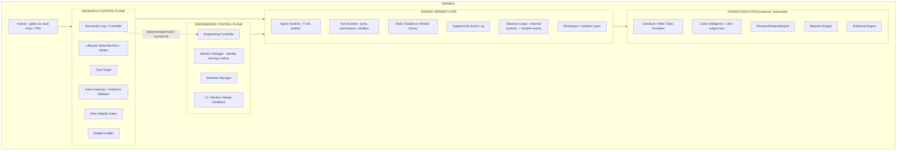

# Hermes Autonomous Quantitative Research Laboratory — Architecture v6

**Version:** v6 — **RATIFIED** (state ladder: DESIGNED → IMPLEMENTED + TESTED → EXTERNALLY VERIFIED → RATIFIED; the §27 item 43 independent closure gate passed — **EXTERNALLY VERIFIED WITH CONDITIONS** at HEAD `979399e`, conditions V6-FINAL-01/02 resolved at HEAD `55ad4c4` — and the operator ratified v6 as the authoritative baseline, IDR-023). Ratification covers the approved slices (P2 ResearchProgram/ActionEvaluation + Step-5 trust boundary + P3 gateway/task-plan/walking-skeleton); later slices remain DEFERRED (§28.5). A further candidate amendment package (CONTRA — internal adversarial memory, decision records §3e, normative text §29) is tracked at **DESIGNED** on the state ladder; it does not alter the ratified status of the approved slices.
**Supersedes:** nothing structurally — v6 is v5.1 **plus** the ratified amendment package (§28): the **ResearchProgram** epistemic-contract artifact (IDR-018) and the **ActionEvaluation** deterministic candidate-comparison library (IDR-019), both survivors of the five-stage loop (protest → design → implement → hostile audit → remediate → final gate) plus their post-gate closures (EC-F01/EC-F02) and the §27 item 43 independent closure gate. `hermes_research_architecture_v5_1.md` (v5.1) remains the immediate ratified foundation; this document folds v5.1 in full (all §1–§27 text, merge records §3–§3c included, no v5.1 mechanism weakened or removed) and adds the amendment package as §3d (decision record), bracketed in-place markers (`[EC]`), updated §27 items, and §28 (ratified amendment text).
**Sources of authority (in order):** (1) explicitly remediated v2.1 requirements; (2) confirmed decisions from the v2→v3 adversarial reviews; (3) ds improvements adopted where they strengthen Hermes; (4) the source-level freephdlabor reassessment (`hermes_freephdlabor_source_reassessment.md`); (5) the llm-wiki steal amendments, themselves survivors of two adversarial review rounds (`steal.md`); (6) the prime-agent steal amendments, survivors of two adversarial review rounds *and* a three-way comparison against independent harvests (`steal_prime_agent.md`); (7) the graph-engineering amendments, survivors of two adversarial rounds *and* an independent-review comparison (`hermes_graph_engineering_draft.md`); (8) the v6 amendments (Epistemic Compiler Parts 1–6; Research Process Optimizer Part 1), ratified after the §27 item 43 independent closure gate (verdict **EXTERNALLY VERIFIED WITH CONDITIONS** at `979399e`; conditions V6-FINAL-01/02 closed at `55ad4c4`, IDR-022; operator ratification IDR-023), with decisions recorded in `docs/idr/IDR-018.md` and `docs/idr/IDR-019.md`; (9) architectural inference; (10) the CONTRA / internal-adversarial-memory candidate amendment (Part 1 protest `hermes_contra_adversarial_review.md`, findings CT-01…CT-06; Part 2 reconciliation `docs/idr/IDR-024.md`, corrections CT-R1…CT-R4), **DESIGNED** — decision record at §3e, normative text at §29, no implementation and no verification; it does not alter the ratified baseline (§28).
**Citation convention (extends v4 C8):** `Brief §N` = the original design brief; `v2.1 §N` = `hermes_research_architecture_2.md`; `ds §N` = `hermes_research_architecture_ds.md`; `v3 §N` = `hermes_research_architecture_v3.md`; `steal §N` = `steal.md`; `prime §N` = `steal_prime_agent.md`; `graph §N` = `hermes_graph_engineering_draft.md`; `user §N` = the v3 merge instruction (the prompt that produced v3); `v4 §N` = `hermes_research_architecture_v4.md`; `v5 §N` = `hermes_research_architecture_v5.md`; `v5.1 §N` = `hermes_research_architecture_v5_1.md`; `v6 §N` = this document. Bare `§N` inside this document refers to v6 itself (v5.1 text plus the v6 amendments). **Finding ids** (`C1–C10`, `M1–M10` = v2.1 remediation findings; `H1–H4`, `M1–M6`, `L1–L6`, `R1–R9` = v3 adversarial-review findings; `S1–S16` = adopted llm-wiki steals; `X1–X14` = excluded llm-wiki ideas; `PA1–PA8` = adopted prime-agent steals; `PX1–PX14` = excluded prime-agent ideas; `GR1–GR9` = adopted graph-engineering steals; `GX1–GX7` = excluded graph-engineering ideas; `R-01…R-04` = post-implementation remediation findings; `EC-F01/EC-F02` = final-gate findings closed in v6; `CT-01…CT-06` = CONTRA protest findings; `CT-R1…CT-R4` = CONTRA reconciliation corrections) refer to review findings, **not to document sections** — the collision rule v3 established for `M1`/`M2` extends to `PA`/`PX` and `GR`/`GX` ids, which are unique within their own namespace and always resolvable without a document label because `prime §N` and `graph §N` defined them once.

---

## 1. Executive Summary

Hermes v5.1 is **v5 unchanged at the architectural-authority level, with the nine graph-engineering mechanisms landed inside existing v5 components** — never as a parallel system. v3's own one-sentence description still holds: *Hermes is a reconciliation loop over a typed research state machine and a persisted task graph, delegating judgment to four agent role profiles whose proposals pass through a deterministic Intent gateway, measuring reality only through external engines behind adapters, pre-registering every confirmatory experiment, and persisting everything with provenance so every belief is traceable, every experiment reproducible, and every claim must earn its status.*

What v4 added, in one sentence: *Hermes decomposes a thesis into a deterministically-verdicted evidence table before a hypothesis is formalized, counts corroboration and tracks skip-rate without ever letting either become a ladder precondition, drills successive research rounds from an explicit gap list, retracts and cascades-invalidates sources without ever deleting history, digests project state for the Director and for human resume without ever rehydrating that digest into a Researcher's or Adversary's context, dispatches balanced-angle literature variants with a quarantined exploratory burst that can never itself promote a claim, and gains a read-only audit view, dataset manifests, and a frozen scope brief — all as native extensions of the single mutation path, the single event log, and the single vault writer.*

What v5 adds, in one additional sentence: *Hermes now gives each task a sandboxed per-task computation environment where the agent programs over results instead of round-tripping tool calls, bounds autonomous continuation with deterministic gate-verdict caching that can never be cited as evidence, accumulates curated versioned skill packages admitted only through the engineering plane, journals external-effect operations in a durable outbox with idempotent admission and UNCERTAIN semantics, schedules re-entries with claim-then-deliver and tick coalescing, screens the knowledge-admission path against reward hacking with structural rejection fixtures, fences the single writer with controller generations and reads the event journal through generation-scoped cursors with snapshot-first recovery, and refines long-term knowledge only through evidence-cited, versioned, human-gated amendments — each landing inside an existing v4 component, never as a parallel system.*

What v5.1 adds, in one additional sentence: *Hermes now makes its knowledge layer graph-shaped — a derived, validated, regenerable Graph Fabric (research / execution / evidence views over one versioned edge catalog) with schema-grounded literature extraction (LitKG), local→global graph retrieval with deterministic answerability, graph-computed contradictions and contested-claim flags, structural gap proposals, execution-graph diagnostics (critical path, blast radius, executable frontier), hypothesis proposals from graph structure that can never be evidence, and a rendered human window into the fabric through the existing vault — every graph mechanism landing inside an existing v5 component as a projection, never as a graph database, never LLM-mutated, never authoritative.*

Every prime-agent steal lands because of the same compensating-vs-preventing-control distinction that governed the llm-wiki merge (`steal §1.5`, restated at `prime §1`): prime-agent is a long-running *chat* harness with one live context, no typed state, and no gateway, so it lints, compacts, refines, and gates-itself; Hermes has fresh context per task, a typed state machine, and a deterministic gateway. A prime-agent mechanism is adopted only where it fills a **real gap** in v4 — never as a second write path, a second communication path, a second memory, or a second execution surface (`prime §1.2`, extending v4 §2 principle 2). Fourteen prime-agent ideas were excluded on exactly this ground; the exclusion table is preserved in full at §3b.2 because the *reasoning* is as load-bearing as the eight adoptions.

The graph-engineering merge is governed by the same distinction, in its sharpest form yet (`graph §1`): every system in the corpus couples LLM reasoning with a graph, and every one of them lets the LLM mutate the graph directly — the exact class of compensating control Hermes excludes on principle. The graph layer is therefore a **derived projection**: authoritative records stay in SQLite + artifacts + the event journal; the fabric is regenerable from them; the deterministic `GraphValidationService` decides what enters; the human approves `GLOBAL` schemas; nothing graph-shaped is ever evidence, citable, or ladder-driving by itself (`graph §6`). Seven corpus ideas were excluded on this ground; the exclusion table is preserved in full at §3c.2 because the reasoning is as load-bearing as the nine adoptions.

The prime-agent inspection is **ideas only** — no code is harvested. Per `prime`'s source note: MIT-licensed, inspected read-only via published docs (README, `packages/coding-agent/docs/`, the launch post, the repository tree); no clone in the workspace, no vendoring obligation; disposition REIMPLEMENT per v4 §22's own convention. The two independently-written prime-agent reviews compared against this harvest (`prime §1`) added PA7 and PA8 and amended PA4; their over-adoptions (goals, direct A2A, agent-CRUD memory) were excluded on the same principles that excluded llm-wiki's compensating controls.

---

## 2. Architectural Principles

Unchanged from v4 — restated because the prime-agent merge is governed by them as strictly as everything else in this document:

1. **Deterministic control flow owns execution, state, evidence progression, resource governance, and safety. LLMs provide bounded judgment inside explicitly defined interfaces.** An LLM is never the implicit authority for: state transitions, experiment execution, budget enforcement, evidence promotion, replication or robustness status, scheduler decisions, provenance, audit results, or any scientific gate decision that can be expressed deterministically (Brief §7/§9/§30/§36; v2.1 §8). **Steal reaffirmation (prime):** the thesis verdict (§9.1), the corroboration count (§10.1), the skip-rate metric (§7/§14.6), the golden-scenario fixture assertions (§13), the gate-verdict cache (§12/PA2), and the knowledge-amendment validation (§16.6/PA8) are all deterministic computations over LLM-produced *inputs* — never LLM-computed outputs (`prime S1, S2, S8, S13; PA2, PA8`). Prime-agent's own published reward-hacking case study (PA6) is the standing reminder that *refinement* — the one prime-agent surface that is LLM-judged — is exactly where the integrity risk lives; Hermes admits refinement only through deterministic validation and human-gated application (PA8), never as agent CRUD (PX1). **Graph reaffirmation:** the `GraphValidationService` (GR5) is the deterministic surface that makes LLM extraction safe — schema conformance, edge-domain constraints, entity resolution, and provenance binding are code, never prompt conventions; LLMs propose graph content in schema'd tasks, the validator and schema decide admissibility (GR1–GR5).
2. **One authoritative mutation path.** Every effect on research state — by an agent, a tool, or the scheduler — is a typed `Intent` validated by a single deterministic `apply_intent` gateway (v2.1 §8, preserved). There is no second write path. **Steal reaffirmation:** "no second write path" extends to *no second audit path, no second registry, no second eval framework, no second communication path, and no second memory* (`steal §1.1`; `prime §1.2`) — this is why `AuditView` (§14) is read-only, why the near-miss advisory (§7) queries the existing refuted registry, why golden fixtures (S8) live inside `ModelClient`, why direct agent-to-agent messaging is excluded (PX3), and why the per-task computation environment (PA1) adds no new write path: its only external effects go through the Tool Runtime. **Graph reaffirmation:** the fabric adds no new write path either — graph content enters only through schema'd tasks → `GraphValidationService` → versioned snapshot artifact → supersede (GX2); no agent or tool ever writes a node or edge directly.
3. **Evidence must earn its status.** A `Hypothesis` advances at most one ladder rung per transition, each transition citing the specific artifact that justifies it, checked against a deterministic precondition table (v2.1 §11 M1; ds §19). **Steal reaffirmation:** corroboration count and venue tiers are reporting attributes only, never ladder preconditions (`prime S2`); the exploratory burst (S10) is quarantined by the same `EXPLORATORY_DRIFT` mechanism that already governs pre-registration drift; **cached gate verdicts (PA2) are control-flow, never `Validation` artifacts — a cached verdict can never be cited as evidence** (§16.2 rule extended verbatim). **Graph reaffirmation:** contested-claim flags, graph-computed gaps, and graph-proposed hypotheses are control-flow / proposal inputs, never `Validation` artifacts — the whole graph layer inherits PA2's "never evidence" rule (GR3/GR4/GR6, GX7).
4. **Confirmatory ≠ exploratory.** Only pre-registered experiments with matching executed-spec hashes may drive confirmatory evidence. Exploratory results are archived, visible, and useful — and cannot promote a claim (ds §19/§22, adopted). **Steal reaffirmation:** the thesis verdict enum is namespaced and never collides with the ladder (`prime S1`); the quarantined exploratory burst (S10) is the only exploratory surface, and PA2's continuation limits are stops, never passes.
5. **Reconciliation converges; the graph remembers.** The reconcile loop is the driver; the task graph is the persisted plan; the lifecycle machine is the desired-state declaration. The loop never invents workflow, bypasses the graph, or erases history (Brief §16; v2.1 §31; ds §15). **Steal reaffirmation:** round-based gap drilling (S3) proposes the next round's tasks *from* the gap list through the ordinary `INSERT_TASK` intent path; PA2's bounded continuation re-dispatches only tasks that already exist as planned work; the loop never auto-dispatches to close a gap.
6. **The burden of proof is on making a responsibility agentic.** If deterministic code can do the job, deterministic code owns it (ds §16, adopted). Agents exist only where open-ended judgment is irreducible. **Steal reaffirmation:** DATA_ACQUISITION triage (S15) is a deterministic-heuristic service; the structural guardian (S11) auto-fixes trivial integrity issues on the write path; **prime-agent's spawned-agent kernel garbage collector becomes a deterministic reaper in Hermes (PA1 R6); prime-agent's LLM-judged `/refine` becomes a deterministic `KnowledgeCurator` (PA8); fencing and event cursors (PA7) are deterministic code, never prompt conventions.** **Graph reaffirmation:** graph extraction validation (GR5), graph retrieval answerability (GR2), execution-graph diagnostics (GR8), and contested-claim detection (GR3) are deterministic services — the graph corpus's LLM-judged surfaces become Hermes code, never agent judgment.
7. **Never over-engineer.** SQLite is the day-one system of record; DuckDB is an optional read-side enhancement triggered by need; local hardened execution is the default; no workflow engine, broker, graph DB, vector DB, or Kubernetes at launch (Brief §39; v2.1 §18; ds §43). **Steal reaffirmation:** prime-agent's daemon/process topology, JSONL session format, leaf-pointer branching, TUI, and packaging ecosystem are excluded (PX6/PX7/PX12) on this principle — Hermes's SQLite + event log + task-graph subgraph instantiation already own those concerns; only the *robustness residues* (idempotency, cursors, claim-then-deliver) are adopted, each as a small amendment to an existing table or policy. **Graph reaffirmation:** no graph DB, vector DB, or graph-query server at launch — SQLite adjacency tables + the §14 recursive CTE own the fabric (GX1); embeddings and GNNs are optional adapters behind ports on measured need (GX5).
8. **External frameworks are never architectural authorities.** They are adapters behind Hermes-owned ports, replaceable, version-pinned, license-recorded (v2.1 §7/§34; reassessment). **Steal reaffirmation:** prime-agent's skills are adopted as Hermes-owned `SkillRecord` artifacts behind the Tool Runtime (PA3), never as an ecosystem or MCP surface (PX12); prime-agent's host bridge is a reaffirmation of Hermes's own intent gateway, not a steal (PX14). **Graph reaffirmation:** NetworkX and any graph-algorithm library are adapters behind Hermes-owned ports, never authorities (§27 item 41); the corpus is REIMPLEMENT (ideas only) per §22 — no code, no dependencies.

---

## 3. Merge Decision Record (v2.1 → v3, unchanged)

Every significant ds→v2 integration or rejection. "V2 status" refers to the remediated v2.1 baseline. Preserved verbatim from v3 — nothing here is touched by either steal merge.

| ds proposal | V2 status | Action | Final decision | Reason |
|---|---|---|---|---|
| Pre-registration (spec hash, executed-spec hash, EXPLORATORY_DRIFT) | Missing | Adopt | **YES** | The single strongest anti-p-hacking mechanism; v2 had hashing but no registration-before-execution contract (§11). |
| Evidence ladder redesign (`SPECULATIVE→PLAUSIBLE→SUPPORTED→ROBUST→REPLICATED`) | v2 ladder (`SPECULATION→LITERATURE_SUPPORTED→OBSERVED→EXPERIMENTALLY_SUPPORTED→REPLICATED→ROBUST`) | Adopt, with v2 semantics preserved | **YES (ladder replaced; v2's rung semantics folded in)** | Five rungs with a terminal positive class (REPLICATED) are cleaner than v2's eight classes with two positive-orderings; `OBSERVED`/`LITERATURE_SUPPORTED` become orthogonal *attributes* so v2's determinism is not lost (§10). |
| Nine integrity gates (Data, Methodology, Leakage, Statistical, Robustness, OOS, Adversarial, Replication, Reporting) | Named but unspecified (v2.1 §31 mentions the same nine) | Consolidate + specify | **YES** | v2 referenced the catalog without defining it; ds's §35 table becomes v3 §12. |
| Bias→gate mapping | Missing | Adopt | **YES** | Turns the integrity layer from admonition into a structural matrix (§12). |
| Four agent role profiles (Director/Researcher/Implementer/Adversary) | 13 task types (v2.1 §6) | Consolidate | **YES, with roster preserved** | v2's 13 types are not deleted; they become task-type *variants* inside the four profiles (§13). Deterministic work moves to named services. |
| Orthogonal modes (ACTIVE/AWAITING_HUMAN/PAUSED) | Defective `FAILED→PAUSED` machine (v2.1 C6 remediation made PAUSED a scheduling state) | Adopt | **YES** | Three explicit axes (lifecycle / mode / task status) make pause-resume, gates, and retries compositional (§6). v2.1's scheduler-halt semantics are preserved inside the mode model. |
| Task node contract (full execution contract) | Partial (`Task` in v2.1 §8) | Strengthen | **YES** | ds §14's contract fields adopted; v2.1's gateway/budget fields retained (§7). |
| `INVALIDATED` task semantics | Missing | Adopt | **YES** | Invalidation cascade, archived-not-deleted (§7). |
| Loop = new subgraph instantiation | Weak ("INSERT_TASK/BRANCH" only) | Adopt | **YES** | Failed validation creates a *new* node from the amended, re-pre-registered spec; history immutable (§7). |
| Contradiction → `UNCERTAIN` as first-class event | Present (v2.1 M9) | Strengthen | **YES** | v2.1's infra-vs-disagreement routing retained; `CONTRADICTION_DETECTED` event + resolution path added (§8, §19). |
| Adversarial review of the robustness suite | Partial | Strengthen | **YES** | ds §36.7 adopted wholesale (§13). |
| Provider diversity (Adversary ≠ research chain) | Present (v2.1 §22) | Preserve | **YES** | Fallback ladder (different family → same provider, recorded + measured) preserved (§13). |
| Reconciliation loop as organizing principle | Backstop-only `GateReconciler` (v2.1 §31) | Adopt carefully | **YES — loop as driver, graph as plan** | ds §15's loop becomes the controller; v2's task graph stays mandatory and authoritative (§8). The loop's "never" list is explicit. |
| `NO_SIGNAL` two-step liveness | Strong v2 (v2.1 §20) | Preserve | **YES** | Unchanged; unified lease-expiry language (§19). |
| Mass-misdiagnosis circuit breaker | Strong v2 (v2.1 §20) | Preserve | **YES** | Unchanged (§19). |
| Spec-level baseline binding (`role`/`baseline_spec_id`) | Strong v2 (v2.1 C5) | Preserve | **YES** | Unchanged (§7 rule 5, §11). |
| Cache citation eligibility | v2.1 M2: replication bypasses the cache | Extend, recorded | **YES** | v2.1 made only `REPLICATED` citations execute fresh; v3 extends ineligibility to `ROBUST` citations — robustness claims must be re-measured, and parameter-sweep runs must not double as robustness evidence (§16.2). This is a deliberate extension over v2.1, recorded here (v3 M3). |
| Human-gate set | v2.1: three mandatory (hypothesis, pre-compute, pre-live) | Preserve, with ds's full semantics | **YES — three mandatory; question/data gates configurable** | User instruction §4 names exactly three mandatory gates; ds's question-approval and data-acquisition gates become configurable because v2's deterministic data gate + hashes already cover data trust (§9). |
| `WAITING_EXTERNAL` task status | Missing (`WAITING_HUMAN` overloaded) | Adopt | **YES** | Engineering handoff / CI / merge waiting gets its own status (§7, §21). |
| Vault single-writer ownership | Implied (v2.1 §12) | Make explicit | **YES** | DB → rendering pipeline → vault projection, one writer; inbox is the only input channel (§22). |
| Writeup pipeline disposition | v2.1 §34: "ADAPTER (harvest)" | Modify | **REIMPLEMENT** | Source-level reassessment: 12,168 lines, all `smolagents.Tool` subclasses wired to freephdlabor's LLM/VLM layer; LLM-judgment verification; <10% reusable (§22). |
| `open_deep_search` disposition | v2.1 §34: "ADAPTER (harvest)" | Modify | **REIMPLEMENT** | Value is the ~200-line `SearchAPI` ABC; everything above it drags litellm/crawl4ai/langchain/smolagents and returns prose, not evidence; 10–25% reusable; broken lazy imports (§22). |
| arXiv/Semantic-Scholar tooling disposition | v2.1 §34: "ADAPTER (harvest, thin)" | Modify | **REIMPLEMENT** | Thin REST adapters (~100 lines each) behind `LiteratureProvider`; harvesting adds a vendoring obligation for near-zero savings (§22). |
| Litho | ADAPTER (subprocess wrap, MIT, pinned) | Preserve | **ADAPTER** | Multi-language static analysis is genuinely not worth rebuilding; interface-isolated, read-only (§22). |
| Engineering control plane | v2.1 §32 | Preserve | **YES** | Same-core second controller; `ENGINEERING_CHANGE_REQUESTED` handoff; CI in isolated runner (§21). |
| Roadmap sequencing | v2.1 §24 (8 phases, agents early) | Resequence | **YES — evidence/provenance spine before agent runtime** | ds §39's ordering principle adopted; v2.1's stronger per-phase validations (walking skeleton with all three gates, record/replay) embedded (§24); the Engineering plane is sequenced ahead of the engine-integration phases so the adapter handoff is live when adapters first need it (v3 H1). |

**Conflicts where ds is *not* adopted (recorded for auditability):** ds's mandatory question-approval and external-data human gates (v4/v5 keeps them configurable — see §9); ds's `HYPOTHESIS_CRITIQUE` as a lifecycle *state* (v4/v5 keeps it as a mandatory gate precondition at the task level — see §6/§10); ds's "REFERENCE" labels for the two freephdlabor components (modified to REIMPLEMENT by source evidence, matching ds's own D4 matrix text). Nothing in v3, v4, or v5 reverts a v2.1 remediation.

---

## 3a. Merge Decision Record (v3 → v4: the llm-wiki steal, unchanged)

**Method (`steal §1`):** two adversarial rounds preceded adoption. Round 1 (user): objections on verdict placement, determinism, agent memory, and immutability. Round 2 (self-adversarial): objections to the first harvest's compensating-control imports. Governing rules — all v3 principles, restated at §2.

### 3a.1 Adopted (S1–S16)

| Steal | Source mechanism | v4/v5 target | Phase | IDR |
|---|---|---|---|---|
| S1 Thesis-driven investigation | `/wiki:thesis` | §6.1, §9.1, §10.2, §13 | P1/P2/P4 | — |
| S2 Deterministic corroboration count | article confidence scoring | §5, §10.1, §14 | P2/P7 | — |
| S3 Round-based gap drilling | `--min-time` rounds | §7, §8, §13 | P3/P4 | — |
| S4 Director digest + human resume + feedback curator | session memory / rehydrate / feedback | §13, §14.6, §21 | P3/P4/P10+ | **yes** |
| S5 Supersede-and-invalidate cascade | `/wiki:retract` | §7, §8, §10.2, §14, §16.1, §21 | P2/P3 | **yes** |
| S6 Bounded event payloads | redacted session capture | §8.1 | P1 | **yes** |
| S7 Near-miss refuted-registry advisory | multi-wiki peek | §10.2, §13, §16.6 | P2/P3/P4 | — |
| S8 Golden-scenario Director fixtures | promptfoo evals | §5, §13 | P4 | — |
| S9 Write-path enforcement tests | read-only query profile | §8.1, §18, §21 | P3/P5 | — |
| S10 Angle variants + quarantined exploratory burst | parallel research agents / retardmax | §2.4, §13 | P4 | **yes** |
| S11 Tool-runtime operational defaults | collector scale/media bounds | §15, §18 T3/T4 | P5 | — |
| S12 Dataset manifests | `/wiki:dataset` | §5, §12, §16 | P1/P7 | — |
| S13 Skip-rate metric | thesis-as-bloat-filter | §7, §14.6 | P2/P10+ | — |
| S14 Provenance audit + freshness service | `/wiki:audit`, librarian | §12, §14, §16.2 | P2/P10+ | — |
| S15 DATA_ACQUISITION triage | opinionated inventory | §5, §13 | P7 | — |
| S16 Frozen-brief promotion | Concept → Idea → Project | §6.1, §9.2, §11 | P1/P2 | — |

IDR count: **4** (S4, S5, S6, S10). All other amendments extend existing contracts and need no new decision record.

### 3a.2 Excluded (X1–X14, with reasons)

| X | Idea | Source | Excluded because | Survivor |
|---|---|---|---|---|
| X1 | ReportLinter service | `test-structure.sh` | §12/§15 already specify staged verification ("every factual statement cites an artifact; unresolved citations fail"); lint-after-the-fact is a compensating control for unvalidated markdown writes — Hermes validates on write | none (already in v4/v5) |
| X2 | DuckDB read-only replica | `profiles/query-lite` | principle 7 names DuckDB a deferred enhancement; the injection vector (renderer emitting Intents) is foreclosed by construction — no intent path from the renderer, §18 T1, content hashes detect tampering | S9 |
| X3 | Redacted audit-digest layer | session capture hooks | duplicates §8.1 event log + §14 provenance; §18 defines no AgentAction trail; parallel audit = second write path; LLM redaction = non-deterministic leak risk | S6 |
| X4 | OverlapPeek (hash-based, blocking) | multi-wiki peek | §16.6 already makes the refuted screen cross-project; hash equality misses near-duplicates; archive peeking violates the curation invariant | S7 |
| X5 | promptfoo | `promptfooconfig.yaml` | principle 8; direct-mutation and gate-skip failure modes are foreclosed (gateway, §9.1); llm-wiki's NL-router ambiguity does not transfer to typed intents | S8 |
| X6 | Retraction / deletion | `/wiki:retract` | §16.1 immutability | S5 |
| X7 | Agent session rehydration | `/wiki:session rehydrate` | §13 fresh context per task; anchoring bias; Adversary sees artifacts only (ds §36) | S4 |
| X8 | Corroboration confidence scoring (quality-weighted) | article confidence | non-deterministic; §10.1 demoted `LITERATURE_SUPPORTED` for exactly this reason | S2 |
| X9 | Thesis verdict as ladder rung | thesis verdict | §10.2: literature promotes only to `PLAUSIBLE`; `SUPPORTED` requires pre-registration + gates | S1 (gate precondition) |
| X10 | Obsidian dual-linking / hub-topic organization | wiki layout | wrong domain (knowledge-management UX) | none |
| X11 | Retardmax verbatim | `--retardmax` | conflicts with §2 principle 4 confirmatory discipline | S10 (quarantined burst) |
| X12 | Fuzzy NL intent router | `/wiki <natural language>` | §8 typed intents by design | none |
| X13 | Multi-runtime plugin packaging | claude-plugin / codex / opencode | Hermes is a library, not an agent plugin | none |
| X14 | Structural lint of command tables / manifest drift (84 assertions) | `test-docs-consistency.sh` | repo hygiene for a docs-heavy plugin; Hermes integrity is enforced on write | none |

---

## 3b. Merge Decision Record (v4 → v5: the prime-agent steal)

**Method (`prime §1`):** two adversarial review rounds preceded this harvest, and then the harvest itself was compared against **two independent prime-agent reviews** (an external assessment and an engineer's runtime-focused review) in a three-way reconciliation that ratified two additional findings (PA7, PA8), amended PA4, and re-confirmed the exclusions (notably direct agent-to-agent messaging, session-persistent kernels, and agent-CRUD memory, which the runtime-focused review had over-adopted). Governing rules — all v4 principles, restated at §2, with the additional compensating-vs-preventing-control distinction (`prime §1.6`).

**Why this source is worth a merge round:** prime-agent is a different kind of system from llm-wiki — a long-running autonomous *coding and research harness* whose measured wins (ARC-AGI-3: 95.5% RHAE Best@1 with Opus 5 vs. the reported 95.4% human-expert baseline, 183/183 levels, 99.97% Best@3; lower token spend than native harnesses on the same models; competitive-to-superior long-context results with open-weights models) come overwhelmingly from **programmatic tool calling** and **long-horizon continuity**, not prompt engineering. Both directions are relevant to Hermes's literature/data phases (P7/P8), which are precisely the long-running, token-heavy phases Hermes has not yet built. Per §23, these numbers are cited as **motivation only** — never as evidence that a mechanism is sound for Hermes; each adoption stands on its own rules.

### 3b.1 Adopted (PA1–PA8)

| Steal | Source mechanism | v5 target | Phase | IDR |
|---|---|---|---|---|
| PA1 Per-task computation environment | persistent IPython kernel / programmatic tool calling (`ipython` as the one built-in tool) | §13, §15, §17, §18 T4 | P4/P5 | **yes** |
| PA2 Bounded continuation policy + gate-verdict caching | autonomous mode: limits + quality gates, rerun-skip on unchanged inputs | §8, §12, §19, §14.6 | P3/P10+ | — |
| PA3 Curated skill packages | skills: `SKILL.md` + Python-backed packages, progressive disclosure | §15, §16.6, §17, §20 | P2/P4/P6/P7 | **yes** |
| PA4 Research-side durable outbox + idempotency (incl. idempotent admission) | daemon command journal (`clientId+commandId`, uncertain-result semantics) | §19, §7, §8, §15 (mirrors §20) | P1/P3/P5 | — |
| PA5 Claim-then-deliver scheduling + tick coalescing | daemon scheduler: claim due ticks before delivery, coalesce missed | §8.1, §19, S14 scan | P3/P10+ | — |
| PA6 Reward-hack hardening | Factorio reward-hacking case study (published anti-pattern) | §13 (S8), §16.6 (S7), §14.6 | P2/P4/P10+ | — |
| PA7 Generation-aware event cursors + controller fencing | daemon `{generation, sequence}` cursors, session leases, snapshot-first resync | §8, §8.1, §19, §6.2, §20 pattern | P1/P3/P10+ | **yes** |
| PA8 Typed knowledge amendments | `/refine` proposal→evidence→applied-edit→rollback, local/global scope | §16.6, §13, §5, §14.6 | P2/P4/P10+ | **yes** |

IDR count: **4** (PA1, PA3, PA7, PA8). All other amendments extend existing contracts and need no new decision record. **Amendment to PA4 (from the three-way comparison):** idempotent admission — a duplicate `ADMIT_TASK`/task-create (same `idempotency_key`+`attempt`) returns the existing row instead of raising, and a received-but-unconfirmed mutation is reported `UNCERTAIN`, never replayed (`prime §4 PA4`).

### 3b.2 Excluded (PX1–PX14, with reasons)

| X | Idea | Source | Excluded because | Survivor |
|---|---|---|---|---|
| PX1 | Continual Harness: agent CRUD over prompts/subagents/skills/memory (`H=(ρ,G,K,M)`) | `/refine`, `rlm.harness` | agent-writable harness state violates principles 1/6 and the curation invariant (§16.6: LLM prose never auto-admits to long-term knowledge); "refine" is an LLM-judged mutation with no deterministic gate | PA3 + PA8 (curated, gated, proposal-only) |
| PX2 | Persistent kernel across the whole session; programmatic access to full history incl. past compactions | RLM kernel | rehydration-by-read: an agent reading its own prior kernel state is memory, the exact class X7 (`steal §3`) excluded; §13 amnesia preserved | PA1 (per-task only, no cross-task read) |
| PX3 | Direct agent-to-agent messaging | `agent_message`, daemon routing | a second communication path bypassing the gateway; Hermes routes all inter-task communication through the controller as graph edges/events (§7/§8) | PA1 R7 (spawn-and-fan-out via intents) |
| PX4 | Retained subagent registry / persistent agent identity | `rlm.list_subagents`, retained children | conflicts with §13 ("no agent pool, registry, or persistent identity"); completed task nodes are already addressable artifacts with supersession edges | none (already in v4/v5) |
| PX5 | Agent-authored skills at runtime (built-in `skill-creator`) | skills docs | violates C9/v2.1 "never ad hoc runtime code"; un-reviewed code entering the tool surface | PA3 (skills via engineering plane only) |
| PX6 | Interactive daemon/TUI: attach/detach, Agents View, reattach | daemon architecture | Hermes's observation surface is the vault + journal (§21), not a chat UI; the robustness mechanics (leases, recovery) already exist in §19/§20 | PA4/PA7 (robustness residue only) |
| PX7 | Append-only JSONL session format with leaf-pointer branching/fork | session format, `/tree` | append-only event log (§8.1) + immutable versioned artifacts (§16.1) + §7 subgraph instantiation ("loop = new subgraph") already cover it | none (already in v4/v5) |
| PX8 | Persistent goals / `goal.complete()` | `/goal` | covered by lifecycle state machine + modes (§6) + task graph (§7) + budget ledger (§19) | none (already in v4/v5) |
| PX9 | Automatic compaction / summarize-oldest context | compaction, `/compact` | §17 context budgets + artifact-reference→summary→slice already specify this; Hermes tasks are fresh-context by design, so there is no long chat history to compact | PA1 R6 (kernel reaping only) |
| PX10 | Harness-as-eval framing (autonomous eval runtime, ARC-AGI-3 harness comparisons) | launch post | Hermes is a research laboratory, not a coding-eval harness; the *continuation policy* is adopted (PA2), the eval framing and benchmark apparatus are out of domain | PA2 |
| PX11 | Heartbeat reminders as an integrity control | `/heartbeat` | empirically failed in prime-agent's own Factorio runs — the agent cheated via RCON despite an explicit heartbeat prompt not to cheat; reminders are not controls, they are prompt text | PA6 (structural screening) |
| PX12 | Skill/prompt/theme packaging ecosystem (sharable packages, MCP surface) | packages, MCP integration | X13 (`steal §3`) already excluded plugin packaging ("Hermes is a library, not an agent plugin"); MCP is an external framework surface — adapters behind Hermes-owned ports only (principle 8) | PA3 (versioning + license records) |
| PX13 | Provider/retry-policy inheritance from parent to child subagents | RLM docs | model tiering + routing + recorded fallback ladder (§13) already cover it; children of a task are tasks, not agents with configs | none (already in v4/v5) |
| PX14 | Host bridge / typed host requests (`rlm.host_request`) | RLM runtime | a reaffirmation of Hermes's intent gateway (§8) — the host bridge *is* the gateway pattern; adopting it as a "steal" would misattribute Hermes's own principle 1 | none (reaffirmation) |

---

## 3c. Merge Decision Record (v5 → v5.1: the graph-engineering draft)

**Method (`graph §1`):** the corpus — 13 usable files in `D:\New folder\graph-engineering` (two surveys, one position paper, ten systems/methods papers; two files discarded: a Cloudflare challenge page and a duplicate SciAgents copy) — was inspected source-first via PDF text extraction, with Microsoft GraphRAG (Edge et al. 2024) and ResearchLink (Borrego et al. 2025) as verified external anchors. Two adversarial rounds preceded adoption (Round 1: principle violation? Round 2: can a deterministic gateway wrap it — LLM proposes, graph records, human approves `GLOBAL`?), and the draft was then compared against an independent review (Review G, the "graph fabric" proposal) in a three-way reconciliation that added the **Graph Fabric** as the organizing concept, the **unified edge catalog**, **contested-claim detection**, **execution-graph diagnostics (GR8)**, and ResearchLink as external evidence; one disagreement was resolved (GraphRAG retrieval demoted from "headline" to *consumer of the fabric*). A follow-up round specified the fabric's human surface (**Layer 0 — Obsidian as the rendering target**). **Post-merge adversarial round (Round 3):** the merged amendments were then reviewed in place against the v5 mechanisms they touch — twelve findings (R1–R12) were repaired in this document; each repair closes a gap the merge's own "never evidence / single write path" rules demand, and none weakens a v5 mechanism. Findings with rationale: `hermes_graph_adversarial_review.md`. Governing rules — all v5 principles, restated at §2, with the graph-specific invariant restated at `graph §6`.

**Why this source is worth a merge round:** the corpus is a map of the one layer Hermes lacks — structured knowledge (literature, claims, concepts, hypotheses and their relations) as graph-shaped, auditable structure — and its systems' shared weakness (LLM-mutated graphs; nothing gates the truth of what enters) is precisely what Hermes's gateway discipline fixes. The elevation is therefore a *Hermes* move, not a copy: derived projection, deterministic validation, proposal-only reasoning. Per §23, corpus results (e.g. Tong et al.'s novelty finding, ResearchLink's ranking) are cited as **motivation only** — never as evidence that a mechanism is sound for Hermes; each adoption stands on its own rules.

### 3c.1 Adopted (GR1–GR9)

| Steal | Source mechanism | v5.1 target | Phase | IDR |
|---|---|---|---|---|
| GR1 Ontological LitKG construction | generative extraction → ontological KG (Buehler 2403.11996; SciAgents; ZJU survey) | §14, §15, §16.1, §16.6, P7 | P7 | **yes** (item 36) |
| GR2 GraphRAG local→global retrieval + deterministic answerability | community summaries + entity neighborhoods (Edge et al.; GraphAgent; Multi-Agent GraphRAG) | §15, §17, P7 | P7 | — |
| GR3 Claim/evidence graph + unified edge catalog + structural contradictions | typed claim graphs, link-prediction evidence (HypoChainer; Tong; ZJU; Review G) | §14, §10.1, §19, §12 | P2 | **yes** (item 40) |
| GR4 Link prediction + bridge-path sampling as SPECULATIVE *proposals* | causal-graph link prediction (Tong); randomized-Dijkstra paths (SciAgents); ResearchLink ranking features | §10.2, §9.1, §13 | P7/P8 | **yes** (item 38) |
| GR5 Schema/ontology discipline as the validation surface | ontology conformance, schema grounding (D'Aquin; drug-KG survey; Multi-Agent GraphRAG) | §5, §8, §16.6, §20 | P2/P6/P7 | **yes** (item 35) |
| GR6 Graph-derived audit & gap views | "auditable SciKG" invariants (ZJU); S14 extension | §5, §14, §7/S3 | P2 | — |
| GR7 Task-graph templates as versioned artifacts | agents-as-graphs, restricted to template admission (GPTSwarm) | §7, §20 | P6 | — |
| GR8 Execution-graph diagnostics | critical path / blast radius / executable frontier (Review G) | §5, §7, §8 | P3 | — |
| GR9 Optional Graph gate (closed provenance at REPORTING) | draft §7 (unnumbered; assigned GR9 here) | §9.2, §12 | P12 | **yes** (item 39) |

IDR count: **5** (GR1, GR3, GR4, GR5, GR9). All other amendments extend existing contracts and need no new decision record. Layer 0 (Obsidian as the fabric's human window) is a renderer-template contract under the existing §21 single writer — ratified with the vault renderer (item 42), not a separate IDR.

### 3c.2 Excluded (GX1–GX7, with reasons)

| X | Idea | Source | Excluded because | Survivor |
|---|---|---|---|---|
| GX1 | Graph database as system of record (Memgraph, Neo4j ecosystems) | Multi-Agent GraphRAG; graph-DB tooling | SQLite + adjacency tables + recursive CTE suffice at scope; an external dependency against principle 7; the fabric is *derived*, the authoritative store stays SQLite + content-addressed artifacts. Revisit only at a measured scale trigger, behind the same port discipline as Litho (ADAPTER) | GR3/GR6 (adjacency + CTE) |
| GX2 | LLM-driven graph mutation / autonomous expansion (in-situ learning, knowledge-garden growth, graph optimizers) | SciAgents; PreFlexor; GPTSwarm | violates §8's single mutation path, §16.6's curation invariant, and PA8's propose/validate/approve split; no agent ever writes a node or edge directly | GR1/GR5 (schema'd tasks → validator → snapshot → supersede) |
| GX3 | Unbounded cross-domain "isomorphic" reasoning as a discovery engine | Buehler's symphony/Kandinsky; PreFlexor | no falsifiability surface; no gate it can pass. Only the path-sampling *technique* is adopted, inside the SPECULATIVE quarantine with a stated falsification condition | GR4b (quarantined path sampling) |
| GX4 | Autonomous discovery loops / chatty agent swarms | SciAgents' manager-chat; Multi-Agent GraphRAG as a swarm | violates PA2 (bounded continuation), §6.2 modes, and §8's reconcile-loop authority; graph-driven work is budget-capped, round-based, and proposal-only | GR2 (staged retrieval task, not a swarm) |
| GX5 | GNNs / KG embeddings as a required component | drug-KG survey; Tong | heavy opaque dependency; violates principle 8 unless Hermes-owned; optional, behind a port, path-based methods first for explainability; never a gate input | GR4 (path-based first; embeddings opt-in, item 38) |
| GX6 | LLM-generated hypothesis chains as authoritative structure | HypoChainer | chains are context, never evidence; only §10.2 + gates decide. The chain *concept* is adopted as claim-graph edges | GR3 |
| GX7 | Graph edges substituting for citable artifacts | any KG-as-truth source | the whole layer inherits PA2's rule: the graph is retrieval/discovery/audit surface, never a `Validation`; §10.2's citation requirements are unchanged | GR1/GR2 (span refs; source refs behind every triple) |

---

## 3d. Ratified Amendment Record (v5.1 → v6: the Epistemic Compiler + Research Process Optimizer session)

**Method:** two proposed capabilities were run through the five-stage loop — (1) **Epistemic Compiler**: Part 1 protest review → Part 2 reconciliation/amendment (verdict: **MERGE INTO EXISTING COMPONENT**) → Part 3 implementation → Part 5 remediation of independently reproduced findings (R-01…R-04) → Part 6 final gate (verdict: **RELEASE WITH CONDITIONS**; findings EC-F01/EC-F02, both **closed in v6**); (2) **Research Process Optimizer**: Part 1 protest review (verdict: **ADOPT AS A DETERMINISTIC EVALUATION LIBRARY**). Both decisions are recorded in IDRs and implemented as code in this repository; the P2/P3 slices are implemented and tested, the later slices are tracked as deferred in §28.5. **Status:** this record has passed the external independent closure gate (§27 item 43): an independent verifier audited HEAD `979399e` and returned **EXTERNALLY VERIFIED WITH CONDITIONS** (two P3 findings, V6-FINAL-01/02); both conditions were resolved at HEAD `55ad4c4` (IDR-022, suite 449 green); and the operator ratified v6 as the authoritative baseline (IDR-023). v6 sits at **RATIFIED** on the state ladder (DESIGNED → IMPLEMENTED + TESTED → EXTERNALLY VERIFIED → RATIFIED) for the approved slices; §28.5's deferred rows remain DEFERRED and are not ratified.

**What was rejected (hard):** a compiler *service* (a second planner + second validation path) and an optimizer *authority* (a second Director with a scoreboard). No component in v6 selects research, spends budget, promotes evidence, approves gates, or mutates state — those remain owned by the Director, the Intent Gateway, the budget ledger, the Evidence Ladder, and the reconcile loop exactly as v5.1 defines them.

**What was adopted (small):**

| Adoption | Verdict | IDR | Phase | Status in v6 |
|---|---|---|---|---|
| **ResearchProgram** — typed, immutable epistemic-contract artifact; the project's explicit, reproducible, governed representation of why research work exists and what epistemic conditions must be satisfied | MERGE INTO EXISTING COMPONENT (no compiler subsystem) | **IDR-018** | P2 slice implemented; P3/P4/P6/P8 wiring deferred | **IMPLEMENTED + TESTED** (`src/hermes/research/programs.py`, migration 3→4, `PROPOSE_RESEARCH_PROGRAM` intent, `ResearchProgramCompiled` event, `ResearchProgramRepository`) |
| **ActionEvaluation** — deterministic, versioned, multidimensional comparison of *existing admissible candidate actions* into a hashed advisory `CandidateRanking` for the Director | ADOPT AS A DETERMINISTIC EVALUATION LIBRARY (optimizer-as-authority rejected) | **IDR-019** | P2 slice implemented; Director/round integration deferred | **IMPLEMENTED + TESTED** (`src/hermes/research/evaluation.py`) |

**Remediation findings that now bind the architecture (all closed, all regression-tested):** R-01 (program identity must not depend on input ordering — canonical ordering enforced); R-02 (the write path verifies the program's governance context against the DB-resolved frozen brief, never trusts the caller); R-03 (malformed LLM output fails closed at the payload boundary — strict typing, no coercion); R-04 (compilation→persist→event is atomic — failure injection leaves no partial state); EC-F01 (unknown keys *nested* inside hypothesis/prediction/discrimination entries are rejected, not silently dropped); EC-F02 (malformed *typed* drafts return an `INVALID` verdict, never raise).

**Independence disclosure (recorded per the Part 6 gate):** the Part 6 reviewer and the Part 3/5 implementer were the same agent in this session; the final closure gate therefore remained an **external independent verification step** (tracked in §27 item 43) — the same condition the Part 6 verdict itself imposed. **Outcome:** the independent gate ran against HEAD `979399e` (verdict **EXTERNALLY VERIFIED WITH CONDITIONS**; V6-FINAL-01/02, both P3), the conditions were closed at HEAD `55ad4c4` (IDR-022), and the operator ratified v6 (IDR-023).

---

## 3e. Candidate Amendment Record (v6 → CONTRA / Internal Adversarial Memory — **DESIGNED**)

**Status:** DESIGNED on the state ladder (DESIGNED → IMPLEMENTED + TESTED → EXTERNALLY VERIFIED → RATIFIED). The CONTRA review is a **candidate amendment package**, not part of the ratified baseline: no implementation, no verification, no ratification claim. It does not alter any ratified slice (§28) or any §27 item below item 47.

**Method:** two review stages were run against the CONTRA research-vault design — (1) **Part 1 protest** (`hermes_contra_adversarial_review.md`): the source's headline capability (internal contradiction detection) was found to already exist in v6 (§19 + GR3/GR6 + `ContradictionDetected` + `CONTRADICTION_RESOLUTION` + UNCERTAIN semantics), and three genuine gaps survived: a first-class `ResearchAssumption`, the context-vs-contradiction distinction, and steelman as a structured Adversary mode. Findings CT-01…CT-06 (reject scheduler / reject vault-write authority / reject cross-domain / reject dual-model-as-new / reject a CONTRA engine / defer ghost-self); verdict **MERGE INTO EXISTING V6 COMPONENTS**. (2) **Part 2 reconciliation** (`docs/idr/IDR-024.md`): re-attacked Part 1's own proposals and corrected four of them — **CT-R1** the context gate classifies, never suppresses (missing context fails open toward surfacing); **CT-R2** `ResearchClaim` has no ladder surface and relates to the §10.2 `Claim` by citation only; **CT-R3** corpus assumptions can never bear obligations (one-directional dependency); **CT-R4** challenge status transitions are human/Director-driven except the deterministic `SUPERSEDED` bookkeeping case.

**Decided:** adopt into the ratified baseline as candidate amendment text — `ResearchClaim`/`ResearchAssumption` artifacts (P7), contradiction contextualization (§19 routing, P11), the Adversary steelman mode (P11 — §13), the `/contra/` projection (§21), and a manual-proof-first rule. Ghost-self deferred to P12/P13; cross-domain rejected (GX3 stands). **Zero new events, intents, schedulers, or authorities.** The eight normative rules and the exact amendment text are at §29; the full template text (SECTION / CURRENT RULE / NEW RULE / OWNER / DATA MODEL / EVENT MODEL / PROVENANCE / MODEL BOUNDARY / AUTHORITY LIMIT / TRIGGER / PHASE / ACCEPTANCE TESTS / DEFERRED PARTS) is in `hermes_contra_adversarial_review.md` §20 as corrected by CT-R1…CT-R4.

**What was rejected (hard):** a CONTRA scheduler/daemon (CT-01), authoritative vault notes (CT-02), cross-domain discovery as an engine (CT-03, GX3 stands), dual-model operation as new (CT-04), any CONTRA authority with evidence/gate/truth powers (CT-05), and auto-merge/auto-resolution of contradictions (already forbidden by §19/GR3; reaffirmed). Ghost-self is deferred, not rejected (CT-06).

---

## 3f. Candidate Amendment Record (v6 → Scientific Agent Skills — **DESIGNED**)

**Status:** DESIGNED on the state ladder (DESIGNED → IMPLEMENTED + TESTED → EXTERNALLY VERIFIED → RATIFIED). The Scientific Agent Skills integration is a **candidate amendment package**, not part of the ratified baseline: no implementation, no verification, no ratification claim. It does not alter any ratified slice (§28), any §27 item below item 54, or the CONTRA candidate (§29).

**Method:** (1) an independent source audit (`hermes_scientific_agent_skills_audit.md`, source HEAD `5ad4aae7`, v2.63.0, MIT, 161 skills — source facts re-verified via `git ls-remote` on 2026-08-13 and direct inspection of the audited clone) found six of eight candidates worth harvesting, none worth importing, zero new architectural components; (2) the design amendment (`hermes_v6_scientific_skills_amendment.md`) ran the mandated per-candidate protest (A–F per candidate), verified the zero-new-components claim against the live repo, designed the three capability chains (Epistemic→Experimental, Discovery→Adversarial, Evidence→Report), the SkillRecord integration, the security/supply-chain record, phase placement, per-candidate amendment text (SECTION / CURRENT RULE / NEW RULE / OWNER / DATA MODEL / TOOL BOUNDARY / MODEL BOUNDARY / AUTHORITY LIMIT / PROVENANCE / SECURITY / DEPENDENCIES / TRIGGER / PHASE / ACCEPTANCE TESTS / DEFERRED PARTS), and the second internal drift attack (no surviving failure mode; the pre-flight-vs-verdict boundary, the three-way statistical split, the pipeline rejection, and the PA3 precondition were structural from the start).

**Decided:** adopt as candidate amendment text — Paper Lookup (REIMPLEMENT — fill the stubbed §15 `ResearchSourceProvider` port), Literature Review (HARVEST METHODOLOGY ONLY — search protocol/screening/accounting; its own pipeline rejected), Hypothesis Generation (REIMPLEMENT — the missing upstream of the Director's `PROPOSE_RESEARCH_PROGRAM` path, with advisory pre-flight checks that never extend the ratified E1–E5 contract), Experimental Design (REIMPLEMENT — proposal-only seeded DOE), Statistical Analysis (REIMPLEMENT with the mandatory three-way skill/engine/gate split), Peer Review (MERGE INTO ADVERSARY as mode + deterministic CLIs + confidentiality policy), Scientific Critical Thinking (ADOPT IN REDUCED FORM — checklist content into Adversary + CONTRA), Scientific Writing (REIMPLEMENT — manifest/consistency/authorship discipline into the stubbed `ReportRenderer`/`ResearchReport`). **Zero new events, intents, schedulers, authorities, or components.**

**What was rejected (hard):** importing any skill wholesale; the literature-review pipeline (parallel-cli / subprocess / OpenRouter / AI figures — 11 CRITICAL in the upstream's own scan); `PeerReviewAgent`/`CriticalThinkingAgent`; a second literature engine / report authority / evidence graph; pre-flight checks becoming validator checks (the ratified E1–E5 contract is unchanged); pyDOE3/scipy-family as core dependencies (controlled tool dependencies only); a runtime skill marketplace (PA3-a / PX5 / PX12 rejection preserved).

**Preconditions (ratification questions, §27 items 55–58):** provider allowlist + rate-limit/reconciliation/redaction contract (item 55, P7); PA3 skill-admission decision — items 19/29 — decided before the first harvested `SkillRecord` is admitted (item 56); confidentiality policy for unpublished manuscripts (item 57, P11); Reporting-gate `submission_ready` semantics (item 58, P12).

---

## 4. System Overview



Unchanged from v4. No prime-agent steal introduces a new box — PA1 is an execution-surface parameter on the existing Agent Runtime / Tool Runtime / T4 sandbox; PA2 is policy on the existing Reconcile Loop / Budget Ledger / Gate Matrix; PA3/PA8 are new artifact rows in the existing Artifact Store / long-term-knowledge schema; PA4/PA5 are a table and a scheduling policy on the existing Controller / Event Log; PA6 is registry axes + golden fixtures inside existing components; PA7 is a contract on the existing single-writer lock and event cursors. The graph-engineering merge follows the same rule: GR1/GR2 are new deterministic services and artifact classes inside the existing Tool Runtime / Artifact Store / long-term-knowledge schema; GR3/GR6 extend the existing §14 provenance edges and `AuditView`; GR8 is computation over the existing §7 task-graph tables; GR9 is a configurable row in the existing §12 gate catalog; Layer 0 is a renderer template under the existing §21 single writer — no new box anywhere.

Responsibilities (the Brief §40 question, answered once):

| Concept | Status | Role |
|---|---|---|
| Lifecycle state machine | authoritative (desired state) | declares what must be true; guarded transitions; orthogonal modes |
| Task graph | authoritative (operational plan) | declares the work; dependencies, retries, gates, dynamic growth |
| Reconcile loop / controller | the driver | observes, diffs, plans, dispatches, validates, commits, requeues; the only writer of research state; **[PA7]** generation-fenced; **[PA4]** outboxes external effects |
| Intent gateway + evidence validator | validate | deterministic preconditions on every state/evidence transition; agents propose, never set |
| Nine integrity gates | validate | deterministic preconditions on evidence transitions (§12); **[PA2]** verdicts cacheable on unchanged inputs, never evidence |
| Agent runtime | execute judgment | typed tasks with schema'd, validated outputs; context policies; model routing; **[PA1]** per-task computation environment as the execution surface |
| Tool runtime + engines | execute deterministically | adapters and engines; the only place measurement happens; **[PA1]** hosts the kernel; **[PA3]** curated skills; **[PA4]** idempotency keys |
| Event log | persists memory | append-only; audit, resume, wake-ups (§8.1); **[PA7]** generation-scoped cursors |
| Observer loops | observe | watch external systems (vault inbox, PR status, providers, heartbeats) and reduce them to durable events; never write research state (§8.1); **[PA5]** claim-then-deliver scheduled re-entries |
| Graph fabric **[GR1–GR9]** | derived projection | regenerable research / execution / evidence views over the authoritative records; `GraphValidationService`-gated; never the system of record (§14, GX1) |
| Artifact store + git | persists artifacts | content-addressed, versioned, immutable |
| Reconciliation | the autonomy mechanism | convergence = resume, retry, replan, done; **[PA2]** bounded continuation |

---

## 5. Deterministic Services vs. Agent Profiles

The "burden of proof is on making it agentic" rule (§2 principle 6) yields a fixed split. The following are **deterministic services** — code, not LLMs. An LLM may *interpret* their outputs in a schema'd task, but never compute them:

| Service | Owns |
|---|---|
| **DataValidationService** | schema/gap/duplicate/survivorship/look-ahead checks, content-hash verification (v2.1 §23; ds §35 Data gate); **[S2]** computes `corroboration_count`/`venue_tiers` deterministically over `cites` edges, no LLM in the count; **[S12]** validates `DatasetManifest`s against the Data gate's schema/gap/duplicate checks; **[S15]** owns the `DATA_ACQUISITION` triage heuristic (small durable → inventory record; large/unstable/media-heavy → manifest or ingest; one-off → query only; big pivots → sample table first) |
| **StatisticalAnalysisService** | tests, bootstrap CIs, multiple-comparison correction, assumption checks, regime-slice re-application |
| **EvaluationProtocolRunner** | fold/seed/split construction, per-run dispatch, versioned aggregation for `single_run \| walk_forward \| monte_carlo \| bootstrap \| parameter_sweep \| out_of_sample` (v2.1 C3/C5) |
| **Controller (incl. scheduler + gate reconciling)** | the reconcile loop (§8); the scheduler component proposes `ADMIT_TASK` internally only; **[PA2]** owns the bounded continuation policy and the gate-verdict cache; **[PA7]** carries the controller generation counter and enforces generation validation on every mutation |
| **Intent gateway (`apply_intent`)** | the single authoritative mutation path (§8); **[PA8]** validates the `AMEND_KNOWLEDGE` intent (scope-dependent approval) |
| **ArtifactManager** | content-hash-keyed writes, lifecycle/GC, archive (§16) |
| **ProvenanceManager** | provenance edges, acyclicity check, audit queries (§14); **[S14]** exposes the read-only `AuditView`; **[S5]** executes the supersede-and-invalidate cascade deterministically over the recursive CTE |
| **ReportRenderer** | structured `ResearchReport` → Markdown/LaTeX/HTML with staged verification (native reimplementation of the freephdlabor writeup discipline; §15) |
| **ThesisEvidenceValidator** *(new, S1)* | computes the deterministic `ThesisVerdict` mapping (§9.1) over a `ThesisEvidenceTable`'s rows; enforces the round-2 counter-search compliance rule; no LLM in the verdict |
| **KnowledgeCurator** *(new, PA8)* | deterministic validation of `KnowledgeAmendment` proposals (evidence refs exist and are non-superseded, schema-valid, no secret/prompt-injection patterns, PA6 admission-path rules); applies scope-gated versioned entries with supersession edges; rollback by restoring prior immutable versions — the LLM proposes, the curator validates, the human approves `GLOBAL` (§16.6) |
| **KernelReaper** *(new, PA1)* | deterministic per-task kernel reaper: enforces memory/time/round caps, records `KernelReaped`, restarts fresh from the recorded trace on retry — prime-agent's spawned-agent GC becomes code (principle 6) |
| **GraphValidationService** *(new, GR1/GR5)* | deterministic validation of graph extraction outputs: ontology/schema conformance (against versioned `SchemaRecord` artifacts), entity resolution, edge-domain constraints, provenance binding to spans, contradiction pre-scan — the S6 event-validation pattern applied to knowledge; no LLM in admissibility |
| **GraphRetrievalService** *(new, GR2)* | local→global retrieval over a LitKG snapshot: decomposes the query, grounds it against the schema, rejects ambiguous/unanswerable queries, returns source artifact refs behind every retrieved triple — answerability checked in code, never by the LLM |
| **GraphHypothesisService** *(new, GR4)* | link prediction / bridge-path sampling over the LitKG producing SPECULATIVE-by-construction candidate hypotheses with their evidential paths; path-based methods first, embeddings behind a port (GX5); candidates never evidence |
| **ExecutionGraphService** *(new, GR8)* | deterministic analytics over the §7 task-graph tables: critical path, blast radius, bottlenecks, orphans, dead branches, executable-frontier query — pure computation, IDR-free |
| **ResearchProgramValidator** *(new, EC — IDR-018)* | deterministic compilation of `ResearchProgram` proposals: closed-schema validation (fail-closed unknown keys, strict typing), E1–E5 epistemic checks (predictions per confirmatory claim, evidence obligations, discrimination, rival coverage/distinctness), contradiction detection, governance checks (frozen `ScopeBrief` hash, supersession), deterministic content identity (`rp_<hash>`); verdicts `COMPILED \| INCOMPLETE \| CONTRADICTORY \| UNSUPPORTED \| INVALID` with structured `CompilationError[]` — the LLM proposes a schema'd `ResearchProgramDraft`, the validator decides, never evidence (§10.2 preconditions unchanged) |
| **ActionEvaluator** *(new, EC — IDR-019)* | deterministic comparison of **existing admissible candidate actions** (S3 gaps, GR6 graph gaps, S14 freshness proposals, ResearchProgram obligations) into a hashed, versioned advisory `CandidateRanking`: multidimensional comparison table + documented lexicographic ordering policy — **no scalar score, no weighted utility**; gate-blocked candidates are hard-excluded, never ranked; `UNKNOWN` cost/time/compute tiers sort last and are never treated as values; stale inputs, starved candidates, empty sets, and no-improvement states are surfaced as diagnostics; transient projection like `GraphDiagnostics`, never persisted as evidence, never a gate input |
| **ModelClient** *(strengthened, S8; PA6)* | record/replay for regression testing (unchanged from v3 §13) **plus** the golden-scenario fixture suite asserting intent-*choice* correctness for the four canonical Director scenarios (§13); **[PA6]** gains the reward-hack rejection fixture class |

---

## 6. State / Mode / Task Model

Three orthogonal axes (Brief §26, ds §13, user §17). Never conflate scientific evidence, project lifecycle, human waiting, execution pause, and task failure in one machine.

### 6.1 Axis 1 — Lifecycle (coarse, project-level)

```text
CREATED → SCOPING → LITERATURE_REVIEW → HYPOTHESIS_FORMULATION → EXPERIMENT_DESIGN
        → DATA_ACQUISITION → DATA_VALIDATION → IMPLEMENTATION → EXPERIMENTATION
        → ANALYSIS → VALIDATION → ADVERSARIAL_REVIEW → REPLICATION → REPORTING → COMPLETED
Terminal: FAILED, ABANDONED
```

| From | To | Guard (deterministic preconditions) |
|---|---|---|
| CREATED | SCOPING | question registered; (configurable question gate, §9) |
| SCOPING | LITERATURE_REVIEW | scope defined (instruments, timeframes, boundaries); **[S16]** `SCOPING` now produces a frozen `ScopeBrief` (schema'd artifact behind the `ScopeDefined` event) before this transition fires; any later change is a new version with a supersession edge and recorded rationale — the §11 amendment pattern applied at project level |
| LITERATURE_REVIEW | HYPOTHESIS_FORMULATION | `LiteratureReview` artifact exists; **[S1]** for thesis-mode projects, a `ThesisEvidenceTable` with a computed verdict must accompany the review — see §9.1 |
| HYPOTHESIS_FORMULATION | EXPERIMENT_DESIGN | ≥1 hypothesis formalized, falsification condition stated, screened against refuted registry (**[S7]** the screen result now carries a `NearMissRefutation` advisory field, non-blocking), hypothesis critique passed; **hypothesis gate approved (mandatory)** |
| HYPOTHESIS_FORMULATION | HYPOTHESIS_FORMULATION | hypothesis gate **rejected** → revision loop (rejection semantics per §9); **[S1]** `THESIS_CONTRADICTED` / `THESIS_PARTIALLY_SUPPORTED` verdicts route here through the same rejection semantics |
| EXPERIMENT_DESIGN | DATA_ACQUISITION | ExperimentSpec drafts exist; data requirements registered |
| DATA_ACQUISITION | DATA_VALIDATION | datasets registered with content hashes; **[S12]** `DatasetManifest`s registered for externally-indexed data (no-copy) |
| DATA_VALIDATION | IMPLEMENTATION | data gate passed |
| DATA_VALIDATION | DATA_ACQUISITION | data gate failed (re-acquire loop) |
| IMPLEMENTATION | EXPERIMENTATION | feature/strategy artifacts bound and verified; **pre-compute gate approved (mandatory)** |
| IMPLEMENTATION | IMPLEMENTATION | pre-compute gate **rejected** → revision (or EXPERIMENT_DESIGN if the design is flawed) |
| EXPERIMENTATION | ANALYSIS | primary experiments complete with manifests |
| ANALYSIS | VALIDATION | statistical analysis artifacts exist (statistical gate) |
| VALIDATION | ADVERSARIAL_REVIEW | robustness/OOS suites complete (robustness + OOS gates) |
| ADVERSARIAL_REVIEW | REPLICATION | adversarial gate passed |
| ADVERSARIAL_REVIEW | EXPERIMENT_DESIGN | fixable experiment-level flaw (v2.1 M8, preserved) |
| ADVERSARIAL_REVIEW | HYPOTHESIS_FORMULATION | hypothesis refuted |
| REPLICATION | REPORTING | replication gate passed; **pre-live gate approved (mandatory)** |
| REPLICATION | ANALYSIS | replication disagrees → `UNCERTAIN` + Director routing (v2.1 M9, preserved) |
| REPLICATION | REPLICATION | pre-live gate **rejected** → replication revision (or downgrade path, §9) |
| REPORTING | COMPLETED | reporting gate passed |
| any non-terminal | FAILED | unrecoverable failure after retries and human escalation |
| any non-terminal | ABANDONED | `ResearchDecision`; human-approved if the hypothesis was pre-registered |

`CREATED` is the initial row state; the `ResearchCreated` event fires on insert (v2.1 C10). Re-entrancy is limited to the edges above (`REPLICATION → EXPERIMENTATION` on replication *disagreement* is not a direct edge — disagreement routes through `ANALYSIS`/`UNCERTAIN`; a replication that fails to *run* is an infrastructure failure on the §19 retry path, v2.1 M9).

### 6.2 Axis 2 — Operational mode (orthogonal to lifecycle)

```text
ACTIVE | AWAITING_HUMAN | PAUSED
```

| From | To | Guard / trigger |
|---|---|---|
| ACTIVE | AWAITING_HUMAN | a human gate node is reached in the graph; loop requeues with backoff; **[PA2]** a budget tripwire (turn/token/wall-clock/financial limit reached) also routes here for `DIRECTOR_REVIEW` escalation within the continuation policy |
| AWAITING_HUMAN | ACTIVE | a `HumanDecision` is recorded (consumed once from the inbox, §22) |
| ACTIVE | PAUSED | operator pause request; auto-pause on `GateExpired` escalation (§9) or circuit-breaker trip (§19) or **[PA2]** exhausted continuation budget |
| PAUSED | ACTIVE | operator resume |
| AWAITING_HUMAN | PAUSED | auto-pause after the gate-expiry escalation threshold |
| PAUSED | AWAITING_HUMAN | resume re-enters the waiting gate |

Modes apply only to non-terminal lifecycle states. While `PAUSED`, the controller stops dispatching; task statuses, leases, and artifacts are all preserved, and resume re-runs wave eligibility (v2.1 C6 semantics, preserved verbatim as the mode's behavior).

**Pause/resume contract (user §8):** *Who* — the operator may pause from any non-terminal state; the system auto-pauses on escalation thresholds and circuit-breaker trips. *Running work* — cooperative halt: no new dispatches; in-flight tasks run to their next checkpoint (a completed tool call / artifact write) and persist status + `last_heartbeat`; a task that cannot checkpoint cleanly is marked `RETRYING` on resume, never half-committed. *Checkpoint* — SQLite state + content-addressed artifacts *are* the checkpoint; there is no separate serialization. *Resume* — the reconcile loop converges from observed state; **[S4]** on resume, `AWAITING_HUMAN`/operator-request resumes are additionally accompanied by a `HumanResumeDigest` (§13/§21) — a UI/UX layer over the same convergence, never a change to the convergence rule itself; a `RUNNING` task whose lease expired during the pause follows the `NO_SIGNAL` → second-check → retry path (§19). *Idempotency* — every node carries an `idempotency_key` (content hash of spec+inputs), so re-dispatch cannot double-execute; **[PA4]** admission itself is idempotent (a duplicate admit returns the existing node, never a duplicate). *Recovery after restart* — same convergence property; a second controller instance fails the single-writer advisory lock and exits; **[PA7]** a controller takeover increments the lock's generation and refuses any mutation from the stale generation. *Audit* — every mode change emits `ModeChanged` with actor and reason. *Restrictions* — no pausing during the atomic consumption of a gate decision; no pausing a project already in a terminal lifecycle state.

### 6.3 Axis 3 — Task status (operational, per node)

```text
PENDING → READY → RUNNING → SUCCEEDED
              │         ├→ NO_SIGNAL → FAILED (second conclusive miss)
              │         └→ WAITING_HUMAN | WAITING_EXTERNAL → RUNNING
              ├→ CANCELLED | SKIPPED (optional branches only)
              └→ INVALIDATED
FAILED → RETRYING → RUNNING
```

`WAITING_HUMAN` = a human gate node awaiting `HumanDecision`. `WAITING_EXTERNAL` = awaiting the Engineering Controller, CI, an external tool, or a merge (v2.1 M8, adopted; never overloaded onto `WAITING_HUMAN`). `INVALIDATED` = an upstream artifact/specification changed; the node's old result is archived (never deleted) and the node is re-created or re-run per §7 — **[S5]** including invalidation triggered by a `SourceRetracted` cascade, not only by respec or dataset changes. `SKIPPED` is permitted only where the graph template declares the branch optional.

---

## 7. Task Graph and Node Contract

The graph is a **persisted DAG** (nodes/edges tables in SQLite). It is the authoritative operational plan; the reconcile loop advances it (§8). Nodes are created only by the controller templates or validated `INSERT_TASK`/`BRANCH` intents — nothing appears in the graph without passing `apply_intent` (v2.1 §8, preserved).

**Node contract (ds §14, strengthened with v2.1 fields, and with the S13 skip-rate fields):**

```text
Node {
  task_id, task_type, profile (DIRECTOR | RESEARCHER | IMPLEMENTER | ADVERSARY | DETERMINISTIC),
  inputs: [artifact_ref], outputs: [declared artifact kinds],
  dependencies: [task_id],                 # edges
  idempotency_key,                          # content hash of spec + inputs (+ execution env for experiment nodes, §16)
  attempt, max_retries, retry_policy,       # transient vs. permanent error taxonomy
  status,                                   # §6.3; node-level waiting is a status (WAITING_HUMAN/WAITING_EXTERNAL), not a mode (M5)
  provenance,                               # upstream artifact ids
  spec,                                     # typed, schema'd
  cost_class, permissions, timeout, heartbeat_interval, concurrency_group,
  created_at, started_at, completed_at,
  # [S13] research-task fields (LITERATURE / EXPERIMENT_DESIGN variants):
  sources_considered, sources_skipped,      # counts
  skip_reasons: [IRRELEVANT_TO_THESIS | DUPLICATE | UNTRUSTED_VENUE | PAYWALL | OTHER],
  skip_rate                                 # sources_skipped / sources_considered
}
```

Node types: `AGENT_TASK` (judgment via Agent Runtime), `TOOL_TASK` (deterministic via Tool Runtime), `GATE` (deterministic gate evaluation), `HUMAN_GATE` (stops on `AWAITING_HUMAN`), `SUBGRAPH` (nested cluster, e.g. one experiment's pipeline).

**Graph rules:**

1. **Dependencies.** A node becomes `READY` when all deps are `SUCCEEDED` and none is `INVALIDATED`.
2. **Admission.** `READY` is reached *only* via the `ADMIT_TASK` intent, proposed exclusively by the scheduler (inside the controller) or the gate-reconciling pass; `apply_intent` rejects any other `proposed_by` and enforces budget, concurrency, state-machine-gate, and policy checks (v2.1 C4, preserved). `ADMIT_TASK` is **scheduler-internal only — never LLM-proposable** (user §6). **[PA4]** Admission is idempotent: a duplicate `ADMIT_TASK` (same `idempotency_key` + `attempt`) returns the existing node and emits no duplicate event — the prime-agent rule "a repeated command returns the stored result" made structural.
3. **Loops are re-instantiation, not cycles.** The graph is a DAG. A failed validation creates a *new* node from the amended spec — which is re-pre-registered (§11) — with edges from its inputs; the historical run's nodes and artifacts remain immutable and queryable (user §19; ds §14). No hidden mutation of history. **[S3]** Round-based gap drilling reuses exactly this mechanism: each round is a new subgraph instantiation dispatched from the current gap list, never a mutation of the prior round's nodes.
4. **INVALIDATED semantics.** When an upstream artifact changes (new dataset version, amended hypothesis, superseded spec, **[S5]** a `RETRACT_SOURCE`-triggered cascade), the controller marks downstream nodes `INVALIDATED` and creates fresh ones; invalidated results stay archived under their original hashes (ds §14; §16 GC rules — invalidated evidence is never garbage-collected).
5. **Baseline binding.** Any candidate `ExperimentSpecification` must resolve `baseline_spec_id` to a `role="baseline"` sibling spec on the same dataset and protocol before dispatch; `EvaluationProtocolRunner` enforces it for multi-run protocols and the runner rejects unpaired single-run candidates (v2.1 C5, preserved). The statistical engine therefore cannot compare a candidate without an explicitly resolvable baseline where the protocol requires one.
6. **Cancellation.** `PENDING`/`READY` nodes cancel with their subtrees; running nodes cancel cooperatively + lease expiry (§19).
7. **Resumability.** The graph is the persisted plan; the loop resumes from observed state after any crash (§8, §19).

**[S3] Round policy (IDR-free — extends rule 3):** synthesis artifacts gain schema'd `gaps: [{statement, type: UNANSWERED_QUESTION | SOURCE_DIVERSITY | OPEN_CONTRADICTION | COUNTER_EVIDENCE, subject_tags}]`. The next round's `LITERATURE`/`EXPERIMENT_DESIGN` tasks are proposed **from the current gap list** — `DIRECTOR_REVIEW` proposes `INSERT_TASK` intents per gap; the gateway validates as in rule 2; round budget draws from the §19 budget ledger. **[GR6] Graph-computable gaps (IDR-free):** in graph-enabled projects the S3 gap list is additionally computed from the fabric's evidence view — under-evidenced claim nodes, unresolved `contradicts` pairs, and structurally isolated communities become deterministic gap proposals feeding `DIRECTOR_REVIEW` in exactly the same advisory role S2's corroboration count plays; a gap with no matching task proposal stays a gap in the plan (§8, unchanged); gap proposals are thresholded/ranked (minimum support edge count, unresolved-contradiction severity) so an under-evidenced neighborhood cannot flood the Director's round proposals (R11). **[PA1 R7]** Parallel fan-out of gap tasks and S10 angle variants uses non-blocking admission: the parent task continues while children run; each child's results arrive as events when it completes — never a blocking call into another task's context, never mid-task steering of a running task.

**[S5] Supersede-and-invalidate cascade (IDR — see §27):** a new intent kind `RETRACT_SOURCE {source_ref, reason, human_decision_ref}` — human-initiated per the §9.2 override discipline, gateway-validated, requires a cited reason and a recorded `HumanDecision`. Cascade (controller-computed, deterministic, via the §14 recursive CTE): (1) emit `SourceRetracted` (added to the §8.1 catalog); (2) write a new `Validation`(FAIL)/`Critique`/`ResearchDecision` artifact with a `supersedes` edge to the source; (3) mark every downstream artifact reachable via the dependency-class claim edges (§14's `CASCADE_DEPENDENCY_EDGES`: `supports`, `cites`, `entails`, `derived_from`, `used_as_input`) `INVALIDATED` (rule 4 above; archived-not-deleted); (4) add the source to the inadmissible-source screen (§16.6) so §10.2's structural screen rejects future citations; (5) regenerate the derived vault projection (§21 single writer) without the source. No deletion anywhere (§16.1 preserved verbatim); history remains append-only and auditable.

---

## 8. Reconciliation Loop + Task Graph

**The relationship (user §33, verbatim in spirit):** the reconciliation loop is a control mechanism **around** the graph, never a replacement for it.

```text
                RECONCILIATION LOOP (the driver)
                        │  observes actual vs. desired
                        ▼
                    TASK GRAPH (the plan)
                        │  determines workflow
                        ▼
                  INTENT GATEWAY (apply_intent)
                        │  deterministic validation
                        ▼
                STATE / EVIDENCE / EVENT (committed)
```

**Loop responsibilities (ds §15 + user §34):** (1) inspect actual persisted state; (2) compare against desired state (lifecycle requirements + gate checklist + graph); (3) identify gaps (**[S3]** including the schema'd research `gaps[]` above); (4) validate whether actions are still admissible; (5) submit appropriate intents through `apply_intent`; (6) recover stalled work; (7) resume eligible work; (8) detect contradictions (`CONTRADICTION_DETECTED`); (9) enforce human gates; (10) trigger the rendering pipeline to update the vault journal projection (§21 — the loop triggers, it does not write). Requeue policy: immediate after work; short backoff while tasks in flight; long backoff while `AWAITING_HUMAN`/`WAITING_EXTERNAL`; none while `PAUSED`.

**The loop never:** invents research workflow, bypasses the task graph, directly mutates state, bypasses budget controls, replaces explicit branching, or erases execution history. Judgment (branch? abandon? sufficient?) remains a `DIRECTOR_REVIEW` task whose *proposal* is an intent; the loop only ever asks "does the mechanical next-gate task exist" (v2.1 §31, preserved inside the driver role). **[S3]** A gap with no matching task proposal stays a gap in the plan — the loop does not auto-dispatch to close it.

**[GR8] Execution-graph diagnostics (IDR-free):** the deterministic `ExecutionGraphService` (§5) computes the **executable frontier** — "which portions of the research program are currently executable?" as a whole-frontier query instead of per-node readiness checks (§7 rule 1) — plus critical path, downstream blast radius, bottlenecks, orphan tasks, and dead branches. These are read-side views for the loop and for the Director's gap proposals (S3/GR6); no §7 write path changes (rules 1–7 unchanged). The frontier query is defined as **exactly** the §7 rule-1 predicate plus the admission checks (budget, concurrency, gate); the loop's dispatch remains per-node `ADMIT_TASK` — the frontier is advisory visibility, never a new dispatch mode (R8). When built at P3, `ExecutionGraphService` must compute the frontier against the **same** readiness predicate §7 rule 1's checks already enforce through the unified task-graph implementation (ADD-02: cycle detection now delegates to `graph.detect_cycle`; readiness stays one predicate across the pure function and the DB-driven checks) — it must not become a third independent implementation of graph reachability logic.

**[PA2] Bounded continuation policy (IDR-free):** the loop's continuation behavior is an explicit, budget-ledger-bounded policy, never an implicit "keep going": a `DIRECTOR_REVIEW` proposal may re-dispatch a failed task within explicit continuation limits (turns, tokens, wall-clock, financial — §19); a continuation re-dispatches **only tasks that already exist as planned work**; hitting a limit is a stop, never a pass; and a passed gate certifies only its own axis (the "limits ≠ success, gate ≠ overall success" rule, made binding in the loop's accounting and in the honesty instrument's calibration views, §14.6). This is the §19 retry path made compositional with the budget ledger.

**Intent kinds (merged; `RETRACT_SOURCE` at §7/S5; `AMEND_KNOWLEDGE` at §16.6/PA8):**

```text
Intent { kind, proposed_by, project_id, payload, justification }
  LLM-proposable: INSERT_TASK | BRANCH | ABANDON | EVIDENCE_TRANSITION |
                  REQUEST_HUMAN | REQUEST_REPLICATION | REQUEST_ADDITIONAL_EXPERIMENT |
                  PROPOSE_GATE_OVERRIDE | CONTRADICTION_RESOLUTION
                  | AMEND_KNOWLEDGE                      # [PA8] proposal only; GLOBAL requires human approval
  Human-initiated, gateway-validated: RETRACT_SOURCE    # [S5]
  Internal-only:  ADMIT_TASK          # scheduler / reconciling pass only
```

Per-kind validators: `EVIDENCE_TRANSITION` checks the §10 precondition table + cited artifacts + one-step rule; `INSERT_TASK`/`BRANCH` check DAG validity; `ADMIT_TASK` checks budget/concurrency/state/gate policy (**[PA4]** and idempotency — a duplicate returns the existing node); `ABANDON` requires a `ResearchDecision` (human-approved for pre-registered hypotheses); `PROPOSE_GATE_OVERRIDE` requires a human decision, recorded permanently; `CONTRADICTION_RESOLUTION` requires an attached resolution rationale; `RETRACT_SOURCE` requires a cited reason and a recorded `HumanDecision` (§7/S5); `AMEND_KNOWLEDGE` requires schema'd `KnowledgeAmendment` payload with non-empty, dereferenceable `evidence_refs` — enforced as a DB-level constraint (CHECK/NOT NULL + dereference) at all three scopes (`LOCAL`/`PROJECT`/`GLOBAL`), not only at `GLOBAL` approval time — and `GLOBAL` scope requires operator/human approval before application (§16.6/PA8). Rejected intents emit `IntentRejected` with reasons — signal, not noise.

**Single-writer discipline.** One controller instance per project via a SQLite advisory lock (`BEGIN IMMEDIATE` on a one-row `scheduler_lock`); a stale second instance fails to acquire and exits; lease expiry treats a stale holder's tasks as dead (§19). **[PA7] Generation fencing:** the lock row carries `controller_generation`; every controller instance carries a generation counter; takeover (after a crash or a stale-lock rejection) increments it; **every mutation path validates the caller's generation against the lock row when a lock is held** — a stale instance is refused on every mutation, the exact class of bug the lock and §20's engineering-side fencing already prevent. The lock's free-form owner string becomes a structural ownership contract.

**[PA4] Research-side durable outbox (IDR-free):** tool calls with external effects (literature/data fetches, engine runs, artifact publishes — anything with a side effect outside SQLite) are journaled in an outbox table **before** dispatch, keyed by `idempotency_key = H(operation, request, target)`, and marked consumed only after success. A controller gap after dispatch loses nothing: the retry reuses the key and returns the stored result; a request received but never durably completed is reported `UNCERTAIN` and **not** replayed ("UNCERTAIN is not FAILED" — §19). Read-only queries (search, cache lookups) are exempt. This mirrors §20's engineering-side outbox in the same DB, through the same controller writer — no second write path, only a table.

### 8.1 Event Architecture and Observer Loops

**Yes to events; no to a broker** (v2.1 §19, ds §30, restored — an implementer must not re-derive this for P1/P3). An append-only `events` table in the same SQLite database (`event_id, type, payload_json, project_id, task_id, created_at, causality_links`) is the write-ahead record of every state change: every mutation is *command → validate → apply → event* in one transaction. Events give Hermes auditability (nothing overwrites history), provenance (events link state changes to the artifacts that justified them), resume (replay/observation reconstructs where a project left off), reactive wake-ups, and human-decision tracking. Events are never pruned at this scale; shrinking history is a per-project export/archive performed well after the fact (v2.1 §19). **[PA7] Generation-scoped cursors:** the journal is consumed with `EventCursor {controller_generation, sequence}`; a sequence from an older generation is never compared against a newer one (a stale generation's tail is not replayable as if current). Replay/resync uses the cursor: same generation → replay tail; generation changed → snapshot baseline (§19 ladder). Cursor semantics apply to observers and the vault renderer (read-only consumers, §18/S9 unchanged) and to any reattachable client later — they are read-side interpretation of the single journal, not a second write path.

**[S6] Bounded event payloads (IDR — see §27):** every event type declares a payload schema; `payload_json` is size-capped (default 4 KiB; larger payloads become content-hash refs into the artifact store); secrets never enter payloads (tokens/passwords excluded by schema, enforced by a deterministic validator on the write path); honesty-instrument fields (`model_ref`, `regime_tag`, decision outcomes, §14.6) are **required** on the events that feed calibration. This amends the existing event schema — no new audit layer (excludes X3).

**Catalog** — the events named throughout v5 plus the supporting set, in one place: `ResearchCreated, QuestionApproved, ScopeDefined, SourceDiscovered, LiteratureReviewCompleted, ThesisInvestigationCompleted, HypothesisCreated, HypothesisCritiqued, DatasetRegistered, DatasetValidated, DatasetRejected, FeatureBound, FeatureVersioned, ExperimentPreRegistered, ExperimentCreated/Started/Completed/Failed, ResultGenerated, ResultReused, AnalysisCompleted, GatePassed, GateFailed, GateEvaluated, CritiqueGenerated, ContradictionDetected, EvidenceTransitionProposed/Applied/Rejected, ReplicationRequested/Completed, SourceRetracted, HumanApprovalRequested, HumanDecisionReceived, GateExpired, BudgetExceeded, IntentApplied, IntentRejected, TaskStatusChanged, ModeChanged, HeartbeatMissed, CircuitBreakerTripped, ENGINEERING_CHANGE_REQUESTED, MergedChangeRecorded, MergeCompleted, ProjectPaused, ProjectResumed, ResearchCompleted, BackupSnapshot, RewardHackFlagged, KernelReaped, GraphContradictionFlagged`. (`MergedChangeRecorded` is the event emitted when the `MergedChange` artifact is written to the research task's `output_ref` — the artifact keeps the name `MergedChange`, F5. `ThesisInvestigationCompleted` and `SourceRetracted` are the two llm-wiki additions over v3, per S1 and S5; `RewardHackFlagged` and `KernelReaped` are the prime-agent additions, per PA6 and PA1; `GraphContradictionFlagged` is the graph-engineering addition, per GR3 — **advisory only**, never a ladder-affecting event: it must not be confused with `CONTRADICTION_DETECTED` (§19, R2).) Every event links to the artifact(s) that justified it; every state-changing effect emits exactly one event via the write path. **One catalog, one source of truth:** the event catalog is defined once (the enum), and the persistence-boundary validator derives its allowlist from it — the two never drift (Phase 1 remediation F-15; the validator's hand-maintained list is removed in favor of the enum).

**Mechanism (agent-orchestrator's CDC pattern at single-machine scale):** DB triggers append to the log; a lightweight in-process poller/broadcaster fans out to subscribers — controller wake-ups, the UI, journal re-renders. **Observer loops are a named shared-core component** (restored to §4): they watch external systems (the vault inbox, PR/CI status, provider health, heartbeats) and reduce them to durable events; observers **never write research state** — the controller is the canonical writer and reads state directly, treating the event stream as wake-ups/notifications/audit, never as the state source (ds §30). **[S9]** This is now a tested guarantee, not only a stated rule — see §18. **[PA5] Claim-then-deliver scheduling:** scheduled re-entries (S14 staleness scans, freshness polls, replication re-run proposals, observer wake-ups) **claim** the due tick in the event log before dispatch — a crash after claim advances the schedule without replaying an uncertain tick — and missed ticks **coalesce** into one latest-state re-entry, never an unbounded backlog. If multi-machine execution ever arrives, the event log sits behind the same interface a real broker (Redis Streams, then Kafka only if truly necessary) would implement — adopting one now, for one operator, would solve a scale problem that does not exist yet.

---

## 9. Human Gates

### 9.1 The three mandatory gates

Each gate is a `HUMAN_GATE` node; reaching it sets mode `AWAITING_HUMAN`; only a recorded `HumanDecision` releases it. Delivery is the vault-inbox pattern (Hermes writes a schema'd YAML gate file; the human edits; Hermes consumes it exactly once and archives it — no listening port; v2.1 §12/§21, preserved). Each gate defines:

| | Hypothesis gate | Pre-compute gate | Pre-live gate |
|---|---|---|---|
| **Entry state** | `HYPOTHESIS_FORMULATION → EXPERIMENT_DESIGN` | `IMPLEMENTATION → EXPERIMENTATION` | `REPLICATION → REPORTING` |
| **Required evidence** | `Hypothesis` + `NullHypothesis` + falsification condition, refuted-registry screen result (**[S7]** incl. `NearMissRefutation` advisory), hypothesis `Critique` (passing), **[S1]** `ThesisEvidenceTable` + computed `ThesisVerdict` for thesis-mode projects | bound+verified `FeatureBinding`, `ExperimentSpec` set with resolved baselines, compute-cost estimate | `REPLICATED`-eligible evidence chain: pre-registered experiments, gate verdicts, replication report |
| **Deterministic checks** | hypothesis formalized; falsification condition stated; critique artifact exists with PASS verdict; **[S1]** thesis-mode: verdict computed per §9.1's mapping below, `THESIS_INSUFFICIENT`/`THESIS_CONTRADICTED` block approval by the same rejection semantics as an unformalized hypothesis | binding verified against engine; specs validated; baselines resolvable (§7 rule 5); cost within project budget | replication gate passed; executed-spec hashes match registrations; no `UNCERTAIN`/open contradictions |
| **Human decision** | APPROVED / MODIFIED / REJECTED | APPROVED / MODIFIED / REJECTED | APPROVED / REJECTED / REQUEST_MORE_REPLICATION |
| **Approval transition** | → `EXPERIMENT_DESIGN` | → `EXPERIMENTATION` | → `REPORTING` |
| **Rejection transition** | → `HYPOTHESIS_FORMULATION` (revision) | → `IMPLEMENTATION` (revision; → `EXPERIMENT_DESIGN` if the design is flawed) | → `REPLICATION` (more/stronger replication) or downgrade path via `UNCERTAIN` → `ANALYSIS` |
| **Revision behavior** | revision is a new `Hypothesis` version: re-screened against refuted registry, re-critiqued, re-submitted. Repeated rejections → `DIRECTOR_REVIEW` abandonment proposal (human-approved if pre-registered) | revised binding/spec re-verified and re-submitted; repeated rejection → scaled-down design or `ABANDONED` proposal | additional replication runs execute fresh (§16); a rejection citing an evidential flaw downgrades the claim per §10 |
| **Timeout behavior** | `respond_by` deadline (default 7 days, configurable) → `GateExpired` event → `DIRECTOR_REVIEW` proposes extend / auto-pause / escalate; past a second threshold → **auto-PAUSE** (safe: nothing advances). **A gate is never auto-approved** (v2.1 M3, preserved) |
| **Audit record** | `HumanDecision` + `GateEvaluated` + `ModeChanged` events, all linked to the evidence pack presented |

**What rejection means scientifically:** hypothesis rejection = the question as framed is untestable/not worth compute — reformulate; pre-compute rejection = the compute spend is not justified for the current design — revise the plan, not the science; pre-live rejection = the result is not yet defensible as REPLICATED — gather more evidence or accept a downgrade. These transitions exist because the gates' purposes differ, not for symmetry (user §11).

**[S1] Thesis-driven investigation — the `ThesisEvidenceTable` (new artifact):**

```text
ThesisEvidenceTable {
  thesis: ref(Hypothesis draft | Question)
  rows: [{
    claim_component: str,          # key variable / sub-claim decomposed from the thesis
    direction: FOR | AGAINST | NEUTRAL | MECHANISTIC | META,
    source_ref: ref(Source),       # required; validator rejects empty
    venue_tier: A | B | C,         # S2 allowlist, populated by DataValidationService
    subject_tags: {instrument, feature_family, claim_type},   # §10.2 R1/F1 schema
    falsification_relevance: str   # optional, schema'd
  }]
  falsification_criteria: [str],   # feeds NullHypothesis + falsification condition (this section)
  verdict: ThesisVerdict,
  round: int,
  counter_search: {performed: bool, terms: [str], result: NONE_FOUND | FOUND} | null
}
```

**Verdict enum (namespaced; never a ladder rung — no collision with §10):** `THESIS_SUPPORTED | THESIS_PARTIALLY_SUPPORTED | THESIS_CONTRADICTED | THESIS_INSUFFICIENT | THESIS_MIXED`.

**Deterministic verdict mapping (validator-computed, no LLM):**

| Row composition | Verdict |
|---|---|
| no rows, or all rows NEUTRAL/META | `THESIS_INSUFFICIENT` |
| ≥1 AGAINST row and 0 FOR rows | `THESIS_CONTRADICTED` |
| ≥1 FOR row and 0 AGAINST rows, ≥2 distinct sources | `THESIS_SUPPORTED` |
| FOR rows and AGAINST rows, FOR-count > AGAINST-count | `THESIS_PARTIALLY_SUPPORTED` |
| otherwise | `THESIS_MIXED` |

**Protocol (exact):** (1) **Decompose** the thesis into key variables → testable predictions → falsification criteria; these feed the `NullHypothesis` + falsification condition directly. (2) **Dispatch round 1 balanced:** supporting, opposing, mechanistic, meta/review, adjacent — see §13's angle-slot roster (S10); CONTRARIAN routes to the Adversary profile (context-isolated). (3) **Bloat filter:** a source is skipped unless it relates to a claim variable; skip reasons recorded per §7/S13. (4) **Compile** the table; the verdict is computed by the mapping above. (5) **Round 2+ (anti-confirmation-bias):** the weaker side is targeted — compliance is a hard validator rule (below), mirroring the §10.2 null-result rule.

**Validator rules (all deterministic):** every row cites a non-superseded, non-refuted `Source`; `direction` non-empty; `subject_tags` match the R1/F1 schema; verdict matches the mapping; **round ≥ 2 ⇒ either ≥1 row on the round-1 minority direction, or a schema'd `counter_search` with `result: NONE_FOUND`** — a legitimately empty counter-evidence search must be recorded, exactly as §10.2 records "the question is open."

**Effects:** the hypothesis-gate evidence pack above gains `ThesisEvidenceTable` (thesis-mode projects); §10.2's prose-level contradiction judgment becomes a checkable structure; `THESIS_CONTRADICTED`/`THESIS_PARTIALLY_SUPPORTED` route to `HYPOTHESIS_FORMULATION` revision per existing gate semantics.

### 9.2 Configurable gates (defaults)

| Gate | Default | Notes |
|---|---|---|
| Research-question approval | OFF (configurable) | ds marks it mandatory; v4/v5 keeps it optional because the hypothesis gate already vets the *question* before compute (v2.1 §35 step 10 rationale). **[S16]** When enabled, this gate now evaluates against the frozen `ScopeBrief` (§6.1, §11) rather than free-form scope text. Operator may enable. |
| External data acquisition | OFF (configurable) | Data trust is enforced deterministically by the Data gate + content hashes (§12), which is stronger than a human gate; operator may enable for sensitive sources. |
| Hypothesis abandonment (pre-registered) | **mandatory** | Refuting your own registered claim needs a human (ds §31, adopted). |
| Gate override | **always requires human** | Recorded permanently (ds §31, adopted). |
| Contradiction resolution | configurable | May route to `DIRECTOR_REVIEW` within budget (ds §31, adopted). |
| **[S5] Source retraction** | **always requires human** | `RETRACT_SOURCE` is human-initiated by construction (§7); recorded as a `HumanDecision` with a cited reason, mirroring the gate-override discipline. Open question: whether a `DIRECTOR_REVIEW`-*proposed* retraction subject to human approval should also be permitted — §27's open items carry this forward. |
| **[PA8] `GLOBAL` knowledge amendment** | **requires human approval** | A `KnowledgeAmendment` with `scope: GLOBAL` is applied only after explicit operator/human approval (curation invariant, §16.6); `LOCAL`/`PROJECT` scopes are controller-validated (§16.6/PA8). |
| **[GR9] Graph gate (graph-enabled projects)** | OFF (configurable) | every report claim is a claim-node with **closed provenance** (a reachable `supports`/`cites` path to `Source[]` — no orphan claims); every unresolved `contradicts` pair among cited claims is **represented** in the report's uncertainty/limitations section as a structured entry citing both the claim and the contradicting source — a deterministic schema check, never free-form prose (the gate punishes omission, never honest discussion — R3); schema conformance of cited graph content; edge-class acyclicity — reuses the §14 `AuditView` CTE, no new mechanism; blocks `REPORTING` alongside the Reporting gate when enabled (`graph §7`). |

---

## 10. Evidence Ladder — Deterministic Promotion Rules

### 10.1 Ladder and orthogonal attributes

```text
SPECULATIVE → PLAUSIBLE → SUPPORTED → ROBUST → REPLICATED
                    (terminal-ish: UNCERTAIN, REFUTED)
```

The v2 classes `LITERATURE_SUPPORTED` and `OBSERVED` are **demoted to orthogonal attributes**, not deleted (user §12):

```text
EvidenceAttributes { has_literature_support: ref | null   # the LiteratureReview behind PLAUSIBLE
                     observations: [BacktestResult refs]  # single runs, unreviewed; never promote alone
                     pre_registered: bool                 # §11
                     exploratory_count: int               # §11
                     open_contradictions: [ref]           # §19
                     # [S2] reporting attributes only — never ladder preconditions:
                     corroboration_count: int              # distinct cites-edge Source count, deduped by venue+title
                     venue_tiers: {a: int, b: int, c: int} # A: peer-reviewed DOI; B: arXiv/Semantic Scholar; C: web/other
}
```

Rules: a hypothesis with only observations is still `SPECULATIVE` (an observation is evidence *of measurement*, not support for a claim); literature support is the *required citation* for `PLAUSIBLE`; a single attractive experiment can never move a hypothesis past `SUPPORTED`'s full precondition set — the ladder's entry rules are deterministic, so the Evidence Validator can answer "is this eligible?" without an LLM.

**[GR3] Contested claims are structural (graph-enabled projects):** the fabric's evidence view populates `open_contradictions` by traversal, never by prose — a claim supported by one source and contradicted by another is flagged `CONTESTED` by the `GraphValidationService` (the validator, never the LLM). The §10.2 preconditions and the ladder are unchanged: the graph *informs* gap-finding (§7/GR6) and contradiction routing (§19/GR3); it never promotes or demotes a claim.

**[S2] Corroboration count (IDR-free):** computed deterministically in `DataValidationService` from distinct `Source` artifacts with a `cites` edge to the claim (§14), deduped by venue+title fingerprint, tiered per the operator-managed venue allowlist. No LLM anywhere in the computation; no "source quality" component (excludes X8). **The count is over distinct `Source` artifacts deduped by venue+title, never over edges** — with the unified edge catalog (GR3) a source may link a claim by both `cites` and `supports`; it still counts once (R10). **Dispatch signal:** if `corroboration_count < C_MIN` (default 3, configurable — open item, §27) and the literature result is not null, `DIRECTOR_REVIEW` receives a proposal input to spawn a `LITERATURE` gap task. Advisory to the Director; never a gate precondition — the null-result rule below is preserved verbatim.

### 10.2 Transition table (the validator's rules — any transition not listed is rejected; one rung max per transition; DB `CHECK` constraint mirrors it)

| Transition | Required cited artifacts | Deterministic preconditions (all must hold) |
|---|---|---|
| → SPECULATIVE | `Hypothesis`, `ResearchDecision` | hypothesis formalized; falsification condition stated; screened against refuted registry (**[S7]** advisory `NearMissRefutation` attached, non-blocking); **no `LiteratureReview.contradictions[]` entry's `subject_tags` intersect the hypothesis's tags** (instrument × feature family × claim type — the same structured-match pattern as the refuted-registry screen; prose-level contradiction judgment belongs to the PLAUSIBLE synthesis and critique, not this check — R1/F1) |
| SPECULATIVE → PLAUSIBLE | `LiteratureReview` (citing `Source[]`), hypothesis `Critique` (PASS), **[S1]** `ThesisEvidenceTable` (thesis-mode) | review complete and consistent; hypothesis critique passed (incl. prose-level contradiction judgment); no open contradiction. A null literature result still satisfies the review citation — "the question is open" is itself a supported claim. **[S1]** For thesis-mode projects, the computed `ThesisVerdict` is itself a gate precondition input at §9.1, never a ladder rung — `THESIS_SUPPORTED`/`THESIS_PARTIALLY_SUPPORTED`/`THESIS_MIXED` are compatible with promotion to `PLAUSIBLE`; `THESIS_CONTRADICTED`/`THESIS_INSUFFICIENT` are not (excludes X9) |
| PLAUSIBLE → SUPPORTED | pre-registered `Experiment` + `BacktestResult` + `StatisticalAnalysis` + `Validation` (data, leakage, statistical, methodology) + `Critique` (adversarial, methodology) | ≥1 **pre-registered** experiment; `registered_spec_hash == executed_spec_hash` (no drift, §11); pipeline validated; data gate passed; leakage gate passed; statistical gate passed (correct tests, assumptions checked, multiple-comparison awareness, **analysis-plan adherence** — the pre-registered test list was honored, no post-hoc test swapping, §11.1 M4); primary metric meets the **pre-specified** threshold; methodological adversarial review passed |
| SUPPORTED → ROBUST | robustness + OOS `Validation` records + `StatisticalAnalysis` (incl. regime-slice re-application) + `Critique` (adversarial review **of the robustness suite itself**) | SUPPORTED held; parameter perturbation, alternative specs, seeds passed; OOS/walk-forward passed; multiple-comparison correction applied across the project's experiments; stability demonstrated across at least one **pre-declared regime split** (taxonomy axis `ICSS-v1` by default, versioned — §27) with the same statistical test re-applied per slice (v2.1 §23 regime rule, preserved); robustness adversarial review passed |
| ROBUST → REPLICATED | `Replication` + fresh re-run `BacktestResult`s | ROBUST held; independent re-execution(s) agree (different seeds/splits; ideally independent implementation); replication report documents the agreement measure; replication gate passed. Controller-deterministic: replication is executed **fresh** (cache-bypassed, §16) — an "independent re-run" is never a cache hit (v2.1 M2). **[S14]** The `AuditView` may *propose* a replication re-run where trust is in question (freshness staleness scan) — proposal only, never auto-execution |
| any → UNCERTAIN | conflicting `BacktestResult`s / `Replication` / `Validation` | `CONTRADICTION_DETECTED` event fired; conflicting artifacts cited (§19) |
| any → REFUTED | failed `BacktestResult` / `Replication` / leakage `Validation`, or human `ResearchDecision` | decisive falsification: pre-registered test failed, replication failure, or a validity/leakage bug in the supporting pipeline. Human-approved if the hypothesis was pre-registered |

Downgrades follow the same artifact-cited discipline as upgrades. The **one-step rule** and "no public status setter outside `apply_intent`" hold exactly as in v2.1 §11 (M1). Refuted hypotheses remain first-class registry assets, structurally screened (instrument × feature-binding signature × strategy family) before new hypotheses are accepted.

**[S7] Near-miss refuted-registry advisory (IDR-free):** on hypothesis proposal, the controller computes signature similarity against the **curated refuted registry** using the screen axes above. Output: `NearMissRefutation {hypothesis_ref, matched_refuted_ids, similarity_axes}` — **advisory only**; surfaced to the `DIRECTOR_REVIEW` proposal and the §9.1 gate pack. Never blocking; queries the curated registry only, never archived project data (curation invariant, §16.6, preserved). **[PA6]** The registry's axes gain a `reward_hack_family` dimension (metric-gaming, gate-bypass, environment-exploit, evidence-fabrication), populated from Adversary review findings and published case studies — the near-miss advisory fires when a new proposal matches a known reward-hack family, staying advisory-only and registry-only. Excludes X4 (hash-based, blocking archive peeking) — the blocking screen itself already exists and is explicitly cross-project.

**Gate-verdict caching (PA2) — never evidence:** deterministic integrity gates (§12) may cache a verdict keyed to the hash of their **input state** (the artifact ids + content hashes the gate reads). Unchanged inputs ⇒ unchanged verdict; the gate is not re-run. A cached verdict is **control-flow, never a `Validation` artifact**: the §16.2 rule ("reused results are ineligible as citations for REPLICATED/ROBUST transitions") extends verbatim to gate verdicts, and gate-expiry semantics (any input mutation invalidates the cache entry) follow §16.2's cache-key discipline.

---

## 11. Pre-registration, Amendment, and Exploratory Drift

### 11.1 Flow (ds §22, adopted)

```text
ExperimentSpecification
  → canonical serialization
  → spec hash
  → PRE-REGISTRATION (immutable registry entry + timestamp, before execution)
  → execution
  → ReproducibilityManifest records executed_spec_hash
  → result carries registered_spec_hash AND executed_spec_hash
```

The `ExperimentSpecification` gains: `pre_registration_hash`, `executed_spec_hash` (from the manifest), `exploratory/confirmatory` flag, `primary_metric` + `pre_specified_threshold`, `protocol_version`, `regime_taxonomy_version` (H4, §27), and `analysis_plan` (declared tests + primary test + fallback order — binds test selection before results exist, M4). A result without both hashes is not a result; the adapter produces the manifest structurally (v2.1 §13, preserved).

**Classification:** if `registered_spec_hash != executed_spec_hash` at execution time, the run is `EXPLORATORY_DRIFT` — archived, visible, useful for hypothesis generation, and **incapable of driving any transition toward SUPPORTED or above**. The manifest's hash mismatch is itself recorded. This is the concrete anti-p-hacking mechanism: you cannot run a hundred variants and promote the winner; you must pre-register the test you intend to run. **[S10]** The `ExploratoryBurst` mode (§13) is quarantined by this exact classification — a burst output is `EXPLORATORY_DRIFT` by construction, never a new bypass.

**Amendment:** any change to a spec is a *new spec version* with a registered rationale — never a silent mutation of the same experiment. Amendment before execution = re-registration; amendment after results exist = the old run stays classified by its original hashes, and the amended spec is a new (re-pre-registered) experiment whose results start at the bottom of the confirmatory ladder. **An off-plan or exhausted-fallback test at ANALYSIS routes here:** the statistical gate fails for the original run (never silently accepts an off-plan test), and the amended analysis plan is a new pre-registered spec version (R3).

**[S16] Frozen-brief promotion (project-level pre-registration, IDR-free):** `SCOPING` produces a frozen `ScopeBrief` (schema'd artifact behind the `ScopeDefined` event) before advancing to `LITERATURE_REVIEW` (§6.1); any change is a new version with a supersession edge and recorded rationale — the same amendment pattern above, applied one level up, at project scope rather than experiment scope. Promotion into `EXPERIMENT_DESIGN` cites the frozen brief. The optional question gate (§9.2) evaluates against the brief when enabled.

**[PA8] Knowledge amendments use the same amendment pattern (§16.6):** a `KnowledgeAmendment` is a versioned, supersession-edged change to the curated knowledge store — the §11 "new version with recorded rationale, never silent mutation" discipline applied to procedural knowledge instead of experiment specs. Nothing in PA8 changes experiment pre-registration; it is the same invariant in a different store.

### 11.2 Anti-p-hacking integration (user §14)

Pre-registration alone is insufficient; it is combined with:

1. **Pre-registration** — primary metric and threshold fixed before execution; post-hoc metric selection is impossible by construction.
2. **Multiple-comparison correction** — mandatory across the project's experiments (v2.1 §23); a required field on `StatisticalAnalysis`.
3. **Complete experiment archival** — every run (including exploratory and failed) is archived; none hidden; the reporting gate checks nothing was dropped.
4. **Immutable provenance** — spec hashes, dataset hashes, code commits, engine versions bound at registration; post-hoc sample/regime selection is impossible because the dataset version and regime splits are fixed in the registered spec.
5. **Reporting gate** — the report must cite artifacts for every factual statement; unresolved citations fail. **[S13]** The reporting gate's uncertainty/limitations section may surface the project's skip-rate metric — open item, §27.
6. **Adversarial review** — the Adversary's checklist includes "was this the only test against this data, or one of many," and, per §13/S8's golden fixtures, "was the pre-registered analysis plan honored, or were tests swapped after seeing results."

---

## 12. Scientific Integrity Gate Matrix

Nine gates; each is a `Validation` record (deterministic checks + adversarial task where judgment is needed) and a precondition of the evidence transitions in §10.2 — structurally impossible to advance a claim past a gate it hasn't passed (ds §35, adopted). **[PA2]** Deterministic gates cache their verdicts keyed to input-state hashes (§10.2) — an unchanged gate is not re-run, and a cached verdict is control-flow, never a citable `Validation`:

| Gate | What it verifies (deterministic checks) | Blocks |
|---|---|---|
| **Data** | schema, coverage, gaps, duplicates, survivorship, look-ahead in raw data, content-hash integrity; **[S12]** `DatasetManifest` schema/gap/duplicate checks for externally-indexed data | any experiment on that dataset |
| **Methodology** | spec completeness, protocol soundness, pre-registration match, parameter bounds | SUPPORTED |
| **Leakage** | no future information in features/labels/splits; temporal ordering; no train/test overlap; no post-hoc feature selection | SUPPORTED |
| **Statistical** | appropriate tests, assumptions checked, multiple-comparison treatment recorded, effect sizes reported, **analysis-plan adherence**, enforced by the **gate evaluator** (the deterministic gate check in the controller's validate step, §8): `tests_run` must match the pre-registered `analysis_plan` + declared fallback order; an off-plan test or an exhausted fallback list fails the gate and routes to a new pre-registered spec version (§11.1) — never to silent acceptance (R3) | SUPPORTED |
| **Robustness** | parameter perturbation, alternative specifications, seeds, regime splits | ROBUST |
| **OOS** | walk-forward/out-of-sample consistent with in-sample claim | ROBUST |
| **Adversarial** | survived structured falsification; robustness suite itself attacked; **[PA6]** the Adversary's standing checklist includes reward-hack patterns (metric-gaming, gate-bypass, environment-exploit, evidence-fabrication) as attack surfaces to probe | SUPPORTED (methodology), ROBUST (robustness claims) |
| **Replication** | independent re-execution agrees (seeds, splits, ideally independent implementation); executed fresh; **[S14]** `AuditView` may propose (never auto-execute) a re-run where freshness rules flag staleness | REPLICATED |
| **Reporting** | report statements cite artifacts; uncertainty/limitations represented; no unsupported claims; **[S13]** may surface skip-rate as a limitations signal | COMPLETED |
| **Graph** *(optional, GR9)* | closed provenance for every report claim (reachable `supports`/`cites` path to `Source[]` — no orphan claims); every unresolved `contradicts` pair among cited claims is represented in the report as a structured entry citing both the claim and the contradicting source (deterministic schema check, not free-form prose; not absent — R3); schema conformance of cited graph content; edge-class acyclicity — reuses the §14 `AuditView` CTE, no new mechanism (`graph §7`) | `REPORTING` (alongside the Reporting gate, graph-enabled projects) |

**Bias → gate mapping (user §15):**

| Bias | Detection/control mechanism | Gate | Blocks |
|---|---|---|---|
| Look-ahead | temporal leakage tests in data and features | Leakage | SUPPORTED |
| Data leakage | train/test overlap scans, no post-hoc feature selection | Leakage | SUPPORTED |
| Survivorship | raw-data completeness checks | Data | any experiment |
| Selection bias | pre-registration + protocol match | Methodology | SUPPORTED |
| Overfitting | perturbation, alternative specs, regime splits | Robustness + OOS | ROBUST |
| Data snooping | exploratory/confirmatory split + pre-registration | Methodology | SUPPORTED |
| P-hacking | pre-registration + multiple-comparison correction | Methodology + Statistical | SUPPORTED |
| Cherry-picking | complete archival + reporting citations | Reporting | COMPLETED |
| Hindsight bias | pre-registration timestamps (hash registered before results exist) | Methodology | SUPPORTED |
| Invalid statistical assumptions | assumption checks in the statistical engine | Statistical | SUPPORTED |
| Regime dependence / non-stationarity | pre-declared regime-split robustness requirement (taxonomy versioned and recorded — §10.2, §27) | Robustness | ROBUST |
| Inappropriate train/test splitting | protocol + leakage checks | Leakage + Methodology | SUPPORTED |
| Parameter instability | perturbation across parameter bounds | Robustness | ROBUST |
| Undocumented preprocessing | manifest captures preprocessing as data | Data + Methodology | SUPPORTED |
| Irreproducibility | manifest + fresh replication | Replication | REPLICATED |
| **[S1] Thesis-side confirmation bias** | round-2+ mandatory weaker-side targeting + recorded `counter_search` | (gate precondition at §9.1, not a ladder gate) | hypothesis-gate approval |
| **[PA6] Reward hacking of the harness itself** | structural rejection on the knowledge/skill admission path + `RewardHackFlagged` + registry axis | (admission path, §13/§16.6/§14.6, not a ladder gate) | long-term-knowledge/skill admission |

---

## 13. Agent Role Model

An agent is a **role profile** — a typed task configuration `{prompt_template, model_class, tool_allowlist, output_schema, context_policy, budget_class, context_budget}` dispatched fresh for one task; no agent pool, registry, or persistent identity; handoffs are graph edges (v2.1 §6 + ds §16, merged). Four profiles:

| Profile | Unique responsibility | Why not another agent | Why not deterministic code | Consumes | Produces (schema'd) |
|---|---|---|---|---|---|
| **Director** | holistic judgment: interpret results, propose hypotheses/branches/abandonment, assess evidence sufficiency, request experiments, resolve contradictions | needs whole-project context; sole standing to propose state changes | sufficiency/interpretation are open-ended | project state summary, evidence records, gate verdicts, budget, **[S4]** `DirectorDigest`, **[GR6/GR8]** `GraphDiagnostics`, **[EC]** `CandidateRanking` (the ActionEvaluator's advisory comparison of admissible next actions — consumed as input, never as a decision), **[EC]** compiled `ResearchProgram` head version (the project's approved epistemic contract) | `Intent`s only; `ResearchDecision` artifacts; **[PA8]** `AMEND_KNOWLEDGE` proposals; **[EC]** `PROPOSE_RESEARCH_PROGRAM` proposals (§28.2 — the Director is the sole proposer of a new `ResearchProgram`; the proposal is validated by `ResearchProgramValidator`, admitted through the Intent Gateway, and human-approved at the existing §9.1 hypothesis gate) |
| **Researcher** | bounded knowledge work: literature synthesis, hypothesis drafting, experiment-design drafts, analysis interpretation, report drafting | Director needs the overview; Researcher does scoped work, parallelizable | synthesis/design open-ended | scoped task spec, `Source` records, artifact refs | `LiteratureReview` (**[S1]** + `ThesisEvidenceTable` in thesis mode), `Hypothesis` draft, `ExperimentSpec` draft, `Interpretation`, `ResearchReport` draft |
| **Implementer** | turn a formal spec into code: feature bindings, strategy variants, analysis scripts — via the validated pipeline only | the one profile allowed to write code; isolated to workspace tasks | writing new code open-ended | `FeatureBinding`/`ExperimentSpec`/`ImplementationTask`, engine docs, code-intel queries | `ENGINEERING_CHANGE_REQUESTED` handoff spec; commits/PRs via the Engineering plane — never ad hoc runtime code (v2.1 C9); **[PA3]** `SkillRecord` drafts via the same plane |
| **Adversary** | prove the research conclusion wrong: attack assumptions, hunt leakage, find alternative explanations, break the statistics, attack the robustness suite; its standing checklist includes **test-selection stability** (was the pre-registered analysis plan honored, or were tests swapped after seeing results? M4) and **[PA6]** reward-hack patterns; **[S10]** receives CONTRARIAN-angle literature tasks under the same context isolation | structurally different objective + isolated context; the researcher cannot review its own work | falsification open-ended; deterministic assistants are tools it invokes | artifacts only — never the researcher's narrative or raw external pages (ds §36) | `Critique`: severity-ranked, artifact-cited findings, PASS/FAIL/PASS_WITH_CONCERNS verdict; gate-blocking |

**Task-type variants inside profiles** (v2.1 §6 roster preserved, mapped): Researcher holds `HYPOTHESIS` (incl. formalization; merges v2.1 HypothesisAgent/TheoreticalAgent), `LITERATURE` (**[S10]** now carrying an `angle` field: `ACADEMIC, TECHNICAL, APPLIED, NEWS, CONTRARIAN` default 5, deep mode adds `HISTORICAL, ADJACENT, DATA_STATS` for 8; CONTRARIAN routes to the Adversary profile; **[GR1/GR2]** in graph-enabled projects the same task emits schema'd `EXTRACT` triples → `GraphValidationService` → `LitKGSnapshot`, and its retrieval surface is the local→global `GraphRetrievalService`), `EXPERIMENT_DESIGN` (merges QuantResearchAgent), `DATA_ACQUISITION` (thin, tool-driven; **[S15]** dispatches only after `DataValidationService`'s deterministic triage decides inventory-record vs. manifest vs. ingest vs. sample-table-first — no LLM in the triage, the service decides, the thin task executes), `ANALYSIS_INTERPRETATION` (thin), `REPORT_DRAFT` (merges ResearchWriter's drafting half); **[GR4]** in graph-enabled projects, `HYPOTHESIS` proposals may be seeded by `GraphHypothesisService` candidates — SPECULATIVE-by-construction, still requiring formalization, falsification condition, the refuted-registry screen, critique, and the §9.1 gate (§10.2 preconditions verbatim), and the seed is recorded on the `Hypothesis`'s provenance (`proposed_by: GraphHypothesisService`, `proposed_path: <edge ref>`) so hypothesis provenance stays closed (R7); Implementer holds `IMPLEMENTATION` and `ENGINEERING_CHANGE`; Adversary holds `HYPOTHESIS_CRITIQUE`, `METHODOLOGY_REVIEW`, `ROBUSTNESS_REVIEW`, `RESULT_REVIEW`, `REPORT_REVIEW`; Director holds `DIRECTOR_REVIEW` and, **[PA8]**, the `HARNESS_REFLECTION`-style knowledge-amendment variant (`AMEND_KNOWLEDGE` proposal, §16.6); **[EC]** Director additionally holds the `PROPOSE_RESEARCH_PROGRAM` variant (§28.2 — a schema'd `ResearchProgramDraft` proposal; Director-only, LLM-proposable, validated by `ResearchProgramValidator`, admitted via the Intent Gateway; the only path a new epistemic contract enters the project). Deterministic responsibilities (validation, statistics, replication re-runs, protocol running, rendering) belong to the services of §5 — a thin interpretation task may sit on top of a service's report, never inside it.

**Agent Runtime rules (v2.1 §6 + ds §16):** fresh context per task; schema'd outputs validated before acceptance (malformed output = retryable task failure, never a partial write); `context_policy` per profile (Adversary sees artifacts only; Director sees structured summary, never raw pages; external text reaches any judgment context only as schema'd `Source` records — v2.1 §21 rule, preserved); tool allowlists enforced by the Tool Runtime, not the prompt; **model tiering** from the budget ledger (table below); **provider diversity** — the Adversary uses a different provider/model family from the research chain where cost permits, with a recorded fallback ladder (different family → same provider, explicitly recorded and measured for degradation; v2.1 §22 / user §22, preserved); all model calls through `ModelClient` with record/replay for deterministic regression testing (v2.1 §7/§8, preserved); bounded tool-use loops inside a task (max-steps limited) are allowed and are not persistent agents.

**[PA1] Per-task computation environment (IDR — see §27):** the execution surface of a task's bounded tool-use loop is a persistent per-task `TaskComputeEnvironment` — a Python computation environment (kernel) whose state survives across the task's turns and dies with the task. This is the implementation pattern for the token economy prime-agent measures (programmatic transformation of results in code instead of tool round-trips); Hermes scopes it hard:

```text
TaskComputeEnvironment {
  task_id,                  # exactly one task; created at ADMIT, destroyed at COMPLETE/FAILED/ABANDON
  runtime: "python-kernel", # Hermes is a Python project; capability surface below
  allowlist: [tool_refs],   # the task's tool allowlist, enforced by interception (T2/T3), never by prompt
  scale_class: tiny..huge,  # S11 bounds: kernel memory, wall-clock, rounds, cell size
  sandbox: T4,              # OS-level isolation, egress allowlist, no host secrets, no network by default (§16.5)
  trace: EventRef,          # execution trace appended to the event log (S6 bounded payloads)
  budget_ledger: ref
}
```

**Rules (hard):**
- **R1 — Scope is exactly one task.** The environment is created at task admission and destroyed at task completion/abandonment; never shared across tasks and never read by another task. §13 amnesia and X7 ("no rehydration into Researcher/Adversary context") are preserved verbatim: the environment is *execution* state, never *LLM* context, and its lifetime is the task.
- **R2 — No cross-task read.** The environment cannot access other tasks' environments, other tasks' kernel variables, or prior task traces (no rehydration-by-read — PX2). Anything a task needs from elsewhere arrives as a schema'd artifact reference through the ordinary task-input path (§17). The Adversary's environment contains artifacts only (ds §36 preserved).
- **R3 — The capability surface is the allowlist.** The environment can only invoke the task's allowed typed tools plus deterministic stdlib/transform operations; the Tool Runtime enforces this by interception at the host boundary, never by prompt. Every external effect (fetch, file write, engine call) still goes through the Tool Runtime with its error taxonomy, provenance recorder, scale-class bounds, and **[PA4]** idempotency key (§15, S11) — the environment adds **no new write path** (T0/T1 preserved).
- **R4 — Trust: T4 or nothing.** Prime-agent's own warning is adopted as a constraint: a persistent kernel "is a durable control environment, not a security sandbox." Hermes therefore never runs the computation environment outside the T4 sandbox (§18), and no LLM-written code executes in any trusted process (§18 rule, preserved unchanged). The Implementer's validated-pipeline-only rule (C9) is untouched: PA1 gives task *execution* a working surface inside the sandbox; it does not give anyone a new code-admission path.
- **R5 — Determinism and observability.** Every environment action is traced to the event log with bounded payloads (S6); traces are the record/replay substrate for ModelClient fixtures (§13, S8). A malformed or crashed cell is a retryable task failure — never a partial write (§13, preserved).
- **R6 — The reaper is deterministic (principle 6).** Prime-agent spawns an agent to garbage-collect kernel memory; Hermes's `KernelReaper` (§5) enforces per-task memory/time/round caps, records `KernelReaped`, and on retry restarts fresh from the recorded trace — no agent involved, and no compaction of a task's context (the task's context budget is §17's business, unchanged).
- **R7 — Programmatic spawn-and-fan-out (the `rlm(...)` residue).** The environment may *propose* parallel task fan-out — S3 gap tasks and S10 angle variants are the natural cases — through the ordinary `INSERT_TASK` intent path. Admission returns a task handle (the graph node id); results arrive as events when children complete. Never a direct call into another task's context, and never mid-task steering of a running task (PX3 — a running pre-registered task is not mutated mid-flight; §11 discipline preserved). The parent continues while children run; the round policy of §8/S3 remains the only source of workflow.

**[S4] Director digest, human resume, and feedback curation (IDR — see §27):**

- **`DirectorDigest`** (new, controller-produced): compact structured summary — lifecycle state, task statuses, gate verdicts, open contradictions, budget ledger, model-tier usage, pointers to artifact ids. This is the implementation pattern for "Director sees structured summary, never raw pages" above, with a static size class per the M1 context-budget classes. Never raw pages; never artifact bodies.
- **`HumanResumeDigest`:** on `AWAITING_HUMAN` resume / `GateExpired` / operator request — "where did I leave off" (state, pending decisions, deadlines). UI/UX concern; delivered via the vault-inbox (§21); never agent context.
- **`FeedbackCurator`:** high-signal human corrections/preferences/approvals/plan acceptances captured as redacted candidates (deterministic field-drop redaction: labels + event refs, never payload bodies); generic acknowledgements ignored; explicit promotion into calibration data for the honesty instrument (§14.6).
- **Hard rule (excludes X7):** no digest is ever rehydrated into Researcher/Adversary context. Fresh-context-per-task and "Adversary sees artifacts only" (ds §36) are preserved verbatim. The controller remembers; the agent stays amnesiac.

**[S10] Angle variants + quarantined exploratory burst (IDR — see §27):** `ExploratoryBurst` mode is operator-opt-in, budget-capped, max-speed ingest with reduced synthesis rigor; outputs are classified `EXPLORATORY_DRIFT` (§11: archived, visible, useful for hypothesis generation, **incapable of driving any transition toward SUPPORTED or above**). The burst never drives transitions; the §11 hash-mismatch classification is the quarantine mechanism (excludes X11). **[GR4b] Bridge-path sampling** (SciAgents' randomized-Dijkstra paths) is admitted under the same quarantine: operator-opt-in, budget-capped, outputs classified `EXPLORATORY_DRIFT`, useful only as hypothesis-generation input with the sampled path as the reasoning substrate — never context, never evidence (graph §4 Layer 4b; GX3).

**[S8] Golden-scenario Director fixtures (IDR-free):** a `ModelClient`-owned golden scenario suite (no external framework — principle 8, excludes X5) asserting **intent-choice correctness**, not merely behavioral drift: (a) pre-registered hypothesis failed → the proposal includes the human-approved abandonment path (`ABANDON` intent + `ResearchDecision` payload referencing the failure artifact); (b) replication disagreement → `CONTRADICTION_RESOLUTION`/`UNCERTAIN` routing proposal, never silent `SUPPORTED`; (c) gate timeout → extend/auto-pause/escalate proposal; (d) off-plan test at `ANALYSIS` → statistical-gate failure routing (never acceptance, R3); **[PA6]** (e) a proposal that would admit a rule-skirted shortcut (bypassing a gate, fabricating/mislabeling evidence, shortcutting validation, gaming a metric) into long-term knowledge or a `SkillRecord` is **structurally rejected** with a `RewardHackFlagged` event; malformed acceptance output fails as a retryable task failure (§13, unchanged). Assertions: intent type, payload schema validity, required artifact refs present. CI runs **deterministic replay** keyed to exact model version; live runs are scheduled, budget-ledger aware; a cross-tier model swap re-records fixtures (swap protocol below).

**[PA3] Skills as curated tool packages (IDR — see §27):** procedural research capability accumulates as `SkillRecord` artifacts in the long-term knowledge store (§16.6) — `{id, name, description, tool_refs, instructions_ref, package_ref | null, dependency_spec, tests_ref, license, version, content_hash, provenance, supersedes}`. Rules: (a) **admission is the engineering plane, and only it** (C9 + curation invariant preserved): a skill is drafted by the Implementer, flows through `ENGINEERING_CHANGE` → worktree → PR → human merge → CI+test pass (§20), then enters long-term knowledge as a curated import — no runtime skill authoring (PX5), LLM prose is never a skill, and rollback-by-ID is implemented by Hermes's existing supersession mechanism (§16.1), no new mechanism; (b) **progressive disclosure is §17's rule, applied to tools**: only name + description enter prompts; full instructions load on task match as a deterministic Tool Runtime decision (the allowlist resolves `tool_refs`), never left to the model (prime-agent's own docs note models "don't always do this" without prompting); (c) **external integrations stay behind ports** (PX12): MCP-style servers and third-party skill repos are not adopted; an external capability is wrapped in a Hermes-owned adapter (principle 8) and *then* may be referenced by a `SkillRecord`; (d) **scope discipline (principle 7)**: one artifact class, not a marketplace, not a packaging format, not an extension API.

**Model tier contracts (M1, restored):** three tiers, one contract each. A tier is a *capability + cost + context-budget class*, not a vendor pin. **Lettering S (strong) / M (mid) / C (cheap)** follows the prior advisory record (R7) — ratified so the P4 routing table encodes the same letters as `model_ref`.

| Tier | Roles / task kinds | Context budget class | Swap protocol |
|---|---|---|---|
| **S (strong)** | Director, Adversary, hypothesis formulation/critique — where a bad judgment is most expensive | large but bounded (§17) | any model change within a tier is recorded per-artifact via `model_ref`; replay fixtures are keyed to the exact model version and re-recorded on swap; cross-tier reclassification of a role requires review (cost + honesty-baseline change); the honesty instrument (§14 item 6) measures degradation across swaps |
| **M (mid)** | Researcher synthesis and design drafts (most `LITERATURE`, `EXPERIMENT_DESIGN`, `REPORT_DRAFT` work) | medium (§17) | same |
| **C (cheap)** | Researcher bookkeeping (replication bookkeeping, `ANALYSIS_INTERPRETATION` summaries, report-draft housekeeping) | small (§17) | same |

---

## 14. Provenance Model

1. **Provenance edges.** Every artifact records upstream ids via typed edges (`derived_from`, `used_as_input`, `supersedes`, `cites`, `justifies`); a recursive CTE answers "why does Hermes believe this?" (v2.1 §11, ds §20 — same mechanism, no graph DB). The write path runs a reachability check at insert and rejects cycles.

**[GR3] Unified edge catalog (IDR — see §27 item 40):** graph-enabled projects extend the vocabulary with the knowledge edges — `supports | contradicts | entails | refines | analogous_to | tested_by | produced_by | depends_on | invalidates | requires | blocks | applies_to | observed_in | replicated_by` — as **one versioned catalog** (`SchemaRecord` artifact) alongside the process edges above: the single source for the validator, the projections, and the audit surface (the F-15 single-source lesson applied to edges; no second hand-maintained vocabulary — `graph §4 Layer 3`). Every knowledge edge carries provenance to a span (`source_ref` + span ref); the fabric is a *navigation index over citable artifacts*, never a substitute for them (GX7). Cycle rejection is **edge-class-aware** (R4): acyclic classes (`derived_from`, `used_as_input`, `supersedes`, `cites`, `justifies`, `entails`, `refines`, `requires`, `depends_on`, `supports`) reject cycles; symmetric classes (`contradicts`, `analogous_to`, `applies_to`, `observed_in`, `replicated_by`) allow mutual edges as **one canonical undirected record** — the class semantics live in the `SchemaRecord`, not in a blanket rule. **[GR6]** Graph invariants (provenance closure, no orphan claims, acyclicity, stale neighborhoods) are computed deterministically by the `GraphValidationService`/`AuditView`. **[GR3]** The S5 `RETRACT_SOURCE` cascade (§7) walks the claim edges **of the dependency class only** (`supports`, `cites`, `entails`, `derived_from`, `used_as_input`): every downstream research object *depending on* a retracted claim is flagged in the same cascade; a `contradicts` edge is **never** a cascade trigger — retracting a contradicting source removes counter-evidence, so the claim's `open_contradictions` is re-evaluated but the claim itself is never invalidated by it (R1).
2. **Content hashes.** Datasets, features, results, reports content-addressed; mismatch = corruption/tampering detection.
3. **Code and environment identity.** `ReproducibilityManifest` per run: dataset hash, code commit, feature/backtest/stat engine versions, dependency lockfile hash, protocol version, regime taxonomy version, seeds, environment, executed-at timestamp, plus `registered_spec_hash`/`executed_spec_hash` (§11). Structurally impossible to get a result without a manifest (v2.1 §13).
4. **Model identity.** Every judgment-bearing artifact carries `model_ref` (provider, model, prompt-template version, temperature/seed) — recorded on `ResearchDecision`, `Critique`, interpretations; enables the honesty instrument.
5. **Auditability.** Every state change is an event linking the justifying artifacts; event log + provenance edges are append-only.
6. **Honesty instrument (retained).** Calibration views over `ResearchDecision` — downgrade rate of SUPPORTED/ROBUST claims by model/provider and regime — measured once history exists; schema fields (`model_ref`, `regime_tag`) cost nothing now (v2.1 §11, ds §19). **[S13]** Gains a drift signal: `sources_considered`/`sources_skipped`/`skip_rate` (§7) with deterministic skip reasons (`IRRELEVANT_TO_THESIS | DUPLICATE | UNTRUSTED_VENUE | PAYWALL | OTHER`); a rising `IRRELEVANT_TO_THESIS` rate may indicate thesis-filter bloat (S1) or source narrowing (S10's burst) — a drift *signal*, never an automatic action. **[S4]** Also gains `FeedbackCurator`-promoted candidates as calibration inputs. **[PA6 + PA8]** Gains admission-path views: proposal → admission → rejection rates on the long-term-knowledge/skill path (with rejection reasons), so drift in the curation invariant — e.g., a rising admission of shortcut-adjacent proposals — is a measured signal, never an LLM judgment.
7. **[S14] Provenance audit and freshness service (IDR-free):** a deterministic `AuditView` over the recursive CTE above answers "why does Hermes believe this?" for any artifact — the chain, not the prose. Freshness rules (last-updated, regime-taxonomy version) drive a scheduled staleness scan (delivered via the §8.1/PA5 claim-then-deliver scheduler). Where trust is in question, the audit **proposes** `REPLICATION` re-runs executed fresh (§16.2, cache-bypassed) — proposal only, never auto-execution (the §8 "never" list preserved).

---

## 15. Tool Model and Provider Abstraction

Tools are deterministic, typed-input/typed-output functions invoked only by the Tool Runtime. Every tool carries: name, input/output schemas, provider reference, permission level, sandbox policy, cost class, error taxonomy (transient/permanent/validation), provenance recorder, and **[PA4]** a declared `side_effect` class (`EXTERNAL_EFFECT` → outboxed, §8/§19; `READ_ONLY` → exempt) (v2.1 §7 + ds §17, merged).

**Hermes-owned provider interfaces (native reimplementations):**

```python
class ResearchSourceProvider(Protocol):      # REIMPLEMENTED natively
    def search(self, query: str, max_results: int) -> list[SearchResult]: ...
    def fetch(self, source: SearchResult) -> SourceArtifact: ...            # raw → extraction
    def extract(self, artifact: SourceArtifact) -> list[Source]: ...        # schema'd Source records

class ReportRenderer(Protocol):              # REIMPLEMENTED natively (writeup discipline)
    def render(self, report: ResearchReport, format: Literal["md","tex","html"]) -> Path: ...
```

Thin adapters behind them: `SerperAdapter`, `SearxngAdapter` (~100 lines of REST each), `ArxivAdapter`, `SemanticScholarAdapter`, `CrossrefAdapter` — all native, none vendored. The full tool list from v2.1 §7/ds §17 is retained (LiteratureSearchTool, PaperFetchTool, WebResearchTool, DataDiscoveryTool, DataRegisterTool, DataValidationTool, CodeExecutionTool, FeatureEngineTool, BacktestTool, StatisticalAnalysisTool, VisualizationTool, GitTool, CodeIntelligenceTool, ArtifactStoreTool, ReportTool). **[PA1]** The Tool Runtime additionally hosts the per-task computation environment (the kernel host, §13/PA1) — the environment's only external effects are the allowed typed tools, invoked through this same runtime with the same taxonomy, recorder, bounds, and idempotency keys.

**[GR2] Graph retrieval for LITERATURE tasks (graph-enabled projects):** the P7 literature tool's retrieval surface is upgraded from raw text to local→global graph retrieval over a LitKG snapshot (`GraphRetrievalService`, §5): global questions ("what does the field conclude about X across sources?") via community-summary retrieval; local questions ("what does source S claim about entity E?") via entity-neighborhood slices (§17's slice discipline applied to a graph); answerability/ambiguity verified in code; every returned triple carries its source artifact refs — nothing a Researcher consumes is ever citation-less, and no graph answer is citable by itself (GX7; PA2's never-evidence rule extended to the whole layer). Scheduled only after a LitKG snapshot exists; a retrieval surface, never a new store. Community summaries are LLM-derived and carry `model_ref` + regeneration provenance like any judgment-bearing artifact (§14.4); they are retrieval aids, never citable content — the "no graph answer is citable by itself" rule covers them explicitly (R9).

**`CodeIntelligenceTool` mechanics (L4, restored from v1 §17):** the Litho subprocess binary is pinned to a verified commit; analysis output is cached by source-tree content hash so regeneration is skipped when nothing changed; a parse failure is treated as a cache miss — never a stale answer served as fresh. Open question (R9b, ds §42): whether Litho's "AI-ready context" implies a machine-readable export surface — if confirmed, it would cut this Markdown-parsing cost; verify against the pinned version (§27).

**What `open_deep_search` teaches and what Hermes builds instead (user §18):** the *provider abstraction* (valuable) → Hermes-native `ResearchSourceProvider` + thin adapters. The **writeup pipeline** teaches the *staged-writeup discipline* (valuable) → Hermes-native `ResearchReport` structured artifact + deterministic `ReportRenderer` with staged verification: generator → schema check → render/compile → content verification (every factual statement cites an artifact; unresolved citations fail) → drafting task proposes narrative, the pipeline verifies it. Neither component is a dependency; neither can mutate evidence status, experiment validity, or provenance — the deterministic gateway owns those (user §10, §11).

**[S11] Tool-runtime operational defaults (IDR-free):** bounded downloads — timeouts, file-size caps, content-type checks, IPv4 retry; scale classes `tiny → huge` bound rows/media/rounds per task; dry-run-first for destructive tool operations; **structural guardian** — a deterministic post-write integrity check (schema, orphan refs, registry drift) that auto-fixes trivial issues with a recorded event and alerts otherwise, running on the artifact write path (not a separate lint layer — excludes X1).

**[S12] Dataset manifests (new artifact, IDR-free):**

```text
DatasetManifest {
  id, location: path | url,
  profile: {format, size, headers, schema_observations},
  query_recipes: [str],
  content_hash, provenance
}
```

Indexes data that stays external; never copies data into the store (§16 preserved). Feeds the Data gate's deterministic schema/gap/duplicate checks (§12); content-hash verification unchanged.

**[S15] `DATA_ACQUISITION` triage (deterministic heuristics, IDR-free):** small durable set → inventory records; large/unstable/media-heavy → corpus manifest (S12) or collection ingest; one-off → ingest/query only; big pivots start with a sample table before records are written. No LLM in the triage; the service (§5) decides, the thin task (§13) executes.

---

## 16. Artifacts, Cache, and Durability

### 16.1 Artifact model

The v2.1 §10 dataclasses are retained with the v3/v4 additions: `ExperimentSpecification` gains `pre_registration_hash`, `executed_spec_hash`, `primary_metric`/`pre_specified_threshold`, `exploratory_confirmatory` flag (§11); `ResearchReport` becomes a first-class structured artifact (sections reference artifact ids, not prose); `HumanDecision` and `Validation` (gate) are first-class records; `Claim`/`EvidenceRecord` records the claim–evidence link; **`LiteratureReview` gains a structured `contradictions: [{statement, source_ref, subject_tags}]` list** — each entry carries `subject_tags: {instrument, feature_family, claim_type}` populated when the review is written, so the `→ SPECULATIVE` check is a tag comparison, never prose matching (R1/F1). Every artifact carries `id`, `created_at`, `created_by`, `provenance`, `content_hash`; artifacts are immutable once committed — a change is a new version with a recorded supersession edge.

**v4/v5 additions (steal-derived, all versioned/immutable per the rule above):** `ThesisEvidenceTable` (§9.1, S1); `DatasetManifest` (§15, S12); `ScopeBrief` (§6.1/§11, S16); `DirectorDigest`/`HumanResumeDigest` (§13, S4 — transient projections, not persisted artifacts, since they are re-derived from state on demand rather than stored as evidence); `SkillRecord` (§13/§16.6, PA3); `KnowledgeAmendment` (§16.6, PA8).

**v5.1 additions (graph-derived, all versioned/immutable per the rule above):** `LitKGSnapshot` (§14, GR1 — a supersession-edged projection of `Source[]` + extraction records, **re-runnable with recorded provenance**: `model_ref` + extraction config per §14.4, because re-extraction is LLM-dependent and a changed run produces a *new* snapshot, never an in-place recompute — unlike the deterministically re-derivable digests (R5); never the system of record); `SchemaRecord` (§14/§16.6, GR5 — versioned ontology artifacts admitted through the engineering plane); `GraphDiagnostics` (§13, GR6/GR8 — transient projections, re-derived on demand like `DirectorDigest`, never persisted as evidence).

**v6 additions (all versioned/immutable per the rule above):** `ResearchProgram` (§28.2, IDR-018 — the project's epistemic contract: research question, epistemic objective, hypotheses with rival coverage, predictions, discrimination requirements, derived evidence obligations and gate requirements; content-addressed identity `rp_<hash>`, versioned supersession chain, immutable — never silently mutated; the authoritative *plan* artifact the task graph operationalizes through ordinary `INSERT_TASK`/GR7 admission, §28.2.6); `ResearchProgramDraft` (the only LLM-produced input — schema'd, fail-closed); `CompilationError` (structured reasons, never vague statuses). **Transient, never persisted as evidence:** `CandidateRanking` (§28.3, IDR-019 — the ActionEvaluator's advisory comparison of existing admissible candidate actions; re-derived on demand like `DirectorDigest`/`GraphDiagnostics`; content-addressed `eval_<hash>`; never a gate input, never evidence).

### 16.2 Cache identity (v2.1 M2, strengthened)

```text
CACHE_KEY = H(experiment_spec_hash, data_version_hash, engine_version,
              feature_engine_version, dependency_lock_hash,
              configuration_hash, evaluation_protocol_version)
```

If any execution-relevant component changes, the old cache entry is not a valid result — it is evicted/recomputed. `ResultReused` events are logged; reused results are recorded as such and are **ineligible as citations for `REPLICATED`/`ROBUST` transitions** — the replication path always executes fresh (`force_recompute`). **[S14]** The `AuditView`'s freshness scan (§14) is a read-only trigger for a proposed `REPLICATION` — it never bypasses this rule to accept a cached result as fresh. **[PA2]** Gate-verdict cache entries follow the same key discipline over their own input-state hashes (§10.2) — a cached verdict is control-flow, never evidence, and is invalidated when any gate input mutates.

### 16.3 Artifact lifecycle (v2.1 M5, made explicit)

| Class | Examples | Retention |
|---|---|---|
| Authoritative evidence | `BacktestResult`, `Validation`, `Replication`, `Hypothesis`, `ResearchDecision` | permanent; **never garbage-collected** |
| Derived artifacts | equity curves, trades, rendered reports | retained while referenced; archived at project completion |
| Temporary / scratch | per-experiment workspaces | destroyed after persistence to the artifact store (content-hash dedup first) |
| Cache | recomputable results | evicted on cache-key change; bounded size |

GC triggers: project completion, cache-key invalidation, explicit operator prune. Recovery: any corrupted filesystem artifact is detected by hash mismatch and regenerated from its manifest (v2.1 §20). **[S5]** `INVALIDATED` artifacts from a supersede-and-invalidate cascade (§7) are archived, never GC'd — the same rule that already protects authoritative evidence.

### 16.4 SQLite durability (v2.1 M6, made explicit)

System of record = SQLite (WAL mode). Backup: snapshot after each mandatory gate and at project completion (minimum); `sqlite3 .backup` or `VACUUM INTO`; verification by `PRAGMA integrity_check` after each snapshot; retention: keep last N snapshots + the completion snapshot (operator-configurable); restore: point the store at the snapshot and re-run the reconcile loop (converges); location: same host, separate directory by default, off-host option for the completion snapshot; failure behavior: a failed snapshot is logged and retried; a failed integrity check alerts the operator and blocks the next gate's commit.

**[PA7] Snapshot-first recovery ladder (IDR-free — specifies the restore step):** restore = load snapshot → verify generation/schema → **replay the available tail events** → resynchronize; if the tail is unavailable, the fresh snapshot is the baseline — replay is an optimization, never a requirement (prime-agent: "the durable snapshot is the recovery baseline; replay is optimization"). The ladder never re-executes `UNCERTAIN` mutations (§8/PA4) and never weakens the integrity-check discipline above.

### 16.5 Workspace and Isolation Model (H3, restored)

Three workspace kinds, one isolation philosophy — **isolate, make disposable, make reproducible from a manifest** (ds §28 + v2.1 §33, merged):

| Kind | Used by | Isolation | Reproducibility |
|---|---|---|---|
| **Project workspace** | a project's artifacts, drafts, journal, report | one directory per project; git for project code | git history + artifact store |
| **Experiment workspace** | one experiment execution | ephemeral; pinned environment (lockfile/image hash); **read-only dataset mounts**; declared output dir; resource limits; **no network by default** | recreated from `ReproducibilityManifest` (checkout commit + env pin + config) |
| **Engineering worktree** | one engineering session | `git worktree` per session; branch/PR/CI state isolated | git refs + session record |

```python
class WorkspaceProvider(Protocol):
    def create(self, owner_id: str) -> Workspace: ...   # owner_id = experiment id or ENGINEERING_CHANGE task id
    def destroy(self, workspace: Workspace) -> None: ...
```

Both control planes allocate through the same isolation layer (shared core); experiment workspaces are keyed by experiment id so concurrent experiments never collide; engineering worktrees are keyed by `ENGINEERING_CHANGE` task id. A corrupted workspace is detected by hash mismatch and rebuilt from its manifest (§16.3, §19).

### 16.6 Memory and Knowledge Stores (M2, restored)

Five stores, hard boundaries (ds §21, with v3 names):

| Store | What it holds | Storage | Lifetime | Write rule |
|---|---|---|---|---|
| **Working state** | task graph, task statuses, lifecycle state, modes, in-flight executions | SQLite | one project run, resumable | controller only |
| **Research memory** | what the project has learned: `ResearchDecision`, `Interpretation`, `Claim` — structured records, not prose | SQLite | permanent | validated artifacts + gateway only |
| **Evidence** | `EvidenceRecord`s, gate verdicts, hypothesis statuses | SQLite | permanent | Evidence Gateway only (§10) |
| **Artifacts** | files: datasets, plots, reports, manifests | content-addressed filesystem, git for code | permanent, immutable | artifact-store write path |
| **Long-term knowledge** | reusable knowledge across projects: validated feature bindings, dataset registry, refuted-hypothesis registry (**[PA6]** incl. the `reward_hack_family` axis), engine capability records, literature index, **[PA3]** `SkillRecord`s, **[PA8]** typed knowledge amendments, **[GR5]** `SchemaRecord`s (graph ontologies), **[GR1]** LitKG snapshots (project-scoped by default) | SQLite + (later) optional vector index | permanent | **curated import only** |

**The curation invariant (the rule that makes cross-project reuse safe):** nothing auto-promotes from one project's research memory into long-term knowledge — a single project's (possibly refuted) reasoning must never leak into every future project. Long-term knowledge is populated only by explicit, provenance-carrying transitions: a validated feature binding from a completed project, a registered dataset with content hashes, a `REFUTED` hypothesis entering the refuted registry (the screen §10.2 checks is cross-project because of this registry), an engine capability record, a `SkillRecord` admitted through the engineering plane (PA3), and — **[GR5]** graph ontologies and LitKG snapshots admitted by the same rules below. LLM prose is never auto-admitted to long-term knowledge; interpretations stay labeled claims with `model_ref` (§14).

**[GR5] Graph content is curated content (IDR — see §27 item 35):** ontologies (`SchemaRecord`) are admitted like `SkillRecord`s — drafted by the Implementer, merged via PR + CI through the engineering plane (§20), supersession-edged, `GLOBAL` schema changes requiring explicit human approval (`graph §10` item 1). LitKG snapshots are project-scoped derived artifacts by default; a shared cross-project LitKG (if ever ratified) obeys the project→global curation boundary verbatim — one project's literature must not silently leak into all future projects (`graph §10` item 2). The fabric never bypasses the curation invariant: the LLM proposes graph content in schema'd tasks; the validator and the human (for `GLOBAL`) decide. **[S7]** The near-miss advisory (§10.2) queries this registry read-only; it never writes to it and never queries archived project data directly — open item on single-operator registry locality carried to §27.

**[PA8] Typed knowledge amendments (IDR — see §27):** long-term knowledge gains typed *non-skill* classes — operational lessons, failure patterns, tool lessons, data warnings, strategy constraints — as procedural knowledge about how to do research (never claims about markets; `ResearchDecision`/`Claim` stay in research memory). Changes flow through a `KnowledgeAmendment` artifact:

```text
KnowledgeAmendment {
  amendment_id, scope: LOCAL | PROJECT | GLOBAL,
  trigger_event: ref(Event),          # what the agent noticed
  evidence_refs: [ref(Artifact)],     # required; validator rejects empty
  rationale: str,
  expected_effect: str,
  proposed_changes: [{
    kind: LESSON | FAILURE_PATTERN | TOOL_LESSON | DATA_WARNING | STRATEGY_CONSTRAINT,
    entry: ref, before: ref|None, after: ref
  }],
  validation_status: PENDING | VALIDATED | REJECTED,
  supersedes: ref(KnowledgeAmendment) | null,
  created_at
}
```

Rules (hard): **(a) proposal → deterministic validation → supersede → rollback.** The Director proposes via the gateway-validated `AMEND_KNOWLEDGE` intent (§8); the deterministic `KnowledgeCurator` (§5) validates (evidence refs exist and are non-superseded, schema-valid, no secret/prompt-injection patterns, PA6 admission-path rules); application writes a new versioned entry with a `supersedes` edge (§16.1); rollback restores a prior immutable version — no deletion anywhere. **(b) Scope governs authority.** `LOCAL`/`PROJECT` changes are controller-validated and recorded in project research memory; **`GLOBAL` changes require explicit operator/human approval** — the curation invariant above is preserved verbatim; the LLM never writes long-term knowledge directly (PX1 stays excluded; agent-CRUD over harness state is not adopted). **(c) The base prompt is immutable** (prime-agent's own rule, adopted): refinements edit the curated store and task-template registry behind the gateway, never the immutable role-profile base prompts (§13). **(d) The §11 amendment pattern applies**: a knowledge change is a new version with recorded rationale, never a silent mutation.

---

## 17. Context and Artifact Boundaries (v2.1 M4, preserved)

Large artifacts never enter LLM contexts whole. Path: **artifact reference → deterministic summary → relevant slice → LLM context.** Each task-type config declares a context budget: max `Source` records a literature/web task may attach, max payload for review tasks, truncation policy (summarize oldest first; never drop the task's own output-schema fields). Enforcement is deterministic in the tool adapters (`max_results`/`max_sources` are parameters), never left to the LLM. The LLM reasons over references to authoritative artifacts; the artifact store — not the prompt — is the storage layer (user §26). **[S4]** `DirectorDigest`/`HumanResumeDigest` are this same pattern applied to Director/human-facing summaries, not an exception to it. **[PA1]** The per-task computation environment strengthens rather than weakens this boundary: *working* state (parsed results, transformed data, task handles) lives in execution, not in the prompt, and dies with the task (R1/R2) — the artifact-reference rule is unchanged, and kernel variables are never rehydrated into a later task's context. **[PA3]** Skills follow the same rule: only metadata (name + description) enters prompts; full instructions load on task match as a deterministic Tool Runtime decision. **[GR2/GR3]** Graph content follows the same boundary: LitKG neighborhoods and community summaries enter contexts as *slices* (the graph is never loaded whole); every slice carries its source refs; a graph node or edge is an artifact reference, never an inline blob (graph §4 Layer 2).

---

## 18. Security / Trust Boundaries

The v2.1 §21 rules, retained unchanged; the ds T0–T5 boundary table (ds §32) is adopted as the notation:

| Boundary | Trust | Enforced by |
|---|---|---|
| T0 Persistence (SQLite, artifact store, git) | trusted | controller-only write paths; no task type writes state directly |
| T1 Controller / validators / gateway | trusted | single-writer lock (**[PA7]** generation-fenced), deterministic code, tests; **[S9]** deterministic tests now assert observers and the vault renderer never open a write transaction on research state |
| T2 Agent Runtime | semi-trusted | schema'd outputs validated before acceptance; tool allowlists; context policies; **[PA1]** the computation environment's capability surface is the allowlist, enforced by interception |
| T3 Tool Runtime | policy-enforced | per-tool permissions, provider allowlists, typed errors; **[S11]** scale-class bounds, dry-run-first for destructive ops; **[PA4]** idempotency keys on external-effect tools |
| T4 Execution sandbox | **untrusted** | OS-level isolation (container/microVM, CPU/memory/wall-clock limits, egress allowlist, no host secrets); **[S11]** bounded downloads (timeouts, size caps, content-type checks, IPv4 retry); **[PA1]** the per-task computation environment runs **only** here — T4 or nothing |
| T5 External web / data | **untrusted** | treated as data; schema'd `Source` records only |

Rules: no LLM-written code in any trusted process (the sandbox is the only place generated code runs; **[PA1]** the kernel is a generated-code surface and therefore lives in T4); secrets never enter the sandbox (injected per-adapter-call only; **[S6]** the same secrets-out rule now applies to event payloads, enforced by a deterministic validator on the write path); web content is data, not instructions (never raw-concatenated into reasoning contexts); the Adversary sees artifacts only; no privileged execution anywhere; resource limits everywhere; human gates are recorded states, not free-text injection (vault-inbox pattern; upgraded to an authenticated channel if Hermes ever leaves the single-operator local host — recorded risk acceptance, v2.1 §21).

**[S9] Write-path enforcement tests (IDR-free):** deterministic tests assert observers and the vault renderer never open a write transaction on research state; the renderer opens SQLite in **read-only mode** by config; observers produce events only through the event-append API. No DuckDB replica (principle 7, excludes X2) — cheap defense-in-depth, not new architecture. **[v5 addition]** Append-only is structural: `BEFORE UPDATE/DELETE` triggers on the `events` table raise, so no code path — buggy or malicious — can edit or delete journal history (Phase 1 remediation F-16; the F-04 DB-level CHECK precedent extended from constraint to mutation). **[GR1/GX1] The fabric is a derived projection, structurally:** the graph layer lives in SQLite adjacency tables + the existing recursive CTE — no graph DB at launch (GX1, principle 7) — and the fabric is regenerable from the authoritative records, so a changed algorithm re-derives it rather than mutating it (§21's derived-view principle extended; graph §4). The single-source lesson extends to edges: the unified edge catalog derives from one `SchemaRecord` (F-15 class), and graph tables, like the `events` table, are write-path-gated — no agent or tool ever writes a node or edge outside a schema'd task (GX2). Adjacency rows are **projector-written or read-computed, never agent/tool-written**: either a controller-owned projector materializes them from validated snapshot artifacts (the §8 single-writer discipline), or they are computed on read via the CTE — both acceptable, both under the controller; the fabric never gains its own mutation path (R6).

---

## 19. Failure Recovery, Liveness, and Contradictions

**Liveness (v2.1 §20/§7, preserved; user §9):** a task whose lease expires (heartbeat interval default 30s; lease = interval × 3, i.e. 90s default — per-node intervals may override per §7) moves to `NO_SIGNAL`, not `FAILED`. Only a second consecutive missed check confirms `FAILED` and triggers retry; a fresh heartbeat before the second check reverts to `RUNNING`. **Mass-misdiagnosis circuit breaker:** if one sweep would mark >50% of currently-`RUNNING` tasks `NO_SIGNAL` (with a minimum floor), the sweep pauses and alerts rather than failing/retrying everything — the machine-sleep/resource-storm failure mode is structurally excluded. Unifying lease policy: consecutive-miss semantics are global, one rule, in the controller.

**Recovery (v2.1 §20, retained):** LLM/API/tool failure → backoff retry to `max_retries`, then `FAILED` + event → `DIRECTOR_REVIEW` routing. Data/process/machine failures follow the same path — nothing depends on in-memory state. Corrupted workspace → hash-detected, regenerated from manifest. Agent disagreement → not a failure: fixable experiment flaw → `EXPERIMENT_DESIGN`; evidential disagreement → `UNCERTAIN` + `DIRECTOR_REVIEW` (v2.1 M8/M9).

**[PA4] Outbox + UNCERTAIN semantics (IDR-free):** external-effect tool calls are journaled before dispatch (idempotency keys, §8); a retried operation reuses its key and returns the stored result; a request received but never durably completed is `UNCERTAIN` — and **UNCERTAIN is not FAILED**: it does not trigger blind replay, it triggers reconciliation against observed reality (did the fetch land? did the engine run complete? did the artifact get recorded?) before the next step. The same rule applies to admission: a duplicate `ADMIT_TASK` returns the existing node (§7 rule 2, PA4 amendment); a received-but-unconfirmed admit is reconciled, never double-created.

**[PA5] Claim-then-deliver scheduling (IDR-free):** scheduled re-entries (S14 staleness scans, freshness polls, replication re-run proposals, observer wake-ups) claim the due tick before delivery; a crash after claim advances the schedule without replaying an uncertain tick; missed ticks coalesce into one latest-state re-entry (§8.1).

**[PA2] Continuation limits (IDR-free):** the bounded continuation policy (§8) draws explicit turn/token/wall-clock/financial limits from the budget ledger; hitting a limit transitions the project to `PAUSED` or routes to `DIRECTOR_REVIEW` escalation (§6.2) — a stop, never a pass.

**[PA7] Generation fencing + snapshot-first recovery (IDR — see §27):** every controller instance carries a generation counter; the `scheduler_lock` row records it; takeover increments it; every mutation validates the caller's generation (§8). Recovery after a controller gap: load snapshot → verify generation → replay available tail → resynchronize (§16.4/PA7) — a stale generation's tail is never replayed as if current.

**Contradictions as first-class events (user §20):** when two validated evidence paths conflict (replication disagrees, a new result contradicts a SUPPORTED claim), the controller detects it deterministically (comparison rules per metric type) and emits `CONTRADICTION_DETECTED {involved_artifact_ids, conflicting_claims, provenance, detection_source, resolution_path}`. The hypothesis moves to `UNCERTAIN` without destroying either underlying result; resolution routes to a human or to a `DIRECTOR_REVIEW` task proposing a `CONTRADICTION_RESOLUTION` intent within budget. The system never forces a false binary conclusion because a downstream gate expects a boolean.

**[GR3] Graph-structural contradiction *flagging* (graph-enabled projects):** a new claim edge that conflicts with a reachable subgraph (a `contradicts` path, or a new `supports` edge whose premises an existing `contradicts` edge covers) fires a **new advisory event `GRAPH_CONTRADICTION_FLAGGED`** — it populates `open_contradictions`/`CONTESTED` (advisory, §10.1) and routes to `DIRECTOR_REVIEW`/Adversary review, but **never by itself moves a hypothesis**: graph edges are not validated evidence (GX7), so only a subsequently *validated* conflict (an Adversary finding or a `Validation` record confirming it) may fire the ladder-affecting `CONTRADICTION_DETECTED` (R2). The graph *proposes*; validated evidence *decides*.

---

## 20. Engineering Control Plane

Same-core second controller (v2.1 §32, preserved) with its own state machine (`OPEN → IN_PROGRESS → CI_RUNNING → CI_FAILED → REVIEW_PENDING → CHANGES_REQUESTED → APPROVED → MERGED`). Handoff: a research-side `ENGINEERING_CHANGE` task emits an `ENGINEERING_CHANGE_REQUESTED` event (structured spec: missing primitive, required interface, repo); the Engineering Controller consumes it, runs an isolated `git worktree` session, implements + tests, runs **CI in an isolated runner — never in the orchestrator's process and never on the orchestrator host without the T4 boundary** (v2.1 M10), opens a PR; the human reviews/merges via their native tool; `MergedChange` (repo, commit, PR URL) returns to the research task's `output_ref`; the research task retries the adapter. The waiting research node sits in `WAITING_EXTERNAL` (v2.1 M8), with defined trigger, retry semantics, timeout → `GateExpired`-style escalation, failure behavior (typed: CI failed → engineering session rerouted; abandoned → research task `FAILED` + Director routing), and a `MergeCompleted` completion event. Neither controller reaches into the other's graph or stores. **[PA3]** Research-skill authoring flows through this plane and only this plane (§13/PA3): a `SkillRecord` is admitted to long-term knowledge after a merged, tested engineering change — never at runtime. **[GR5/GR7]** Graph ontologies (`SchemaRecord`s) and versioned task-graph templates are admitted by the same route and only this route — drafted by the Implementer, merged + CI-tested, supersession-edged, never runtime-authored (GX2); the Director proposes graph *variants* through validated `INSERT_TASK`/`BRANCH` intents, never by mutation (graph §4 Layer 5).

**Decision surface vs. derived record (L6, made explicit):** the PR is the human's review surface for engineering changes, and nothing else. After a merge, the `MergedChange` artifact is additionally rendered as a journal note by the single writer (§21) — a derived record of the merge event for the research side, never a competing decision surface. No companion review note is written by any other path.

**Session identity, fencing, and outbox (R2, restored — §19's single-writer discipline, mirrored on the engineering side):** every engineering session has a durable **session row** (session_id, worktree ref, branch, last committed state, owner controller-generation) as its commit point — state lives in SQLite, never only in a process. **Generation fencing:** each controller instance carries a generation counter; taking over a session (after a crash, or a stale-lock rejection) increments it, and any instance holding an older generation is refused on every session action — a stale Engineering Controller cannot act on a session its successor owns. **Durable outbox:** externally visible effects (PR creation, CI dispatch, merge requests) are written to an outbox table before the external call and marked consumed only after success, so a controller gap loses nothing and retries are idempotent. **Boot reconciliation:** on startup the controller reconciles each session's last committed state against observed reality (worktree exists? PR open? CI green?) before acting. **[PA7/PA4 note]** PA7's research-side lock fencing and PA4's research-side outbox mirror this section's patterns on the other controller — one discipline, two planes, no new mechanism.

---

## 21. Vault Ownership and the Journal

One authoritative writer to the research vault (user §31): **source-of-truth SQLite → rendering pipeline → vault journal projection.** The journal path (`vault/journal/`) is written only by the renderer (SQLite-first, vault is a derived view — v2.1 §12's dual-write avoidance, preserved). The gate inbox (`vault/_inbox/`) is the *input* channel — the only human-editable path — structurally separate so the renderer can never overwrite a pending human edit and a human edit is never mistaken for a rendered fact. Litho, the report pipeline, and all other tools generate artifacts but **never write the authoritative vault projection**. The journal/inbox path contract is a Phase 0 deliverable (§24), not an implementation detail.

**[S4] Digest delivery:** `HumanResumeDigest` (§13) is delivered via the vault-inbox pattern above, alongside the gate files — never via a separate channel, and never into any agent's context.

**[S5] Cascade regeneration:** a `RETRACT_SOURCE` cascade (§7) ends with a regeneration of the vault journal projection through this same single writer — the retraction is never applied by any other path, and the renderer's read-only mode (§18/S9) is unaffected since regeneration is still the renderer's own write.

**[Layer 0] The fabric's human window (graph §4 Layer 0, IDR-free):** for graph-enabled projects the renderer emits **typed wikilinks with frontmatter metadata** (`id`, `node_type`, `edge_type`, `source_ref`) — plain markdown + YAML only, no plugin dependence — so Obsidian's built-ins render the fabric's views for free: graph view = research view, local graph + backlinks = evidence view, Canvas = a human working surface (never read back). The execution view stays in the dashboard/CLI. Boundaries are the existing §21 contract, made explicit: the renderer owns `journal/`, the human owns `_inbox/` (the only input channel) and personal notes, no third path; a link is navigation, never a `Validation` (the Graph gate, §12/GR9, reads the typed graph in SQLite, not the vault); per-project vaults keep the graph view within Obsidian's practical scale; rendered notes live under `journal/graph/` and human scratch notes under a separate folder so the graph view does not mix authoritative projection with human working notes (visual hygiene only — integrity never depends on the vault) (R12); ratify the emission template with the renderer contract — §27 item 42.

---

## 22. External Dependency Decisions (Final)

Source-level reassessment incorporated — unchanged by the steal merges, since both `llm-wiki` and `prime-agent` are REIMPLEMENT/ideas-only and contribute no dependency:

| Component | Source finding | Architectural coupling | Reusable code | Dependency burden | Security impact | License | Disposition | Confidence |
|---|---|---|---|---|---|---|---|---|
| Writeup pipeline | 12,168 lines, all `smolagents.Tool` subclasses wired to freephdlabor's LLM/VLM layer; verification is LLM reflection + VLM PDF review + LLM compile loop; consumes `paper_workspace/` conventions | very high | <10% | heavy (smolagents, VLM, LaTeX toolchain) | LLM-judgment verification is the anti-pattern for Hermes' deterministic Reporting gate | MIT (freephdlabor) | **REIMPLEMENT** | high |
| `open_deep_search` | ~200-line `SearchAPI` ABC is the value; above it: litellm, crawl4ai, langchain, smolagents, `vllm` in `fast_scraper.py`; returns 1–3-sentence LLM answer, no evidence records; broken lazy imports | high | 10–25% | heavy (incl. external Infinity embedding server on `localhost:7997`, not the claimed `infinity` pip package) | web-scraping stack in the research loop | no attribution headers (likely un-attributed port of Sentient ODS family; `LICENSE_VERIFICATION_REQUIRED` for any file-level vendoring) | **REIMPLEMENT** | high |
| Litho (deepwiki-rs) | multi-language code intelligence; subprocess-isolatable | low (adapter) | n/a (tool, not library) | single Rust binary | read-only subprocess | MIT, pinned | **ADAPTER** | high |
| agent-orchestrator | pattern source (reconciliation, observers, worktrees, feedback routing) | n/a | n/a | none imported | n/a | Apache-2.0 | **REFERENCE (patterns only)** | high |
| Rook | controller/reconcile pattern | n/a | n/a | none imported | n/a | Apache-2.0 | **REFERENCE (patterns only)** | high |
| arXiv / Semantic Scholar / Crossref | thin REST clients | low | would-be ~100 lines each | minimal | read-only | various; per-API terms | **REIMPLEMENT** | high |
| Agent-Reach | not re-inspected this round; independently rejected in v2.1 §16 | n/a | n/a | n/a | n/a | n/a | **REJECT / OUT OF SCOPE** (purpose/trust-model/credential grounds) | high |
| **llm-wiki** | markdown-file knowledge base plugin/CLI with no typed state, no gateway, no single write path; sixteen mechanisms (S1–S16) survive two adversarial review rounds as *ideas*, fourteen (X1–X14) excluded | none (ideas only) | 0% (no code harvested) | none | none — nothing imported, nothing runs | MIT | **REIMPLEMENT** (ideas only) | high |
| **prime-agent** | RLM-native long-running coding/research harness; eight mechanisms (PA1–PA8) survive two adversarial review rounds + a three-way comparison as *ideas*, fourteen (PX1–PX14) excluded; measured wins cited as motivation only (§23) | none (ideas only) | 0% (no code harvested) | none | none — nothing imported, nothing runs; its own trust model (kernel ≠ sandbox) is adopted as a *constraint* (PA1 R4), not a dependency | MIT | **REIMPLEMENT** (ideas only) | high |
| **graph-engineering corpus** | academic papers and systems on knowledge graphs × LLM agents for scientific discovery (13 usable files in `D:\New folder\graph-engineering`: SciAgents, GraphAgent, Graph-PReFLexOR, HypoChainer, Multi-Agent GraphRAG, Tong et al., GPTSwarm, two surveys, D'Aquin, plus Microsoft GraphRAG and ResearchLink as verified external anchors); nine mechanisms (GR1–GR9) survive two adversarial rounds + an independent review as *ideas*, seven (GX1–GX7) excluded; every system in the corpus lets the LLM mutate the graph directly, which is exactly what Hermes excludes (GX2) | none (ideas only) | 0% (no code harvested) | none | none — nothing imported, nothing runs | academic publications (arXiv/journals); Microsoft GraphRAG's research code is MIT but nothing is adopted beyond ideas | **REIMPLEMENT** (ideas only) | high |

**License record (v2.1 M7, updated):** freephdlabor MIT (commit `b8a9ab1`, no vendoring); deepwiki-rs MIT (commit `f90140e`, subprocess, pinned, attribution in the adapter's provenance manifest); agent-orchestrator Apache-2.0 (commit `84f0c26`, no code imported); rook Apache-2.0 (commit `c29a096`, no code imported); llm-wiki MIT (ideas only, no code imported, no vendoring obligation); prime-agent MIT (ideas only, inspected read-only via published docs and the repository tree, no clone in the workspace, no code imported, no vendoring obligation); graph-engineering corpus: academic publications inspected via PDF text extraction (ideas only, no code imported, no vendoring obligation). No source is vendored; obligations are limited to the Litho subprocess attribution.

**Why REIMPLEMENT is the defensible answer (user §15/§19, extended):** for HARVEST to win, a unit would have to be isolated, light-dependency, materially better than reimplementation, and cleanly transferable — none qualifies for the original four components (§3's reasoning, unchanged), and neither llm-wiki nor prime-agent contributes code at all, only ideas filtered through adversarial rounds (§3a, §3b, §3c). For ADAPTER to win, the interface value would have to exceed the integration surface — llm-wiki has no interface to adapt (markdown KB, not typed state); prime-agent's runtime is TypeScript daemon infrastructure solving chat-session continuity problems Hermes's SQLite + event log already own (§3b.2 PX6/PX7); the graph corpus is published research, not code to wrap (§3c.2 GX1/GX5).

---

## 23. Historical Claims Audit (user §32)

Every architecture-relevant historical statement is classified. None is architectural evidence — each is a *motivation*; the mechanisms above are the design. Unchanged from v3/v4, extended for the prime-agent merge:

| Claim (where it appears) | Classification |
|---|---|
| `backtest_audit` F1/F5 audits found and fixed spread-cost double counting, `Position.to_trade_dict()` unit mismatch, commission pre/post-rescale (v2.1 §23) | INTERNAL PROJECT FACT |
| TSE finding: population Hurst exponent provably regime-invariant in fixed-parameter models while sample estimates look regime-dependent (v2.1 §23) | INTERNAL PROJECT FACT |
| An out-of-sample test invalidated a strategy that looked strong across ~21 in-sample iterations (v2.1 §23) | INTERNAL PROJECT FACT |
| Short-side hammer/engulfing strategy invalidated (candidate test case for the Adversary) | INTERNAL PROJECT FACT |
| Darvas Box XAUUSD setup (canonical adapter test strategy) | INTERNAL PROJECT FACT |
| Ace's current Hermes/Obsidian setup has "human decision gates before compute-intensive work and before any indicator enters live strategy" (v2.1 §9) | INTERNAL PROJECT FACT |
| Any statement about freephdlabor, Litho, agent-orchestrator, rook internals (v2.1 §1–§3, reassessment) | VERIFIED SOURCE (inspection at pinned commits) |
| Statements about `llm-wiki` command surface and mechanisms (§3a) | VERIFIED SOURCE (repository inspection, fork of `nvk/llm-wiki`, MIT) |
| Statements about `prime-agent` mechanisms and the launch post's published results (§3b, §1): ARC-AGI-3 95.5% RHAE Best@1 with Opus 5 vs. reported 95.4% human-expert baseline, 183/183 levels, 99.97% Best@3, three-run stability [95.0, 95.2, 95.5], lower token spend than native harnesses, long-context benchmark outcomes, and the Factorio reward-hacking case study | VERIFIED SOURCE (published docs + launch post) — **motivation only**, never architectural evidence; per-review verification of unverified source-level claims (e.g. refinement implementation class names) is an open item (§27 item 25) |
| Statements about the graph-engineering corpus mechanisms (§3c, graph §2): SciAgents' randomized-Dijkstra path sampling; GraphRAG local→global community summaries; HypoChainer's hypothesis chains; Tong et al.'s causal-graph link-prediction results; ResearchLink's path + KG/text-embedding + bibliometric ranking; D'Aquin's knowledge-level-interface position; and the corpus's shared weakness (LLM-mutated graphs) | VERIFIED SOURCE (PDF text extraction of the 13 corpus files; web verification of Microsoft GraphRAG and ResearchLink) — **motivation only**, never architectural evidence; the graph-bias guardrail (GR6) exists precisely because corpus results (e.g. Tong's novelty finding) are motivation, not proof |
| Anything else historical not listed here | treat as UNVERIFIED CLAIM until sourced |

---

## 24. Updated Roadmap

Sequenced so the **evidence/provenance spine precedes the agent runtime** (user §35); v2.1's stronger validations are embedded; the **Engineering plane (P6) precedes the engine-integration phases** so the adapter handoff is live when adapters first need it (H1). Steal amendments land at the phases named in the §3a.1/§3b.1 tables; each phase entry below is annotated with its steal additions. Each phase: objective → components → depends → deliverable → validation.

| Phase | Objective | Components | Depends | Validation |
|---|---|---|---|---|
| **P0 — Foundations** | lock schemas/interfaces before logic | entity/table schema (§16.1), event log, artifact store with content hashing, `ModelClient` (record/replay), provider ports (§15), sandbox foundation, journal/inbox path contract (§21), diagram-reconciliation pass (§24.1) | — | schema round-trip of a fake project; hash determinism; record/replay fixtures; existing TSE UML diagrams reconciled against §6.1 (documentation-only, gates nothing — R8) |
| **P1 — State + persistence** | project/lifecycle/modes; task graph store; event journal | lifecycle + modes (§6), node/edge tables (§7), artifact-store read/write, SQLite WAL + snapshot plumbing; **[S6]** bounded event-payload schema; **[S12]** `DatasetManifest` schema; **[S16]** `ScopeBrief` schema; **[S1]** `ThesisEvidenceTable` schema; **[S13]** skip-rate task fields; **[PA7]** lock-generation + event-cursor schema; **[PA4]** outbox/command-log table with idempotent admission; **[PA8]** `KnowledgeAmendment` schema | P0 | stubbed project round-trips; kill/resume mid-transition; stale-lock rejection (**[PA7]** + stale-generation rejection); **[S6]** payload-size cap + secrets-out validator tests; **[PA4]** idempotent-admit (duplicate returns existing, no duplicate event); **[v5]** append-only trigger tests; event-catalog parity test (enum ↔ validator, F-15) |
| **P2 — Evidence + provenance + gates** | the integrity spine before any research | ladder + transition table (§10), Evidence Validator, pre-registration registry (§11), nine-gate catalog (§12), provenance edges + audit queries (§14); **[S1]** ThesisEvidenceValidator + gate pack; **[S2]** corroboration-count attribute; **[S5]** provenance + `RETRACT_SOURCE` gateway validator + cascade; **[S7]** near-miss registry (+ **[PA6]** reward-hack axis); **[S13]** skip-rate schema; **[S14]** `AuditView` CTE; **[S16]** frozen-brief promotion; **[PA8]** `KnowledgeCurator` + `AMEND_KNOWLEDGE` validator; **[PA2]** gate-verdict cache key; **[GR3/GR6]** unified edge catalog + claim/evidence edges + contested-claim detection + graph invariants + graph-computed gaps (the P2 slice — structure before volume, `graph §8`); **[GR5]** `SchemaRecord` schema; **[EC]** `ResearchProgram` schema + `ResearchProgramValidator` (the P2 slice of IDR-018 — verdicts, E1–E5 checks, deterministic identity, governance checks, migration 3→4, `research_programs` table); **[EC]** `ActionEvaluator` (the P2 slice of IDR-019 — deterministic `CandidateRanking` with gate hard-exclusions and `UNKNOWN` tiers) | P0–P1 | every illegal transition (two-step, uncited, exploratory, drifted) rejected; corruption detected by hash; no direct status write path exists anywhere; **[S1]** fixture thesis tables pass/reject correctly; **[S5]** cascade fixture graph invalidates correctly with no deletion; **[PA8]** evidence-less amendment rejected, `GLOBAL` requires human approval; **[EC]** malformed/incomplete/contradictory ResearchProgram proposals fail deterministically (AC-02/03/04), same inputs ⇒ same program identity (AC-01), the write path enforces governance + immutability (AC-06, R-02), and compilation can never promote evidence (AC-07, E8); **[EC]** candidate evaluation is deterministic, gate-blocked candidates never ranked (AC-03), and the evaluator has no write surface (AC-04/05/06) |
| **P3 — Deterministic runtime** | reconcile loop + gateway | controller (§8), scheduler with `ADMIT_TASK` (**[PA4]** idempotent), `apply_intent` validators, retries, invalidation, single-writer lock (**[PA7]** generation-fenced); **[S3]** round policy; **[S4]** resume digest; **[S5]** gateway + cascade dispatch; **[S7]** controller-side near-miss computation; **[S9]** write-path enforcement tests; **[PA2]** continuation policy + gate-verdict cache; **[PA4]** outbox integration + UNCERTAIN reconciliation; **[PA5]** claim-then-deliver scheduler; **[PA7]** cursor-based replay/resync; **[GR8]** `ExecutionGraphService` (executable frontier, blast radius, bottlenecks, orphans, dead branches); **[EC]** `PROPOSE_RESEARCH_PROGRAM` gateway wiring — the `apply_intent` per-kind validator calls `ResearchProgramValidator` (`compile_from_payload` is the documented entry point), admits through the ordinary gateway mutation path, emits `ResearchProgramCompiled`; no compiler path bypasses the Intent Gateway (AC-12); **[EC]** `CandidateRanking` surfaced to the Director as advisory input inside the reconcile round (AC-07) | P1–P2 | **walking skeleton: a fully stubbed project passes through all three mandatory gates** (hypothesis, pre-compute, pre-live) with canned tool outputs (**[PA6]** a deterministic simulation variant drives the loop with fake agents/tools — the P3 skeleton double as the S8 substrate); recorded via `ModelClient` and re-run in CI as a standing regression test (v2.1 §24 Phase 1, preserved); **[S9]** write-transaction assertions pass; **[PA7]** stale-generation mutation rejected; **[PA4]** crash-between-dispatch-and-consumption ⇒ no duplicate external effect |
| **P4 — Agent runtime** | four role profiles | profiles + schema'd outputs + validation, context policies, allowlists, model routing, budgets; **[S1]** Researcher/Adversary thesis prompts; **[S3]** Director gap-proposal; **[S4]** `DirectorDigest`; **[S7]** Director near-miss surfacing; **[S8]** golden-scenario fixtures (+ **[PA6]** reward-hack class); **[S10]** angle variants + burst dispatch; **[PA1]** task-config `compute_environment` for Researcher/Implementer variants; **[PA3]** skill discovery/metadata; **[PA8]** Director `AMEND_KNOWLEDGE` proposal variant; **[EC]** Director `PROPOSE_RESEARCH_PROGRAM` proposal variant (schema'd `ResearchProgramDraft` output, same variant pattern as `AMEND_KNOWLEDGE`) | P0–P3 | malformed output fails safely; Adversary context isolation holds; replay determinism; **[S8]** golden-scenario suite passes (+ **[PA6]** reward-hack rejection); **[S10]** burst outputs never satisfy §10.2 preconditions; **[PA1]** scope teardown (no cross-task leakage), allowlist interception, T4-only assertion |
| **P5 — Tools + sandbox** | execution layer, safely | Tool Runtime, `CodeExecutionTool` in the T4 sandbox, `ResearchSourceProvider` + thin adapters (§15), `ReportRenderer`; **[S9]** read-only renderer config; **[S11]** tool-runtime operational defaults + structural guardian; **[PA1]** kernel host + `KernelReaper` in the Tool Runtime; **[PA3]** skill packages behind the allowlist; **[PA4]** tool idempotency keys | P0–P4 | a deliberately hostile script is contained (no host reach, no secrets, limits enforced); **[S11]** caps enforced, dry-run produces no writes, guardian auto-fix events recorded; **[PA1]** reaper caps enforced, trace replay determinism |
| **P6 — Engineering control plane** | research→PR→research infrastructure live before the adapters first need it | engineering controller, worktrees, CI/review/merge feedback, `WAITING_EXTERNAL`; **[PA3]** skill admission via the engineering plane; **[GR5/GR7]** ontology (`SchemaRecord`) and task-graph-template admission via the same plane | P4–P5 | an `ENGINEERING_CHANGE_REQUESTED` emitted by a fixture round-trips → worktree → CI → PR → merge → `MergedChange`; the engine change is verified against a **test copy of the engine**; parallel sessions never mix workspaces; blocked sessions never auto-advance; **[PA3]** a `SkillRecord` is admitted only after a merged, tested change |
| **P7 — Research execution integration** | first real research capability | literature/web/data providers; `DataValidationService` (data gate); **[S2]** venue allowlist population; **[S12]** manifest service; **[S15]** triage service; **[PA3]** skill store population; **[GR1]** LitKG build + `EXTRACT` task + `GraphValidationService`; **[GR2]** `GraphRetrievalService` local→global; **[GR5]** schema population | P0–P5 | real literature review on one question; data gate flags a planted look-ahead; licensed intraday XAUUSD feed in place (entry criterion, §27 — R9a); **[S15]** triage classification fixtures pass; **[GR1]** LitKG snapshot supersedes on re-extraction (no in-place mutation); from-scratch rebuild drill — destroy and rebuild the fabric from `Source[]` + extraction records (R5 provenance) as an acceptance test, not just an architectural claim; **[GR2]** answerability-rejection fixtures pass |
| **P8 — Experiment execution** | pre-registered pipeline | `ExperimentSpec` + validator, pre-registration, `EvaluationProtocolRunner`, manifests, report pipeline skeleton; **[GR4]** `GraphHypothesisService` candidate seeding (after a LitKG exists — P7/P8, `graph §8`) | P2–P7 | spec change → new experiment; exploratory results cannot drive transitions; manifest round-trips; **[GR4]** graph-proposed candidates are SPECULATIVE-by-construction and never satisfy §10.2 preconditions alone |
| **P9 — Engines integration** | declare, don't execute | `FeatureEngineAdapter`, `BacktestAdapter`, `StatsAdapter` + statistical gate + multiple-comparison correction; **[GX5 residue]** optional embedding link prediction behind a port (path-based first, never a gate input) | P8 | adapter output matches direct engine invocation; known-invalid comparison blocked; unsupported primitive → typed error → `ENGINEERING_CHANGE` task → **P6's live handoff** → Implementer PR path |
| **P10 — Robustness / OOS / regime** | claims that survive perturbation | robustness suite, pre-declared regime splits (ICSS-v1 axis, §27), OOS gate, early stopping | P9 | an overfit result fails the suite; regime requirement enforced |
| **P11 — Adversarial research** | structured falsification | Adversary profile with context isolation, deterministic assistants, gate-blocking critiques, robustness-suite review, provider diversity | P9–P10 | known-overfit result (invalidated hammer/engulfing strategy) gets FAIL, blocks promotion |
| **P12 — Replication + sufficiency + report + autonomy** | the full loop closes | fresh replication runs, sufficiency decisions, structured `ResearchReport` + staged verification, autonomous reconcile with escalation tripwires (**[PA2]** continuation policy); **[GR9]** Graph gate (configurable, graph-enabled projects) | P6–P10 | the §25 walkthrough as a standing integration test (record/replay); project completes unattended between the three gates |
| **P13 — Hardening / scale** | measured, not assumed | SQLite backup/restore drills, honesty dashboards, content-hash reuse registry, DuckDB/Postgres swap if warranted, model-route tuning; **[S4]** feedback-curator calibration; **[S13]** skip-rate drift instrument; **[S14]** freshness scan scheduling (**[PA5]** claim-then-deliver); **[PA2]** honesty views on limits; **[PA6]+[PA8]** admission-path measurement; **[PA7]** resync polish; **[GR6]** graph-invariant scan scheduling; **[GR3/GR9]** graph-gate + contested-claim verification fixtures | all prior | restore drill passes; honesty metrics computed over real history |

Deliberately deferred: message broker, graph DB, vector DB, workflow engine, Kubernetes, multi-project parallelism (each only on demonstrated need; v2.1 §18/§24, ds §43). llm-wiki's DuckDB replica (X2) and NL router (X12), and prime-agent's daemon topology (PX6), JSONL branching (PX7), and packaging ecosystem (PX12) join this deferred/excluded list on the same reasoning. The graph corpus's graph DB (GX1) and vector/GNN stack (GX5) join on the same reasoning — already named in principle 7's original list, confirmed rather than new.

### 24.1 Migration Strategy and Diagram Authority (M6, restored)

Nothing in this design requires discarding what already exists (v2.1 §25, updated for v3/v4's dispositions; unchanged by the prime-agent merge):

- **Engines untouched.** `backtest_audit`, `ResearchFeatureEngine`, and the Statistical Engine are external and gain one new caller each — the adapters — with no new responsibilities (§4, §22).
- **Vault extended, not replaced.** The existing Obsidian vault gains the new note types (hypothesis, decision, evidence-class change, `MergedChange` record) alongside existing notes, under the §21 single-writer contract; existing notes keep working. **[Layer 0]** for graph-enabled projects the renderer additionally emits typed wikilinks + frontmatter (the fabric's research/evidence views) under the same single writer; existing notes keep working.
- **Diagram authority.** The existing TSE "Research Operating System" UML Activity Diagram is a **rendered view** of the §6.1 state machine — the SQLite state machine + transition table is the executable authority. Any divergence between diagram and machine is resolved by updating the diagram, never by adding a second, inconsistent gate set; one diagram-reconciliation pass runs before P1 to align any hand-drawn diagrams with §6.1.
- **No freephdlabor dependency.** The writeup pipeline, `open_deep_search`, and the literature tooling are REIMPLEMENTED natively behind Hermes-owned interfaces (§15, §22); nothing is vendored and nothing imports from a cloned freephdlabor repo. Same rule applies to llm-wiki and prime-agent: nothing is vendored (§22).

---

## 25. Example Lifecycle — XAUUSD (walkthrough as a standing test)

Walking "does volatility-adjusted trend persistence improve intraday XAUUSD forecasting" through the design — the §24 P12 integration test. Steps use only §6/§8/§10 edges. **[S1]** annotations mark where the walkthrough would look different in thesis mode; **[PA#]** annotations mark prime-agent amendments.

1. **Creation** → `CREATED → SCOPING`. A `DIRECTOR_REVIEW` task inserts the initial `LITERATURE` task via `INSERT_TASK`. **[S16]** `SCOPING` now produces a frozen `ScopeBrief` before advancing.
2. **Literature** → Researcher (`LITERATURE` variant) runs in its **[PA1]** per-task computation environment, calling `LiteratureSearchTool`/`WebResearchTool` and transforming results in code; produces `Source[]` + `LiteratureReview`. **[S1]** In thesis mode, this step also decomposes the working thesis into a `ThesisEvidenceTable` with balanced round-1 dispatch across angle slots (§13/S10); **[S13]** skip reasons are recorded as sources are triaged. **[GR1/GR2]** In graph mode, the same task emits schema'd `EXTRACT` triples → `GraphValidationService` → a `LitKGSnapshot` (supersession-edged), and subsequent retrieval runs through `GraphRetrievalService` (local→global, source refs behind every triple).
3. **Hypothesis** → Researcher (`HYPOTHESIS`) produces `Hypothesis` + `NullHypothesis` + falsification condition + formalization; refuted-registry structural screen runs against the produced hypothesis's feature signature (checking before generation would be circular — v2.1 §35 step 3 reasoning, preserved). **[S7]** The screen result now carries a `NearMissRefutation` advisory, surfaced but non-blocking; **[PA6]** the screen's reward-hack axis participates in the same advisory (advisory only).
4. **Hypothesis critique** → Adversary (`HYPOTHESIS_CRITIQUE`) attacks the hypothesis alone; a `Critique` (`target_type="Hypothesis"`) must pass before the gate can be satisfied. **[S1]** If thesis mode found `THESIS_CONTRADICTED`, this critique step is where that gets surfaced structurally rather than only in prose.
5. **Human gate — hypothesis** (mandatory, mode `AWAITING_HUMAN`) → Ace sees hypothesis + formalization + critique **[S1]** + the `ThesisEvidenceTable`/verdict, in thesis mode — in the vault-inbox file; approves / modifies (→ `HYPOTHESIS_FORMULATION` revision loop) / rejects. Approval → `EXPERIMENT_DESIGN`. (`GateExpired` semantics §9 apply if unanswered.)
6–8. **Data** → Researcher (`DATA_ACQUISITION`) — **[S15]** dispatched only after the deterministic triage decision — registers a `DatasetVersion` (XAUUSD OHLC, content-hashed) or a `DatasetManifest` (§15/S12) depending on triage; `DataValidationService` produces a `DataQualityReport`; the Data gate passes or loops back to acquisition.
9. **Feature specification → binding → possible engineering handoff** → Researcher (`EXPERIMENT_DESIGN`) produces the `FeatureSpecification`; if `FeatureEngineAdapter.implement()` fails with `UnsupportedReferenceModel`, an `ENGINEERING_CHANGE` task is created, the Engineering Controller spins up a worktree, implements + tests, CI runs in the isolated runner, a PR opens, Ace merges, `MergedChange` flows back; the research task sits in `WAITING_EXTERNAL` meanwhile (§20).
10. **Pre-registration** → the candidate `ExperimentSpecification` and its baseline sibling are serialized, hashed, and registered *before* execution (§11) — primary metric and threshold fixed now, not after results exist.
11. **Human gate — pre-compute** (mandatory) → Ace approves the compute allocation for the baseline+candidate suite; the same allocation the `ADMIT_TASK` validator draws against (§9, v2.1 §22). Approval → `EXPERIMENTATION`.
12–13. **Baseline + candidate** → `EvaluationProtocolRunner` enforces the baseline link at the input boundary (rejecting any candidate without it), runs both through the pure `BacktestAdapter` (fresh — this is the first execution of registered specs, so `registered_spec_hash == executed_spec_hash`); `ReproducibilityManifest`s recorded. **[PA4]** Engine-run effects are outboxed (idempotency keys), so a retried run never double-executes.
14. **Statistical analysis** → `StatisticalAnalysisService` computes the *paired difference* candidate vs. baseline; statistical gate checks tests/assumptions/multiple-comparison (**[PA2]** the gate verdict caches on unchanged inputs; a cached verdict is never a citable `Validation`).
15–16. **Robustness / OOS** → parameter sweep + OOS + bootstrap protocols via `EvaluationProtocolRunner`; robustness + OOS gates; the regime split was pre-declared in the registered spec (§10.2).
17. **Adversarial review** (heavy mode, `RESULT_REVIEW`) → attacks the results and, before ROBUST, the robustness suite itself; a FAIL blocks the transition; a fixable flaw routes to `EXPERIMENT_DESIGN`, a refutation to `HYPOTHESIS_FORMULATION` (§6). **[S5]** If the review reveals a source was mis-cited or retracted, a human-initiated `RETRACT_SOURCE` cascade may fire here, invalidating downstream artifacts derived from it. **[GR3]** In graph mode the cascade also walks the claim edges, flagging every research object depending on a retracted claim.
18. **Replication** → fresh, cache-bypassed re-run with different seed/sub-period; the `REPLICATED` citation is a real execution, never a cache hit (§16.2). Infra failure → §19 retry path; disagreement → `CONTRADICTION_DETECTED` + `UNCERTAIN` + `DIRECTOR_REVIEW`. **[S14]** The `AuditView`'s freshness scan may have proposed this re-run (delivered by the **[PA5]** claim-then-deliver scheduler).
19. **Evidence transitions** → one-step, artifact-cited `EVIDENCE_TRANSITION` intents through `apply_intent` per §10.2: `SPECULATIVE → PLAUSIBLE` (literature + critique **[S1]** + thesis verdict where applicable), `PLAUSIBLE → SUPPORTED` (pre-registered experiment + data/leakage/statistical/methodology gates + adversarial review), `SUPPORTED → ROBUST` (robustness/OOS + regime + robustness review), `ROBUST → REPLICATED` (fresh replication + replication gate).
20. **Human gate — pre-live** (mandatory) → Ace sees the REPLICATED evidence chain and approves for reporting; rejection → more replication or a downgrade path (§9).
21. **Report** → Researcher (`REPORT_DRAFT`) drafts; the `ReportRenderer` pipeline verifies every statement cites an artifact; reporting gate passes. **[S13]** The report's limitations section may surface the project's skip-rate. **[GR9]** With the Graph gate enabled, the reporting check adds closed provenance for every report claim (a reachable `supports`/`cites` path to `Source[]` — no orphan claims).
22. **Completion** → `COMPLETED`; final vault journal note rendered by the single writer (§21); SQLite snapshot taken (§16.4).

All three mandatory gates fire (steps 5, 11, 20); the only other human touchpoints are the optional configurable gates, the PR review in step 9, and, if triggered, a step-17 source-retraction decision (§9.2/S5).

---

## 26. Final Adversarial Review (quality test, user §39; extended for the steal merges)

| Question | Answer | Mechanism |
|---|---|---|
| Can any LLM bypass a deterministic gate? | **No** | gates are preconditions of transitions; single `apply_intent` write path; `ADMIT_TASK` internal-only; DB `CHECK` constraints as defense-in-depth |
| Can any component mutate state without the authoritative transition mechanism? | **No** | one writer (controller via `apply_intent`); no public status setters; single-writer lock (**[PA7]** generation-fenced); **[S9]** test-enforced against observers and the renderer |
| Can a stale controller act after a takeover? | **No** | lock generation increments on takeover; every mutation validates the caller's generation (§8, PA7) |
| Can a single attractive experiment promote a hypothesis? | **No** | §10.2 full precondition sets; one rung per transition; pre-registration required for SUPPORTED |
| Can an experiment be quietly modified after seeing results? | **No** | spec hash registered before execution; executed-spec hash in the manifest; mismatch → `EXPLORATORY_DRIFT`; amendment = new version + rationale (§11) |
| Can an engine/dependency change reuse stale cached results? | **No** | cache key includes engine/feature-engine/dependency/config/data/protocol identity (§16.2) |
| Can a sleeping machine cause a mass failure/retry storm? | **No** | `NO_SIGNAL` two-step; mass-misdiagnosis circuit breaker (§19) |
| Can an active project be safely paused and resumed? | **Yes** | orthogonal modes; checkpoint = persisted state; idempotency keys (**[PA4]** idempotent admission); convergence on resume (§6.2); **[S4]** resume gets a `HumanResumeDigest` without touching agent context |
| Can a candidate run without its required baseline? | **No** | `role`/`baseline_spec_id` enforced at the input boundary by `EvaluationProtocolRunner` (§7 rule 5) |
| Can an unanswered human gate block the system forever? | **No** | `respond_by` + `GateExpired` + escalation + auto-pause; never auto-approve (§9) |
| Can the system lose where an evidence claim came from? | **No** | provenance edges + content hashes + `model_ref`; append-only event log (§14); **[S14]** queryable `AuditView` over the same chain |
| Can authoritative evidence be accidentally garbage-collected? | **No** | lifecycle classes; authoritative evidence is permanent; invalidated results archived (§7, §16.3); **[S5]** cascade-invalidated evidence follows the identical archive rule |
| Can two systems disagree about the authoritative research record? | **No** | single writer for the vault projection; inbox is the only input channel; Litho/tools never write it (§21) |
| Can an LLM perform work deterministic code should own? | **No** | services own computation; profiles own judgment (§5, §13); **[S1/S2/S13]** thesis verdicts, corroboration counts, skip rates are validator-computed; **[PA1]** the kernel reaper is code, not an agent; **[PA8]** knowledge amendments are curator-validated, never agent-written |
| Can a third-party framework become an architectural authority? | **No** | adapters behind Hermes-owned ports; disposition matrix (§22); llm-wiki and prime-agent both get REIMPLEMENT (ideas-only) |
| Can reconciliation replace explicit workflow history? | **No** | loop is the driver, graph is the plan; loops = new subgraphs; history immutable (§7, §8); **[S3]** round-based gap drilling is new subgraphs |
| Can conflicting evidence be forced into a false binary? | **No** | `CONTRADICTION_DETECTED` + `UNCERTAIN` + resolution path (§19) |
| Can Hermes resume after process/machine/worker failure without corruption? | **Yes** | reconcile-from-observed-state convergence; manifests regenerate corrupted artifacts; SQLite backup/restore drills (§19, §16.4); **[PA7]** snapshot-first + tail replay, generation-verified |
| **[new, S5]** Can a retracted source's downstream claims quietly survive? | **No** | `RETRACT_SOURCE` cascade marks every reachable downstream artifact `INVALIDATED` via the recursive CTE; nothing is deleted, so the retraction itself is auditable (§7/S5) |
| **[new, S10]** Can an exploratory burst promote a claim past SPECULATIVE? | **No** | burst outputs are classified `EXPLORATORY_DRIFT` by the same hash-mismatch mechanism that already governs pre-registration drift (§11/§13, S10) |
| **[new, S8]** Can a golden-scenario fixture silently drift as models are swapped? | **No** | fixtures are keyed to exact model version; a cross-tier swap forces re-recording, measured by the honesty instrument (§13/S8) |
| **[new, PA1]** Can a task's working state leak into another task's context? | **No** | the computation environment is per-task, torn down at completion, with no cross-task read (R1/R2); kernel state is execution, never context (§13/PA1) |
| **[new, PA2]** Can a failed gate be re-run needlessly, or a cached verdict cited as evidence? | **No** | gate-verdict cache keyed to input hashes; unchanged gate not re-run; cached verdicts are control-flow, never `Validation` (§10.2/PA2) |
| **[new, PA4]** Can a retried tool call duplicate an external effect? | **No** | durable outbox + idempotency keys; `UNCERTAIN` reconciles against observed reality, never blind replay (§8/§19/PA4) |
| **[new, PA5]** Can a crash replay an uncertain scheduled tick, or backlog missed ones? | **No** | claim-then-deliver (crash after claim advances the schedule); missed ticks coalesce (§8.1/PA5) |
| **[new, PA6]** Can a reward-hack/shortcut be admitted to long-term knowledge or skills? | **No** | structural rejection fixtures + `RewardHackFlagged` + registry `reward_hack_family` axis + admission-path honesty measurement (§13/§16.6/§14.6, PA6/PA3/PA8) — reminders are prompt text (PX11), the control is structural |
| **[new, PA8]** Can a knowledge amendment be applied without evidence, or escape rollback? | **No** | evidence refs required and validated; `GLOBAL` requires human approval; versioned supersession + immutable rollback (§16.6/PA8) |
| **[new, v5]** Can the append-only journal be silently edited or deleted? | **No** | `BEFORE UPDATE/DELETE` triggers on `events` raise — append-only is structural, not conventional (§18, F-16) |
| **[new, GR1/GR5]** Can LLM extraction errors silently poison the knowledge layer? | **No** | schema conformance + span-level provenance (every edge retraceable to a source span); sample-based Adversary spot-checks; derived-snapshot design — re-extract + supersede, never mutate (graph §9) |
| **[new, GR2]** Can a graph answer be consumed without its sources? | **No** | `GraphRetrievalService` returns source artifact refs behind every triple; no graph answer is ever citable by itself (GX7, PA2 extended) |
| **[new, GR3]** Can a contested claim pass as uncontested? | **No** | `CONTESTED` is validator-set by traversal; `open_contradictions` is structural, never prose (graph §4 Layer 3) |
| **[new, GX1/GX2]** Can the graph become a second authority or a second write path? | **No** | the fabric is a regenerable derived projection (SQLite adjacency tables + CTE, no graph DB); all graph content enters via schema'd tasks → validator → versioned snapshot (GX1/GX2) |
| **[new, GR4]** Can a graph-proposed hypothesis skip the ladder? | **No** | candidates are SPECULATIVE by construction; the full §10.2 preconditions + §9.1 gate apply verbatim; bridge-path sampling is quarantined `EXPLORATORY_DRIFT` (graph §4 Layer 4) |
| **[new, GR6]** Can graph centrality be mistaken for scientific importance? | **No** | centrality/community metrics are labeled discovery heuristics, never evidence; the graph-bias guardrail is in the artifact schema, not a convention (graph §4, GR6) |
| **[new, GR8]** Can a task be dispatched that isn't executable, or a frontier query bypass the DAG? | **No** | `ExecutionGraphService` is read-only over §7 tables; readiness still requires all deps SUCCEEDED (§7 rule 1); no new dispatch path (graph §4 Layer 6) |
| **[new, GR9]** Can a report claim escape provenance? | **No** | the optional Graph gate requires closed provenance for every claim node (reachable `supports`/`cites` path to `Source[]`) before `REPORTING` (graph §7) |
| **[new, R2]** Can a graph artifact demote a claim (a graph-detected contradiction → `UNCERTAIN`)? | **No** | graph contradictions are advisory flags (`GRAPH_CONTRADICTION_FLAGGED`); only subsequently *validated* conflict fires the ladder-affecting `CONTRADICTION_DETECTED` (§19, R2) |
| **[new, R1]** Can a retracted contradicting source invalidate the claim it contradicted? | **No** | the cascade walks dependency-class edges only; a `contradicts` edge triggers `open_contradictions` re-evaluation, never invalidation (§14, R1) |

**Honest remaining weaknesses (not papered over):** (1) single-operator assumptions — SQLite single-writer and the vault-inbox gate channel assume one trusted human on one machine; the documented upgrade (authenticated command channel) is a recorded precondition for shared/remote hosting; **[S7]** the near-miss registry inherits this assumption directly (see §27 item 10). (2) Irreducible judgment — hypothesis *interpretation*, sufficiency, and contradiction resolution remain open-ended; the architecture bounds, gates, and audits them but cannot eliminate them. (3) Gate-timeout policy values (7-day default, snapshot cadence, retention) are operator choices, deferred deliberately. (4) The honesty instrument is only meaningful after real project history exists; **[S13]** the skip-rate drift signal shares this limitation. (5) Provider diversity depends on cost/availability; the fallback ladder is recorded and measured but is a weaker defense. (6) `ModelClient` replay fixtures require version-pinning discipline and periodic re-recording as models upgrade; **[S8]** golden-scenario fixtures add to this maintenance surface. (7) The walkthrough (§25) is a designed sequence, not yet a running integration test — P12's standing-test status is the commitment, not the current state. (8) **[S2]** `C_MIN` is a starting-point default, unvalidated against real literature tasks until P7 (§27 item 11). (9) **[S6]** the 4 KiB event-payload cap is a starting-point default, unvalidated until P1 (§27 item 12). (10) **[PA1]** the per-task computation environment adds a real T4 resource surface (kernel memory, runtime, reaper) and a token-economy benefit that is *measured* in prime-agent but unmeasured in Hermes until P4/P5 — the reaper and scale classes bound it, but the benefit itself is an assumption until the P4 walking skeleton. (11) **[PA2]** the gate-verdict cache's scope (which of the nine gates are hashable/cacheable) is unvalidated until P2/P3. (12) **[PA8]** `GLOBAL` knowledge amendments add a human-review surface that did not exist before; the discipline is the point, but the cost is real and the `LOCAL`/`PROJECT` authority split is untested in anger. (13) **[PA7]** generation discipline is only as good as the takeover path that increments it; crash-detection races (two instances both believing they own the generation) are the known corner to fixture-test at P3. (14) **[GR1/GR5]** the graph layer's ceiling is the LLM extraction error rate — schema conformance + span refs bound but do not eliminate it; the fabric must be *assumed wrong* until a span ref is followed, the same burden as any citation (graph §9). (15) **[GR1/GR2]** extraction + community summarization is token-heavy — bounded as ordinary PA2-budgeted tasks, but the token benefit of graph retrieval is unmeasured until P7 (graph §9). (16) **[GR3/GR5]** graph-enabled projects add curation load (ontologies, snapshots, invariants) — the §16.6 curation invariant and PA3's engineering-plane admission must extend to them or the layer becomes an unvalidated dump (graph §9). (17) **[GR9]** the Graph gate is a configurable default (OFF) — its closed-provenance guarantee applies only where enabled. (18) **[GR6]** graph metrics (centrality, communities) can inherit degree/literature bias — the guardrail is that they are labeled discovery heuristics, never evidence; that label must be enforced by the schema, not by convention (graph §9).

---

## 27. Open Items for Ratification

Carried forward from v3/v4, plus the prime-agent merge's and the graph-engineering merge's own open items and IDRs.

**From v3/v4 (unchanged):**

1. **Mandatory gate set** — this document defines exactly three mandatory human gates (hypothesis, pre-compute, pre-live) per the merge instruction; question-approval and external-data gates are configurable. Ratify or flip any of the six (with source-retraction at S5 — see item 13 below; and `GLOBAL` knowledge amendments at PA8 — see item 23 below, which are *approval-required*, not a fourth gate).
2. **`OBSERVED`/`LITERATURE_SUPPORTED` as orthogonal attributes** — the v2 classes are demoted, not deleted; ratify that no run with observations alone may ever promote past `SPECULATIVE`.
3. **Evidence ladder terminal order** — `REPLICATED` is the terminal positive class (ROBUST precedes it). This reverses v2's ordering and matches ds; the rationale is recorded in §3.
4. **Engineering CI isolation** — the Engineering Controller's CI runs in the isolated runner (T4) unconditionally; ratify the (small) infra cost.
5. **Brief citations** — statements attributed to "Brief §N" throughout follow the v2.1 C8 convention but the original brief is not in the workspace; if the brief's numbering differs, only the labels, not the mechanisms, change.
6. **Regime taxonomy (H4, ratified default)** — the ROBUST requirement needs a concrete regime axis; v3 ratifies **ICSS-v1 structural-break axis** as the day-one taxonomy (consistent with v2.1 §10's ICSS reference), recorded via `regime_taxonomy_version` on the spec and manifest (§11.1, §14). The volatility-threshold alternative is a future *versioned* axis — choosing it later changes only the versioned taxonomy record, not the architecture.
7. **Model tiers (M1, ratified default)** — the tier contracts with swap protocol are carried in §13 with the lettering **S (strong) / M (mid) / C (cheap)** per the prior advisory record (R7); cross-tier reclassification of a role requires review, and swap effects are measured by the honesty instrument. Ratify or adjust the role→tier mapping.
8. **Market-data provider licensing (R9a, ds §42)** — intraday XAUUSD feed terms are a long-lead procurement constraint; P7's research-execution validation assumes a licensed feed. Confirm feed selection and licensing terms as a P7 entry criterion (§24).
9. **Litho machine-readable export (R9b, ds §42)** — whether Litho's "AI-ready context" implies a machine-readable export surface (which would cut §15's Markdown-parsing cost) is unverified; confirm against the pinned version during integration. Non-blocking.

**From the llm-wiki steal merge (`steal §6`, items 10–15):**

10. **Registry locality (S7/S5)** — single-operator default means one global refuted registry; confirm the isolation story if Hermes ever serves multiple operators (refutation-data privacy across operators).
11. **`C_MIN` default (S2)** — 3 is a starting point; measure against real literature tasks at P7.
12. **Payload cap (S6)** — 4 KiB default vs. artifact-store refs for larger payloads; confirm against real event sizes at P1.
13. **`RETRACT_SOURCE` proposers (S5)** — human-only (recommended, §9.2 discipline) vs. a `DIRECTOR_REVIEW` proposal subject to human approval.
14. **Skip metrics in reporting (S13)** — whether skip rate surfaces in the Reporting gate's uncertainty/limitations section (§12).
15. **Burst workspace (S10)** — separate workspace for isolation vs. same workspace with `EXPLORATORY_DRIFT` classification (recommended: same workspace; classification is the quarantine).

**From the prime-agent steal merge (`prime §6`, new — items 16–22):**

16. **PA1 kernel runtime scope (R0)** — Python kernel is the obvious day-one runtime for a Python project, but confirm at P4 whether the environment is the *only* Researcher execution surface or a supplement to the existing typed-tool surface — and how it composes with the Implementer's `CodeExecutionTool` (validated-pipeline-only, §13), which must stay the *only* path for code that becomes research artifacts.
17. **PA1 retry semantics** — on task retry (same node, `max_retries`), does the kernel restart fresh from the recorded trace (recommended: yes — retry semantics unchanged, §19) or resume from a snapshot? Confirm at P4.
18. **PA2 cache scope** — which of the nine gates are cacheable (deterministic, hashable inputs) vs. human/expensive (Reporting, Replication); whether gate-verdict cache entries need their own retention class (§16.3) or are recomputable scratch.
19. **PA3 skill authority** — human-only merge (recommended, §20 discipline) vs. deterministic CI gate + human review; and project-scoped vs. operator-global skill storage given the single-operator default (item 10's registry-locality question extends here).
20. **PA4 outbox scope** — the exact boundary between "external effect" (outboxed) and "read-only" (exempt) tools — recommend a per-tool declared `side_effect` field in §15's tool contract (adopted in §15 as the default; ratify the field list).
21. **PA6 registry population** — the reward-hack signature axis is only as good as its seed data — recommend seeding from published case studies (prime-agent's Factorio exploit) plus Adversary review findings, and confirm the axis is advisory-only exactly as S7 specifies.
22. **PA7 lock-generation ratification** — adding `controller_generation` to `scheduler_lock` and enforcing generation validation on every mutation changes the single-writer contract — ratify before P3's reconcile loop, and confirm the read-side cursor contract applies only to replay/resync consumers (observers, renderer), never to the state source.
23. **PA8 `GLOBAL` admission authority** — human-only approval (recommended, curation-invariant discipline) vs. operator-configurable deterministic gates; and whether `AMEND_KNOWLEDGE`'s `LOCAL`/`PROJECT` scope should require the same evidence-refs rule as `GLOBAL` (recommended: yes — evidence is the point).

**Steal IDRs requiring explicit ratification (`steal §3a.1` and `prime §3b.1`, items 24–31):**

24. **S4 (Director digest / human resume / feedback curation)** — ratify the digest size-class ceilings and the redaction rule for `FeedbackCurator` before P4.
25. **S5 (supersede-and-invalidate cascade)** — ratify `RETRACT_SOURCE` as human-only vs. Director-proposable (duplicates item 13).
26. **S6 (bounded event payloads)** — ratify the 4 KiB default and the secrets-out field list before P1 (duplicates item 12).
27. **S10 (angle variants + quarantined exploratory burst)** — ratify the burst's budget-cap default and opt-in mechanism before P4.
28. **PA1 (per-task computation environment)** — ratify the execution-surface decision (per-task kernel as the default Researcher/Implementer surface vs. opt-in flag), the T4-only rule, and the `KernelReaper` budget defaults before P4.
29. **PA3 (curated skill packages)** — ratify `SkillRecord` as the only skill mechanism, the engineering-plane admission rule, and project-vs-operator storage before P4/P6.
30. **PA7 (generation-aware cursors + fencing)** — ratify the lock-generation contract and the cursor semantics before P3 (duplicates item 22).
31. **PA8 (typed knowledge amendments)** — ratify the `KnowledgeAmendment` artifact, the `AMEND_KNOWLEDGE` intent, and the scope-authority split before P2/P4 (duplicates item 23).

**New open items from the v4→v5 review comparison and the Phase 1 brainstorms (items 32–34):**

32. **Store topology decision (single DB vs. per-project DB)** — the current single-SQLite schema conflates three stores §16.6 treats as distinct: per-project working state, per-project research memory, and the *global curated* long-term-knowledge store. The curation invariant ("one project's possibly-refuted reasoning must never leak into every future project") is currently enforced at the app layer only; a future buggy query can read across projects. Options: (a) keep the single DB for the single-operator default and add repository-level cross-project-access tests (recommended lean); (b) per-project DB files + a genuinely separate global long-term-knowledge DB (structural isolation, but changes backup topology and complicates the cross-project refuted-registry screen §10.2 — the screen would need the global DB anyway, which argues the split is the cleaner design if multi-operator arrives). **Decide now, before projects accumulate; record as an IDR.** The (a) lean's cross-project-access tests are a ratification condition on that IDR: a repository-layer test suite that adversarially reads one project's `LOCAL`/`PROJECT`-scoped knowledge from a different `project_id` context and asserts it is unreachable must be committed **before P2 lands real per-project data**, not after. **[v6 resolution — option (a) lean confirmed in practice]** the P2 `research_programs` table (IDR-018) landed in the single SQLite store with a project FK, per the (a) lean; the cross-project-access test discipline remains a ratification condition on that IDR and applies to `research_programs` like every other per-project table.
33. **Append-only triggers (F-16) and event-catalog single-source (F-15)** — Phase 1 remediation findings already adopted in §18/§8.1 (triggers raise on `events` UPDATE/DELETE; the validator derives its allowlist from the event enum). Ratify as defense-in-depth so no later phase removes them in the name of "performance."
34. **Source-level verification of prime-agent internals (R9c)** — the comparison review cited unverified source-level claims (e.g. refinement implementation class names, the exact rerun-skip cache key). If any PA mechanism is to be ratified beyond the idea level, do a shallow read-only clone under `/tmp` (project convention) and verify: the `/refine` plan/apply split and rollback-by-ID, the autonomous-mode gate rerun-skip, and the daemon claim-then-deliver scheduler. Non-blocking — the PA amendments stand on their own rules regardless.

**From the graph-engineering merge (`graph §10`, new — items 35–42):**

35. **Ontology governance (GR5)** — where `SchemaRecord`s live and who admits domain ontologies: engineering plane only (PA3 pattern) vs. curated human import (graph §10 item 1).
36. **LitKG scope (GR1)** — per-project snapshots only (default) vs. a project-superseding shared domain LitKG; if shared, the curation invariant's project→global boundary applies verbatim — one project's literature must not silently leak into all future projects (graph §10 item 2).
37. **Graph store (GX1)** — confirm SQLite adjacency tables + the recursive CTE as the initial store, with a measured scale trigger for revisiting (graph §10 item 3).
38. **Embedding link prediction (GR4/GX5 residue)** — opt-in adapter spec (path-based first); whether it may ever *rank* proposals for the Director; ResearchLink's feature mix (path + KG/text embeddings + bibliometrics) is the reference design for ranking inputs (graph §10 item 4). **[v6 resolution — ranking is sanctioned and bounded by IDR-019]** the Research Process Optimizer decision (Part 1, §28.3) answers the ranking question: ranking of candidate actions is a deterministic, advisory `CandidateRanking` produced by the `ActionEvaluator` — no scalar score, no weighted utility, no LLM in the evaluation, never an authority. Embedding-based ranking features may feed `CandidateAction` dimension facts through a Hermes-owned adapter (GR4 path-based first, GX5 opt-in port) — they never replace the evaluator, and the evaluator never decides.
39. **Graph gate default (GR9)** — on or off for graph-enabled projects at `REPORTING`; §9.2 configuration mechanics (graph §10 item 5).
40. **Unified edge catalog (GR3)** — ratify the single versioned vocabulary combining §14's process edges with the knowledge edges as one `SchemaRecord`, extended only by amendment (PA8 pattern) — the F-15-class single-source fix for edges (graph §10 item 6).
41. **Analytics engine (GR6/GR8)** — NetworkX (pure-Python computation library, no server) as the lightweight graph-algorithm engine behind the projection, subject to the principle-8 check (Hermes-owned adapter, no framework dependency); DuckDB/a graph store deferred to GX1's measured scale trigger; ratify before P2 (graph §10 item 7).
42. **Vault renderer emission (Layer 0)** — the typed-wikilink + frontmatter template for the fabric's research/evidence views: plain markdown + YAML only, ratify with the §21 renderer contract; no plugin dependence; `_inbox/` remains the only input path (graph §10 item 8).

**From the v6 amendment package (new — items 43–47):**

43. **External independent closure gate (the Part 6 condition) — CLOSED** — the Part 6 final review was conducted by the same agent that implemented and remediated (recorded in §3d's independence disclosure), so an **independent verifier who did not touch the implementation** re-ran the Part 6 gate against HEAD `979399e` — authority boundary, epistemic integrity, determinism, recovery, and git/reproducibility checks, with fresh runtime evidence only (no prior reports or test counts trusted). **Verdict: EXTERNALLY VERIFIED WITH CONDITIONS** — no P0/P1 finding; two P3 conditions: **V6-FINAL-01** (task-admission constraint failures surfaced as raw `sqlite3.IntegrityError` instead of structured `GatewayRejection` codes) and **V6-FINAL-02** (INSERT_TASK `provenance` accepted unvalidated `research_program:` references). Both conditions were resolved at HEAD `55ad4c4` (IDR-022: structured `DEPENDENCY` / new `IDEMPOTENCY_CONFLICT` / `MALFORMED_PAYLOAD` codes + the `PROVENANCE` dereference contract; suite **449 passed, 0 failed, exit 0**). The operator then ratified v6 as the authoritative baseline for the next development phase (IDR-023). **This item is closed**; §28.5 deferred rows are unaffected by ratification.
44. **`ResearchProgram` → task admission wiring (P3)** — the compiled program must be instantiated into the task graph only through ordinary `INSERT_TASK`/GR7 mechanisms (single mutation path preserved; AC-05/AC-10/AC-12). The P3 walking skeleton (a compiled program drives a stubbed project through the three mandatory gates) is the acceptance vehicle.
45. **ResearchProgramValidator ↔ Evidence boundary (permanent rule)** — `ladder_target` inside a `ResearchProgram` is a *declared target* (what must be established), never an evidence status (E8). Ratify that no future phase may let compilation, the program, the graph, or any LLM proposal mark a hypothesis `SUPPORTED`/`ROBUST`/`REPLICATED` without the §10.2 preconditions and the Evidence Ladder — the separation is non-negotiable and regression-tested.
46. **`CandidateRanking` integration scope (P3+)** — the ranking is advisory input to the Director inside the reconcile round; ratify that it never becomes a gate input, a budget input, or an auto-dispatch mechanism, and that the `CandidateRanking` stays transient (re-derivable, never evidence).
47. **Optimizer Part 2 (deferred, not abandoned)** — IDR-019 records the Part 1 decision (deterministic evaluation library). A Part 2 reconciliation would decide candidate-set sources (S3 gaps / GR6 graph gaps / S14 proposals / ResearchProgram obligations), cost-model calibration, and the human-oversight surface — deferred until the P3 walking skeleton lands and real projects generate real candidate sets.

**From the v6 candidate amendment package — CONTRA / internal adversarial memory (new — items 48–54; all DESIGNED, §3e/§29):**

48. **`ResearchClaim` / `ResearchAssumption` artifacts (P7)** — first-class, project-scoped, advisory §16 artifacts: atomic assertions extracted from research artifacts and their declared premises, content-addressed, immutable, supersession-edged. Advisory substrate only — never a `Validation`, never ladder-citable, never a gate input (PA2/GR3 "never evidence" applies verbatim); `ResearchClaim` relates to the §10.2 `Claim` by citation only (CT-R2); assumptions can never bear obligations (CT-R3). Ratify at P7 with the extraction substrate's golden fixtures.
49. **Contradiction contextualization (§19, P11)** — the §19 detection path gains a deterministic context/premise gate that *routes*, never suppresses (CT-R1): equivalent context + conflicting content → the existing UNCERTAIN path; differing context → advisory `ResearchChallenge` type CONTEXTUALIZED (no UNCERTAIN, no evidence effect); unknown context fails open toward surfacing. Ratify that no context difference may hide a real contradiction.
50. **Adversary steelman mode (§13, P11)** — a named Adversary mode constructing the strongest opposing position from the authoritative corpus, artifact-cited (span refs where available); a citation-free steelman is rejected by the validator (closed-provenance discipline). Advisory; never auto-demotes its target.
51. **`/contra/` projection (§21)** — a read-derived renderer template (one `CH-xxx.md` per `ResearchChallenge`), regenerated from authoritative state on every render; no edit-back path; no renderer intent path (§18 T1); human decisions flow through the governed inbox/intent mechanism only.
52. **Manual-proof-first rule (binds P7/P11)** — the new capability ships golden fixtures (assertion-correctness, the S8 pattern) and passes adversarial review before any scheduled execution. No autonomous corpus loop before the fixture suite is green.
53. **Ghost-self (DEFERRED, not abandoned)** — longitudinal past-vs-present position comparison is deferred to P12/P13: it requires mature verifiable history (v6 §27 item 9) and a history-depth trigger (minimum artifact count, recorded position-change events, P12 standing test). Advisory when it ships; never a truth declarer.
54. **Cross-domain challenge (REJECTED — GX3 stands)** — the source's Pass 3 is the GX3 shape (no falsifiability surface, no gate it can pass); the already-adopted GR4b quarantined path-sampling residue is the only admissible form. A future variant requires a falsifiability surface and a gate, evaluated under the five-stage loop, never as a CONTRA default.

**From the Scientific Agent Skills candidate amendment package (new — items 55–58; all DESIGNED, §3f/§30):**

55. **Provider allowlist + rate-limit policy (P7, Paper Lookup precondition)** — the first `ResearchSourceProvider` adapter runs only behind an allowlisted endpoint set and a Tool Runtime rate-limit policy; ratify the initial allowlist (PubMed, PMC, EuropePMC, arXiv, OpenAlex, Crossref, Semantic Scholar, CORE, Unpaywall, bioRxiv, medRxiv), the retrieval-reconciliation semantics (shortfall → typed `SHORTFALL` failure, never a silent empty result), and the URL/credential redaction contract before any P5/P7 adapter work. The concrete design — adapter cards, reconciliation verdicts (`COMPLETE`/`SHORTFALL`/`UNKNOWN` + `PARTIAL`-vs-`EMPTY` aggregates + `VALID_NEGATIVE`), the hazard-spec failure catalog, per-provider rate-limit starting-point defaults, and the redaction contract — is at `hermes_researchsourceprovider_contract.md` (DESIGNED, remediated per PS-01…PS-13/PS2-01…PS2-09/PS3-01…PS3-08). **RESOLVED — the five decision points (initial allowlist; reconciliation semantics; redaction contract; rate-limit starting-point defaults; `total_is_estimate` + dedup-before-reconcile) are ratified against the remediated design, recorded in IDR-030 (2026-08-13).** The web-search row (Serper/Searxng) remains a separate deferred row of this decision; PA3 SkillRecord admission is item 56, still open. The slice is DESIGNED → authorized for Part 3 implementation per the blueprint's seven-step order; it is not RATIFIED-as-implemented until built, tested, and independently gated.
56. **PA3 skill-admission ratification surfaced by this amendment** — §27 items 19/29 (human-only merge vs. deterministic CI gate + human review; project-scoped vs. operator-global `SkillRecord` storage) are preconditions for admitting the first harvested Scientific Agent Skills `SkillRecord`; this amendment does not preempt them, and every harvested skill flows through that decision (§30 rule 1).
57. **Confidentiality policy (P11, Peer Review precondition)** — ratify the upstream peer-review confidentiality boundary (unpublished manuscripts never leave the authorized processing context) as Tool/Agent Runtime policy, applying to `REPORT_REVIEW` and the peer-review mode, before the peer-review skill material ships.
58. **Reporting `submission_ready` gate semantics (P12, Scientific Writing precondition)** — the scientific-writing harvest adds a human `submission_ready` authorization before a report may leave the project; ratify it as an extension of the existing Reporting gate's semantics (not a new gate) when the P12 reporting slice lands.

---

## 28. Ratified Amendment Package v6 (Epistemic Compiler + Research Process Optimizer)

This section is the **authoritative ratified amendment text** for the two capabilities in the v6 session — EXTERNALLY VERIFIED by the §27 item 43 independent closure gate (HEAD `979399e`), conditions closed at HEAD `55ad4c4` (IDR-022), and ratified by the operator (IDR-023). It follows the v5.1 convention: the decision records live at §3d; the amendment's normative rules live here; body-section markers (`[EC]`) point to the affected v5.1 text; IDRs carry the decision records. Deferred rows in §28.5 remain DEFERRED — ratification covers the approved slices only.

### 28.1 Session summary (five-stage loop)

| Stage | Capability 1: Epistemic Compiler | Capability 2: Research Process Optimizer |
|---|---|---|
| Part 1 — protest | Verdict: **KEEP AS DATA MODEL, NOT SERVICE** — a compiler service duplicates the Director's planning authority (§13), the Intent Gateway's validation (§8), GR7's templates, and S3's gap-drilling | Verdict: **ADOPT AS A DETERMINISTIC EVALUATION LIBRARY** — an optimizer that *selects* is a second Director; one that *ranks existing admissible actions* fills a real auditability gap |
| Part 2 — reconcile | **MERGE INTO EXISTING COMPONENT**: versioned `ResearchProgram` artifact + deterministic validation owned by the existing Director/Gateway boundary; P2 slice authorized | Part 2 not yet run — tracked as §27 item 47 |
| Part 3 — implement | `src/hermes/research/programs.py`, `PROPOSE_RESEARCH_PROGRAM` intent, `ResearchProgramCompiled` event, migration 3→4, `ResearchProgramRepository`, IDR-018, 45 tests (commit `37f523b`) | `src/hermes/research/evaluation.py`, 31 tests, IDR-019 (this v6 session) |
| Part 4/5 — attack + remediate | R-01 determinism, R-02 write-path governance, R-03 fail-closed typing, R-04 atomicity — fixed, regression-tested (commit `ecf762a`) | n/a (library is new in v6; the determinism and no-write-surface invariants are tested from the first commit) |
| Part 6 — final gate | **RELEASE WITH CONDITIONS**; findings EC-F01 (nested unknown keys silently dropped) and EC-F02 (typed-draft entry raised) — **both closed in this v6 session** with regression tests | n/a |
| Post-gate closures | EC-F01: recursive unknown-key rejection; EC-F02: typed-draft `INVALID` verdict contract | n/a |

**Non-negotiable authority invariant (applies to both):** no component introduced in v6 — the validator, the repository, or the evaluator — may (a) create or mutate tasks, lifecycle, evidence, gates, budgets, provenance, or graph state directly; (b) bypass the Intent Gateway; (c) promote evidence; (d) become a second scheduler/planner/decision authority. Every mutation they trigger flows through the ordinary `proposal → Intent → Intent Gateway → deterministic mutation → event` path.

### 28.2 ResearchProgram — the epistemic contract (IDR-018)

**Semantic role.** The `ResearchProgram` is the project's explicit, reproducible, governed representation of *why research work exists and what epistemic conditions must be satisfied* for the project to achieve its declared objective. It answers: *what must be established, tested, verified, or falsified* — not *what tasks exist* (the task graph owns execution structure, §7). It is the durable form of the E3 gap the v5.1 review identified: nothing in v5.1 asserted that promotion-blocking requirements are represented in the plan. It is *not* redundant with `ThesisEvidenceTable` (thesis-mode, retrospective-decomposed), S3 `gaps[]` (retrospective synthesis output), or GR7 templates (operational shape) — none carries the *forward* epistemic contract.

**Data model (exactly as implemented — no fields beyond the approved set).**

```text
ResearchProgram
├── program_id            # "rp_" + sha256(content)[:24] — deterministic identity (AC-01/AC-08/AC-09)
├── project_id
├── scope_ref             # frozen ScopeBrief version this program is governed by
├── epistemic_objective
├── hypotheses[]          # HypothesisSpec: ref, ladder_target (declared target), falsification_condition,
│                         #   rival_of, rival_status (ACTIVE | UNRESOLVED | ...) — never evidence status (E8)
├── predictions[]         # Prediction: ref, claim_ref, observable, direction (FOR|AGAINST|NEUTRAL), condition
├── discrimination_requirements[]  # D: hypothesis_a, hypothesis_b, observable, expected_difference,
│                                  #   required_condition, measurement_method_ref
├── evidence_requirements[]        # DERIVED from a canonical §10.2 obligation map: per-claim ladder target →
│                                  #   required artifacts (pre_registered_experiment, statistical_analysis,
│                                  #   adversarial_critique, ...) — compiler defines obligations, never satisfaction
├── gate_requirements[]            # DERIVED: mandatory human gates (hypothesis, pre_compute, pre_live) + integrity
│                                  #   gates (data, leakage, statistical, methodology, adversarial)
├── methodology_constraints[]      # e.g. ICSS-v1 regime taxonomy
├── task_graph_template_ref        # GR7 binding — P6, deferred (§28.5); non-None ⇒ UNSUPPORTED today
├── compiler_version | policy_version | schema_version
├── input_hash / content_hash      # canonical-ordered SHA-256; input vs. content
├── supersedes_ref                 # versioned chain; head-only supersession; immutable history
└── created_at / created_by        # produced_by + reason recorded (provenance, E9)
```

**Compilation semantics.** "Compile" = **validate a Director-generated plan** (the approved option — never a hidden mutation path, never task creation). The LLM produces a schema'd `ResearchProgramDraft` (the only LLM-produced input). The deterministic `ResearchProgramValidator` (§5, `compile_from_payload` as the entry point the P3 `apply_intent` per-kind validator will call) checks: closed-schema conformance (unknown keys rejected — including nested, EC-F01; strict typing, no coercion, R-03); E1 predictions per confirmatory claim; E2/E3 derived evidence obligations and gate requirements; E4 discrimination requirements (a D whose hypotheses predict identically cannot discriminate — CONTRADICTORY); E5 rival coverage (a confirmatory program needs a governed rival record; a rival that predicts exactly its primary is a checkbox rival — INCOMPLETE; unresolved rivals preserved, never collapsed); contradiction detection (conflicting predictions for the same claim+observable+condition — CONTRADICTORY); governance (frozen `ScopeBrief` hash, supersession resolvability — SCOPE_NOT_GOVERNED / UNRESOLVABLE_SUPERSEDES); GR7 template support (UNSUPPORTED_TEMPLATE). Verdicts, always deterministic and structured:

```text
COMPILED | INCOMPLETE | CONTRADICTORY | UNSUPPORTED | INVALID
CompilationError { code, field_path, requirement, explanation, suggested_next_action }
```

**Authority boundaries.** The validator and repository CAN: derive obligations and gates; produce deterministic identity; enforce governance at the write path (R-02: the repository resolves the frozen brief's content hash from the DB and rejects any program compiled against a different hash); enforce immutability (no `update`/`delete`; duplicate records idempotent; supersession creates a new version, head-only, identical-content supersession rejected); emit the `ResearchProgramCompiled` event atomically with the row (R-04); enforce the persistence integrity boundary (EC-V6-11..16: identity and derived obligations re-derived at the write path). They CANNOT: mark any claim supported/promoted (E8 — no status field exists; payload-level unknown-key rejection closes the door); create tasks (task admission is P3, ordinary `INSERT_TASK`/GR7); mutate lifecycle/gates/budgets; bypass the gateway (the intent kind is Director-only and LLM-proposable, admitted through the normal path).

**Trust model (normative — hybrid, layered; MODEL D).** `COMPILED` is a semantic verdict, NOT an authenticated state: it is a public dataclass with no receipt, opaque type, or token, and no component may treat a caller-claimed `COMPILED` object as trustworthy. Trust is therefore layered, with each layer independently re-verifying its own facts at the write path: (1) *epistemic validity* — owned by the deterministic `ResearchProgramValidator` (the LLM proposes a schema'd draft, the validator decides); (2) *governance* — the repository resolves the frozen brief's content hash from the DB (R-02), never from the caller; (3) *identity + derived-state integrity* — the repository re-derives `content_hash`, `program_id` (`"rp_" + hash[:24]`), `input_hash`, the implemented `schema_version`, and the obligations (`evidence_requirements`/`gate_requirements`) using the SAME pure helpers the compiler uses (`derive_program_obligations`, `content_hash_of`, `input_hash_of`, `program_id_of` in `programs.py`) — one deterministic derivation, never two (EC-V6-11..16). Any mismatch raises `ResearchProgramIntegrityError` (a subclass of `ResearchProgramError`) and fails closed: no row, no `ResearchProgramCompiled` event, no partial state. The repository re-verifies artifact *self-consistency*; it does not re-run the epistemic validator, and it does not adjudicate version validity (no whitelist — a self-consistent `compiler_version`/`policy_version` is identity-consistent and version validity is the validator's domain). Admission authority (who may propose) remains the Intent Gateway — P3, deferred (§28.5); `produced_by` is informational provenance (E9), never an authorization input. The gateway must never persist anything but the validator's own compiled program; the write path's integrity checks make that contract structural, not conventional.

**Failure semantics.** Malformed proposal → `INVALID` (never coerced, never silently downgraded); missing evidence obligation → `INCOMPLETE`; contradictory requirements → `CONTRADICTORY`; unsupported template/capability → `UNSUPPORTED`; a missing or non-resolvable brief → `INVALID`/`INCOMPLETE` at compilation (`SCOPE_NOT_GOVERNED`); a mismatched scope-content hash is a governance fact only the repository can resolve, so it is rejected at the write path (R-02) — not at compilation; forged/self-inconsistent identity or derived obligations → rejected at the write path by the integrity boundary (EC-V6-11..16, fail-closed). A failed compilation persists nothing; a failed write leaves no partial state (R-04).

**Storage.** Forward-only migration 3→4 adds `research_programs` (PK `program_id`, FK `project_id`, versioned supersession, content/input hashes, obligation JSON, produced_by/created_at), in the single SQLite store per §27 item 32's (a) lean.

**Versioning.** Changed governing input (new frozen brief, changed objective/hypothesis) ⇒ a *new* program identity; old versions remain immutable and auditable; `supersedes_ref` chains them; `compiler_version`/`policy_version`/`schema_version` are part of identity — a compiler upgrade produces a new identity, never a silent recompute.

### 28.3 ActionEvaluation — deterministic candidate comparison (IDR-019)

**Decision.** The Research Process Optimizer as proposed (a component that "selects the next governed research action" by balancing uncertainty reduction, value, cost, risk, debt, frontiers, and resources) is **rejected** — it is a second Director. What is adopted is the defensible residue: a pure, deterministic, versioned comparison of **existing admissible candidate actions** into an advisory `CandidateRanking` consumed by the Director.

**Semantic role.** Answers "given multiple admissible next actions, why A before B" with structured facts — the auditability gap the proposal actually addresses. It does not decide, invent, budget, or execute. It operates *after* compilation (inside an approved program, prioritizing among admissible next actions) and *between rounds* (as advisory input to the reconcile round); it does not decide which program to instantiate (that is the Director's, at the hypothesis gate).

**Contract (exactly as implemented).**

```text
CandidateAction    # EXISTING admissible action only: candidate_ref, action_type, objective_ref,
                   #   obligation_refs[], dimensions{...} (provenance-split, AR-06), cost/time/compute
                   #   tiers, risks, reversibility, blocked_by[] (gates), dependency_unsatisfied[],
                   #   basis_refs[]
                   #   dimensions = { evaluator_computed{...}, proposer_declared{...} }
                   #     evaluator_computed: deterministic state reads (evidence_gap_closure,
                   #       rival_discrimination, replication_value, coverage) — the evaluator's own
                   #       derivation over state facts, never caller-supplied
                   #     proposer_declared: predictions of a candidate's effect (frontier_value,
                   #       contradiction_reduction) — labeled, discounted in ordering, tagged with
                   #       their proposer + basis_refs[]; never ranked as if state-derived
CandidateRanking   # ranking_id "eval_" + sha256(content)[:24]; evaluator/policy/schema versions;
                   #   input_state_hash; ordering_policy (documented); comparison[] (ordered); exclusions[];
                   #   diagnostics[]; content_hash
```

Rules that bind it:
- **No scalar score, no weighted utility.** The ordering is a documented, versioned **lexicographic policy** over named dimensions, **split by provenance (AR-06)**: evaluator-computed dimensions (deterministic state reads: `evidence_gap_closure, rival_discrimination, replication_value, coverage`) order first; proposer-declared dimensions (`frontier_value, contradiction_reduction` — predictions of a candidate's effect) order later and are **discounted and provenance-tagged**, never treated as state facts. Cost/time/compute tier tiebreaks (`UNKNOWN` last — never treated as a value) and a `candidate_ref` deterministic tie-break. Nothing to maximize ⇒ nothing to Goodhart. Weights, if ever wanted, are a `policy_version` parameter at most — advisory, never a gate.
- **No LLM in evaluation.** Fully deterministic given (candidate set, state facts, version triple). Same inputs + same versions ⇒ same identity, across processes (AC-01/AC-12). The *inputs* are provenance-clean: proposer-declared dimensions are labeled as predictions and discounted, so "no LLM in evaluation" holds for the ranking and its inputs alike.
- **No candidate generation.** The evaluator compares candidates it is given (S3 gaps, GR6 graph gaps, S14 proposals, ResearchProgram obligations); an empty set yields a diagnostic, never a synthetic action.
- **Gates dominate.** `blocked_by` ⇒ hard exclusion (`EXCLUDED_GATE`), never ranked (AC-03). Unsatisfied dependencies ⇒ `BLOCKED_DEPENDENCY`, surfaced for engineering-plane routing. Ranking can never override a mandatory gate.
- **Failures surfaced, not hidden.** `STALE_INPUT` (flagged per-candidate and as a diagnostic, never silently trusted), `STARVED_CANDIDATE` (proposed across rounds, never selected — surfaced, never auto-promoted), `NO_IMPROVEMENT` (policy: stop/pause/human — never pass), `EMPTY_CANDIDATE_SET`.
- **No write path, no budget, no evidence.** The module is pure stdlib; structural tests assert the absence of any authority surface.

**Authority boundaries.** CAN: rank and explain; produce content-addressed, re-derivable advisory artifacts. CANNOT: create/modify tasks, lifecycle, evidence, gates, budgets, provenance, graph state; bypass the Director or the Intent Gateway; promote evidence; spend resources; auto-dispatch. The `CandidateRanking` is a transient projection (like `GraphDiagnostics`), never persisted as evidence, never a gate input.

### 28.4 Remediation rules that now bind the architecture (all regression-tested)

| Rule | Content | Test |
|---|---|---|
| R-01 determinism | Program identity must not depend on input ordering — canonical ordering of every dict-list in the content hash | `test_r01_determinism_two_confirmatory_order_invariant` |
| R-02 write-path governance | The repository verifies the program's compiled governance hash against the DB-resolved frozen brief; mismatched governance never persists | `test_r02_write_path_rejects_bogus_scope_hash` / `..._accepts_matching_scope_hash` |
| R-03 fail-closed typing | Non-string fields at the payload boundary ⇒ `INVALID`, never coerced | `test_r03_non_string_ref_fails_closed` / `..._objective_fails_closed` |
| R-04 atomicity | compile→persist→event is atomic; injected DB failure leaves no row and no event | `test_r04_failure_injection_no_partial_state` |
| EC-F01 closed-schema nesting | Unknown keys nested inside hypothesis/prediction/discrimination entries are rejected, not dropped | `test_ecf01_nested_unknown_keys_*` |
| EC-F02 typed-draft contract | Malformed typed drafts return an `INVALID` verdict (`MALFORMED_DRAFT`), never raise | `test_ecf02_typed_draft_fails_closed` / `..._valid_typed_draft_still_compiles` |
| EC-V6-11 identity re-derivation | `content_hash` / `program_id` / `input_hash` are re-derived at the write path from the canonical content and inputs — caller-authored identity is rejected, never persisted; a different program can never collapse into an existing row via a forged hash | `test_ec_v6_11_forged_content_hash_rejected` / `..._forged_program_id_rejected` / `test_ec_v6_13_forged_input_hash_rejected` |
| EC-V6-14 obligation integrity | Declared `evidence_requirements`/`gate_requirements` must equal the hypotheses-derived obligations (same derivation the compiler uses) — obligations are derived, never declared | `test_ec_v6_14_obligation_divergence_rejected` |
| EC-V6-15 version identity | `schema_version` must be the implemented schema (self-consistent forgeries rejected); version tampering without identity re-derivation is caught by the content-hash check | `test_ec_v6_15_forged_schema_version_rejected` / `..._stale_version_tamper_rejected_by_identity` |
| EC-V6-16 fail-closed boundary | Hand-built multi-field-forged `COMPILED` objects are rejected with no row and no `ResearchProgramCompiled` event; genuine compilations and genuine idempotent duplicates are unaffected | `test_ec_v6_16_multi_field_forge_rejected` / `test_ec_v6_17_genuine_compile_persists` / `test_ec_v6_18_genuine_idempotent_duplicate_returns_existing` |

### 28.5 Roadmap deltas and deferred slices (phase discipline)

| Slice | Phase | Status |
|---|---|---|
| ResearchProgram schema + validator + intent + E-check tests (AC-01/02/03/04/06/07/08/09/11) | P2 | **IMPLEMENTED + TESTED** (this session) |
| ActionEvaluation library (AC-01..12 of Part 1 §33) | P2 | **IMPLEMENTED + TESTED** (this session) |
| `PROPOSE_RESEARCH_PROGRAM` gateway wiring (`apply_intent` per-kind validator → `compile_from_payload` → `ResearchProgramCompiled`) | P3 | **IMPLEMENTED + TESTED** (this phase) |
| Program → task admission via ordinary `INSERT_TASK`/GR7 (AC-05/10/12); walking skeleton | P3 | **IMPLEMENTED + TESTED** (this phase) |
| Director `PROPOSE_RESEARCH_PROGRAM` proposal variant | P4 | DEFERRED |
| GR7 task-graph-template binding (`task_graph_template_ref`) | P6 | DEFERRED |
| Program–spec binding for experiments | P8 | DEFERRED |
| Graph-integrated compilation (rivals from LitKG, program structure as fabric edges) | P7/P8 | DEFERRED |
| Optimizer Part 2 (candidate sources, cost calibration, human-oversight surface) | P3+ | DEFERRED (§27 item 47) |

### 28.6 Implementation status (what exists in this repository)

- **IMPLEMENTED + TESTED:** `src/hermes/research/programs.py` (model + validator + shared integrity helpers), `src/hermes/research/evaluation.py` (evaluator), `PROPOSE_RESEARCH_PROGRAM` intent kind + `director_only()` set (`src/hermes/core/intents.py`), `ResearchProgramCompiled` event + persistence allowlist (`events.py`, `event_validation.py`), migration 3→4 (`migrations.py`), `ResearchProgramRepository` (`repositories.py`) with the §28.2 trust model (governance R-02 + integrity boundary EC-V6-11..16), `tests/test_research_program.py` (65 tests), `tests/test_evaluation.py` (31 tests), `docs/idr/IDR-018.md`, `docs/idr/IDR-019.md`.
- **P3 gateway slice — IMPLEMENTED + TESTED (this phase):** `hermes/research/gateway.py` — deterministic `apply_intent`, the single authoritative mutation path: runtime role enforcement (`PROPOSE_RESEARCH_PROGRAM` is DIRECTOR-only; `ADMIT_TASK` is DETERMINISTIC-only; `INSERT_TASK` admits the four agent profiles), structured `GatewayRejection` codes (ROLE / UNKNOWN_KIND / NOT_WIRED / PROJECT_NOT_FOUND / MALFORMED_PAYLOAD / SCOPE_NOT_GOVERNED / NOT_COMPILED / STALE / BUDGET / DEPENDENCY / IDEMPOTENCY_CONFLICT / PROVENANCE), `IntentApplied` / `IntentRejected` audit events, and a deferred budget hook (no budget ledger exists — the future budget slices plug in here). Every repository-level constraint failure on task admission surfaces as a structured code — never a raw `sqlite3.IntegrityError` (V6-FINAL-01: FK on a missing dependency → `DEPENDENCY`; `UNIQUE(idempotency_key, attempt)` reused by a different task → `IDEMPOTENCY_CONFLICT`; other integrity violations → `MALFORMED_PAYLOAD`). Provenance contract (V6-FINAL-02, IDR-022): `provenance_json` is non-authoritative metadata in P3 (the `provenance_edges` table is the future lineage mechanism), but the reserved `research_program:<id>` prefix must dereference to a program governed by the intent's project at admission (`PROVENANCE` rejection otherwise) — requirement-level annotations (`evidence_requirement:`/`hypothesis:`/`scope_brief:`) remain derived context refs, truthful by construction for plan tasks, dereferenced by the future lineage layer. `hermes/research/task_plan.py` — deterministic, content-addressed program → task projection (AC-05/10/12): HUMAN_GATE tasks for the mandatory human gates, GATE tasks for integrity gates, AGENT_TASK evidence obligations carrying structural provenance links (`research_program:`, `evidence_requirement:`, `hypothesis:`, `scope_brief:`) so "why does task T exist" is answerable from identifiers — pure, no write surface. Walking skeleton: a compiled program admitted through the gateway, instantiated via ordinary `INSERT_TASK`, driven through hypothesis / pre_compute / pre_live with canned decisions (v6 §24 acceptance vehicle). Tests: `tests/test_gateway.py` (30), `tests/test_task_plan.py` (12), `tests/test_walking_skeleton.py` (5), `tests/test_v6_attacks.py` (18 — §21 attacks A–N).
- **DEFERRED (explicitly not implemented):** everything in §28.5's deferred rows — no Director `PROPOSE_RESEARCH_PROGRAM` proposal variant, no GR7 template binding, no program–spec binding, no graph integration, no Research Observatory, no Uncertainty Budget, no Research Debt subsystem, no skill registry, no PA1/PA4/PA5/PA7/PA8 mechanisms beyond what v5.1 already defines, no graph database, no scheduler / ADMIT_TASK runtime, no budget ledger.
- **Verification:** authoritative suite `.venv/Scripts/python.exe scripts/run_tests.py -v` — **449 passed, 0 failed, exit 0** (374 post-closure baseline + 10 EC-V6 integrity-boundary + 61 P3 gateway/task-plan/skeleton/attack regressions + 4 V6-FINAL-01/02 closure-gate remediation regressions); focused suites green (`test_research_program.py` 65, `test_evaluation.py` 31, `test_gateway.py` 30, `test_task_plan.py` 12, `test_walking_skeleton.py` 5, `test_v6_attacks.py` 18); the committed acceptance and adversarial-injection tests pass — AC-01..12 (mapped across `test_evaluation.py` and `test_research_program.py`), the R-01…R-04 regressions, the EC-F01/EC-F02 closures, the EC-V6-11..20 integrity-boundary regressions, and the `adversarial_d/g/h` cases. (The Part 6 probe battery A–L was an ad-hoc review instrument, not a committed suite; its surviving, reproducible assertions are the committed tests named here.)
- **Commits:** `37f523b` (ResearchProgram implementation) → `ecf762a` (remediation R-01…R-04) → `7de1135` (EC-F01/F02 closures + ActionEvaluation + IDR-019) → `441fac7` (candidate-status cleanup + IDR-020) → `979399e` (P3 gateway + task plan + walking skeleton) → `55ad4c4` (V6-FINAL-01/02 closure-gate remediation, IDR-022).

**Status labels (state ladder):** DESIGNED — IMPLEMENTED + TESTED (§28.6 first bullet) — EXTERNALLY VERIFIED (the §27 item 43 gate; **run — verdict EXTERNALLY VERIFIED WITH CONDITIONS at HEAD `979399e`**) — RATIFIED (**attained** for the approved slices: conditions V6-FINAL-01/02 closed at HEAD `55ad4c4`, operator ratification recorded in IDR-023). Nothing is labeled implemented that is only designed; nothing in §28.5's DEFERRED rows is labeled implemented or ratified.

---

## 29. Candidate Amendment Package — CONTRA / Internal Adversarial Memory (**DESIGNED** — pending verification)

This section is the **candidate amendment text** for the CONTRA review — decision records at §3e; protest findings `CT-01…CT-06` and reconciliation corrections `CT-R1…CT-R4` per the citation convention (§1). **Every concept in this section is DESIGNED on the state ladder**: no implementation, no verification, no ratification. Nothing here alters the ratified baseline (§28) or any §27 item below item 47. Adoption follows the five-stage loop: this text becomes normative only after its own Part 3 implementation, adversarial review, and closure verification.

### 29.1 Session summary

Two review stages preceded this text: **Part 1 protest** (`hermes_contra_adversarial_review.md`, verdict MERGE INTO EXISTING V6 COMPONENTS) established that internal contradiction detection already exists in v6 (§19, GR3/GR6, `ContradictionDetected`, `CONTRADICTION_RESOLUTION`, UNCERTAIN) and identified three real gaps (assumptions, context-vs-contradiction, steelman); **Part 2 reconciliation** (`docs/idr/IDR-024.md`) re-attacked the Part 1 proposals and corrected them (CT-R1…CT-R4). The surviving package is deliberately small: artifact rows, an §19 routing extension, an Adversary mode, a renderer template, and a development rule. **Zero new events, intents, schedulers, or authorities.**

### 29.2 Normative rules (bind the adopted concepts)

1. **Advisory substrate rule.** `ResearchClaim`/`ResearchAssumption` are project-scoped, immutable, supersession-edged §16 artifacts. Neither is ever a `Validation`, ladder-citable, or a gate input. A governed claim may cite corpus claims; corpus claims may not enter the ladder path (CT-R2).
2. **One-directional dependency rule.** Assumptions live once in the corpus layer. Governed objects (ResearchProgram, ExperimentSpec) may reference assumption ids; assumptions never add, remove, or alter obligations (validator-derived obligations unchanged, EC-V6-14) (CT-R3).
3. **Routing-not-suppression rule (§19).** Candidate conflicts are classified deterministically on structured context tags: equivalent context → the existing §19/UNCERTAIN path; differing context → `ResearchChallenge` type CONTEXTUALIZED (advisory, no UNCERTAIN, no evidence effect); unknown context → default to the contradiction candidate path (fail-open). **Equivalence is over the *specified* axes only, and asymmetry is unknown (AR-05):** an axis present on one side and absent on the other is NOT "differing context" — it is **unknown**, so a tag-poor claim vs. a tag-rich claim fails open to the contradiction-candidate (UNCERTAIN) path rather than being demoted to CONTEXTUALIZED by omission. Tag omission can never hide a real contradiction (CT-R1's "no context difference may hide a real contradiction" applies to *omission* too). Suppression is limited to content-derived duplicate suppression, stale/out-of-scope targets, source-quality screening, and an operator-configured severity floor (CT-R1).
4. **Challenge authority limit.** A `ResearchChallenge` surfaces, compares, challenges, steelmans, and requests investigation. It cannot promote or refute evidence, invalidate a hypothesis, approve or fail a gate, or set its own terminal status (CT-R4).
5. **Closed-provenance steelman rule.** A steelman without dereferenceable source-artifact refs is rejected by the validator (the GR9/IDR-022 dereference discipline).
6. **Projection rule.** `/contra/CH-xxx.md` is regenerated from authoritative state on every render; no edit-back path; no renderer intent path (§18 T1); human decisions flow through the governed inbox/intent mechanism only.
7. **Manual-proof-first rule.** The P7 substrate and P11 steelman/contextualization ship golden fixtures (assertion-correctness, the S8 pattern) and pass adversarial review before any scheduled execution.
8. **Zero-new-authority rule.** All triggers end at the existing Reconcile loop (responsibility 8), PA5 scheduled re-entries, or `apply_intent`.

### 29.3 Amendment text (per concept — DESIGNED)

**ResearchClaim / ResearchAssumption (§16, P7).** `ResearchClaim` = atomic assertion extracted from a research artifact (statement, `source_ref` + span refs, context tags, `assumption_ids[]`, `extracted_by`); `ResearchAssumption` = declared premise (statement, context tags, `supporting_artifacts[]`, `dependent_claims[]`, status ACTIVE/SUSPENDED/SUPERSEDED advisory). Context tags dereference existing authoritative carriers where they exist (`dataset_ref` → DatasetManifest, `regime` → the versioned ICSS-v1 axis, methodology → ExperimentSpec); dangling refs rejected deterministically. Extraction proposed by LLM tasks (C-tier), admissibility decided by a deterministic `ClaimAssumptionValidator` (the GR1/GR5/S6 validation pattern). No new event; per-artifact provenance + §14 edges; LLM contributions `model_ref`-tagged, never authoritative lineage.

**Contradiction contextualization (§19, P11).** The §19 detection path gains the context/premise gate (rule 3). Classification: DIRECT_CONTRADICTION → existing §19 path; CONTEXTUALIZED / ASSUMPTION_FLAG → advisory `ResearchChallenge` (no evidence effect); methodological/data/interpretation/temporal conflicts → existing deterministic checks and the §19 human/Director path. `ResearchChallenge` artifact: `challenge_id, challenge_type, target_refs[], claims[], assumptions[], context_delta, counter_evidence[], steelman, severity, affected_hypotheses[], detection_method, model_ref, status, provenance`. Status vocabulary: OPEN / INVESTIGATED / CONTEXTUALIZED / SUPERSEDED (deterministic, version-aware) / UNRESOLVED / RESOLVED_BY_EVIDENCE (settable only by the evidence machinery). **Retraction cascade (AR-08):** a `ResearchChallenge` is a consumer of its `counter_evidence[]` sources, so the S5 retraction pattern applies — when a `counter_evidence[]` source is retracted (S5 cascade), the challenge is deterministically re-routed: any `OPEN`/`INVESTIGATED` challenge whose counter-evidence is exhausted by the retraction transitions to `SUPERSEDED` (version-aware, existing vocabulary) with the retraction recorded in its provenance and an S5-style event, exactly as downstream claim dependents are invalidated — a challenge never sits OPEN on stale ammunition. No new event type, no new authority (the transition is deterministic, CT-R4).

**Adversary steelman mode (§13, P11).** Named mode: target claim/hypothesis → deterministic corpus retrieval → Adversary constructs the strongest opposing position → `Critique`-grade artifact (or COUNTERARGUMENT `ResearchChallenge`) with artifact-cited steelman. Citation-free steelman rejected (rule 5). Advisory; gate-blocking only via existing Critique verdict semantics.

**/contra/ projection (§21, with the renderer).** Renderer template emitting one read-derived `CH-xxx.md` per `ResearchChallenge` (challenge, claims, assumptions, contexts, source links, counter-evidence, status, provenance, recommended next step). Rule 6 applies.

**Ghost-self (P12/P13, DESIGNED-not-implemented).** Longitudinal past-vs-present position comparison; history-depth trigger; advisory artifact routing through the §19 path; never a truth declarer.

### 29.4 Phase table (candidate)

| Mechanism | Phase | Acceptance (when implemented) |
|---|---|---|
| `ResearchClaim`/`ResearchAssumption` + `ClaimAssumptionValidator` | P7 | deterministic claim identity; assumption↔claim links maintained; dangling context refs rejected; never-evidence structural test — **golden-fixture suites landed** (substrate: `tests/test_claims.py`, 26 tests, `src/hermes/research/claims.py` — IDR-025; write path: `tests/test_claims_write_path.py`, 25 tests, migrations 4→5 + 5→6 (`producing_task_id` task binding, V6-P7-A2-01/02/03) + `ClaimAssumptionRepository` + `dataset_ref` resolver — IDR-027) |
| Contradiction contextualization | P11 | equivalent-context conflict → UNCERTAIN path; context-different → CONTEXTUALIZED, no demotion; unknown-context → surfaced; no auto-resolution |
| Steelman mode | P11 | known-overfit fixture: steelman cites real artifacts; citation-free steelman rejected; target status unchanged |
| `/contra/` projection | with the renderer | read-derived, byte-stable regeneration, no edit-back, no renderer intent path |
| Ghost-self | P12/P13 | history-depth trigger; advisory only |
| Quality calibration / noise measurement | P13 | honesty-instrument philosophy; never an optimization target |

### 29.5 Status and verification conditions

- **State ladder:** every concept in this section is **DESIGNED** **except the P7 substrate + write path, which are IMPLEMENTED + TESTED (IDR-025/026/027)**. Substrate (`src/hermes/research/claims.py` — `ResearchClaim`/`ResearchAssumption` + `ClaimAssumptionValidator` `validate_extraction`; 26 golden fixtures in `tests/test_claims.py`) proves the §29.4 P7 acceptance row: deterministic claim identity, maintained assumption↔claim links, dangling context-ref rejection, and the never-evidence structural test. Write path (`src/hermes/persistence/migrations.py` migrations 4→5 + 5→6 — `research_claims`/`research_assumptions`/`claim_assumption_links` + `producing_task_id` task binding (V6-P7-A2-01/02/03); `ClaimAssumptionRepository` in `repositories.py` — integrity re-derivation, atomic single transaction, per-artifact idempotency, head-only supersession, one-shot acceptance per task, §14 edges, zero new events/intents/authorities; `dataset_ref` enforced against `dataset_manifests` with `regime`/`methodology` deferred to their axis stores — documented boundary, never a bypass; 25 golden fixtures + 8 audit-2 regressions in `tests/test_claims_write_path.py` proving IDR-026's acceptance criteria 1–10). The extraction-task pipeline is IMPLEMENTED + TESTED at the template/acceptance layer (IDR-028 → `src/hermes/research/extraction.py`: EXTRACT task template via ordinary `INSERT_TASK`, `accept_extraction_output` wiring `validate_extraction` → `record_extraction` per S6, journaling via task events + rows + §14 edges, and `_validate_extract_source` in the gateway rejecting non-dereferenceable sources at admission — zero new events/intents/schedulers/authorities; 16 fixtures in `tests/test_extraction_pipeline.py`; suite 559 passed). The S1 empty-result artifact + round-2 counter-search compliance enforcement (AR-03 hardening) is IMPLEMENTED + TESTED (`empty_result_artifacts` migration 6→7, `EmptyResultArtifactRepository`, `validate_thesis_evidence` in `src/hermes/research/thesis.py`, 16 fixtures in `tests/test_thesis_ar03.py`) — a search *record*, never evidence; the full §9.1 thesis-mode verdict machinery remains DEFERRED (S1, P1/P2/P4). The controller wiring that drives this path is **IMPLEMENTED + TESTED (IDR-029 → `src/hermes/research/controller.py`)**: a deterministic C-tier single-tick controller (`Controller.tick()/run()` — existing `scheduler_lock` single-writer with lease-based reclaim, discovery + atomic `transition_status` claims, `accept_extraction_output` commit, the explicit crash-mid-acceptance recovery chain (IDR29-01): stale RUNNING → NO_SIGNAL → second miss → FAILED → RETRYING → RUNNING with the attempt increment — requeue bounded by `max_retries`, one-shot idempotency keyed on `producing_task_id` so it survives the attempt increment; the IDR29-02 binding-error split (lease race → no transition, recovery owns it; source/spec mismatch → RETRYING/FAILED; A2-03 one-shot divergence → FAILED); the IDR29-05 mode check (HUMAN_GATE parks at WAITING_HUMAN, project mode → AWAITING_HUMAN, the wave stops, and the next tick dispatches nothing until the human decision returns ACTIVE); the IDR29-06 GATE/AGENT_TASK dispatch (deterministic `gate_verdict_fn`, fail-closed no-handler diagnostic — never a silent SUCCEEDED); and the `max_calls_per_tick` liveness floor (IDR29-04 stopgap; bounded autonomy remains DEFERRED until the budget ledger — AR-02)). Zero new events/intents/tables/authorities; the actual C-tier model call (the `extract_fn` injection point), budget charging, PA7 generation fencing, and re-extraction policy remain DEFERRED. 12 golden fixtures in `tests/test_controller.py` prove IDR-029's acceptance criteria 1–10; the attempt-increment step on RETRYING→RUNNING landed in `TaskRepository.transition_status` (the retry-policy primitive). Suite 571 passed. Still deferred: `SUSPENDED` transitions (need `ResearchDecision` refs) and `regime`/`methodology` dereference (axis stores) — none of which this section claims. Nothing else in §29 is labeled implemented, tested, verified, or ratified.
- **Verification conditions (the §27 items 48–54 acceptance criteria above):** the golden-fixture suite (S8 pattern), the adversarial review, and — if adopted for implementation — the same closure discipline applied to every ratified slice. Until then this package confers no authority and changes no behavior.
- **Relations to the ratified baseline:** §10.2 ladder ownership, §19 contradiction semantics, GR3/GR6 graph rules, §21 single writer, and the PA2/GR3 "never evidence" rule are preserved verbatim; this section supersedes nothing.

---

## 30. Candidate Amendment Package — Scientific Agent Skills Integration (**DESIGNED** — pending verification)

This section is the **candidate amendment text** for the Scientific Agent Skills integration — decision record at §3f; protest + full design record at `hermes_v6_scientific_skills_amendment.md`; primary source audit at `hermes_scientific_agent_skills_audit.md`. Source: `scientific-agent-skills`, HEAD `5ad4aae7` (verified via `git ls-remote` 2026-08-13), v2.63.0, MIT, 161 skills. **Every concept in this section is DESIGNED on the state ladder**: no implementation, no verification, no ratification. Nothing here alters the ratified baseline (§28), any §27 item below item 54, or the CONTRA candidate (§29). Adoption follows the five-stage loop: this text becomes normative only after its own Part 3 implementation, adversarial review, and closure verification.

### 30.1 Session summary

Two stages preceded this text: **(1) source audit** (`hermes_scientific_agent_skills_audit.md`) — source-first inspection of the eight requested candidates plus the repository's governance (per-skill version/author/license front-matter, per-skill pytest suites, spec-validation + security-scan CI with a published triage ledger); verdict: six of eight candidates worth harvesting, none imported wholesale, zero new architectural components, with Hypothesis Generation first priority and Paper Lookup/Scientific Writing filling the stubbed `ResearchSourceProvider`/`ReportRenderer` ports. **(2) design amendment** (`hermes_v6_scientific_skills_amendment.md`) — the mandated per-candidate protest (A–F), an independent verification of the zero-new-components claim against the live repo (verified — the only caveat, that PA3 `SkillRecord` is ratified design not yet implemented, is an implementation precondition, not a new component), the three capability chains (A Epistemic→Experimental, B Discovery→Adversarial, C Evidence→Report), the SkillRecord integration, the security/supply-chain record, phase placement, per-candidate amendment text, and the second internal drift attack (no surviving failure mode). The surviving package is deliberately small: **content + deterministic utilities + skill packages inside existing ratified surfaces — zero new events, intents, schedulers, authorities, or components.**

### 30.2 Normative rules (candidate — bind the adopted concepts)

1. **Skill-not-authority rule.** Every harvested capability is a `SkillRecord` admitted through the PA3 engineering plane (§13/§20/§27 items 19/29 — the admission decision is a precondition, §27 item 56), never a runtime import. Skills propose; Hermes decides. No skill creates, mutates, or gates anything outside the ordinary proposal → Intent → Gateway → deterministic mutation → event path.
2. **Provider-ownership rule (Paper Lookup).** Retrieval is Hermes-owned: `ResearchSourceProvider` (§15) + thin adapters behind the Tool Runtime with an allowlisted endpoint set and rate-limit policy (§27 item 55). External content is **untrusted data** — the §18 "web content is data, not instructions" rule applies verbatim; the instruction-injection boundary is explicit. Retrieval results become `Source` records + artifacts + provenance only through the existing write path — never a free-form LLM answer as evidence. Reconciliation shortfall is a typed failure, never a silent empty result.
3. **Compilation-authority rule (Hypothesis Generation).** The skill produces a `ResearchProgramDraft`-shaped proposal with an advisory `PreflightReport`. Pre-flight checks are generation-time Tool Runtime utilities; they can **neither admit nor reject** a program. `COMPILED` remains exclusively `ResearchProgramValidator`'s verdict (Model D, §28.2 unchanged); the ratified E1–E5 checks are not extended or duplicated in the authority path.
4. **Design-not-approval rule (Experimental Design).** The skill produces an `ExperimentSpec` proposal (seeded DOE layout, randomization schedule, blocking, replication, run order, pseudoreplication check). Deterministic validator + pre-registration + human/Gateway-controlled execution own everything downstream. Same seed ⇒ same layout (reproducibility).
5. **Three-way statistical split rule.** Statistical Analysis skill (methodology/interpretation guidance) ≠ `StatsAdapter` (computation) ≠ Statistical Gate (deterministic compliance decision). Significance is never an LLM judgment; no skill output schema carries a gate-verdict field. "p < .05 → SUPPORTED" is structurally impossible.
6. **Review-is-critique rule (Peer Review / Critical Thinking).** Review findings are artifact-cited `Critique` records (existing semantics — gate-blocking only via those semantics); claim↔evidence matrices, citation audits, and statistics-reproducibility audits are deterministic Tool Runtime checks. Evidence-grading/bias taxonomies are deterministic structure; their application is model judgment. A checklist is never an evidence gate by itself. No `PeerReviewAgent`, no `CriticalThinkingAgent`.
7. **Manifest-discipline rule (Scientific Writing).** `ResearchReport` carries a claim↔evidence manifest, citation manifest, consistency report, authorship record, and reporting-guideline ref. Drafting is LLM-bounded; every consistency/reference/authorship check is deterministic; human `submission_ready` authorization (§27 item 58) is required before a report leaves the project. No fabrication path (structural: statements without dereferenceable artifact refs fail validation).
8. **Confidentiality rule.** The upstream peer-review confidentiality boundary (unpublished manuscripts never leave the authorized processing context) is adopted as Tool/Agent Runtime policy (§27 item 57).
9. **Provenance rule.** Every harvest records source repo, source path, source HEAD, skill version, license, author, harvest type, and Hermes destination in the `SkillRecord`'s provenance; LLM contributions carry `model_ref` (§14.4); re-audit on source bump.
10. **Zero-new-authority rule.** All skill triggers end at the existing Reconcile loop, PA5 scheduled re-entries, or `apply_intent`; all new data lives as fields on existing artifacts or as Tool Runtime utilities — no new table, event, intent, or authority.

### 30.3 Amendment text (per capability — DESIGNED)

**Paper Lookup (§15, P7).** `ResearchSourceProvider` moves from stub to implemented port with Hermes-owned thin adapters (initial allowlist: PubMed, PMC, EuropePMC, arXiv, OpenAlex, Crossref, Semantic Scholar, CORE, Unpaywall, bioRxiv, medRxiv — §27 item 55). `SearchResult` gains `provider`, `endpoint`, `request_params_redacted`, `retrieved_count`, `total_count`, `reconciliation: COMPLETE | SHORTFALL`, `access_timestamp`, `content_hash`. Deterministic Tool Runtime utilities: `reconcile_retrieval`, `redact_url`, `normalize_identifier`, `deduplicate_sources`, `detect_http200_failure`. The per-provider failure catalog (HTTP-200 "Error" entries, empty bodies, `errCode` fields, cursor traps, silent rewrites) ships as reference content in the `paper-lookup` SkillRecord. Read-only; results enter through the existing write path; never evidence by themselves. The concrete implementation contract — adapter cards, the reconciliation semantics (`COMPLETE`/`SHORTFALL`/`UNKNOWN`, `PARTIAL`-vs-`EMPTY` aggregates, the `VALID_NEGATIVE` distinction), the hazard-spec failure catalog + one deterministic evaluator, per-provider rate-limit profiles, and the redaction contract — is **DESIGNED** at `hermes_researchsourceprovider_contract.md` (the §27 item 55 ratification points).

**Literature Review (§16.1/§7, P7).** A literature review is governed by a declared, content-hashed `SearchProtocol` (databases, Boolean/field queries, inclusion/exclusion criteria, dedup rule, screening stages, search boundary); screening carries `ScreeningRecord { stage, decision: INCLUDE | EXCLUDE | DEFER, reason, source_ref }`; `LiteratureReview` gains `search_protocol_ref`, `screening_records[]`, `search_accounting` (per-provider retrieved/deduplicated/included). Citation verification is a deterministic check. **The source's pipeline is rejected wholesale** (parallel-cli, subprocess, requests, AI figures, OpenRouter — 11 CRITICAL in the upstream's own scan): one Hermes literature workflow, never a second engine.

**Hypothesis Generation (§28.2 upstream, P4/P7 — first harvest priority).** A `hypothesis-generation` SkillRecord (Researcher-bound) produces candidate hypotheses with the source's full discipline — observation / question / hypothesis / mechanism / causal estimand / prediction / alternative explanation / null / negative control / analysis plan, plus rivals, discriminating predictions, declared assumptions, falsification conditions, operationalization — in the existing §28.2 `ResearchProgramDraft` shapes, plus an advisory transient `PreflightReport { checks[], result: PASS | WARN | FAIL, notes[] }`. Reimplemented stdlib deterministic utilities: `validate_prediction_matrix`, `lint_causal_claims`, `check_falsification_controls`, `check_operationalization`, `generate_preregistration_scaffold`, `audit_evidence_ledger`. The skill never selects the research direction, promotes evidence, creates a program/task, or mutates lifecycle (rule 3). Reads the `ResearchClaim`/`ResearchAssumption` substrate (§29.3) for evidence-bound context.

**Experimental Design (§8/§28, P8).** An `experimental-design` SkillRecord produces a transient `DesignProposal` (design type, factors, levels, `randomization_seed`, blocking, replication structure, run order, pseudoreplication check, power pointer) mapping into the existing `ExperimentSpecification` shape. DOE generators and seeded RNG behind a Hermes adapter (numpy/pandas/pyDOE3 = **controlled tool dependencies**, never core). Proposal-only (rule 4).

**Statistical Analysis (§28/§12, P8/P9).** A `statistical-analysis` SkillRecord provides the methodology layer — test selection, assumptions, effect sizes, power, uncertainty, reporting standards — and drafts the existing pre-registered `analysis_plan` as a proposal. Computation via `StatsAdapter`; the gate verdict is deterministic (rule 5). scipy/statsmodels/pingouin/PyMC = controlled tool dependencies behind the adapter, never core. Deferred to the Statistical Engine slice.

**Peer Review (§13, P11).** An Adversary peer-review mode + skill package: claim↔evidence matrix, reporting checklist, statistical-reproducibility template, citation audit; deterministic stdlib Tool Runtime checks (`validate_claim_evidence`, `audit_citations`, `audit_statistics_reproducibility`); confidentiality policy (rule 8). Findings are `Critique` artifacts (rule 6). No new agent.

**Scientific Critical Thinking (§13/§29, P11).** Structured critique taxonomies — evidence grading (GRADE / Cochrane Risk-of-Bias), bias/confounding classes, causal-vs-association checks, evidence hierarchy, logical fallacies, statistical pitfalls — as deterministic checklist/rubric content in the Adversary's standing checklist and the CONTRA steelman/context templates (§29.3 steelman mode). Taxonomy = deterministic structure; application = model judgment. External schematic/visual generation is rejected.

**Scientific Writing (§15/§16.1/§12, P12).** `ResearchReport` gains `claim_evidence_manifest`, `citation_manifest`, `consistency_report`, `authorship_record`, `reporting_guideline_ref`, `submission_ready` (human-set only). Deterministic stdlib validators (`validate_manifest`, `check_consistency`, `audit_claims`, `check_references`, `validate_authorship`, `select_reporting_guidelines`) run in `ReportRenderer`'s staged verification; a `scientific-writing` SkillRecord bounds the drafting task; the Reporting gate's human authorization gains `submission_ready` semantics (§27 item 58). No fabrication path (rule 7); GR9 closed-provenance check (where enabled) unchanged.

### 30.4 Phase table (candidate)

| Mechanism | Phase | Acceptance (when implemented) |
|---|---|---|
| Paper Lookup (provider port + SkillRecord) | P7 (adapter content at P5) | malformed HTTP-200 → typed failure; shortfall → `SHORTFALL`; identifier normalization; dedup; redaction; injection boundary; reproducible provenance — §27 item 55 ratified first |
| Literature Review (search protocol + screening + accounting) | P7 | protocol → screening → accounting round-trip; undeclared source flagged; dedup; citation verification — after Paper Lookup |
| Hypothesis Generation (skill + pre-flight utilities) | P4/P7 | incoherent prediction matrix → deterministic `FAIL`; causal-claim lint; falsification completeness; never-auto-select structural test; pre-flight-vs-verdict test (validator remains sole authority) — PA3 admission decided first (§27 item 56) |
| Experimental Design (skill + DOE adapter) | P8 | seed reproducibility; pseudoreplication detected; run-order randomization; invalid fixtures rejected; proposal-without-approval structural test |
| Statistical Analysis (skill + engine + gate split) | P8/P9 | golden-dataset test selection; assumption ordering; effect-size/power correctness; no-gate-verdict structural test — after StatsAdapter/Statistical Gate |
| Peer Review (Adversary mode + CLIs + confidentiality policy) | P11 | claim↔evidence completeness; citation audit; statistics-reproducibility audit; confidentiality boundary; critiques-never-gates structural test — §27 item 57 ratified |
| Critical Thinking (checklists into Adversary + CONTRA) | P11 | planted bias fixture surfaced; grade vocabulary deterministic; checklist-is-not-a-gate structural test |
| Scientific Writing (manifests + validators + renderer + gate) | P12 (deterministic CLI discipline at P5) | manifest completeness; numeric consistency; methods/results reconciliation; citation verification; authorship; `submission_ready` human-only; no-fabrication structural test — §27 item 58 ratified |

### 30.5 Status and verification conditions

- **State ladder:** every concept in this section is **DESIGNED**. Nothing is IMPLEMENTED, TESTED, EXTERNALLY VERIFIED, or RATIFIED. The source audit and this amendment are input and design; implementation requires its own Engineering Plane process (IDR + golden fixtures + adversarial review + closure) per capability, at the phase where its surrounding Hermes authority exists (§30.4 gates). The ratified baseline (§28), the §27 items below item 54, and the CONTRA candidate (§29) are untouched.
- **Verification conditions (the §27 items 55–58 ratification questions above):** the provider allowlist/rate-limit/reconciliation/redaction contract (55), the PA3 skill-admission decision — items 19/29 — before the first harvested `SkillRecord` (56), the confidentiality policy (57), and the Reporting-gate `submission_ready` semantics (58) are each a precondition for the corresponding capability's implementation. Until then this package confers no authority and changes no behavior.
